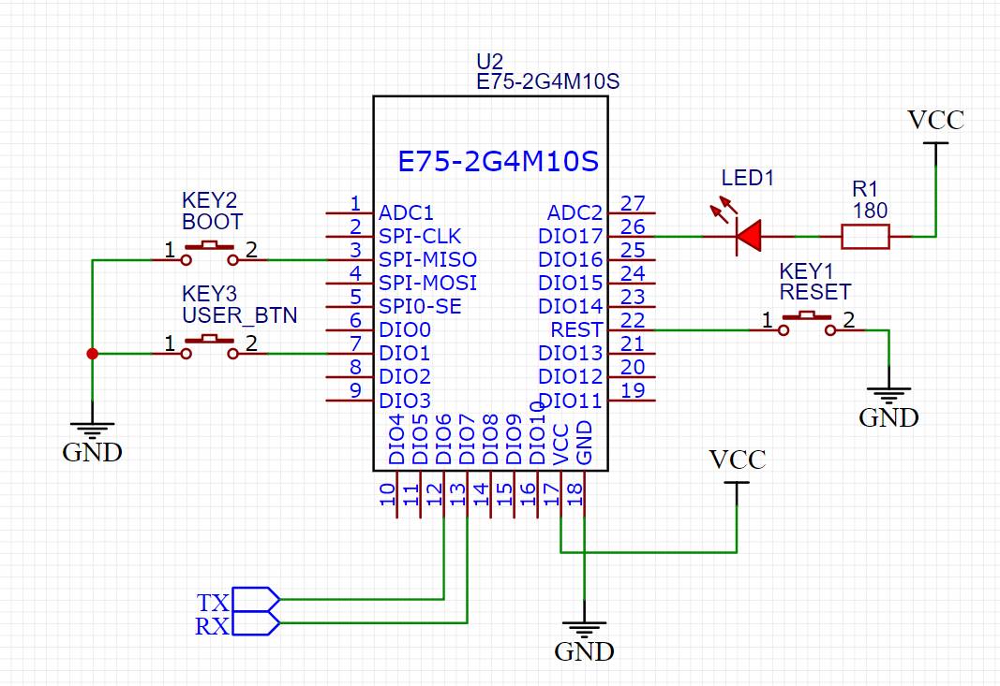

# Hello NXP JN5169 ZigBee World

This is a tiny example how to work with ZigBee stack using JN5169 microcontroller. The example implements a smart switch, that
exposes an On/Off entity to the coordinator. On a button press, or on a network command, the device switches LED blinking mode.

# Test board

Basically the code is almost independent of the hardware (assuming it is based on JN5169). I am using a simple schematics based on a cheap EBYTE E75-2G4M10S module.



# How to build

Prerequisites:
- Beyond Studio IDE (comes with a JN5169 compiler)
- ZigBee SDK (JN-SW-4170 Zigbee 3.0 v1840.zip)
- CMake (any recent one)
- MinGW (or other source where you can get `make`)
- This all is Windows only

Build instructions
- Clone the repo
- make a `build` directory
- `cd build`
- `cmake -G "MinGW Makefiles" -DTOOLCHAIN_PREFIX=C:/NXP/bstudio_nxp/sdk/Tools/ba-elf-ba2-r36379 -DSDK_PREFIX=C:/NXP/bstudio_nxp/sdk/JN-SW-4170 ..`
(Correct paths to the toolchain and sdk if needed)
- mingw32-make HelloZigbee.bin

Flash instructions
- Open Beyond Studio
- Put the device in the programming mode (drive SPI_MISO low while reset or power up)
- Go to Device->Program Device
- Select the built HelloWorld.bin file
- Click `Program` button

or

- Put the device in the programming mode (drive SPI_MISO low while reset or power up)
- mingw32-make HelloZigbee.flash

# How to use

- The device is attempting to joing ZigBee network on start (1 attempt). Make sure your network permits joining, otherwise the device is not able to join
- No re-join, and leave the network functionality is implemented.
- If using zigbee2mqtt, it may be required to delete previous integration of the device (using force remove option)

# Zigbee2mqtt integration

By default zigbee2mqtt will be able to interview the device, but it will list the device as unsupported. No features will be exposed. 

To integrate the device follow these steps:
- Put myswitch.js to zigbee2mqtt configuration folder (next to configuration.yaml)
- In configuration.yaml add this entity
```
external_converters:
  - myswitch.js
```

