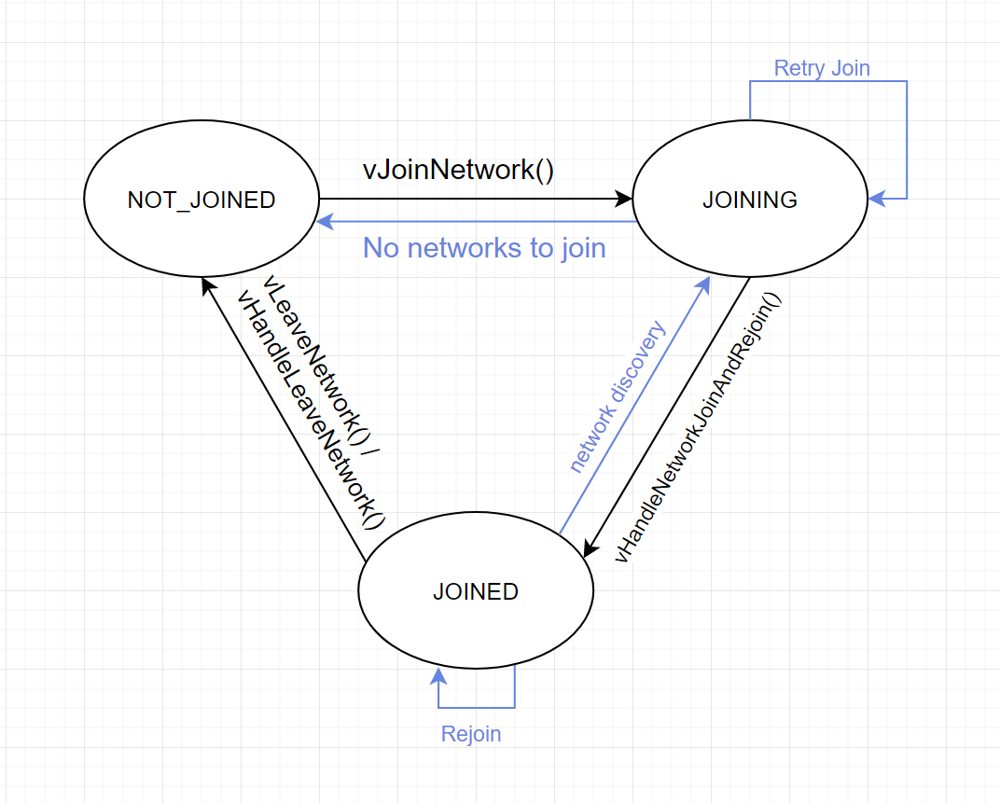
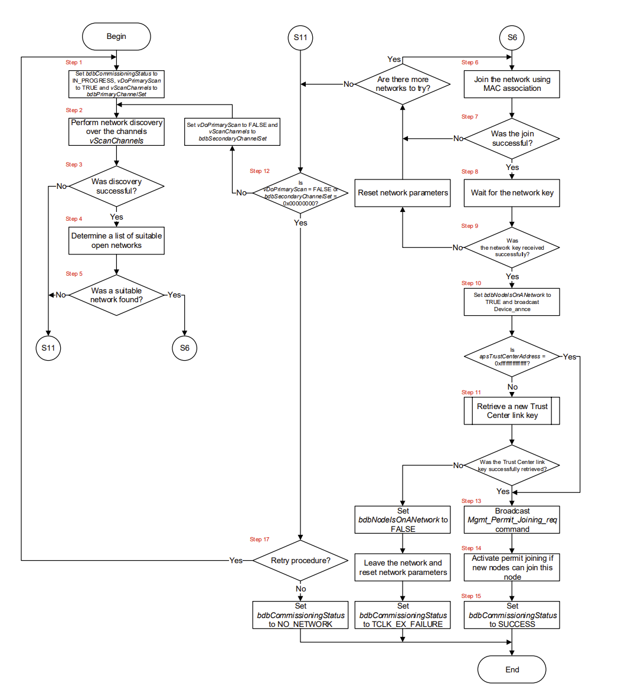
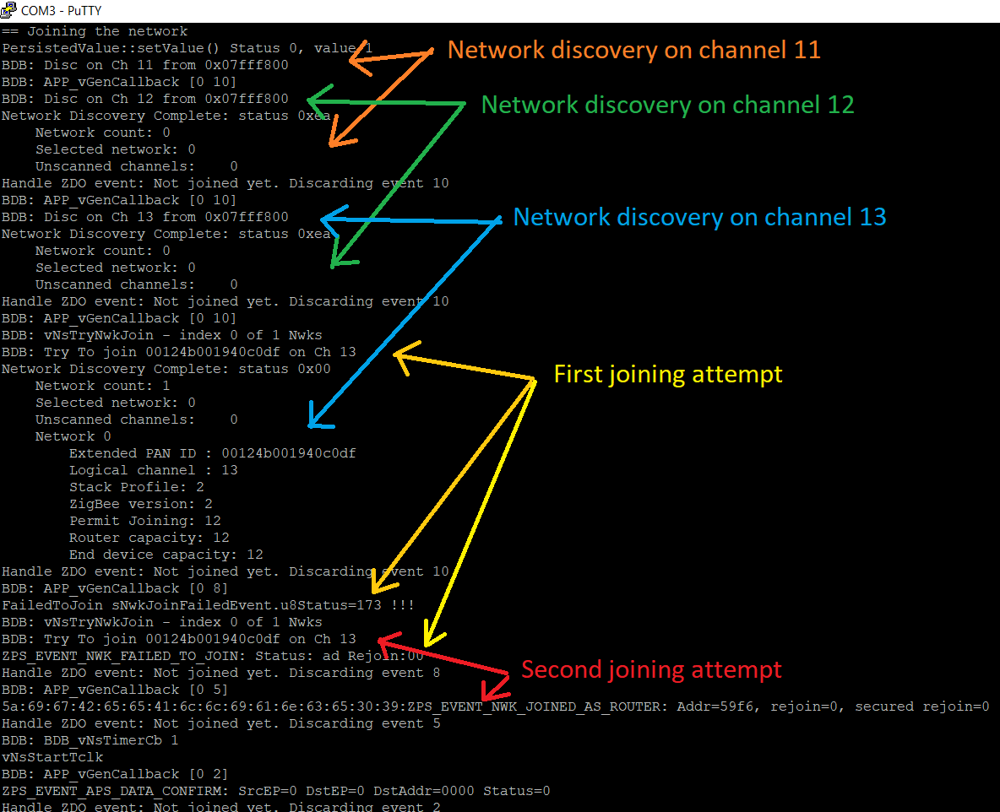
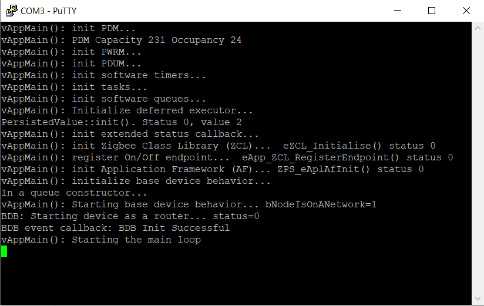
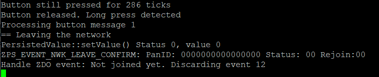

# Hello Zigbee World, Part 10 - Proper joining and rejoining Zigbee network

Today we will continue to [study ZigBee on the example of the NXP JN5169 microcontroller](part0_plan.md). In the previous articles we discussed [microcontroller peripherals](part1_bring_up.md), [how to connect to the ZigBee network](part6_join_zigbee_network.md) and [do basic operations there](part8_simple_switch.md). But the reliability of the created device is far from ideal. The main topic of today's article is the correct and reliable connection to the ZigBee network, as well as handling reconnections. 

The hardware setup is described in the [very first article](part1_bring_up.md), and is based on the EBYTE E75–2G4M10S module. The toolchain and basic MCU peripherals were also described in that article. The code is based on the result of previous articles.

## Join vs Re-Join

Procedure of joining a new device to the Zigbee network is different from rejoining a previously connected device. Let’s check out these 2 cases in detail.

Consider the option of joining a new device. The device does not yet know which channel the network is operating on, what devices are nearby, and what are their network addresses. The network encryption key is also unknown to the device. The network also knows nothing about the device, the device does not have a network address, and there are no routing table entries regarding this device.

Typically, smart home devices do not initiate a joining on their own - usually the user initiates the joining process (for example, by holding down a button on the device). The joining process goes like this.

- The device broadcasts a Beacon request
- Routers nearby respond with their beacons (Beacon response)
- The device selects a router with the best signal quality (or other criteria), and sends it an association request
- The router accepts the request with Association Response message, and assigns the device a network address
- The router also informs the coordinator about the new device
- The coordinator provides the device with a network encryption key (transport key)
- The device announces itself to the network with a broadcast message
- All routers in the network update their routing tables, by adding a new route to the new device

This is how the new device gets to the network. But a much more frequent case is when the device is already on the network, but has to re-join for a reason. For example the device had a power outage, or was in the deep sleep mode for a while. In this case, the joining procedure is much simpler - the device already knows Zigbee network channel number, own network address, and encryption keys used previously, so these parameters do not need to be negotiated again. End-device rejoining will require one or two messages to rejoin the network, which we will discuss in the next article. Surprisingly, rejoining of the routers does not require any special procedure, so the communication can resume almost instantly. 

## Zigbee Device network state

In order to select between joining and re-joining procedures, the device must know whether it was on the network before. Let's create a variable that will reflect this fact. The value must be saved in EEPROM in order to be remembered during reboots. This variable will be very similar to eNodeState variables from NXP examples, and will have 3 states:

- `NOT_JOINED` - in this state the device works completely autonomously without interacting with the network. Moreover, the device does not attempt to connect to the network. For example, the Xiaomi switch, if not connected to the network, works just like a normal switch.

- `JOINING` - the device searches for networks in the area and tries to join one of them. For some reason, the connection may not work the first time, so the device may try joining again after timeout.

- `JOINED` - the device is connected to the network and is ready for the data exchange. In case of reboot, the device can reconnect to the network using a rejoin procedure. That is why we need to store the value in EEPROM.

Now let's analyze the most interesting part - the transitions between these states. Let’s take a look at the diagram below. It looks quite simple, there are only 3 states and a few arrows. In fact, it took me quite a while to extract this from the NXP example code. All these states and transitions are heavily twisted and spread over different files and functions, and it turned out to be non-trivial to understand how it works just by reading the code.



Initially the device is in the `NOT_JOINED` state and does not attempt to connect to the network (unlike the examples from NXP). The user can press the button and initiate a network joining, and the device switches to the `JOINING` state.

In the `JOINING` state, the device will go through the network discovery and joining procedures. The device may need several attempts to join, possibly trying different Zigbee channels. If the connection is successful, the device switches to the `JOINED` state. In case of joining failure, the device returns to the `NOT_JOINED` state.

In the `JOINED` state, the device operates normally on the network - sending and receiving data packets, interacting with other network nodes. The fun begins in the following situations:

- The coordinator (upon the User’s request) can ask the device to leave the network. In this case, the device normally leaves the network, forgets all access keys, stops talking on the radio, and switches to the `NOT_JOINED` state
- The user can explicitly ask the device to disconnect from the network (by holding a button on the device). In this case, the device broadcasts an announcement that it is leaving the network, and also switches to the `NOT_JOINED` state.
- The device may reboot for some reason (a power issue, a watchdog timer, or the device just awakes from a deep sleep). In this case, the device should try to rejoin the same network. If this succeeds, then the device continues to work in the `JOINED` state.

Sometimes the rejoin procedure fails. In this case the following options are possible.

- For example, the device may try to rejoin again to the *same network* and the *same router* after some timeout. This is how some Xiaomi devices behave. If the router has disappeared or unavailable, then the device just falls off the network. Unfortunately their firmware does not have other reconnection options.
- The device can reconnect to *another router* on the same network - rejoin procedure supports this type of reconnection.
- Finally, nothing prevents the device from returning to the `JOINING` state and performing the network discovery procedure.

On the diagram, functions that need to be developed by us are indicated in black. Blue indicates what is implemented by the Zigbee framework (though we may need to implement notification handlers).

## Base Device Behavior

There is one more topic that must be covered. The network joining approach we used in the previous article is rather awkward. We used low-level functions of the Zigbee stack (`ZPS_eAplZdoStartStack()`, `ZPS_eAplZdoJoinNetwork()`), which in response send low-level events like `ZPS_EVENT_NWK_DISCOVERY_COMPLETE` and `ZPS_EVENT_NWK_JOINED_AS_ROUTER`. This is all correct, but does not fully comply with the specification.

In fact, there is a Zigbee Base Device Specification that describes exactly how the device should behave in certain situations, including (re-)joining the network. It describes in detail the sequence of actions the device should do. Here, for example, is a diagram (one of several) that describes the network joining process.



Looks scary. But there is good news: NXP has already implemented all this for us. The ZigBee SDK provides a Base Device Behavior (BDB) component that already implements the required behavior. You just need to switch to using higher-level functions (like `BDB_eNsStartNwkSteering()`), and handle high-level events (like `BDB_EVENT_NWK_STEERING_SUCCESS`) in response. Technically, this is not something completely different - BDB is just a piece of code wrapping the same low level network functions and events, but implements the logic required by the BDB specification.

## Device connectivity via BDB

Enough theory, let’s write a code. Let’s take a look at vAppMain()

```cpp
typedef enum
{
   NOT_JOINED,
   JOINING,
   JOINED
} JoinStateEnum;

PersistedValue<JoinStateEnum, PDM_ID_NODE_STATE> connectionState;

extern "C" PUBLIC void vAppMain(void)
{
...
   // Restore network connection state
   connectionState.init(NOT_JOINED);
...
   sBDB.sAttrib.bbdbNodeIsOnANetwork = (connectionState == JOINED ? TRUE : FALSE);
   DBG_vPrintf(TRUE, "vAppMain(): Starting base device behavior... bNodeIsOnANetwork=%d\n", sBDB.sAttrib.bbdbNodeIsOnANetwork);
   BDB_vStart();
...
//    // Reset Zigbee stack to a very default state
//    ZPS_vDefaultStack();
//    ZPS_vSetKeys();
//    ZPS_eAplAibSetApsUseExtendedPanId(0);

//    // Start ZigBee stack
//    DBG_vPrintf(TRUE, "vAppMain(): Starting ZigBee stack... ");
//    status = ZPS_eAplZdoStartStack();
//    DBG_vPrintf(TRUE, "ZPS_eAplZdoStartStack() status %d\n", status);
```

First of all, before any network operations, we need to restore the previous network state (`connectionState` variable). The value is restored from PDM, and if this is not possible it is initialized to `NOT_JOINED`. A `bbdbNodeIsOnANetwork` flag is used to let the Base Device Behavior (BDB) module know if the device was previously on the network. If this flag is set, the device will restore network parameters from EEPROM (channel number, encryption keys) and rejoin the network, otherwise a full network discovery procedure will be used.

Previously, we did a network parameters reset, and used the `ZPS_eAplZdoStartStack()` function to start the network joining. Now this will be handled by the functions from the BDB component. I commented out the code which is now irrelevant.

Now we need to write some functions that will connect and disconnect from the network. These functions implement the black arrows in the state diagram above. A few words about function naming. Reading the example code, I could not understand why there are so many functions with the Join word in the name. And only after writing this code, I understood the idea: functions with a verb in the name perform some action (possibly asynchronous), while functions with the word Handle are called as a reaction to an event that has already happened. Thus, the `vJoinNetwork()` function initiates the connection, and the `vHandleNetworkJoinAndRejoin()` function is called as a notification that the device has connected. The same applies for other functions.

To join the network, we will use the `BDB_eNsStartNwkSteering()` function - it starts the network discovery procedure and joins a network that is ready to accept our device (a network that has Permit Join enabled). It is important to note that some of the network settings are stored in the PDM. It is reasonable to wipe out previous network settings before joining a new network.

```cpp
PRIVATE void vJoinNetwork()
{
   DBG_vPrintf(TRUE, "== Joining the network\n");
   connectionState = JOINING;

   // Clear ZigBee stack internals
   sBDB.sAttrib.bbdbNodeIsOnANetwork = FALSE;
   sBDB.sAttrib.u8bdbCommissioningMode = BDB_COMMISSIONING_MODE_NWK_STEERING;
   ZPS_eAplAibSetApsUseExtendedPanId (0);
   ZPS_vDefaultStack();
   ZPS_vSetKeys();
   ZPS_vSaveAllZpsRecords();

   // Connect to a network
   BDB_eNsStartNwkSteering();
}
```

It is mandatory to set the `sBDB.sAttrib.bbdbNodeIsOnANetwork` flag to `FALSE` before each joining. Otherwise, if the device falls off the network and the `bbdbNodeIsOnANetwork` flag is still set, the `BDB_eNsStartNwkSteering()` function will skip network discovery procedure.

The previous function only initiates a network connection (in terms of the diagram, this is the transition from `NOT_JOINED` to `JOINING`). The next function is handling the event that the device has finally connected (transition from `JOINING` to `JOINED`). At this point, the device is already connected to the new network, has received an address and a transport encryption key - it makes sense to save all this in PDM using `ZPS_vSaveAllZpsRecords()` so that these parameters can be used when reconnecting later.

```cpp
PRIVATE void vHandleNetworkJoinAndRejoin()
{
   DBG_vPrintf(TRUE, "== Device now is on the network\n");
   connectionState = JOINED;
   ZPS_vSaveAllZpsRecords();
   ZPS_eAplAibSetApsUseExtendedPanId(ZPS_u64NwkNibGetEpid(ZPS_pvAplZdoGetNwkHandle()));
}
```

The necessity of the `ZPS_eAplAibSetApsUseExtendedPanId()` call is not completely clear to me, everything also works without it, but this call is required by the [ZigBee 3.0 Stack User Guide JN-UG-3113 document](https://www.nxp.com/docs/en/user-guide/JN-UG-3113.pdf).

Let’s develop a similar pair of functions for initiating the network exit procedure (`vLeaveNetwork()`) and handling the fact that the device has left the network (`vHandleLeaveNetwork()`). In both cases, we will end up in the `NOT_JOINED` state.

```cpp
PRIVATE void vLeaveNetwork()
{
   DBG_vPrintf(TRUE, "== Leaving the network\n");
   sBDB.sAttrib.bbdbNodeIsOnANetwork = FALSE;
   connectionState = NOT_JOINED;

   if (ZPS_E_SUCCESS !=  ZPS_eAplZdoLeaveNetwork(0, FALSE, FALSE))
   {
       // Leave failed, probably lost parent, so just reset everything
       DBG_vPrintf(TRUE, "== Failed to properly leave the network. Force leaving the network\n");
       vHandleLeaveNetwork();
    }
}

PRIVATE void vHandleLeaveNetwork()
{
   DBG_vPrintf(TRUE, "== The device has left the network\n");

   connectionState = NOT_JOINED;

   // Clear ZigBee stack internals
   ZPS_eAplAibSetApsUseExtendedPanId (0);
   ZPS_vDefaultStack();
   ZPS_vSetKeys();
   ZPS_vSaveAllZpsRecords();
}
```

Well, the last of the basic functions is handling the situation when the device, after several attempts, could not (re)join to the network. At this stage, let the device simply leave the network. A little further on we will try to start a timer here to try to reconnect in a few minutes.

```cpp
PRIVATE void vHandleRejoinFailure()
{
   DBG_vPrintf(TRUE, "== Failed to (re)join the network\n");

   vHandleLeaveNetwork();
}
```

Now let’s try to take off with all this. First, consider the case where the user initiates a connection or disconnection. This is a button handling function.

```cpp
PRIVATE void APP_vTaskSwitch()
{
   ApplicationEvent value;
   if(appEventQueue.receive(&value))
   {
       DBG_vPrintf(TRUE, "Processing button message %d\n", value);

       if(value == BUTTON_SHORT_PRESS)
       {
           vToggleSwitchValue();
       }

       if(value == BUTTON_LONG_PRESS)
       {
           if(connectionState == JOINED)
               vLeaveNetwork();
           else
               vJoinNetwork();
       }
   }
}
```

Usually, by pressing the bind button, the device exits the previous network, forgets all the parameters associated with it, and immediately connects to the new network. In order to better understand the joining and exit processes, I have separated these 2 procedures. Now, if the device is on the network, it will leave it, and vice versa, if not on the network, then connect.

The next thing to implement is reaction to events. As I said, the `BDB_eNsStartNwkSteering()` function is an add-on on top of the basic ZigBee stack. BDB will handle low-level events, so we no longer need to respond to them ourselves. Instead, we will process BDB events that the device has reconnected (`BDB_EVENT_REJOIN_SUCCESS`) or the network search has completed (`BDB_EVENT_NWK_STEERING_SUCCESS`).

```cpp
PUBLIC void APP_vBdbCallback(BDB_tsBdbEvent *psBdbEvent)
{
   switch(psBdbEvent->eEventType)
   {
...
       case BDB_EVENT_REJOIN_SUCCESS:
           DBG_vPrintf(TRUE, "BDB event callback: Network Join Successful\n");
           vHandleNetworkJoinAndRejoin();
           break;

       case BDB_EVENT_NWK_STEERING_SUCCESS:
           DBG_vPrintf(TRUE, "BDB event callback: Network steering success\n");
           vHandleNetworkJoinAndRejoin();
           break;

       case BDB_EVENT_REJOIN_FAILURE:
           DBG_vPrintf(TRUE, "BDB event callback: Failed to rejoin\n");
           vHandleRejoinFailure();
           break;

       case BDB_EVENT_NO_NETWORK:
           DBG_vPrintf(TRUE, "BDB event callback: No good network to join\n");
           vHandleRejoinFailure();
           break;
...
```

Also we need to modify the event handling function to Zigbee Device Objects (ZDO) - the part that services network events on behalf of the entire device. Since we have delegated the process of joining the network to the BDB component, it no longer makes sense in ZDO to process any events until the device is connected.

```cpp
PRIVATE void vAppHandleZdoEvents(ZPS_tsAfEvent* psStackEvent)
{
   if(connectionState != JOINED)
   {
       DBG_vPrintf(TRUE, "Handle ZDO event: Not joined yet. Discarding event %d\n", psStackEvent->eType);
       return;
   }

   switch(psStackEvent->eType)
   {
       case ZPS_EVENT_APS_DATA_INDICATION:
           vHandleZdoDataIndication(psStackEvent);
           break;

       case ZPS_EVENT_NWK_LEAVE_INDICATION:
           if(psStackEvent->uEvent.sNwkLeaveIndicationEvent.u64ExtAddr == 0)
               vHandleLeaveNetwork();
           break;

       case ZPS_EVENT_NWK_LEAVE_CONFIRM:
           vHandleLeaveNetwork();
           break;

       default:
           //DBG_vPrintf(TRUE, "Handle ZDO event: event type %d\n", psStackEvent->eType);
           break;
   }
}
```

As for leaving the network. There is a discrepancy between the documentation and the actual behavior of the network. There are 2 different messages related to leaving the network

- the `ZPS_EVENT_NWK_LEAVE_INDICATION` message has two meanings
  1) some other device has left the network and we are simply informed about this (we don’t care)
  2) we were asked to leave the network (this event must be handled with the vHandleLeaveNetwork() function)
- Sometimes a device wants to leave the network on its own initiative (well, upon the button press). The device makes a request to leave the network, and a `ZPS_EVENT_NWK_LEAVE_CONFIRM` message is returned as a confirmation that the coordinator has accepted the leave request.

In reality (at least with zigbee2mqtt) when the coordinator asks the device to leave the network, the `ZPS_EVENT_NWK_LEAVE_CONFIRM` is sent, skipping the `ZPS_EVENT_NWK_LEAVE_INDICATION` event. Just in case, I implemented handlers for both messages, but I could test only `ZPS_EVENT_NWK_LEAVE_CONFIRM`.

## Real network experiments

Anyhow, let’s try to join a network, and see how the BDB handles the joining.



The log is somewhat confusing, at first I even thought that something went wrong. In fact, here events occur in two streams. The main part of the connection happens in the BDB thread (See BDB debug messages with BDB: prefix). When an event occurs, it is queued and processed in another thread a little later. Therefore, this log looks rather strange - one thread is already starting discovery on channel 12, while the second only gets notification that discovery on channel 11 is done.

Sometimes the radio link fails and the connection fails. Thanks to BDB it tries to connect several times. The connection succeeded on the second attempt. But this is not all. 

After connecting, the device does a few more actions after a pause. These actions are dictated by the specification:
- The device sends a request to the coordinator for the Node Descriptor in order to get coordinator’s Zigbee version
- Depending on the version, the device may start additional encryption keys exchange
- As the last action, the device sends a Permit Join broadcast message (not sure why)
- Only then is the device considered fully joined.

As for ‘Discard events’ in the logs above. As I previously said, BDB is built on top of regular Zigbee messages, and is responsible for handling ZDO messages. But these messages are also delivered to our firmware for our information. We can safely ignore them while BDB is working, and start handling ZDO messages after the device is connected. I will remove the logging of these messages so that the log does not clutter up - this is just to understand how the BDB works.

This is how the reconnect looks after a reboot.



Surprisingly there are no any special messages. When reconnecting in router mode, the device does not send anything to the network, and does not receive anything in response. It just boots and works out of the box. I expected a `BDB_EVENT_REJOIN_SUCCESS` message, but it looks like it is for end devices only, not routers.

Of course, other routers could have forgotten about our device by this moment, but then the internal Zigbee mechanisms for rebuilding routes come into play. The device asks its neighbors for a route to the desired node with a broadcast request, and after a while all routes in the network are restored.

And this is how the exit the network looks like.



That's all for the basic joining and rejoining code. But I was interested in testing a few contingency situations. The test scenario was:

- Move away from the coordinator
- Join the device to the network and make sure that it connected through an intermediate router
- Turn off device
- Turn off intermediate router
- Move the device to the other end of the apartment where other routers work
- Turn on the device and see what happens.

Surprisingly, everything went smoothly. I lost the sniffer log, but there I saw something like this
- When turned on, the device did not send any rejoin signals to the network (because it is the router. The end device would send a rejoin request message)
- The device starts chatting with other routers about updating routing tables
- When I pressed the button, the device realized that it does not know the route to the coordinator, so a route request broadcast was sent to the network (“does anyone know the route to the coordinator?”)
- Several routers in the area said yes, they do. The collection of information about the routes took about 100ms.
- Finally my device sent a message to the coordinator that the button was pressed.
- Well, what happened next, you already know from the previous articles

It would be possible to end here, but there are 2 more points that I would like to emphasize.

Point one: Probably in 2006, when ZigBee was invented, the network rejoining mechanisms were seen a little differently. The BDB specification describes this process as follows: try to connect to the same network, and if it doesn’t work out, look for other networks and connect to them. Wait, what other networks? I don't want my device to suddenly connect to a neighbor's network who forgot to disable the permit join flag. However, this is exactly the behavior implemented in the BDB component. Fortunately, it is possible to set the `BDBC_IMP_MAX_REJOIN_CYCLES` option to 1, which disables this BDB reconnection logic.

Point two: in real life, the code that we just developed is still not enough. What happens if there is a power outage, and all the routers and the coordinators suddenly disappear? The device will try to search for a network several times, then the `BDB_EVENT_REJOIN_FAILURE` event will fire. The device will switch and remain in the `NOT_JOINED` state. This is probably not what a ZigBee home network user expects (and this BTW how Xiaomi devices behave). I think we need to somehow distinguish between situations “the user wants to join a network, and the join fails” and “something happened to the network and it is temporary not available”. In the first case, we probably don't need to do anything - the user is nearby and they already see that the device has not connected. In the second case, I think it's worth starting a timer and trying to reconnect again after a while, and only after several attempts to give up. This can be done in the vHandleRejoinFailure() handler.

## Summary

Today we have analyzed how to properly organize the joining and rejoining of the device to the ZigBee network. The key point is that many things have already been implemented for us in the Base Device Behavior (BDB) component. The BDB implements network joining and rejoining procedures according to the ZigBee specification. With the implemented addition the device became much more stable when joining the network. Even if any network failures happen the device could now properly rejoin the network. Because of improved stability the debugging process has also become much easier.

At the same the logic offered by the Base Device Behavior Specification is a bit inconsistent with the modern understanding of smart home devices. So some situations (such as a temporary power loss) need to be handled additionally, otherwise devices may fall off the network with no possibility to rejoin, or do other odd things, like join someone else’s network. So the connection logic needs to be further tuned for even better stability.

## Links

- Documentation
  - [JN-UG-3113 ZigBee 3.0 Stack User Guide](https://www.nxp.com/docs/en/user-guide/JN-UG-3113.pdf)
  - [JN-UG-3114 ZigBee 3.0 Devices User Guide](https://www.nxp.com/docs/en/user-guide/JN-UG-3114.pdf)
  - [JN-UG-3076 ZigBee Home Automation User Guide](https://www.nxp.com/docs/en/user-guide/JN-UG-3076.pdf)
  - [JN-UG-3101 ZigBee PRO Stack User Guide](https://www.nxp.com/docs/en/user-guide/JN-UG-3101.pdf)
  - [Zigbee Base Device Behavior Specification](https://zigbeealliance.org/wp-content/uploads/2019/12/docs-13-0402-13-00zi-Base-Device-Behavior-Specification-2-1.pdf)
- Code
  - [Project on github](https://github.com/grafalex82/hellozigbee/tree/hello_zigbee_part_2)
  - JN-AN-1220-Zigbee-3–0-Sensors example (recommended)
  - JN-AN-1219-Zigbee-3–0-Controller-and-Switch example (somewhat sophisticated for learning purposes)
  - https://github.com/actg/JN5169-for-xiaomi-wireless-switch.git
