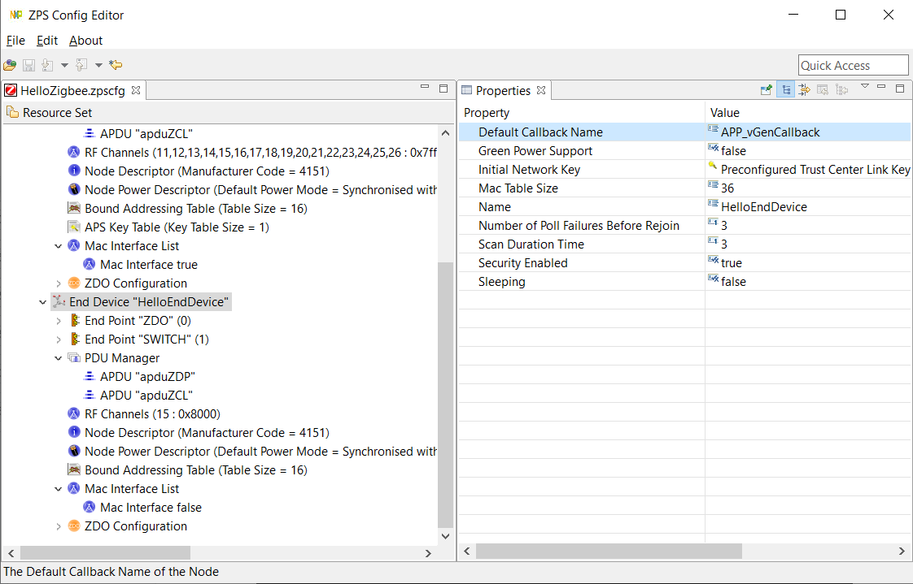
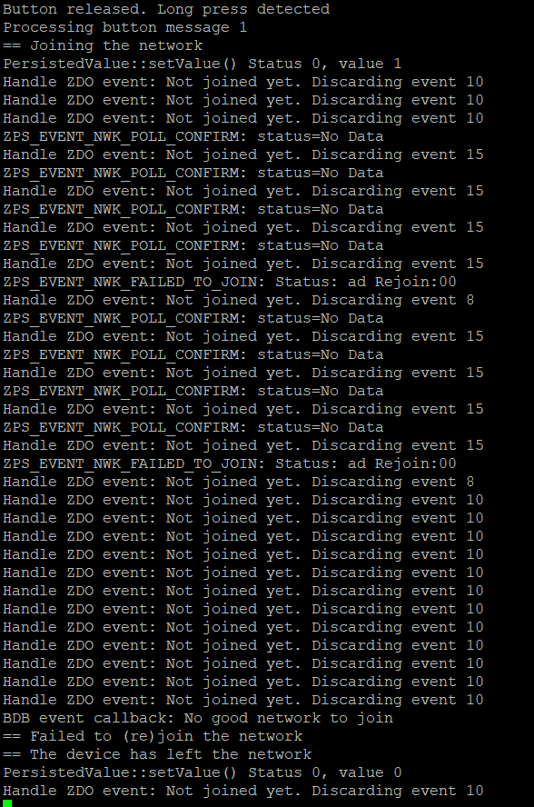
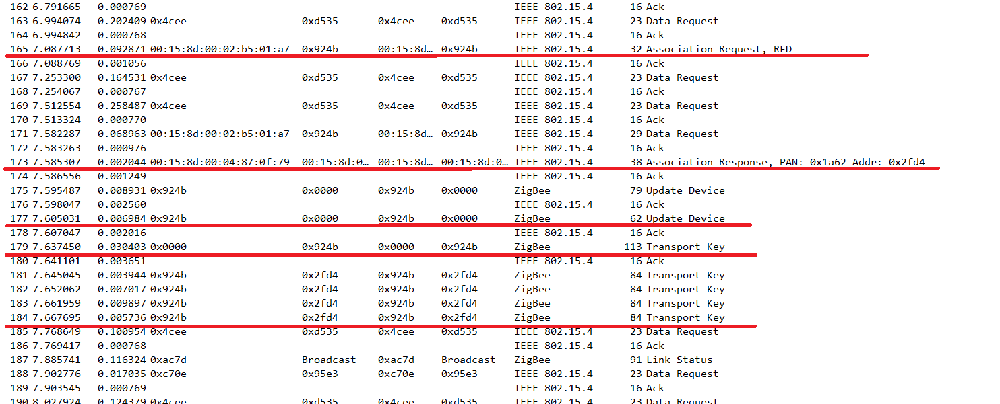
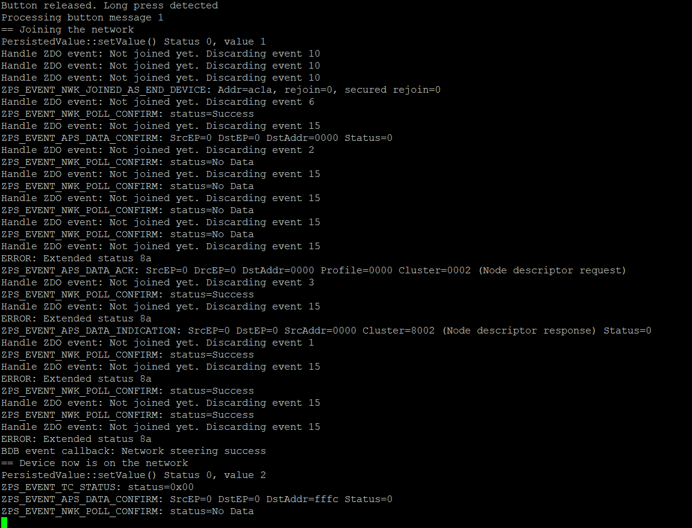
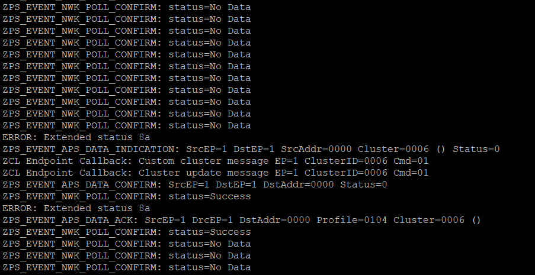
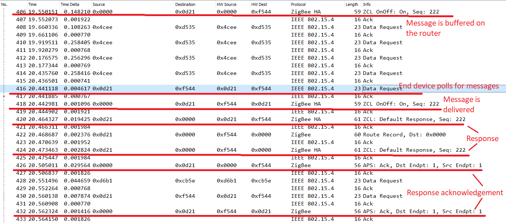

# Hello Zigbee World, Part 11 - End Devices

This is [Hello Zigbee series](part0_plan.md), describing creating Zigbee device firmware from scratch. In the previous articles we discussed developing a device that would act as a router in the Zigbee network. But it seems to me that the series would be incomplete if we do not consider the end devices. The fundamental difference between routers and end devices is availability - typically end devices are battery powered, sleeping most of the time, and therefore can’t be 100% online. This requires special actions from the firmware in order to make sure network communication is correct. I'm sure this will be another interesting dive into Zigbee technology.

As usual, we will be using [the same EBYTE E75–2G4M10S module](part1_bring_up.md) based on the NXP JN5169 microcontroller. The code will be based on the firmware we developed in the previous articles.

## End devices

As you know, there are 3 types of devices can work in ZigBee networks:

- The **coordinator** (one for the entire network) is responsible for building the network, assigning network addresses, and encryption. Typically, this device is also responsible for the smart home logic.
- **Routers** implement the functionality of a certain device (switches, thermostats, sensors), but can also *participate* in transit data transmission, expanding the network geography.
- **End devices** implement the functionality of the device, but *do not participate* in the transit data transmission.

Typically, the end device is battery-powered. This means that the device sleeps for the most part of the time, waking up occasionally to process its sensors, and even more rarely for network communication. From the network point of view, this means that the end device is not always available for data reception. In order to somehow deliver data packets addressed to end devices, ZigBee offers buffering these packets on the parent router. When the end device wakes up, it polls the router for correspondence. The network nodes must agree in advance which router will buffer messages for a given end device, and the end device will be logically tied to this particular router.

Let's try turning our smart switch into an end device. First, in the ZPS Configuration Editor, let's create a new configuration for the end device. Unfortunately, the program does not allow you to simply change the device type from what we did in the previous articles. We have to create a brand new configuration. Fortunately, a creative copy/paste approach works well here. 



Some of the device settings have changed significantly compared to the router devices, other settings are specific for routers, and not available for end devices at all. Thus there is no need to maintain a routing table - the end device will be connected to a single router, and all messages will go through this router. Thus, the end device will have just one route for all messages. Unfortunately, I have not found a good tutorial on how to select other device parameters, so I’ll rely on default values for now.

Now we need to [regenerate pdum_gen.c and zps_gen.c](part5_zigbee_init.md). Surprisingly, the code we created previously compiled fine for the end device configuration without a significant rework. 

I’ll use the same development approach as previously - run the code, and check what message handlers need to be implemented.



The device started, but for some reason could not join the network. Let’s check how it looks in the sniffer.



Here we see:

- the device sends a beacon request (left behind the scenes a little higher)
- routers nearby answer with beacon responses (left behind the scenes a little higher)
- The device makes an association request to one of the routers (it will be the device’s parent router)
- The router acknowledges the association, and issues a network address of 0x2fd4 (association response)
- The router informs the coordinator that a new device has joined (device update)
- The coordinator sends a transport key through the parent router (0x924b)
- Finally, the router tries to send the transport key to our device 4 times, and what is the most important on this screenshot is that the device does NOT acknowledge it (no ACK record)

Considering that acknowledgement occurs at the MAC level without the participation of our code at all, we can assume that the receiver simply does not listen to the air and does not hear this message.

After some investigation, setting the `sleeping option` to true in ZPSConfig tool solved the issue. In fact, this option changes the `RxOnWhenIdle` parameter in the Node Descriptor. As per documentation, this parameter tells the parent router that device can’t receive messages at any time. Instead, the router shall buffer messages for the end device - the device will pick these messages later when it is active.

## Polling for messages

Let’s try joining again.



The output is rather vague, but it contains a large number of unfamiliar messages - `ZPS_EVENT_NWK_POLL_CONFIRM`. Since the end device does not keep the receiver turned on all the time, the device Polls its parent router in order to receive data. The device turns on the receiver, signals the router that the device is online and ready to receive the data. After a short timeout, the device turns off the receiver and generates a `ZPS_EVENT_NWK_POLL_CONFIRM` event. 

So, the device started up, joined the network, and is basically ready to go. And even the button works and sends the on/off status to the coordinator. But if you try to control the device from the coordinator (for example, from zigbee2mqtt), nothing seems to work - the device does not listen to the radio and simply does not receive messages. End devices must explicitly poll the parent router for data using the `ZPS_eAplZdoPoll()` function. Perhaps BDB calls the `ZPS_eAplZdoPoll()` function during the joining procedure - that is why we received all the data sent by the coordinator. But this function shall be called also during the normal working cycle.

For simplicity, we will poll the router every 2 seconds. The timer will be started once the device has joined the network, and stop when the device leaves the network. We will call the `ZPS_eAplZdoPoll()` function in the handler. Periodic tasks are discussed in [one of the previous articles related to C++ usage](part9_cpp_building_blocks.md) in this project.

```cpp
PollTask::PollTask()
{
   PeriodicTask::init();
}

PollTask& PollTask::getInstance()
{
   static PollTask task;
   return task;
}

void PollTask::startPoll(int period)
{
   setPeriod(period);
   startTimer(period);
}

void PollTask::stopPoll()
{
   stopTimer();
}

void PollTask::timerCallback()
{
   ZPS_eAplZdoPoll();
}


PRIVATE void vHandleNetworkJoinAndRejoin()
{
   DBG_vPrintf(TRUE, "== Device now is on the network\n");
...
   PollTask::getInstance()->startPoll(2000);
}

PRIVATE void vHandleLeaveNetwork()
{
   DBG_vPrintf(TRUE, "== The device has left the network\n");
...
   PollTask::getInstance()->stopPoll();
...
}
```


Here is how the periodic poll looks like, as well as an attempt to turn on the light via zigbee2mqtt.



Now it becomes clear how the poll works. Once every 2 seconds the device polls the router. If no data is available, the device just calms down. If there is data on the router, it is delivered to the end device, and processed as usual. At the end of the polling period, a `ZPS_EVENT_NWK_POLL_CONFIRM` message is generated with the status `Success` if data was received or `No Data` if no data was received.

Personally, I was very interested to see how the poll looks in the sniffer. It turned out that this happens with the Data Request message.



`Source` and `Destination` columns describe the overall route of the message. But since nodes may not be directly connected, a message can be sent across multiple hops. The `HW Source` and `HW Destination` columns show device addresses of a particular hop.
	
So here we see the following.

- At the timestamp 19.55, the coordinator (0x0000) sends the ZCL OnOff command to our device (0x0d21). In this case (record 406) the message is moving from the coordinator (0x0000) to the parent router (0xf544).
- Almost a second later, at 20.44 (line 416), our device (0x0d21) calls the router (0xf544) with the question “is there any data for me?”  (four data requests before line 416 are related to another device, just ignore them)
- The router replies that yes, the coordinator has sent the ZCL OnOff command (message 418). Note that this is the same message as line 406, and has the same Sequence number 222. This is just the next hop of the same message.
- In about 20ms, the device replies with ZCL Default Response that the command has been received and processed (response has the same sequence number). The target address of the message is the coordinator (0x0000), but the packet is sent in 2 hops, through the router (0xf544).
- The coordinator acknowledges our default response with an APS Ack message. And this acknowledgement waits on the router for another 60ms until our end device picks it up with a Data Request packet (records 426, 430, and 432)

## Poll frequency

See the one second delay between the coordinator sending an On/Off message (406) and the device has received it (418)? The message is just waiting on the router for being picked up by the device. That is obviously because the device polls the router once in 2 seconds. 

I decided to inspect how real factory produced end devices behave in my network.

- Xiaomi temperature and motion sensors poll the router about once an hour. At the same time temperature and light reports are sent much more often. The Xiaomi wireless wall switch (the battery powered one, without the relay inside) also polls the router once an hour. This confirms the theory that write-only devices can poll the router very rarely - they simply do not expect anything from the server. And, perhaps, this polling is done as a keep alive logic, so that the device is not thrown out of the network.
- The Moes TRV thermostat polls the router every 5 seconds. This is confirmed by my observations that the temperature change through the home assistant reaches the thermostat with a noticeable delay of the same 5 seconds. 
- The Xiaomi Aqara switch without a zero line, despite the fact that it is basically connected to the power line, for some reason acts as an end device in the Zigbee network. This means it has to poll the router for the server commands. It polls the router 4 times per second (every 250 ms) in order to provide an acceptable response delay. If there are many such devices on the network, then they will clog the radio channel decently.

How often the device must poll the router? My thoughts are:

- Long poll period causes a delay in responding to the server commands.
- If you need a quick response to server commands, then poll period must be short
- Frequent polling causes higher battery consumption.

Compare the battery consumption. Xiaomi temperature sensors poll the router once an hour, and sleep most of the time. These devices can work from a single CR2032 battery for more than a year. A Moes TRV polls the router once in 5 seconds. With such a polling frequency, the thermostat consumes 2 AA batteries in about 2 months. Well it also drives a motor, but if you set the low temperature and keep the valve always shut, the device still draws the batteries very quickly due to polling.

Basically, I do not think there is a silver bullet here. Devices that do not expect anything from the server (temperature or light sensors) may poll the router very rarely, just to keep network connection alive. Besides network joining, when the device is actively communicating with the coordinator, the device can turn off the receiver at other times. Things are much more complicated if talking about interactive devices (those that wait for something from the coordinator). It may be necessary to invent some kind of algorithm that is aware of network communication logic, and adjust polling frequency to the current device activity mode.

There is one interesting case, though. In the example above, I did not notice any special delays in receiving two consecutive packets. But depending on the network communication fashion poll frequency may be important. For example, in the case of updating the firmware via OTA, packages can go in a continuous stream, which means they need to be picked up as often as possible. Perhaps the following code that I found in NXP examples improves the polling approach.

```cpp
void vHandlePollResponse(ZPS_tsAfPollConfEvent* pEvent)
{
   switch (pEvent->u8Status)
   {
       case MAC_ENUM_SUCCESS:
       case MAC_ENUM_NO_ACK:
           ZPS_eAplZdoPoll();
           break;

       case MAC_ENUM_NO_DATA:
       default:
           break;
   }
}

PRIVATE void vAppHandleZdoEvents(ZPS_tsAfEvent* psStackEvent)
{
....
       case ZPS_EVENT_NWK_POLL_CONFIRM:
           vHandlePollResponse(&psStackEvent->uEvent.sNwkPollConfirmEvent);
```

The idea here is if some data has just arrived, perhaps there could be some more data on the router, so we should poll for data again. If no more data is available on the router, the `MAC_ENUM_NO_DATA` status is signaled, and the device can switch to normal polling mode.


## Summary

Perhaps that is it for how end devices communicate with the network, and particularly with its parent router. The router is responsible for buffering network packets for our end device, while it is sleeping. It appears that the communication logic is slightly more complicated, compared to end devices. But everything gets simple when we understand the Polling mechanism.

There are a few edge cases related to joining and rejoining the device, which will be discussed in the following articles. Stay tuned for a further journey to the Zigbee networks.


## Links

- Documentation
  - [JN-UG-3113 ZigBee 3.0 Stack User Guide](https://www.nxp.com/docs/en/user-guide/JN-UG-3113.pdf)
  - [JN-UG-3114 ZigBee 3.0 Devices User Guide](https://www.nxp.com/docs/en/user-guide/JN-UG-3114.pdf)
  - [JN-UG-3076 ZigBee Home Automation User Guide](https://www.nxp.com/docs/en/user-guide/JN-UG-3076.pdf)
  - [JN-UG-3101 ZigBee PRO Stack User Guide](https://www.nxp.com/docs/en/user-guide/JN-UG-3101.pdf)
  - [Zigbee Base Device Behavior Specification](https://zigbeealliance.org/wp-content/uploads/2019/12/docs-13-0402-13-00zi-Base-Device-Behavior-Specification-2-1.pdf)
- Code
  - [Project on github](https://github.com/grafalex82/hellozigbee/tree/hello_zigbee_end_device)
  - JN-AN-1220-Zigbee-3–0-Sensors example (recommended)
  - JN-AN-1219-Zigbee-3–0-Controller-and-Switch example (somewhat sophisticated for learning purposes)
  - https://github.com/actg/JN5169-for-xiaomi-wireless-switch.git