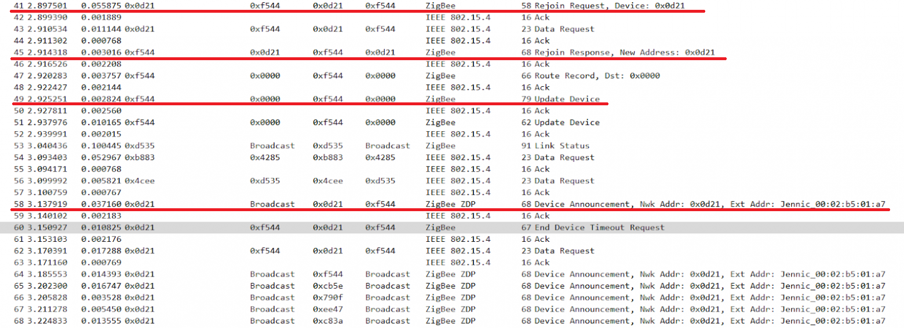
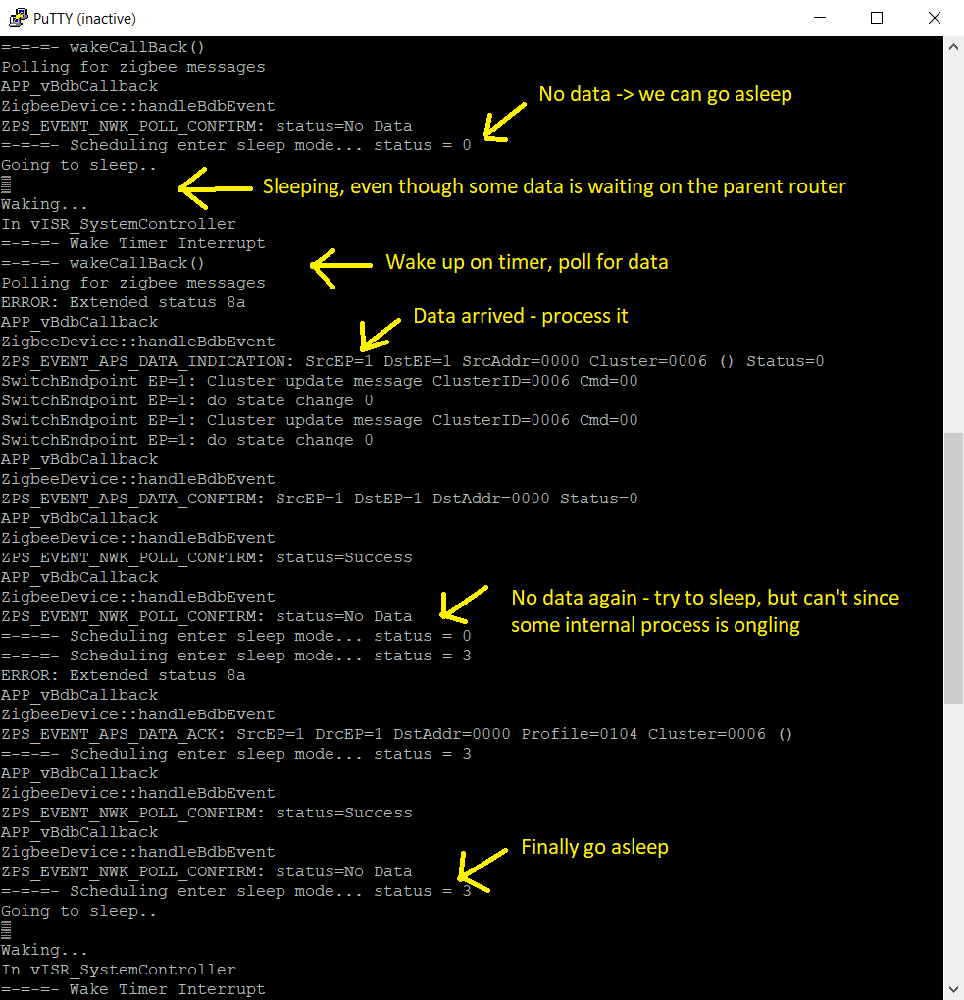
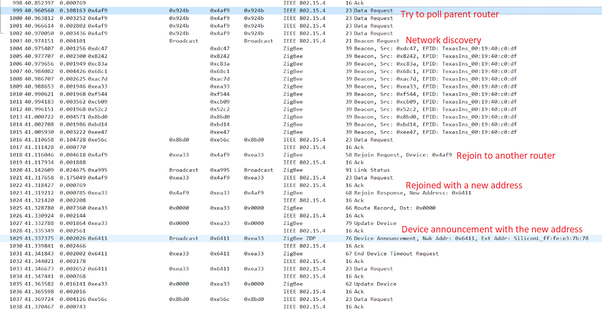
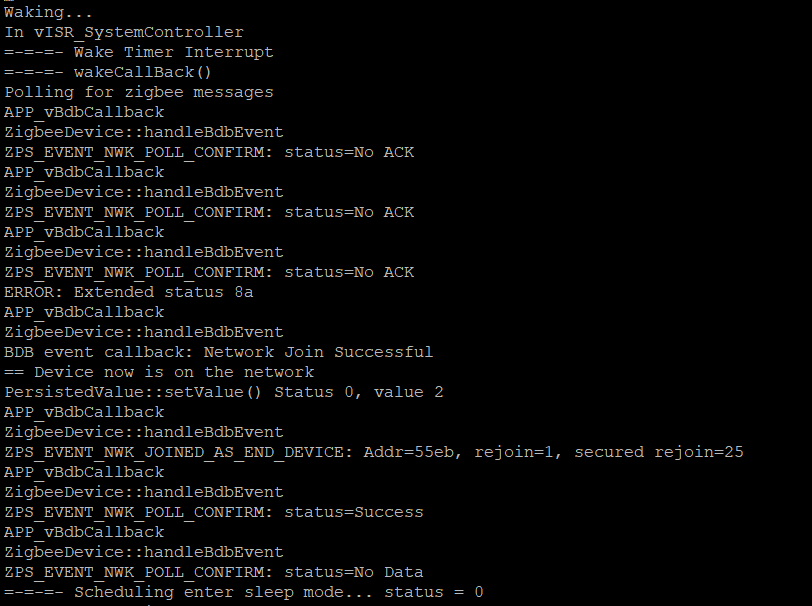
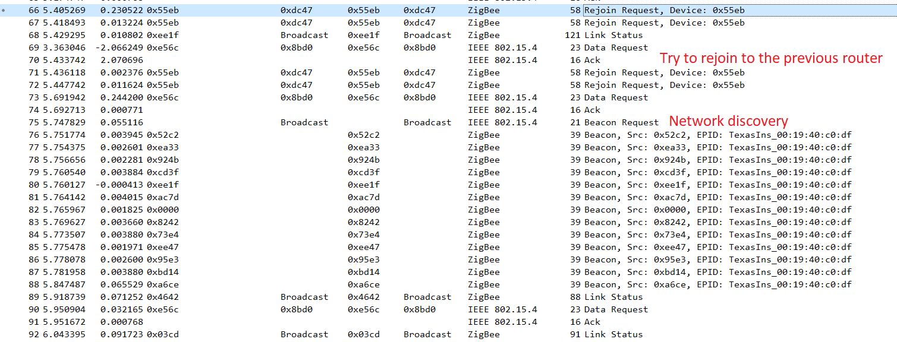
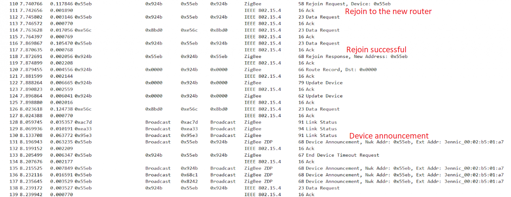
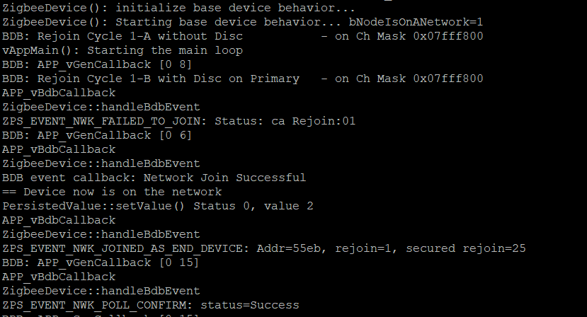
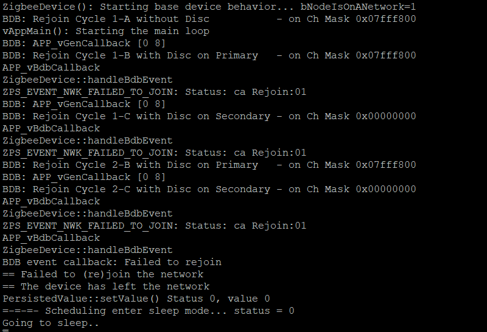

# Hello Zigbee World, Part 12 - Rejoining End Devices

In this article we will continue [learning Zigbee step by step](part0_plan.md). Last time we [created an end device](part11_end_device.md), but did not discuss questions related to joining and rejoining the device to the network. This question is quite important if talking about using sleep modes - end devices are typically battery powered and use sleep modes. But how the device shall behave upon waking from sleep?

At first I thought that end devices are much simpler than routers - routers, after all, transfer data between different nodes, and manage other devices. It turned out the opposite - there is much less fuss with routers, they just work out of the box, and all the data transfer happens behind the scenes. But the end devices add a lot of pain - you should put them to sleep, reconnect them when awake, device network communication can’t be at arbitrary time, but only when it's supposed to be. 

As usual, we will be using [the same EBYTE E75–2G4M10S module](part1_bring_up.md) based on the NXP JN5169 microcontroller. The code will be based on the firmware we developed in the previous articles.

## Rejoining the network

Basically, with the code we created in the previous article, the end device is already working. But before we dive into sleep modes, let’s take a sniffer, and look at how the device rejoins the network on startup. 



It turns out that there is a separate ZigBee protocol command - rejoin request. Since the device has already been on the network before and the network encryption has been already set up, this command is sent over an encrypted channel and the additional encryption keys exchange is not required. But the address of the device on the network may change, so the router responds with a new address. By the way, the rejoin procedure does not require the permit join mode to be enabled (it is considered that the device is already joined, it just needed to reconnect).

After rejoining, a few more things happen:
- The router informs the coordinator that the end device has reconnected and sends a new device address (Update Device message)
- The device announces itself to the network (Device Announcement) using a broadcast message.
- The coordinator broadcasts information about the route to the new device (did not fit in the screenshot)

Basically, everything is clear, and the BDB component does everything for us. The concern is that the device generates an avalanche of messages over the network on every rejoin. Shall the device indeed rejoin the network on every waking up, and therefore generate extra network traffic?

In order to reduce the network traffic on rejoining we can use light sleep mode - OSC On / RAM On (keep the wake-up timer and memory on). The timer is needed to wake up from time to time and poll the parent router for messages to the device. When waking from this kind of sleep mode, we do not actually need to rejoin the network - since the memory is powered, the network address, routing table, and other instant parameters will be quite relevant. Thus, upon waking up from light sleep mode, the device can immediately start polling the parent router or perform other network communication.

Unlike light sleep, the deep sleep mode will discard all the memory. Upon waking from deep sleep the device will have to rejoin the network. And as we just learned, this will produce a lot of network traffic. Based on this, we can conclude that the light sleep will be relevant for devices that communicate with the network quite frequently (send data or poll the parent). The deep sleep mode can be used for very long-lived devices that infrequently generate data and do not consume any information. Examples from NXP use a combined approach: light sleep mode if the device is online, and if the device fell out of the network and cannot connect after several attempts, it goes into deep sleep.

Even if the device does not expect any data from the server (for example, a temperature sensor), it is required to keep the connection alive. This is needed so that the router and coordinator do not forget about our device. If the device does not ping the router for a long time, the router may discard all information about the end device - all undelivered packets, an entry in the router’s children table, entries in the routing tables. The end device must call either `ZPS_eAplAfSendKeepAlive()` function, or at least poll the parent router from time to time. The specification does not specify the timeout period - it is up to the device vendor, and the period is set using `ZPS_bAplAfSetEndDeviceTimeout()` function. Typical mass produced sensors from Xiaomi and Tuya do keep alive polling once an hour.

## Sleep mode

We already [discussed sleep modes](part3_sleep_modes.md) in one of the previous articles. Let's try to implement a light sleep here without disconnecting from the network. In fact, this part appears to be quite complex. And it is not a matter of algorithmic complexity - there seem to be no technical obstacles. The most difficult thing was to state a criteria when the device can fall asleep.

With an ordinary device (not a network one) everything is simple - wake up, do a useful job (poll a sensor, send a signal), and go to sleep again. But how to understand whether it is possible to sleep in the case of active network communication? What if the server wants to send us some data, but we decided to sleep? In general, I did not find any intelligible explanation or example. Let my device work like this.

- If everything is quiet and calm - the device is sleeping
- Wake up every 15 seconds to poll the parent router
- Device will also wake up on the button to toggle the state, stay online for a little bit, and fall asleep in 5 seconds.

As we remember, the microcontroller goes to sleep by calling the `PWRM_vManagePower()` function, which is called from the main loop. But this function is smart, and requires some configuration:

- Use `PWRM_vInit(E_AHI_SLEEP_OSCON_RAMON)` to set the light sleep mode
- Calling `PWRM_eScheduleActivity()` will set the wake up timer

```cpp
PRIVATE void APP_vTaskSwitch(Context * context)
{
...
   if(ButtonsTask::getInstance()->canSleep() &&
      ZigbeeDevice::getInstance()->canSleep())
   {
       DBG_vPrintf(TRUE, "=-=-=- Scheduling enter sleep mode... ");

       static pwrm_tsWakeTimerEvent wakeStruct;
       PWRM_teStatus status = PWRM_eScheduleActivity(&wakeStruct, 15 * 32000, wakeCallBack);
       DBG_vPrintf(TRUE, "status = %d\n", status);
   }
}
```

In this code I went a little further into porting to C++, but you should understand the idea - most of the code is similar to what was discussed in the previous articles.

We will go to sleep if there has been no user/button activity for a long time (more than 5 seconds) and there is no current network activity. There is nothing fundamentally new with buttons compared to the previous articles - we just poll the buttons and count the time since the last press. But detecting network activity is not so simple. As I mentioned above, I have not figured out how to track network activity. But what is absolutely clear is that we should not sleep while the parent router is being polled. 

```cpp
void ZigbeeDevice::pollParent()
{
   polling = true;
   DBG_vPrintf(TRUE, "Polling for zigbee messages...\n");
   ZPS_eAplZdoPoll();
}

void ZigbeeDevice::handlePollResponse(ZPS_tsAfPollConfEvent* pEvent)
{
   switch (pEvent->u8Status)
   {
       case MAC_ENUM_SUCCESS:
       case MAC_ENUM_NO_ACK:
           pollParent();
           break;

       case MAC_ENUM_NO_DATA:
           polling = false;
       default:
           break;
   }
}

bool ZigbeeDevice::canSleep() const
{
   return !polling;
}
```

Everything is simple here. Let's use the `polling` flag, which will signal that the router is being polled. The flag will be raised when the poll starts, and cleared when no more data on the router is available.

Now the functions of falling asleep and waking up. They are mostly the same as in the previous article, but a few interesting challenges have been added here.

```cpp
PWRM_CALLBACK(PreSleep)
{
...
   // Save the MAC settings (will get lost though if we don't preserve RAM)
   vAppApiSaveMacSettings();
...
}

PWRM_CALLBACK(Wakeup)
{
...
   // Restore Mac settings (turns radio on)
   vMAC_RestoreSettings();
...
   // Poll the parent router for zigbee messages
   ZigbeeDevice::getInstance()->handleWakeUp();
}

void ZigbeeDevice::handleWakeUp()
{
       // TODO: more code here later

       pollParent();
}
```

When falling asleep, you need to save the MAC level settings, and, respectively, restore it when waking up. But that is not all. When waking up, it's also a good idea to start polling the parent router for buffered messages. We will also wake up just to keep network connection alive, which is technically data polling as well.

Well, completing the review of sleep functions, it is necessary to refresh the interrupt handler of the system controller. There is nothing new here, though.

```cpp
extern "C" PUBLIC void vISR_SystemController(void)
{
   // clear pending DIO changed bits by reading register
   uint8 wakeStatus = u8AHI_WakeTimerFiredStatus();
   uint32 dioStatus = u32AHI_DioInterruptStatus();

   DBG_vPrintf(TRUE, "In vISR_SystemController\n");

   if(ButtonsTask::getInstance()->handleDioInterrupt(dioStatus))
   {
       DBG_vPrintf(TRUE, "=-=-=- Button interrupt dioStatus=%04x\n", dioStatus);
       PWRM_vWakeInterruptCallback();
   }

   if(wakeStatus & E_AHI_WAKE_TIMER_MASK_1)
   {
       DBG_vPrintf(TRUE, "=-=-=- Wake Timer Interrupt\n");
       PWRM_vWakeInterruptCallback();
   }
}
```

The `PWRM_vWakeInterruptCallback()` function will call our `Wakeup()` handler as needed.

Let’s check out how this works in action.



This screenshot shows how the device wakes up on a timer, polls the parent router, receives a No Data response, and falls asleep again. In the next 15 second sleep interval I did another experiment - I tried to switch the device state through zigbee2mqtt. As expected, data was not delivered immediately, but has to wait until the next poll. 

Interestingly, after the incoming message was processed, the device tried to get asleep several times, but this did not happen. Apparently, the Zigbee stack had some other processes running inside, which prevented the device from falling asleep. This is actually great, because we don't have to worry about it in our code (you can ignore the status 3 returned by the `PWRM_eScheduleActivity()` function - it's just a notification that the alarm has already been set).

Waking up on the button also works, but nothing interesting was found there.


## Experimenting with sleep and rejoin

My Xiaomi Aqara devices have a bug - they fall out of the network quite often if their parent router is temporarily unresponsive. In this section, I would like to see how the device behaves in case of different emergency situations.

**Experiment 1:** Parent router disappears during regular communication.

Test Scenario:
- Add our device to the network and spot which router it is attached to
- Wait for the end device to go to sleep (the device is still online, just sleeping. No rejoin procedure is needed)
- Turn off the parent router
- Observe what happens when the device wakes up, while the parent router cannot respond to the Data Request



The end device tries to poll the router with a Data Request several times. Since the router is not responding, the end device decides to search for another router using the network discovery procedure. When a new router is found, the device connects to it with a rejoin request message. The router allows our device to rejoin the network, but gives a new address. The device broadcasts Device announcement messages with a new network address, so that other nodes on the network can update routes to our device.

The rejoin procedure takes less than a half a second, from the moment the device realized it was alone in this world, until the moment everyone on the network was notified of the new device address. By the way, I didn't write any additional line of code for this case - the reconnection functionality is implemented in the BDB component and its Failure Recovery subcomponent.

From the device side it looks like this.



OK, the device has passed this experiment. Let's try to make it harder.

**Experiment 2:** No parent router found during rejoin. 

In the previous scenario we used light sleep mode, which does not require rejoining procedure on wake up. This time we will check out how the rejoin procedure behaves in case of no previous parent router available.

Test scenario:
- connect the device to the network, make sure that the device on the network is functioning correctly
- turn off the device
- turn off the router that the device is connected to
- turn on the device (the device will have to pass through rejoin procedure)
- observe what happens when the device cannot send a rejoin request (since the parent router is no longer available)





Network communication looks very similar:
- The device tries to send a Rejoin Request to the router which it was connected to (0xdc47)
- After four unsuccessful attempts, the device starts the Network Discovery procedure
- A Rejoin Request is sent to the new parent router (0x924b)
- Next, Update Device message is sent to the coordinator, Device Announcement broadcast, and updating routing tables  - same procedures as we saw for device joining

But the device logs are quite interesting (I enabled the BDB logs)



Here again the messages are a little bit mixed up, but the most interesting messages are:
- The device starts with the `bNodeIsOnANetwork=1` flag. This tells the BDB that the device was already on the network and can communicate immediately
- BDB tries to rejoin without network discovery (Rejoin Cycle 1-A without Disc)
- The `ZPS_EVENT_NWK_FAILED_TO_JOIN` message is received, and processed inside BDB
- Since rejoining previous router has failed, the BDB switches to the next reconnection phase (Rejoin Cycle 1-B with Disc on Primary), which in fact means Network Discovery procedure
- Finally, the `ZPS_EVENT_NWK_JOINED_AS_END_DEVICE` message signals about successful joining. The message is also processed by the BDB, which is then converted to a Network Join Successful BDB event. 

Here I wanted to show that BDB does most of the routine work of joining, rejoining, and handling emergency situations for us. Recovery in this experiment took about 4 seconds (2 of them were spent for the network discovery). Unlike the previous experiment, where the network discovery was performed only on the current network channel, this time BDB performs scanning multiple channels.


**Experiment 3:** The device is trying to reconnect, but there is no one around.

Test scenario:
- connect the device to the network, make sure that the device on the network is functioning correctly
- turn off the device
- turn off ALL the routers on the network (including the coordinator)
- turn on the device
- observe what happens when the device cannot send a rejoin request and cannot find anyone using Network Discovery

There is nothing interesting from the network perspective - there are only distraught end devices that are trying to find at least someone who can answer. From the device side, it looks like this.



The device tried to reconnect, tried to search for a new router on the primary and secondary channels, and eventually left the network.

## Device-level rejoining logic

In the last experiment the device tried to rejoin, and after failure just exited the network. But is the behavior correct? This situation may happen in real life when the electricity is turned off for some time, and all routers go offline. I would be negatively surprised if all my end devices leave the network after a short power outage. Perhaps it makes sense to implement a reconnection in 5, 10, or 60 minutes - hopefully the electricity issue will be solved by this time.

Let's try to implement this behavior. I’ll use shorter timeouts to demonstrate the idea, and will increase it in the production firmware later. 

First I declare 2 variables.

```cpp
   int rejoinFailures;
   int cyclesTillNextRejoin;
```

The first variable counts the number of rejoin attempts before finally giving up and leaving the network. The second counts down the number of 15-second sleep intervals between rejoin attempts.

Next, I separated the code for joining and rejoining into 2 separate functions. You have already seen this code in the previous articles.

```cpp
void ZigbeeDevice::joinNetwork()
{
   DBG_vPrintf(TRUE, "== Joining the network\n");
   connectionState = JOINING;

   // Clear ZigBee stack internals
   sBDB.sAttrib.bbdbNodeIsOnANetwork = FALSE);
   sBDB.sAttrib.u8bdbCommissioningMode = BDB_COMMISSIONING_MODE_NWK_STEERING;
   ZPS_eAplAibSetApsUseExtendedPanId(0);
   ZPS_vDefaultStack();
   ZPS_vSetKeys();
   ZPS_vSaveAllZpsRecords();

   // Connect to a network
   BDB_eNsStartNwkSteering();
   DBG_vPrintf(TRUE, "  BDB_eNsStartNwkSteering=%d\n", status);
}

void ZigbeeDevice::rejoinNetwork()
{
   DBG_vPrintf(TRUE, "== Rejoining the network\n");

   sBDB.sAttrib.bbdbNodeIsOnANetwork = (connectionState == JOINED ? TRUE : FALSE);
   sBDB.sAttrib.u8bdbCommissioningMode = BDB_COMMISSIONING_MODE_NWK_STEERING;

   DBG_vPrintf(TRUE, "ZigbeeDevice(): Starting base device behavior... bNodeIsOnANetwork=%d\n", sBDB.sAttrib.bbdbNodeIsOnANetwork);
   ZPS_vSaveAllZpsRecords();
   BDB_vStart();
}
```

Rejoin failures counter is reset on joining and leaving the network.

```cpp
void ZigbeeDevice::leaveNetwork()
{
...
   rejoinFailures = 0;
...
}

void ZigbeeDevice::handleNetworkJoinAndRejoin()
{
...
   rejoinFailures = 0;
}
```

The interesting part begins when the device fails to rejoin.

```cpp
void ZigbeeDevice::handleRejoinFailure()
{
   DBG_vPrintf(TRUE, "== Failed to (re)join the network\n");
   polling = false;

   if(connectionState == JOINED && ++rejoinFailures < 5)
   {
       DBG_vPrintf(TRUE, "  Rejoin counter %d\n", rejoinFailures);

       // Schedule sleep for a minute
       cyclesTillNextRejoin = 4; // 4 * 15s = 1 minute
   }
   else
       handleLeaveNetwork();
}
```

This function counts rejoin attempts, as well as sets 1 minute intervals between them. After 5 rejoin attempts, the device will permanently leave the network.

Finally, the wakeup handler will now participate in the rejoin procedure.

```
bool ZigbeeDevice::needsRejoin() const
{
   // Non-zero rejoin failure counter reflects that we have received spontaneous
   // Rejoin failure message while the node was in JOINED state
   return rejoinFailures > 0 && connectionState == JOINED;
}

void ZigbeeDevice::handleWakeUp()
{
   if(connectionState != JOINED)
       return;

   if(needsRejoin())
   {
       // Device that is basically connected, but currently needs a rejoin will have to
       // sleep a few cycles between rejoin attempts
       if(cyclesTillNextRejoin-- > 0)
       {
           DBG_vPrintf(TRUE, "ZigbeeDevice: Rejoining in %d cycles\n", cyclesTillNextRejoin);
           return;
       }

       rejoinNetwork();
   }
   else
       // Connected device will just poll its parent on wake up
       pollParent();
}
```

This code works only if the device was connected to the network (JOINED) but for some reason received a REJOIN_FAILED message, indicating a network problem. During normal operation, the function will simply poll the parent router, as before.

## Summary

In this article we finally created an even more robust device. Now a random network failure or a short power outage will not throw out the device from the network. Upon power restore the device will be able to rejoin the network normally, and continue its work in the Zigbee network without human involvement. 

Also we refreshed our knowledge on sleep modes. This time we created a sleeping Zigbee device, capable of rejoining the network upon waking up. We used light sleep mode, that does not require extensive rejoining procedures. But this code can be easily converted to using a deep sleep mode (though in this case high level connectivity logic will need to be slightly adjusted).

## Links

- Documentation
  - [JN-UG-3113 ZigBee 3.0 Stack User Guide](https://www.nxp.com/docs/en/user-guide/JN-UG-3113.pdf)
  - [JN-UG-3114 ZigBee 3.0 Devices User Guide](https://www.nxp.com/docs/en/user-guide/JN-UG-3114.pdf)
  - [JN-UG-3076 ZigBee Home Automation User Guide](https://www.nxp.com/docs/en/user-guide/JN-UG-3076.pdf)
  - [JN-UG-3101 ZigBee PRO Stack User Guide](https://www.nxp.com/docs/en/user-guide/JN-UG-3101.pdf)
  - [Zigbee Base Device Behavior Specification](https://zigbeealliance.org/wp-content/uploads/2019/12/docs-13-0402-13-00zi-Base-Device-Behavior-Specification-2-1.pdf)
- Code
  - [Project on github](https://github.com/grafalex82/hellozigbee/tree/hello_zigbee_end_device)
  - JN-AN-1220-Zigbee-3–0-Sensors example (recommended)
  - JN-AN-1219-Zigbee-3–0-Controller-and-Switch example (somewhat sophisticated for learning purposes)
  - https://github.com/actg/JN5169-for-xiaomi-wireless-switch.git

  