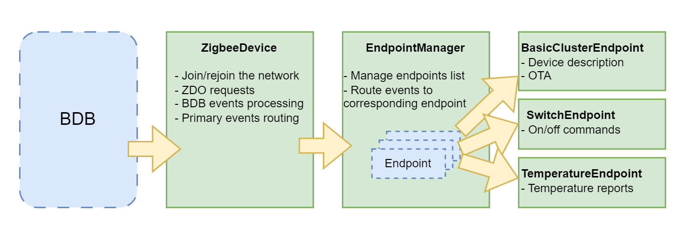
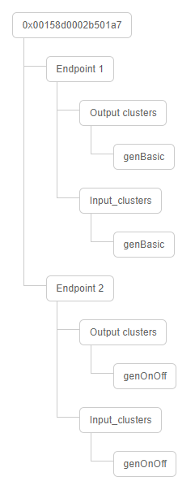

# Hello Zigbee World, Part 13 - Extendable Zigbee project structure in C++

As a part of working on [our custom smart switch firmware](part0_plan.md), we developed a lot of code. Even though each particular function is pretty simple, it is still hard to understand the firmware as a whole. Number of event handlers call each other, and components’ code is somewhat mixed. It is time to do some house cleaning, and bring some structure into the code. As I mentioned previously I love C++ more than C, so I’ll be doing this in OOD way. 

The code will be based on the results of the previous articles, and [run on EBYTE E75–2G4M10S module](part1_bring_up.md) based on the NXP JN5169 microcontroller.

## Firmware structure

There are a number of problems with the Zigbee API from NXP, it does not correspond to object oriented design principles. And the problem is not in C language - the Win32 API is also written in C, but it is very much object oriented. The API from NXP is much worse:

- Callbacks are used everywhere without specifying which object this call refers to. In the best case, we will be given the index of the object (for example, the endpoint number), but converting the index to associated data structure pointer must be done by the client code. 
- Sometimes even this kind of information must be parsed from low level raw data packets.
- Client code has to access ZCL internal structures directly. There are no data accessor functions.
- State machines are used everywhere - for example send a request, and switch into a state of waiting for a response. And an answer may not come, but an error event happens instead.
- Finally, in the NXP example code everything is very mixed up - the code and data of various modules are intertwined into one big clew, without the possibility of splitting it into separate components.

It took me a few weeks to play with the code, before it finally got structured. In fact, the structure is very inspired by the message path from the ZigBee stack to the application components.



Components on this diagram are:

- The `ZigbeeDevice` class serves the device as a whole. Its competence includes joining / rejoining / leaving the network (mostly a reaction on corresponding BDB events), as well as general requests to the device as a ZigBee network node (requests to ZDO).
- The `EndpointManager` class is essentially a list of endpoints. This class is an entry point for ZCL messages, which are then dispatched to the appropriate endpoint. 
- The `Endpoint` class is the base class for endpoints. It parses a received ZCL event, and redirects it to the appropriate handler function. These handlers functions must be implemented in derived classes.
- The `SwitchEndpoint` class is a particular implementation of an endpoint class. In this case it implements the functionality of one particular switch. The class can turn on / off the light, report to the coordinator about state change, and receive commands to turn it on / off. If the device has multiple relay channels, there will be multiple instances of this class.
- The `ThermometerEndpoint` class is an example of another possible functional endpoint, if the device would implement a thermometer function. 
- The `BasicClusterEndpoint` -  endpoint that contains ZCL clusters related to the device as a whole, but not associated with a specific device function. This includes Basic cluster (fields describing the device, such as device name, version, manufacturer, etc), OTA for firmware updates, Identify cluster for device identification, and other similar clusters.

You may be confused that `ZigbeeDevice` (and particularly ZDO) is describing the device as a network node, as well `BasicClusterEndpoint` does pretty much the same. Honestly, I am confused as well. 

The possible explanation is that ZigbeeDevice/ZDO serve the lower (network) level - how the device operates on the network. With this layer the device can exchange data with other devices on the network, but this layer knows nothing about transmitted data content. Device name, firmware version, and manufacturer information is basically not needed for the device to join the network and communicate to other nodes - the only information that is really needed is just a device address. Moreover, even cluster structure is not needed for data communication - you can potentially build your own high level protocol based on the low level Zigbee data transfer.

On the other hand some ZCL clusters such as Basic, OTA, Identify, and others, provide higher level information on the device, and other device level functions. Typically these clusters occupy endpoint #1 - I have no idea why, and I have not found any information on the documentation on this. Anyhow, I decided to put all these clusters in a dedicated Endpoint object - `BasicClusterEndpoint` (even though there will be not only Basic Cluster there one day).

## ZigbeeDevice class

Let’s see some implementation details. ZigbeeDevice implements device joining and rejoining logic - this was the topic of the recent few articles.

```cpp
class ZigbeeDevice
{
   typedef enum
   {
       NOT_JOINED,
       JOINING,
       JOINED

   } JoinStateEnum;

   PersistedValue<JoinStateEnum, PDM_ID_NODE_STATE> connectionState;
   Queue<BDB_tsZpsAfEvent, 3> bdbEventQueue;
   PollTask pollTask;

   bool polling;
   int rejoinFailures;
   int cyclesTillNextRejoin;

   ZigbeeDevice();

public:
   static ZigbeeDevice * getInstance();

   void joinNetwork();
   void rejoinNetwork();
   void leaveNetwork();
   void joinOrLeaveNetwork();

   void pollParent();
   bool canSleep() const;
   bool needsRejoin() const;
   void handleWakeUp();

protected:
   void handleNetworkJoinAndRejoin();
   void handleLeaveNetwork();
   void handleRejoinFailure();
   void handlePollResponse(ZPS_tsAfPollConfEvent* pEvent);
   void handleZdoBindEvent(ZPS_tsAfZdoBindEvent * pEvent);
   void handleZdoUnbindEvent(ZPS_tsAfZdoUnbindEvent * pEvent);
   void handleZdoDataIndication(ZPS_tsAfEvent * pEvent);
   void handleZdoEvents(ZPS_tsAfEvent* psStackEvent);
   void handleZclEvents(ZPS_tsAfEvent* psStackEvent);
   void handleAfEvent(BDB_tsZpsAfEvent *psZpsAfEvent);

public:
   void handleBdbEvent(BDB_tsBdbEvent *psBdbEvent);
};
```

Basically, this class handles joining / rejoining / leaving the network logic. The interesting thing about this class is how the BDB event gets into the respective handler. The issue is that the name of the `APP_vBdbCallback()` function is hardcoded in the stack as the entry point for all events. I had to make the `ZigbeeDevice` class a singleton in order route BDB messages to this class.

```cpp
PUBLIC void APP_vBdbCallback(BDB_tsBdbEvent * event)
{
   ZigbeeDevice::getInstance()->handleBdbEvent(event);
}

ZigbeeDevice * ZigbeeDevice::getInstance()
{
   static ZigbeeDevice instance;
   return &instance;
}

void ZigbeeDevice::handleBdbEvent(BDB_tsBdbEvent *psBdbEvent)
{
   switch(psBdbEvent->eEventType)
   {
...
```

Looks simple. It even compiles... but does not link.

```
c:/nxp/bstudio_nxp/sdk/tools/ba-elf-ba2-r36379/bin/../lib/gcc/ba-elf/4.7.4/../../../../ba-elf/lib/mcpu_jn51xx_sizeopt\libg.a(lib_a-glue.o): In function `_sbrk':
/ba_toolchain/r36379/source/gcc-4.7.4-ba-r36379-build/ba-elf/mcpu_jn51xx_sizeopt/newlib/libc/sys/basim/../../../../../../../gcc-4.7.4-ba-r36379/newlib/libc/sys/basim/glue.c:75: undefined reference to `end'
/ba_toolchain/r36379/source/gcc-4.7.4-ba-r36379-build/ba-elf/mcpu_jn51xx_sizeopt/newlib/libc/sys/basim/../../../../../../../gcc-4.7.4-ba-r36379/newlib/libc/sys/basim/glue.c:75: undefined reference to `_stack'
/ba_toolchain/r36379/source/gcc-4.7.4-ba-r36379-build/ba-elf/mcpu_jn51xx_sizeopt/newlib/libc/sys/basim/../../../../../../../gcc-4.7.4-ba-r36379/newlib/libc/sys/basim/glue.c:75: undefined reference to `_stack'
/ba_toolchain/r36379/source/gcc-4.7.4-ba-r36379-build/ba-elf/mcpu_jn51xx_sizeopt/newlib/libc/sys/basim/../../../../../../../gcc-4.7.4-ba-r36379/newlib/libc/sys/basim/glue.c:75:(.text+0x197): relocation truncated to fit: R_BA_8 against undefined symbol `_stack'
```

We saw a similar error in the article related to C++. The error is strange and does not indicate at all what exactly is wrong. This time it caused by the instance static variable, and particularly because the compiler generates code that
- initializes local static variables in a thread-safe way (preventing simultaneous construction from several threads)
- registers a destructor with the atexit() function (so that the destructor is called at the end of the application)
- protects constructor from possible exceptions
- adds runtime type information (for exceptions purposes)

This all is not relevant to our code. We do not have any threads, and do not need to protect constructors from simultaneous calls. The firmware does not have an “exit” and never calls destructors. Exceptions and RTTI are also not used in the code. So we can safely disable these features with `-fno-rtti -fno-exceptions -fno-use-cxa-atexit -fno-threadsafe-statics` compiler switches. With these tweaks the code has linked normally.

## EndpointManager class

```cpp
class EndpointManager
{
private:
   Endpoint * registry[ZCL_NUMBER_OF_ENDPOINTS+1];

   EndpointManager()
   {
       memset(registry, 0, sizeof(Endpoint*) * (ZCL_NUMBER_OF_ENDPOINTS+1));
   }

public:
   static EndpointManager * getInstance()
   {
       static EndpointManager instance;
       return &instance;
   }

   void registerEndpoint(uint8 id, Endpoint * endpoint)
   {
       registry[id] = endpoint;
       endpoint->setEndpointId(id);
       endpoint->init();
   }

   static void handleZclEvent(tsZCL_CallBackEvent *psEvent)
   {
       EndpointManager::getInstance()->handleZclEventInt(psEvent);
   }

protected:
   void handleZclEventInt(tsZCL_CallBackEvent *psEvent)
   {
       uint8 ep = psEvent->u8EndPoint;
       registry[ep]->handleZclEvent(psEvent);
   }
};
```

As I said, this class manages the list of endpoints. I was too lazy to implement a true map of endpoint indices to class pointers, so I just used an array. Indexes in this array correspond to the endpoint number, and the value in this cell points to the corresponding Endpoint object. You should use consecutive endpoint numbers, otherwise the array would be large and sparse.

I would love static initialization of this list one day, but for now let’s use the `registerEndpoint()` function.

This class also has to be a singleton - it also accepts callbacks from the Zigbee stack through the `handleZclEvent()` function, which then routed to the appropriate endpoint object.

## Endpoint base class

```cpp
class Endpoint
{
   uint8 endpointId;

public:
   Endpoint();
   {
       endpointId = 0;
   }

   void setEndpointId(uint8 id);
   {
       endpointId = id;
   }

   uint8 getEndpointId() const;
   {
       return endpointId;
   }


   virtual void init() = 0;
   virtual void handleZclEvent(tsZCL_CallBackEvent *psEvent);

protected:
   virtual void handleClusterUpdate(tsZCL_CallBackEvent *psEvent) = 0;
   virtual void handleWriteAttributeCompleted(tsZCL_CallBackEvent *psEvent) = 0;
};

void Endpoint::handleZclEvent(tsZCL_CallBackEvent *psEvent)
{
   switch (psEvent->eEventType)
   {
  ...
       case E_ZCL_CBET_CLUSTER_CUSTOM:
       case E_ZCL_CBET_CLUSTER_UPDATE:
           handleClusterUpdate(psEvent);
           break;
        case E_ZCL_CBET_WRITE_INDIVIDUAL_ATTRIBUTE:
           handleWriteAttributeCompleted(psEvent);
           break;
...
   }
}
```

The `handleZclEvent()` function fully corresponds to the `APP_ZCL_cbEndpointCallback()` function from the previous articles. The only thing I would like to demonstrate here is the dispatching of various types of messages to the appropriate handlers from the derived classes (in this case, calling `handleClusterUpdate()` or `handleWriteAttributeCompleted()` handlers).


## BasicClusterEndpoint class

And here the most interesting part begins. Previously we were using the `eZLO_RegisterOnOffLightEndPoint()` function to register the endpoint. In fact this function registers not only the endpoint, but also all the clusters inside. The cluster structure is described in [Zigbee Lighting and Occupancy Devices Specification](https://zigbeealliance.org/wp-content/uploads/2019/11/docs-15-0014-05-0plo-Lighting-OccupancyDevice-Specification-V1.0.pdf), or [ZigBee 3.0 Devices User Guide](https://www.nxp.com/docs/en/user-guide/JN-UG-3114.pdf) from NXP. You have very limited control on what clusters will be included in the endpoint. Clusters are enabled/disabled using defines across the whole application. 

This is probably OK if you are building a generic light device, with a single On/Off endpoint. But I would like to build a custom device, with more than one On/Off cluster (and therefore more than one endpoint), possibly extend this with a temperature and power sensors (like what Xiaomi switches do), maybe do some other tweaks. 

As I mentioned earlier, I decided to separate functional endpoints, and an endpoint containing device related clusters (e.g. Basic Cluster, OTA, Identify). Since the functions like `Register***EndPoint()` just register the endpoint, and add needed clusters inside, we can do the same in our code — manually register the endpoint, and clusters that we need.

```cpp
// List of cluster instances (descriptor objects) that are included into an Endpoint
struct BasicClusterInstances
{
   // All devices have basic mandatory clusters
   tsZCL_ClusterInstance sBasicServer;

   // Zigbee device may have also OTA optional clusters for the client
   tsZCL_ClusterInstance sOTAClient;
} __attribute__ ((aligned(4)));

class BasicClusterEndpoint : public Endpoint
{
   tsZCL_EndPointDefinition endPoint;

   // Cluster instances
   BasicClusterInstances clusterInstances;

   // Value storage for endpoint's clusters
   tsCLD_Basic sBasicServerCluster;
   tsCLD_AS_Ota sOTAClientCluster;
   tsOTA_Common sOTACustomDataStruct;

public:
   BasicClusterEndpoint();

   virtual void init();

protected:
   virtual void registerBasicCluster();
   virtual void registerOtaCluster();
   virtual void registerEndpoint();

   virtual void handleClusterUpdate(tsZCL_CallBackEvent *psEvent);
};
```

But first, let’s talk about data structures. The endpoint consists of the following parts:
- `tsZCL_EndPointDefinition` structure that describes the endpoint as a whole (`endPoint` member field)
- A set of `tsZCL_ClusterInstance` structures that describe each cluster at the endpoint (`clusterInstances` member)
- A set of data structures that reflect the current value of each cluster's attributes

In fact, this code is inspired by the ZCL sources (more specifically, on_off_light.h), I just threw out everything related to the switch functionality, but left only the common clusters. Also I decided to clean up the noodles of defines in the original code to make the code cleaner.

Despite the name, the Cluster Instance structure actually contains a general description of the cluster, while the data itself is stored in a structure like `tsCLD_Basic`. This a little bit contradicts with the C++, where the instance word is used to describe an exact object of a certain type. In Zigbee world it describes an instance of a cluster in an endpoint (other endpoints may have other cluster instances of the same type).

```cpp
void BasicClusterEndpoint::registerBasicCluster()
{
   // Create an instance of a basic cluster as a server
   teZCL_Status status = eCLD_BasicCreateBasic(&clusterInstances.sBasicServer,
                                               TRUE,
                                               &sCLD_Basic,
                                               &sBasicServerCluster,
                                               &au8BasicClusterAttributeControlBits[0]);
   if( status != E_ZCL_SUCCESS)
       DBG_vPrintf(TRUE, "BasicClusterEndpoint::init(): Failed to create Basic Cluster instance. status=%d\n", status);
}

void BasicClusterEndpoint::registerOtaCluster()
{
   // TODO
}

void BasicClusterEndpoint::registerEndpoint()
{
   // Fill in end point details
   endPoint.u8EndPointNumber = getEndpointId();
   endPoint.u16ManufacturerCode = ZCL_MANUFACTURER_CODE;
   endPoint.u16ProfileEnum = HA_PROFILE_ID;
   endPoint.bIsManufacturerSpecificProfile = FALSE;
   endPoint.u16NumberOfClusters = sizeof(BasicClusterInstances) / sizeof(tsZCL_ClusterInstance);
   endPoint.psClusterInstance = (tsZCL_ClusterInstance*)&clusterInstances;
   endPoint.bDisableDefaultResponse = ZCL_DISABLE_DEFAULT_RESPONSES;
   endPoint.pCallBackFunctions = &EndpointManager::handleZclEvent;

   // Register the endpoint with all the clusters above
   teZCL_Status status = eZCL_Register(&endPoint);
   DBG_vPrintf(TRUE, "BasicClusterEndpoint::init(): Register Basic Cluster Endpoint. status=%d\n", status);
}

void BasicClusterEndpoint::init()
{
   registerBasicCluster();
   registerOtaCluster();
   registerEndpoint();

   // Fill Basic cluster attributes
   memcpy(sBasicServerCluster.au8ManufacturerName, CLD_BAS_MANUF_NAME_STR, CLD_BAS_MANUF_NAME_SIZE);
   memcpy(sBasicServerCluster.au8ModelIdentifier, CLD_BAS_MODEL_ID_STR, CLD_BAS_MODEL_ID_SIZE);
   memcpy(sBasicServerCluster.au8DateCode, CLD_BAS_DATE_STR, CLD_BAS_DATE_SIZE);
   memcpy(sBasicServerCluster.au8SWBuildID, CLD_BAS_SW_BUILD_STR, CLD_BAS_SW_BUILD_SIZE);
   sBasicServerCluster.eGenericDeviceType = E_CLD_BAS_GENERIC_DEVICE_TYPE_WALL_SWITCH;
}
```

The `init()` function does exactly what is described above - registers an endpoint, and registers a few clusters in it (OTA cluster is still on its way). Finally this code initializes attributes of the Basic cluster. The code also links together all the structures - cluster data storage with cluster descriptors, cluster descriptors with the endpoint descriptor.

As I said previously, the framework is not object-oriented at all. We cannot bind our specific object on the firmware side to an endpoint on the Zigbee framework. The only thing we can do is to pass the framework a pointer to our callback. That is why I needed the `EndpointManager` class to be the entry point for all messages that will then be dispatched to a specific handler object.

## SwitchEnpoint class

SwitchEndpoint actually implements the functionality of a single switch object.

```cpp
// List of cluster instances (descriptor objects) that are included into the endpoint
struct OnOffClusterInstances
{
   tsZCL_ClusterInstance sOnOffServer;
} __attribute__ ((aligned(4)));


class SwitchEndpoint: public Endpoint
{   
protected:
   tsZCL_EndPointDefinition sEndPoint;
   OnOffClusterInstances sClusterInstance;
   tsCLD_OnOff sOnOffServerCluster;

   BlinkTask blinkTask;

public:
   SwitchEndpoint();
   virtual void init();

   bool getState() const;
   void switchOn();
   void switchOff();
   void toggle();

protected:
   void doStateChange(bool state);
   void reportStateChange();

protected:
   virtual void handleClusterUpdate(tsZCL_CallBackEvent *psEvent);
};
```

This class does two things: control a relay/light, and receive/transmit ZigBee messages. Moreover, these features can be used separately. So if the user pressed the button, then we need to switch the relay and send a ZigBee message. And if the Turn On command comes from the network, then we only need to switch the relay. Therefore, I moved these 2 actions into separate functions.

```cpp
void SwitchEndpoint::doStateChange(bool state)
{
   DBG_vPrintf(TRUE, "SwitchEndpoint EP=%d: do state change %d\n", getEndpointId(), state);

   sSwitch.sOnOffServerCluster.bOnOff = state ? TRUE : FALSE;

   blinkTask.setBlinkMode(state);
}

void SwitchEndpoint::reportStateChange()
{
   // Destination address - 0x0000 (coordinator)
   tsZCL_Address addr;
   addr.uAddress.u16DestinationAddress = 0x0000;
   addr.eAddressMode = E_ZCL_AM_SHORT;

   DBG_vPrintf(TRUE, "Reporting attribute EP=%d value=%d... ", getEndpointId(), sSwitch.sOnOffServerCluster.bOnOff);
   PDUM_thAPduInstance myPDUM_thAPduInstance = hZCL_AllocateAPduInstance();
   teZCL_Status status = eZCL_ReportAttribute(&addr,
                                              GENERAL_CLUSTER_ID_ONOFF,
                                              E_CLD_ONOFF_ATTR_ID_ONOFF,
                                              getEndpointId(),
                                              1,
                                              myPDUM_thAPduInstance);
   PDUM_eAPduFreeAPduInstance(myPDUM_thAPduInstance);
   DBG_vPrintf(TRUE, "status: %02x\n", status);
}

Everything else is just handy functions. Here are user action handlers.

void SwitchEndpoint::switchOn()
{
    doStateChange(true);
    reportStateChange();
}

void SwitchEndpoint::switchOff()
{
    doStateChange(false);
    reportStateChange();
}

void SwitchEndpoint::toggle()
{
    doStateChange(!getState());
    reportStateChange();
}
```

And here are network handlers.

```cpp
void SwitchEndpoint::handleClusterUpdate(tsZCL_CallBackEvent *psEvent)
{
   // Parse the Command and Cluster ID
   uint16 u16ClusterId = psEvent->uMessage.sClusterCustomMessage.u16ClusterId;
   tsCLD_OnOffCallBackMessage * msg = (tsCLD_OnOffCallBackMessage *)psEvent->uMessage.sClusterCustomMessage.pvCustomData;
   uint8 u8CommandId = msg->u8CommandId;

   DBG_vPrintf(TRUE, "SwitchEndpoint EP=%d: Cluster update message ClusterID=%04x Cmd=%02x\n",
               psEvent->u8EndPoint,
               u16ClusterId,
               u8CommandId);

   doStateChange(getState());
}
```

The endpoint initialization is pretty similar to what we did in the BasicClusterEndpoint - initialize clusters, initialize endpoint, link together data structures and descriptors.

```cpp
void SwitchEndpoint::registerServerCluster()
{
   // Initialize On/Off server cluser
   teZCL_Status status = eCLD_OnOffCreateOnOff(&sClusterInstance.sOnOffServer,
                                               TRUE,                               // Server
                                               &sCLD_OnOff,
                                               &sOnOffServerCluster,
                                               &au8OnOffAttributeControlBits[0],
                                               &sOnOffServerCustomDataStructure);
   if( status != E_ZCL_SUCCESS)
       DBG_vPrintf(TRUE, "SwitchEndpoint::init(): Failed to create OnOff server cluster instance. status=%d\n", status);
}

void SwitchEndpoint::registerEndpoint()
{
   // Initialize endpoint structure
   sEndPoint.u8EndPointNumber = getEndpointId();
   sEndPoint.u16ManufacturerCode = ZCL_MANUFACTURER_CODE;
   sEndPoint.u16ProfileEnum = HA_PROFILE_ID;
   sEndPoint.bIsManufacturerSpecificProfile = FALSE;
   sEndPoint.u16NumberOfClusters = sizeof(OnOffClusterInstances) / sizeof(tsZCL_ClusterInstance);
   sEndPoint.psClusterInstance = (tsZCL_ClusterInstance*)&sClusterInstance;
   sEndPoint.bDisableDefaultResponse = ZCL_DISABLE_DEFAULT_RESPONSES;
   sEndPoint.pCallBackFunctions = &EndpointManager::handleZclEvent;

   // Register the endpoint with all the clusters in it
   teZCL_Status status = eZCL_Register(&sEndPoint);
   DBG_vPrintf(TRUE, "SwitchEndpoint::init(): Register Switch Endpoint. status=%d\n", status);
}

void SwitchEndpoint::init()
{
   // Register all clusters and endpoint itself
   registerServerCluster();
   registerEndpoint();

   // Initialize blinking
   // Note: this blinking task represents a relay that would be tied with this switch. That is why blinkTask
   // is a property of SwitchEndpoint, and not the global task object
   // TODO: restore previous blink mode from PDM
   blinkTask.setBlinkMode(false);
}
```

One last thing about the `SwitchEndpoint` class. The `BlinkTask` is part of the `SwitchEndpoint` class, and not a separate thing. That is because the blinking LED, in fact, reflects the state of the particular switch - on or off. That is why it is a part of the switch class. In the future, I will replace this code with switch relay control.

## Running everything together

As you remember, [there is a compiler/platform limitation](part9_cpp_building_blocks.md) - it does not run constructors for globally defined objects. Well, it is technically possible to create needed objects somewhere on the `vAppMain()` function stack and not use global objects. But `SwitchEndpoint` needs to be accessed from several places: 
- From `vAppMain()` to create and initialize the endpoint
- from `MainTask()` to switch the endpoint state on button click
- (maybe) from `Wakeup()` / `Sleep()` functions to suspend / resume endpoint activities.

We have already learned how to make a singleton, but the endpoint cannot be a singleton simply because there could be more than one switch endpoint. Therefore, I simply wrapped all endpoint objects in the Context class and operate with the pointer to the object created on the `vAppMain()` stack.

```cpp
struct Context
{
   BasicClusterEndpoint basicEndpoint;
   SwitchEndpoint switch1;
};

extern "C" PUBLIC void vAppMain(void)
{
...
   Context context;
   EndpointManager::getInstance()->registerEndpoint(HELLOENDDEVICE_BASIC_ENDPOINT, &context.basicEndpoint);
   EndpointManager::getInstance()->registerEndpoint(HELLOENDDEVICE_SWITCH_ENDPOINT, &context.switch1);
...
   while(1)
   {
       APP_vTaskSwitch(&context);
...
```

One more very important thing - now we have 2 endpoints, and therefore we need to let ZCL (and other clients) know about this

```cpp
#define ZCL_NUMBER_OF_ENDPOINTS                             2
```

We also need to add a new endpoint to the ZPSConfigurationEditor and [regenerate zps_gen.c](part5_zigbee_init.md), otherwise the device will send incorrect endpoint descriptors and therefore cannot correctly join the network. BTW, on every change in descriptors, the device must be completely deleted from zigbee2mqtt, and Z2M must be restarted, otherwise it will use outdated device structure.

After some fiddling with the sniffer and fixing minor bugs, everything worked perfectly. Now the structure of the device looks like this: Basic cluster on the endpoint 1, and the switch (genOnOff) on the second endpoint.



## Summary

The main outcome of this part is significantly improved code structure. Now the code is split into several entities with clear responsibilities. It is also easy to add more endpoints, and create a pretty much arbitrary device structure. The Zigbee framework from NXP offers only standard device types with a predefined device structure, while the code we created allows easy creation of custom device types with any number of endpoints and clusters in them.

I very much like the fact this structure was based on C++ classes, rather than C functions. Obviously this is a very limited C++, with no standard library and multiple C++ features are disabled due to architecture limitations. Moreover I did not use very C++ specific features of the language - I want this code to be understood by a wider audience, and particularly C engineers. But even having these limitations, I can still use other benefits of C++ such as strict type checking, templates, OOD, and many more.

I do not consider this code as a final product - it still has a room for improvement. But it already makes a huge benefit regarding the code structure and readability.

## Links

- Documentation
  - [JN-UG-3113 ZigBee 3.0 Stack User Guide](https://www.nxp.com/docs/en/user-guide/JN-UG-3113.pdf)
  - [JN-UG-3114 ZigBee 3.0 Devices User Guide](https://www.nxp.com/docs/en/user-guide/JN-UG-3114.pdf)
  - [JN-UG-3076 ZigBee Home Automation User Guide](https://www.nxp.com/docs/en/user-guide/JN-UG-3076.pdf)
  - [JN-UG-3101 ZigBee PRO Stack User Guide](https://www.nxp.com/docs/en/user-guide/JN-UG-3101.pdf)
  - [ZigBee Lighting & Occupancy Device Specification Version 1.0](https://zigbeealliance.org/wp-content/uploads/2019/11/docs-15-0014-05-0plo-Lighting-OccupancyDevice-Specification-V1.0.pdf)
- Code
  - [Project on github](https://github.com/grafalex82/hellozigbee/tree/hello_zigbee_part_2)
  - JN-AN-1220-Zigbee-3–0-Sensors example (recommended)
  - JN-AN-1219-Zigbee-3–0-Controller-and-Switch example (somewhat sophisticated for learning purposes)
  - https://github.com/actg/JN5169-for-xiaomi-wireless-switch.git


