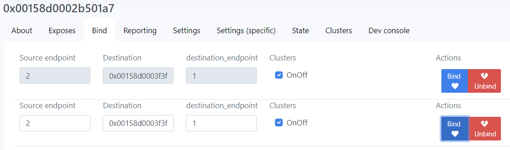
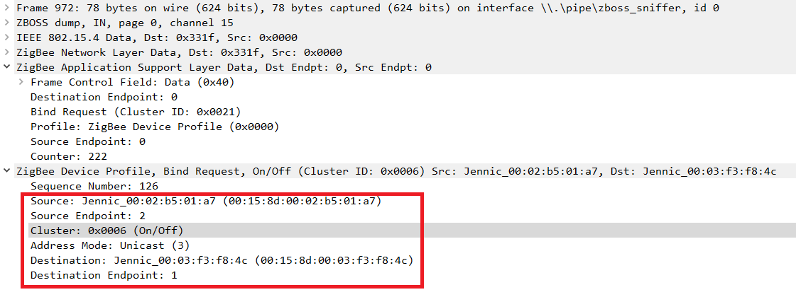
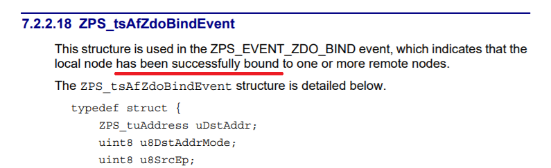
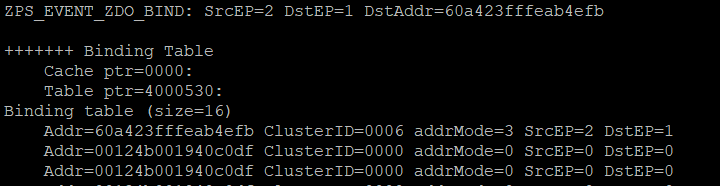
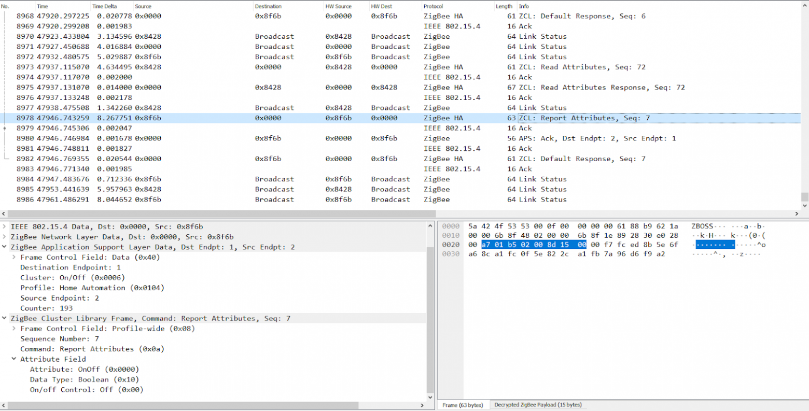
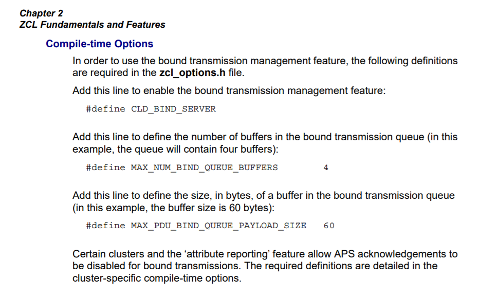
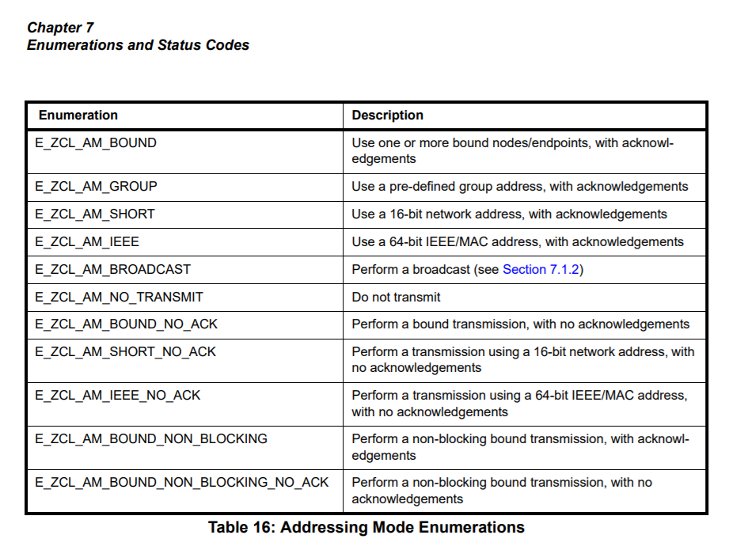
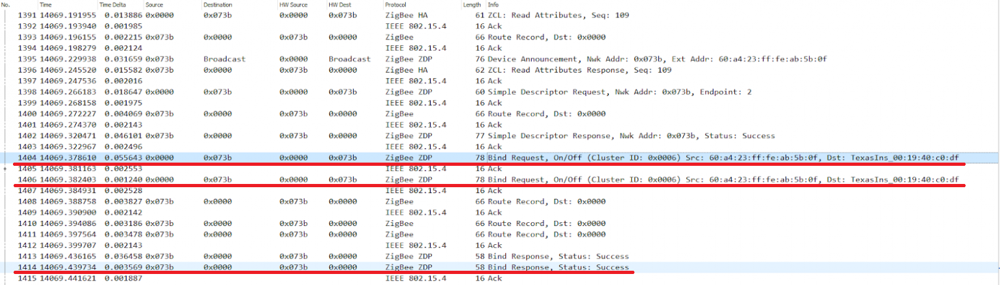
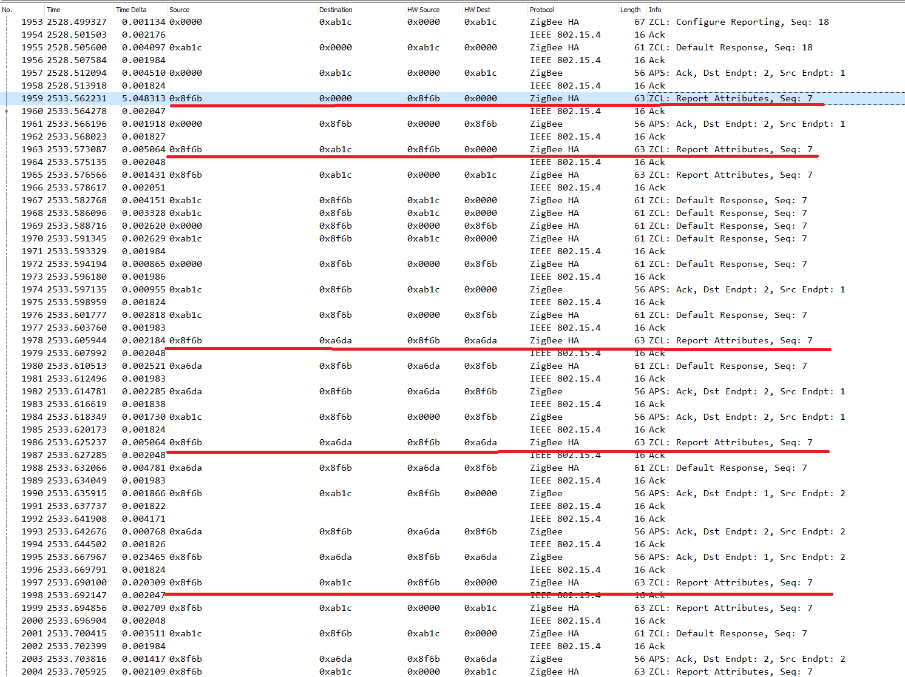

# Hello Zigbee World, Part 14 - Direct binding of devices

Typically, Zigbee home automation networks have a certain server or hub that acts as the Zigbee network coordinator. This server also runs a home automation logic of how devices control other devices. But at the same time, this server is a single point of failure - if something happens to the server, the network will stop functioning.

To reduce the impact of such a situation, Zigbee developers came up with a binding mechanism - individual devices can communicate directly, skipping the coordinator. Thus, for example, a switch can send reports and commands directly to a light (or even a group of lights), and a temperature sensor can supply values ​​directly to a thermostat. At the same time, the coordinator participates only as an initiator of this binding.

This is a next article in the [building custom Zigbee device firmware from scratch series](part0_plan.md). Our device can already act as a smart switch, the user can control device state with the button, and change the state from the smart home system (zigbee2mqtt in my case). In this article I would like to explore the possibility to bind several devices directly, so that they can communicate without the coordinator.

The code will be based on the results of the previous articles, and [run on EBYTE E75–2G4M10S module](part1_bring_up.md) based on the NXP JN5169 microcontroller.

## Taking a look at BDB Find and Bind

The examples from NXP are based on the "Find and Bind" feature. This approach is offered by the Zigbee Base Device Behavior Specification and, as we already know from the previous article, is implemented as part of the NXP Zigbee SDK (BDB component). The following describes typical usage of the Find and Bind feature:

- By pressing certain buttons on the source device, the device enters into pairing mode (Find and Bind as Initiator)
- Similarly, pairing mode is enabled on the receiver device (Find and Bind as Target)
- Devices find each other by broadcasting certain pairing packets
- Devices negotiate various characteristics, node and endpoint descriptors. This is necessary to identify clusters to bind.
- Binding occurs automatically for all matching clusters.

From the code stand point, all this is implemented by the BDB component. We just need to develop button handlers that would call a few functions from the BDB, and handle several messages. The Find And Bind API is very simple and consists of just a few functions.

```cpp
PUBLIC BDB_teStatus BDB_eFbTriggerAsInitiator(uint8 u8SourceEndPointId);
PUBLIC void BDB_vFbExitAsInitiator();
PUBLIC BDB_teStatus BDB_eFbTriggerAsTarget(uint8 u8EndPointId);
PUBLIC void BDB_vFbExitAsTarget(uint8 u8SourceEndpoint);
```

Perhaps, this approach is very convenient for an average user: take the devices out of the box, press a few buttons, and voila - the devices are paired. Unfortunately, this approach does not suit me for two reasons:

- I simply don't have devices that can bind in this way. Even if I implement the Find and Bind magic in my device, it will still not be supported by other devices from Xiaomi, Tuya, Moes, and others.

- My Zigbee network is based on zigbee2mqtt, and the device binding happens by a command from the coordinator. This command clearly states who, where, and how shall communicate. But, as you can see, the BDB API does not provide such a fine tuning - there is neither addresses of the target device, nor list of clusters to bind.

It looks like we need to step back from BDB implementation, and implement binding ourselves.

## Handling bind request

Let's try to bind two devices using the zigbee2mqtt command. As you remember, in the previous articles we built a simple smart switch. The device can handle the on-off button, report state changes to the coordinator, and also respond to the coordinator's commands and switch the state of the LED. Let my switch bind with a Xioami relay switch.

Here is the binding form on the zigbee2mqtt dashboard



By clicking on the Bind button, the coordinator sends a Bind Request message to our device. The message indicates the source endpoint number, address and endpoint number of the target device, and the list of clusters to be bound.



How to add an event handler was described in the previous articles in detail. In a nutshell, Zigbee stack will receive this packet, parse it, decompose it into a structure, and pass it to the callback function we provided. Bind/unbind messages arrive at the zero endpoint (ZDO), and in my case are processed in the ZigbeeDevice::handleZdoEvents() method. For now, let’s just print this message.

```cpp
PRIVATE void vPrintAddr(ZPS_tuAddress addr, uint8 mode)
{
   if(mode == ZPS_E_ADDR_MODE_IEEE)
       DBG_vPrintf(TRUE, "%016llx", addr.u64Addr);
   else if(mode == ZPS_E_ADDR_MODE_SHORT)
       DBG_vPrintf(TRUE, "%04x", addr.u16Addr);
   else
       DBG_vPrintf(TRUE, "unknown addr mode %d", mode);
}

void vDumpBindEvent(ZPS_tsAfZdoBindEvent * pEvent)
{
   DBG_vPrintf(TRUE, "ZPS_EVENT_ZDO_BIND: SrcEP=%d DstEP=%d DstAddr=", pEvent->u8SrcEp, pEvent->u8DstEp);
   vPrintAddr(pEvent->uDstAddr, pEvent->u8DstAddrMode);
   DBG_vPrintf(TRUE, "\n");
}

void ZigbeeDevice::handleZdoEvents(ZPS_tsAfEvent* psStackEvent)
{
...
   switch(psStackEvent->eType)
   {
       case ZPS_EVENT_ZDO_BIND:
           vDumpBindEvent(&psStackEvent->uEvent.sZdoBindEvent);
           break;
...
```

To my surprise, for some reason, the ClusterID field did not reach the `ZPS_tsAfZdoBindEvent` structure, although it is obviously present in the Zigbee packet shown above. The absence of the ClusterID field led me astray for some time. The original plan was to write a ZPS_EVENT_ZDO_BIND event handler that would call the `ZPS_eAplZdoBind()` function, which takes a ClusterID as one of the parameters. 

Fortunately things are easier here. 



As per documentation, the ZPS_EVENT_ZDO_BIND message is sent to indicate that the binding has ALREADY happened inside the stack, we are just informed about this.

Let’s take a look at internal structures of the device, and particularly at the binding table. Below are functions that dump the binding table and address mapping table. These functions are complete analogs of the vDisplayBindingTable() and vDisplayAddressMapTable() functions that come with the Zigbee stack. I just wrote mine a little before I saw the ones in SDK.

```cpp
PRIVATE void vDisplayBindTableEntry(ZPS_tsAplApsmeBindingTableEntry * entry)
{
    DBG_vPrintf(TRUE, "    ClusterID=%04x SrcEP=%d DstEP=%d DstAddr=", entry->u16ClusterId, entry->u8SourceEndpoint, entry->u8DestinationEndPoint);
    vPrintAddr(entry->uDstAddress, entry->u8DstAddrMode);
    DBG_vPrintf(TRUE, "\n");
}

void vDisplayBindTable()
{
   // Get pointers
   ZPS_tsAplAib * aib = ZPS_psAplAibGetAib();
   ZPS_tsAplApsmeBindingTableType * bindingTable = aib->psAplApsmeAibBindingTable;
   ZPS_tsAplApsmeBindingTableCache* cache = bindingTable->psAplApsmeBindingTableCache;
   ZPS_tsAplApsmeBindingTable* table = bindingTable->psAplApsmeBindingTable;

   // Print header
   DBG_vPrintf(TRUE, "\n+++++++ Binding Table\n");
   DBG_vPrintf(TRUE, "    Cache ptr=%04x:\n", cache);
   DBG_vPrintf(TRUE, "    Table ptr=%04x:\n", table);

   // Dump cache
   if(cache)
   {
       DBG_vPrintf(TRUE, "Cache:\n");
       vDisplayBindTableEntry(cache->pvAplApsmeBindingTableForRemoteSrcAddr);
       DBG_vPrintf(TRUE, "Cache size = %d\n", cache->u32SizeOfBindingCache);
       for(uint32 i=0; i < cache->u32SizeOfBindingCache; i++)
           DBG_vPrintf(TRUE, "    %016llx\n", cache->pu64RemoteDevicesList[i]);
   }

   // Dump table
   if(table)
   {
       DBG_vPrintf(TRUE, "Binding table (size=%d)\n", table->u32SizeOfBindingTable);
       for(uint32 i=0; i<table->u32SizeOfBindingTable; i++)
       {
           ZPS_tsAplApsmeBindingTableStoreEntry * entry = table->pvAplApsmeBindingTableEntryForSpSrcAddr + i;

           DBG_vPrintf(TRUE, "    Addr=%016llx ClusterID=%04x addrMode=%d SrcEP=%d DstEP=%d\n",
                       ZPS_u64NwkNibGetMappedIeeeAddr(ZPS_pvAplZdoGetNwkHandle(), entry->u16AddrOrLkUp),
                       entry->u16ClusterId,
                       entry->u8DstAddrMode,
                       entry->u8SourceEndpoint,
                       entry->u8DestinationEndPoint);
       }
   }
}

void vDisplayAddressMap()
{
   ZPS_tsNwkNib * nib = ZPS_psNwkNibGetHandle(ZPS_pvAplZdoGetNwkHandle());

   uint16 mapsize = nib->sTblSize.u16AddrMap;
   DBG_vPrintf(TRUE, "Address map (size=%d)\n", mapsize);

   for(uint16 i=0; i<mapsize; i++)
   {
       DBG_vPrintf(TRUE, "    Addr=%04x ieeeAddr=%016llx\n",
                   nib->sTbl.pu16AddrMapNwk[i],
                   ZPS_u64NwkNibGetMappedIeeeAddr(ZPS_pvAplZdoGetNwkHandle(),nib->sTbl.pu16AddrLookup[i]));
   }
}
```

Here is how the binding table looks like after the bind command is received.




Obviously, there is a record in the binding table that perfectly matches the coordinator's request. I’d like to emphasize the fact that the entry appeared, although we have not yet written a single line of code (dumping the request and the binding table does not count). 

Let's see if anything has changed in the behavior of the device. And unfortunately there are no visible changes - if you press the button on the device, the message is still sent only to the coordinator.



This is clearly not quite the effect that I expected from binding. I would expect multiple Report Attributes sent to different subscribers.

## Bound data transfer

Perhaps we need to perform some additional initialization first. While digging the documentation I found this



Sounds reasonable. If you need to send a message to several bound devices, then there must be a code that does this. And this code is called Bind Server and is enabled by the `CLD_BIND_SERVER` option. 

But this is still not enough - the messages are still sent only to the coordinator. And this is because we tell the device to do so. It appears that a Zigbee data packet can be sent in a whole bunch of different ways: to a short address, to a long address, to a group address, with or without confirmation. And among other things, it is possible send a packet to all bound addresses (`E_ZCL_AM_BOUND*`), with or without acknowledgement. 



Let’s change the `reportStateChange()` function so that it sends data in the `E_ZCL_AM_BOUND` mode.

```cpp
void SwitchEndpoint::reportStateChange()
{
   // Destination address - 0x0000 (coordinator)
   tsZCL_Address addr;
   addr.uAddress.u16DestinationAddress = 0x0000;
   addr.eAddressMode = E_ZCL_AM_BOUND; // was E_ZCL_AM_SHORT

   DBG_vPrintf(TRUE, "Reporting attribute EP=%d value=%d... ", getEndpointId(), sSwitch.sOnOffServerCluster.bOnOff);
   PDUM_thAPduInstance myPDUM_thAPduInstance = hZCL_AllocateAPduInstance();
   teZCL_Status status = eZCL_ReportAttribute(&addr,
                                              GENERAL_CLUSTER_ID_ONOFF,
                                              E_CLD_ONOFF_ATTR_ID_ONOFF,
                                              getEndpointId(),
                                              1,
                                              myPDUM_thAPduInstance);
   PDUM_eAPduFreeAPduInstance(myPDUM_thAPduInstance);
   DBG_vPrintf(TRUE, "status: %02x\n", status);
}
```

So, I have good news for you: a message from our device (0x8f6b) was sent to the bound device (0x8428) directly, bypassing the coordinator.


Bad news: this report was not delivered to the coordinator. Maybe this is not always a bad thing, but I would prefer that the coordinator at least know that some device has switched its state.

## Bound transfer to the coordinator

I inspected a few devices laying around to understand how they behave in this case. 
- Some of the devices simply ignore any binding requests, and always send reports only to the coordinator (exactly how we did in previous articles)
- Other devices send reports as a bound transfer, to whoever has submitted to these reports with a bind request. Therefore, the coordinator in order to get any information from the device has to subscribe to these reports.

For example, a 2-channel relay switch from Lonsonho when joining, gets 2 binding requests from the coordinator for each of the channels.



I tried to do the same, and bind my device’s endpoint to the coordinator (and also to a few other devices, for testing purposes). When I pressed the button I saw this in the sniffer.



Voila, the message was sent to the coordinator, and two other devices (0xa6da and 0xab1c). It may seem strange that messages are sent several times, but everything is correct here - I just made several bindings for the first and second channels of my two relays. It was important for me to test the case when the target device has several endpoints, and all of them shall receive the report. The Zigbee stack did the job and sent the message to all subscribers.

By the way, the device sends messages one at a time, waiting for confirmation. Moreover, in the Zigbee3ConfigEditor settings, there is even a special option ZDO Configuration->Bind Request Server->Time Interval, which does not allow sending messages too often. When all messages have been sent, the Zigbee stack generates the ZPS_EVENT_BIND_REQUEST_SERVER event. This event reports on the work done - whether all messages were sent, or sending some of them was unsuccessful. We won't be doing exception handling at this stage, but it would be a good idea to wait for the previous set of messages to be sent before sending a new one.

## Summary

With almost no changes in the code we were able to implement binding of the devices, so that one device sends reports to the bound devices. Surprisingly binding works mostly out of the box, and handled by the Zigbee stack internally. We just needed to select a proper data transfer type. As we saw in the experiments, a single device can be bound to multiple target devices. 

In this article we were working with state change reports, and managed to send them to the bound devices. In order to make our switch really drive other devices (such as relays) we need to study one more topic - client and server clusters, and how they can communicate with commands. This is a topic for the next article, stay tuned.

## Links

- Documentation
  - [JN-UG-3113 ZigBee 3.0 Stack User Guide](https://www.nxp.com/docs/en/user-guide/JN-UG-3113.pdf)
  - [JN-UG-3114 ZigBee 3.0 Devices User Guide](https://www.nxp.com/docs/en/user-guide/JN-UG-3114.pdf)
  - [JN-UG-3076 ZigBee Home Automation User Guide](https://www.nxp.com/docs/en/user-guide/JN-UG-3076.pdf)
  - [JN-UG-3101 ZigBee PRO Stack User Guide](https://www.nxp.com/docs/en/user-guide/JN-UG-3101.pdf)
  - [Zigbee Base Device Behavior Specification](https://zigbeealliance.org/wp-content/uploads/2019/12/docs-13-0402-13-00zi-Base-Device-Behavior-Specification-2-1.pdf)
- Code
  - [Project on github](https://github.com/grafalex82/hellozigbee/tree/hello_zigbee_binding)
  - JN-AN-1220-Zigbee-3–0-Sensors example (recommended)
  - JN-AN-1219-Zigbee-3–0-Controller-and-Switch example (somewhat sophisticated for learning purposes)
  - https://github.com/actg/JN5169-for-xiaomi-wireless-switch.git

