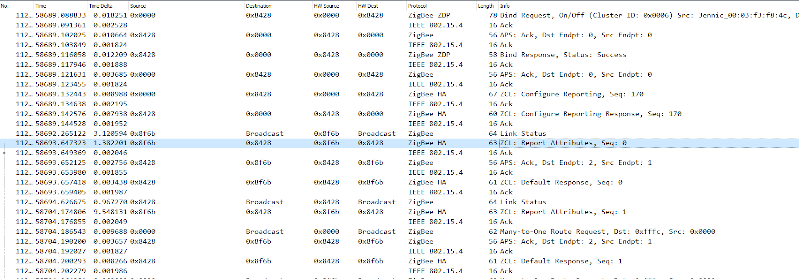
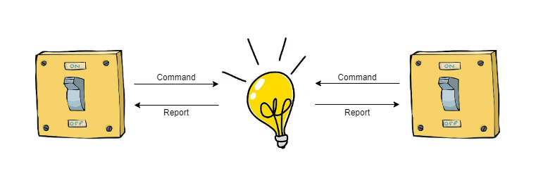
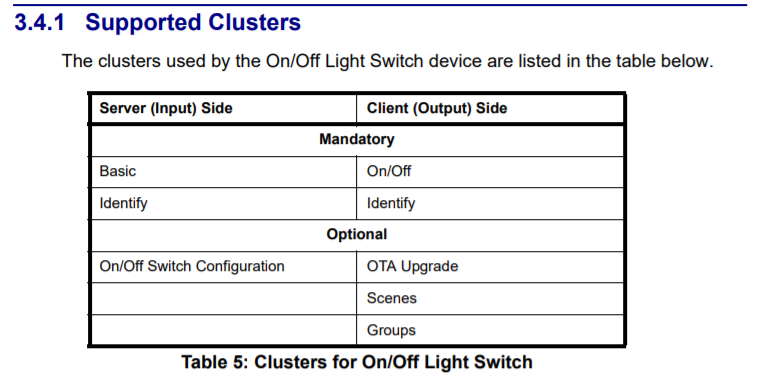
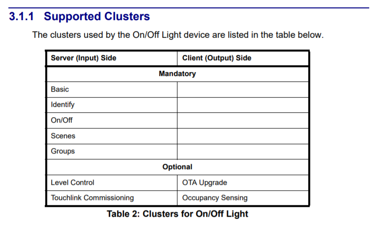
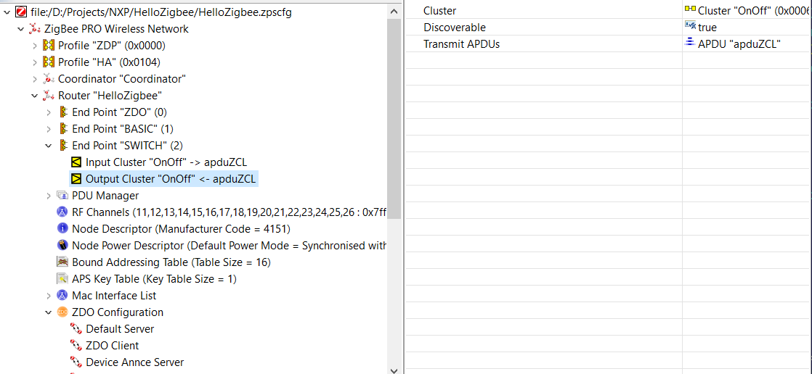
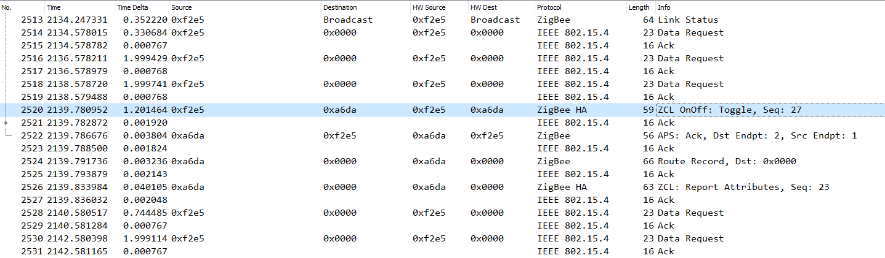
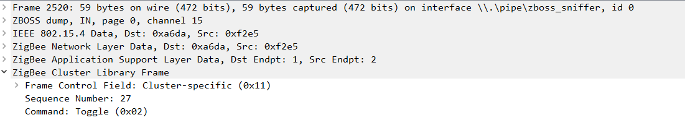
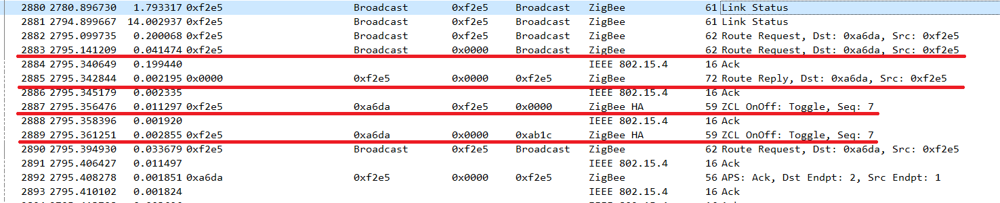
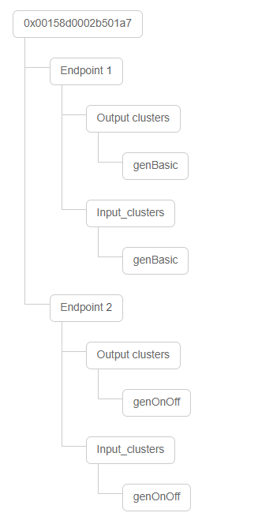
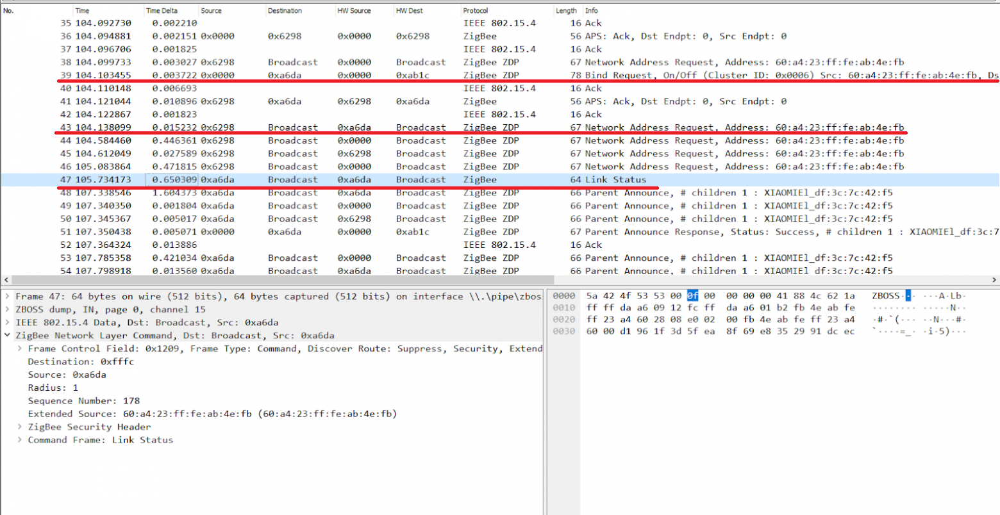

# Hello Zigbee World, Part 15 - Commands binding

In the [previous article](part14_reports_binding.md) we were exploring a binding mechanism - how the devices can communicate directly without the coordinator. We managed to handle bind requests, and send state change reports to the bound devices. Although technically it worked perfectly (messages were sent correctly), the expectations from our smart switch would be to control a bound relay or light. Perhaps something needs to be done differently, which is what this article is about.

This is the next article in the [creation of Zigbee device firmware from scratch series](part0_plan.md). In this article we will get a better understanding of client and server clusters, and how they communicate. 

The code will be based on the results of the previous articles, and run on [EBYTE E75–2G4M10S module based on the NXP JN5169 microcontroller](part1_bring_up.md).

## Reports vs Commands reasoning

Let’s take a look at one of the screenshots from the previous article.



OK, state change reports are sent to another device. But is there any valuable response? Unfortunately no, the receiver device (Xiaomi 2-channel relay switch) acknowledges the message, but does not toggle its state.

Let's think. We're talking about the Report Attribute message. From the sender's point of view, this is a very important message. Device’s state has changed, and the device is ready to tell the world about this fact.

But is the target device obligated to handle this report? What if many devices will start sending to our target device their reports? After all, binding was set on the sender’s side, while the target device does not even know about the fact it was bound with someone, and now some reports can come in.

Well, technically it is possible to respond to such reports. But it would be nice to at least notify the target device that it now shall listen to other device’s reports. Unfortunately, the Zigbee protocol does not provide any relevant message type for this. 

Also, to implement this behavior, we need to change the firmware of almost all devices. And if so, the specification shall say something like “each device shall respond to the Report Attribute message in a particular way”. But there is no such a statement in the Zigbee specification.

Ok, let's go into our reasoning from the other side. A switch shall control a light - this is a classical example when talking about Zigbee device binding. But let's complicate the example a little - let us have several switches that control a single light. Imagine that one switch reports its state is now “on”, and the other that it is “off”. How shall the light behave in this case?



Common sense dictates that there should be only one object in this system that has a state - the light. The switches must either know somehow the state of the light (for example, from the state reports), or simply send one of the ON/OFF/TOGGLE commands blindly. It turns out that the switch we are developing should not have its internal state at all, and should not report any state changes. Instead it shall only send commands to turn on / off / toggle the light.

This theory is also supported by other observations. For example, zigbee2mqtt and home assistant also do not store the current state of the light, but only display the state that the device sends as reports. And to switch the state of the light, Z2M sends the appropriate command to turn on / off / toggle.

## Server vs Client clusters

Here we are approaching the topic of server and client clusters. 

A server device (or rather a server cluster) is a device that has an internal state, or even several parameters, which are called cluster attributes. 
- Typically, these devices are actuators (for example, a light or relay switch), or sensors (for example, a temperature or motion sensor). The device can report the state of its attributes to other devices. 
- The device can report the attribute upon its change, periodically by timer, or by external request.

A client device (client cluster) is a device that has no internal state.
- The client device can communicate with server devices using commands (sent from the client to the server), or subscribe to reports (from the server to the client)

It seems to me that all these things like "The switch is a client and it does not have its own state. And the light is a server - it has a state" are very confusing. Let's take, for example, a smart switch like Xiaomi Aqara. It looks like a switch - it has buttons to toggle the light. But at the same time, it is very much a server - it has an internal state. Thus, what we call a smart switch in fact is just a relay with buttons, but at the same time it does not control any other Zigbee devices (because it is not a client).

So what is better, commands or reports? The documentation gives (only) 2 examples:

- The switch controls the light. The switch is a client device. In order to induce the light (server) for an action (toggle the light), the switch sends a command.
- A temperature sensor supplies the thermostat with the temperature values. The temperature sensor in this case is a server device, and handles the “temperature” attribute state. The thermostat in relation to the thermometer is a client and consumes data. In this case, the thermostat (client) does not induce the sensor (server) for any action, but subscribes to temperature reports.

By the way, one temperature sensor can have many clients, just like a thermostat can receive temperature information from many sensors. But this does not change the client-server relationship.

Overall, using commands or reports very much depends on the physical meaning of a particular cluster. From the reasoning above, in the case of a switch controlling a light, sending commands looks much more logical.


## Zigbee Light and Occupancy devices (ZLO)

Before we dive into the code, we need to take a look at the Zigbee specification a bit. Even at several specifications. Zigbee is a very versatile protocol and therefore is described in several different documents.

- The [ZigBee specification](https://zigbeealliance.org/wp-content/uploads/2019/11/docs-05-3474-21-0csg-zigbee-specification.pdf) describes the network level interaction - how messages are transmitted over the network, how they are processed, how the traffic is encrypted. But at the same time, this document does not describe anything about the functionality of the devices.
- The [ZigBee Class Library specification](https://zigbeealliance.org/wp-content/uploads/2019/12/07-5123-06-zigbee-cluster-library-specification.pdf) introduces the concept of a cluster. It describes standard clusters (On / Off, Basic, OTA) and how they can interact with each other. At the same time, the document does not give any recommendations of what clusters the device should consist of - every vendor can construct the device of an arbitrary structure.
- The [ZigBee Lighting & Occupancy (ZLO) Device Specification](https://zigbeealliance.org/wp-content/uploads/2019/11/docs-15-0014-05-0plo-Lighting-OccupancyDevice-Specification-V1.0.pdf) describes standard lighting devices. This document quite clearly declares the cluster structure of the device, and how it shall behave. There are several more similar specifications for other domain areas (ventilation and air conditioning, security, telemetry, and others)

For example, the ZLO specification requires a switch to consist of the following clusters.



And here is a structure of a typical light (and also relay switch).



The ZLO Specification describes several dozens of typical devices. The guys at NXP did a great job too, and implemented the boilerplates for such devices in the SDK (in the Components/ZCL/Devices directory). 

Apparently ZLO is an attempt to standardize typical devices - switches, lights, and motion sensors. The Zigbee developers apparently wanted the lights of one vendor to work with the switches from another, and be triggered with a motion sensor from the third vendor. 

This is definitely a good initiative, but manufacturers have their own view - everyone is trying to make a closed ecosystem and tie everything to their own hub. Therefore, projects such as zigbee2mqtt offer combining different devices into a single network.

If talking about real devices, perhaps simple ones (e.g. motion sensors) really follow ZLO recommendations. But I have not seen any complex devices (e.g. multi channel switches or relays) that comply with the specifications. Each device was at least somewhat different - extra clusters or endpoints.

As I mentioned in the [previous article](part13_project_cpp_structure.md), my device will also step away from the ZLO vision. It already has basic clusters separated in the endpoint #1, and each functional endpoint is structured according to the device functionality.


## Switch as a Client device

Earlier I mentioned that from Zigbee point of view, the switch is a Client device. So, let's remake our `SwitchEndpoint` from the server to the client. 

If we were using device implementation predefined in the NXP ZCL library, we would need to switch from `tsZLO_OnOffLightDevice` structure to `tsZLO_OnOffLightSwitchDevice` structure. Device registration would be also changed from `eZLO_RegisterOnOffLightEndPoint()` to `eZLO_RegisterOnOffLightSwitchEndPoint()`.

But since we are no longer using these device boilerplates provided by NXP, we need to register the client cluster manually. Fortunately the code is the same as in server case, just need to change one boolean parameter.

```cpp
void SwitchEndpoint::registerClientCluster()
{
   // Initialize On/Off client cluser
   teZCL_Status status = eCLD_OnOffCreateOnOff(&sClusterInstance.sOnOffClient,
                                               FALSE,                              // Client
                                               &sCLD_OnOff,
                                               &sOnOffClientCluster,
                                               &au8OnOffAttributeControlBits[0],
                                               NULL);
   if( status != E_ZCL_SUCCESS)
       DBG_vPrintf(TRUE, "SwitchEndpoint::init(): Failed to create OnOff client cluster instance. status=%d\n", status);
}
```

Sending a command is very simple

```cpp
void SwitchEndpoint::reportStateChange()
{
   // Destination address - 0x0000 (coordinator)
   tsZCL_Address addr;
   addr.uAddress.u16DestinationAddress = 0x0000;
   addr.eAddressMode = E_ZCL_AM_BOUND;

   uint8 sequenceNo;
   teZCL_Status status = eCLD_OnOffCommandSend(getEndpointId(),
                                  1,
                                  &addr,
                                  &sequenceNo,
                                  E_CLD_ONOFF_CMD_TOGGLE);
   DBG_vPrintf(TRUE, "Sending On/Off command status: %02x\n", status);
}
```

Similarly to what we did in the previous article, we send commands with `E_ZCL_AM_BOUND` mode - this will send a command to all bound devices (destination address parameter does not matter in this case).

Changing the code is not enough - we also need to correct device descriptors in the ZPS Config Editor application. There we need to add a client (Output) cluster, and then regenerate files with the ZPSConfig.exe utility.



Let’s build and run, and try to press a button. Here is how this looks in the sniffer.



By pressing the button, the `SwitchEndpoint::reportStateChange()` function is called, a command is immediately sent to the bound device (Xiaomi relay in my case). I do not use On and Off commands since my device does not know the current state of the Xiaomi relay switch. Instead I'm sending the Toggle command.



It is worth noting that everything works very quickly, there is no noticeable delay between pressing the button and toggling the relay switch. Moreover, although commands are sent directly between devices, Zigbee mechanisms continue to work and maintain the integrity of the network. For example, if I move my device to another room where direct communication between devices is not possible, the devices will find their way to each other through intermediate nodes.




In this picture, my device (0xf2e5) is trying to find out the route to the relay (0xa6da) by broadcasting a Route Request. After the route is found (Route Reply), the command goes through the intermediate node (the coordinator, which in this case acts as a router). Thus, bound devices do not necessarily have to have direct connection - they can communicate perfectly through intermediate routers.


## Client-Server devices

Although we have achieved the goal of controlling the bound relay, we lost the ability to send messages to the coordinator. It turns out that while the device is not bound to anyone, it does not produce any messages.

Can the device be a client and a server at the same time? And the answer is Yes. Since we no longer strictly follow ZLO specification anyway (same as other vendors do), is it possible to create a pretty much arbitrary cluster structure for our own device, and add both server and client OnOff clusters to the same endpoint. 

Device structure will look like this. Endpoint #1 is for Basic cluster, Endpoint #2 is our SwitchEndpoint class, including both server and client clusters.



Here is how I see the functionality.
- As long as our smart switch is not bound to any other device, it will work in server mode, sending reports to the coordinator.
- Once an endpoint has been bound with one or more devices, our switch goes into client (stateless) mode. The device will send commands to bound lights.

Let’s take a look at the code

```cpp
// List of cluster instances (descriptor objects) that are included into the endpoint
struct OnOffClusterInstances
{
   tsZCL_ClusterInstance sOnOffClient;
   tsZCL_ClusterInstance sOnOffServer;
} __attribute__ ((aligned(4)));

class SwitchEndpoint: public Endpoint
{   
protected:
   tsZCL_EndPointDefinition sEndPoint;
   OnOffClusterInstances sClusterInstance;
   tsCLD_OnOff sOnOffClientCluster;
   tsCLD_OnOff sOnOffServerCluster;
   tsCLD_OnOffCustomDataStructure sOnOffServerCustomDataStructure;
   ...
```

This is pretty much the same as we discussed in the previous article. Instead of the predefined `tsZLO_OnOffLightDevice` structure proposed by NXP, we will create the endpoint structure ourselves. The endpoint will consist of the following components
- `sEndPoint` - Endpoint descriptor. Describes the parameters of the endpoint, how many clusters it contains, and where their data structures are located.
- `sClusterInstance` - an array of cluster descriptors. Describes each cluster and its attributes, whether it is a server cluster or a client cluster
- `sOnOffClientCluster` and `sOnOffServerCluster` - server and client cluster data
- `sOnOffServerCustomDataStructure` - additional server cluster data. Not actually used, but required by internal APIs

We will initialize this whole thing as follows.

```cpp
void SwitchEndpoint::registerServerCluster()
{
   // Initialize On/Off server cluser
   teZCL_Status status = eCLD_OnOffCreateOnOff(&sClusterInstance.sOnOffServer,
                                               TRUE,                               // Server
                                               &sCLD_OnOff,
                                               &sOnOffServerCluster,
                                               &au8OnOffAttributeControlBits[0],
                                               &sOnOffServerCustomDataStructure);
   if( status != E_ZCL_SUCCESS)
       DBG_vPrintf(TRUE, "SwitchEndpoint::init(): Failed to create OnOff server cluster instance. status=%d\n", status);
}

void SwitchEndpoint::registerClientCluster()
{
   // Initialize On/Off client cluser
   teZCL_Status status = eCLD_OnOffCreateOnOff(&sClusterInstance.sOnOffClient,
                                               FALSE,                              // Client
                                               &sCLD_OnOff,
                                               &sOnOffClientCluster,
                                               &au8OnOffAttributeControlBits[0],
                                               NULL);
   if( status != E_ZCL_SUCCESS)
       DBG_vPrintf(TRUE, "SwitchEndpoint::init(): Failed to create OnOff client cluster instance. status=%d\n", status);
}

void SwitchEndpoint::registerEndpoint()
{
   // Initialize endpoint structure
   sEndPoint.u8EndPointNumber = getEndpointId();
   sEndPoint.u16ManufacturerCode = ZCL_MANUFACTURER_CODE;
   sEndPoint.u16ProfileEnum = HA_PROFILE_ID;
   sEndPoint.bIsManufacturerSpecificProfile = FALSE;
   sEndPoint.u16NumberOfClusters = sizeof(OnOffClusterInstances) / sizeof(tsZCL_ClusterInstance);
   sEndPoint.psClusterInstance = (tsZCL_ClusterInstance*)&sClusterInstance;
   sEndPoint.bDisableDefaultResponse = ZCL_DISABLE_DEFAULT_RESPONSES;
   sEndPoint.pCallBackFunctions = &EndpointManager::handleZclEvent;

   // Register the endpoint with all the clusters in it
   teZCL_Status status = eZCL_Register(&sEndPoint);
   DBG_vPrintf(TRUE, "SwitchEndpoint::init(): Register Basic Cluster. status=%d\n", status);
}

void SwitchEndpoint::init()
{
   // Register all clusters and endpoint itself
   registerServerCluster();
   registerClientCluster();
   registerEndpoint();
...
}
```

For each cluster, we need to call the corresponding initialization function (`eCLD_OnOffCreateOnOff()`), and then register the resulting cluster using the `eZCL_Register()` function. 

Now sending reports and commands. Both you have already seen.

```cpp
void SwitchEndpoint::reportState()
{
   // Destination address - 0x0000 (coordinator)
   tsZCL_Address addr;
   addr.uAddress.u16DestinationAddress = 0x0000;
   addr.eAddressMode = E_ZCL_AM_SHORT;

   // Send the report
   DBG_vPrintf(TRUE, "Reporting attribute EP=%d value=%d... ", getEndpointId(), sOnOffServerCluster.bOnOff);
   PDUM_thAPduInstance myPDUM_thAPduInstance = hZCL_AllocateAPduInstance();
   teZCL_Status status = eZCL_ReportAttribute(&addr,
                                              GENERAL_CLUSTER_ID_ONOFF,
                                              E_CLD_ONOFF_ATTR_ID_ONOFF,
                                              getEndpointId(),
                                              1,
                                              myPDUM_thAPduInstance);
   PDUM_eAPduFreeAPduInstance(myPDUM_thAPduInstance);
   DBG_vPrintf(TRUE, "status: %02x\n", status);
}

void SwitchEndpoint::sendCommandToBoundDevices()
{
   // Destination address does not matter - we will send to all bound devices
   tsZCL_Address addr;
   addr.uAddress.u16DestinationAddress = 0x0000;
   addr.eAddressMode = E_ZCL_AM_BOUND;

   // Send the toggle command
   uint8 sequenceNo;
   teZCL_Status status = eCLD_OnOffCommandSend(getEndpointId(),
                                  1,
                                  &addr,
                                  &sequenceNo,
                                  E_CLD_ONOFF_CMD_TOGGLE);
   DBG_vPrintf(TRUE, "Sending On/Off command status: %02x\n", status);
}

void SwitchEndpoint::reportStateChange()
{
   if(runsInServerMode())
       reportState();
   else
       sendCommandToBoundDevices();
}
```

We send reports to the coordinator with a unicast message, but we send commands to all subscribers using the `E_ZCL_AM_BOUND` mode. 

But the most interesting part is the selection between sending reports and commands. I decided to implement the following behavior: if the device has at least one bound subscriber, then it becomes a client and sends out commands. If there are no bound devices, then the device will be a server and will send reports.

To find out if there are bound devices, I wrote a simple function that iterates over the entries in the binding table.

```cpp
bool SwitchEndpoint::runsInServerMode() const
{
   return !hasBindings(getEndpointId(), GENERAL_CLUSTER_ID_ONOFF);
}

bool hasBindings(uint8 ep, uint16 clusterID)
{
   // Get pointers
   ZPS_tsAplAib * aib = ZPS_psAplAibGetAib();
   ZPS_tsAplApsmeBindingTableType * bindingTable = aib->psAplApsmeAibBindingTable;
   ZPS_tsAplApsmeBindingTable* table = bindingTable->psAplApsmeBindingTable;

   if(!table)
       return false;

   for(uint32 i=0; i < table->u32SizeOfBindingTable; i++)
   {
       ZPS_tsAplApsmeBindingTableStoreEntry * entry = table->pvAplApsmeBindingTableEntryForSpSrcAddr + i;
       if(entry->u8SourceEndpoint == ep && entry->u16ClusterId == clusterID)
           return true;
   }

   return false;
}
```

It is worth mentioning that the server mode is enabled for a specific endpoint only. Other endpoints may continue working in another mode.

## Working with the target device address

Imagine the situation: the device works normally, and one day receives a message -  "bind your endpoint to device 0x0123456789abcdef". Well, ok, we seem to have all the necessary information - address of the target device, cluster and endpoint numbers. The Zigbee stack will add the necessary entry to the link table for us. Is this enough for future work?

Unfortunately no. The fact is that the Zigbee protocol almost does not work with 64-bit device addresses - in almost all cases a short 16-bit address is used. Moreover these network addresses change from time to time. So, in the described situation, it may turn out that the device does not know the 16-bit address of the target device. This situation is easily reproduced by the following test scenario

- Do a factory reset for the device
- Add the device to the network. All binding tables and address caches are currently empty.
- Bind an endpoint to some other device.
- **Problem:** When pressing the button on the device, it tries to send On/Off commands to all bound devices. No errors are printed, but as we see in the sniffer, no outgoing messages are sent.

Some time later, the target device, as a part of its normal operation, may announce itself with the "Link Status" message. As far as I understand it is something like "I'm here, have you forgotten about me? My address is 0x1234". From this point on, our device suddenly realizes that the device with the target 64-bit address and the device that just sent a Link Status are the same device. The 16-bit address is cached, and subsequent on/off commands are sent normally.

In my opinion, this is not a very healthy situation. We need somehow to reduce the time between when a bind request is arrived, and the 16-bit network address of the target device is known. Fortunately we have a coordinator who knows everything about everyone - let's ask him the address. We can even send a broadcast request and ask the entire network for the target device address. The `ZPS_EVENT_ZDO_BIND` handler will come in handy.

```cpp
void ZigbeeDevice::handleZdoBindEvent(ZPS_tsAfZdoBindEvent * pEvent)
{
   // Address of interest
   ZPS_tsAplZdpNwkAddrReq req = {pEvent->uDstAddr.u64Addr, 0, 0};

   // Target addr (Broadcast)
   ZPS_tuAddress uDstAddr;
   uDstAddr.u16Addr = 0xFFFF;   // Broadcast

   // Perform the request
   uint8 u8SeqNumber;
   PDUM_thAPduInstance hAPduInst = PDUM_hAPduAllocateAPduInstance(apduZDP);
   ZPS_teStatus status = ZPS_eAplZdpNwkAddrRequest(hAPduInst,
                                                   uDstAddr,     // Broadcast addr
                                                   FALSE,
                                                   &u8SeqNumber,
                                                   &req);
   DBG_vPrintf(TRUE, "ZigbeeDevice::handleZdoBindUnbindEvent(): looking for network addr for %016llx. Status=%02x\n", pEvent->uDstAddr.u64Addr, status);
}

void ZigbeeDevice::handleZdoEvents(ZPS_tsAfEvent* psStackEvent)
{
...
   switch(psStackEvent->eType)
   {
       case ZPS_EVENT_ZDO_BIND:
           handleZdoBindEvent(&psStackEvent->uEvent.sZdoBindEvent);
           break;
```

Here is how this looks in the sniffer.



While handling the Bind Request, our device is looking up for the device with the 64-bit address 60:a4:23:ff:fe:ab:4e:fb. The desired device responds with a Link Status message, informing us (and everyone else) that such a device has a short address of 0xa6da. The mapping between short and long addresses is stored in the device's address cache. From that moment on, our device knows exactly who to send commands to, and the commands are sent instantly.

## Summary

Now our smart switch fully supports binding, Not just technically, like in the previous article, but really implements behavior when the switch can control a light. Now we should understand better client and server clusters, and why we need to send commands and not reports in order to control other devices.

This and previous articles describe binding by a request from the coordinator. This approach is handy when using a centralized solution like zigbee2mqtt. There is also the Find-And-Bind approach, when binding is happening without the coordinator involvement - this approach needs to be explored one day.

## Links

- Documentation
  - [JN-UG-3113 ZigBee 3.0 Stack User Guide](https://www.nxp.com/docs/en/user-guide/JN-UG-3113.pdf)
  - [JN-UG-3114 ZigBee 3.0 Devices User Guide](https://www.nxp.com/docs/en/user-guide/JN-UG-3114.pdf)
  - [JN-UG-3076 ZigBee Home Automation User Guide](https://www.nxp.com/docs/en/user-guide/JN-UG-3076.pdf)
  - [JN-UG-3101 ZigBee PRO Stack User Guide](https://www.nxp.com/docs/en/user-guide/JN-UG-3101.pdf)
  - [ZigBee specification](https://zigbeealliance.org/wp-content/uploads/2019/11/docs-05-3474-21-0csg-zigbee-specification.pdf)
  - [ZigBee Class Library specification](https://zigbeealliance.org/wp-content/uploads/2019/12/07-5123-06-zigbee-cluster-library-specification.pdf)
  - [ZigBee Lighting & Occupancy (ZLO) Device Specification](https://zigbeealliance.org/wp-content/uploads/2019/11/docs-15-0014-05-0plo-Lighting-OccupancyDevice-Specification-V1.0.pdf)
- Code
  - [Project on github](https://github.com/grafalex82/hellozigbee/tree/hello_zigbee_binding)
  - JN-AN-1220-Zigbee-3–0-Sensors example (recommended)
  - JN-AN-1219-Zigbee-3–0-Controller-and-Switch example (somewhat sophisticated for learning purposes)
  - https://github.com/actg/JN5169-for-xiaomi-wireless-switch.git
