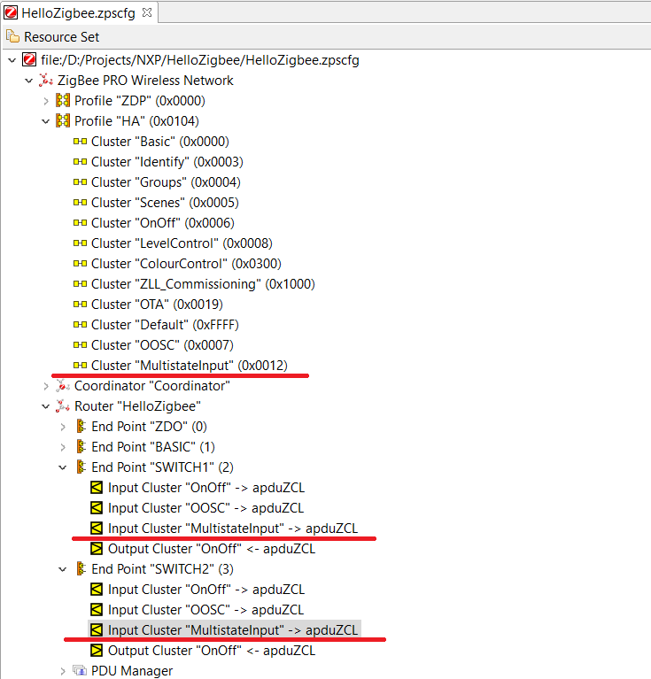
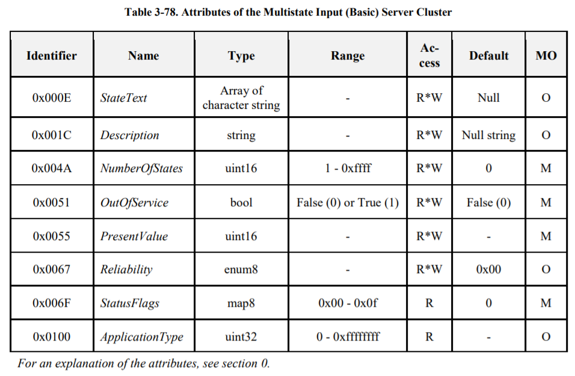
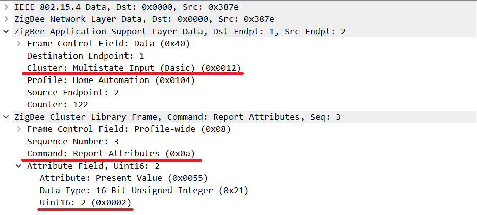

# Hello Zigbee World, Part 16 - Multi-action smart switch

Today we will continue developing a [Zigbee smart switch firmware from scratch](part0_plan.md). By this moment our switch can join the network, control a light, or act as a relay switch, controlled by other devices. It is time to make the switch even smarter - handle single/double/triple/long presses and generate various actions. These actions can be used to control multiple devices with a single switch. For example a single click can turn on/off the main light, double click control an ambient light, pressing the button for a long time moves the shadows until the button is released. It is possible to fine tune the behavior of the device, to provide maximum flexibility.

This topic is too large to fit a single article, and will be split into a subseries:
- Handle single/double/long press (this article)
- Report various press types to the coordinator using Multi state input cluster (this article)
- On/Off Configuration cluster to fine tune the behavior
- zigbee2mqtt support via external converter
- Level Control cluster to control light dimming

The code will be based on the results of the previous articles, and run on [EBYTE E75–2G4M10S module based on the NXP JN5169 microcontroller](part1_bring_up.md).

## The Goal

Obviously, the current implementation of the smart switch is quite limited in features - it can handle a single button press, and turn on/off the associated light. At the same time mass produced smart switches provide a richer functionality - they support double/triple clicks to generate additional actions (not just on/off the main light), long press to dim the light or control shades. At the same time I do not really like the behavior of some factory devices.

- The Xiaomi Opple wall switch is shamelessly stupid. It can handle double/triple button press, but it sends commands about a second after being pressed.
- Xiaomi Aqara switch is not flexible enough to set up both button press without triggering internal relays
- I have not found any mass produced devices that would work as momentary button

What causes switches like Opple to handle buttons so slow? That is because it is impossible to determine in advance if this is a single press, double-triple press, long press, or pressing several buttons simultaneously. It has to wait some until the user finishes its button action, to count how many presses happened. 

And here a two general approaches:

- We can react as soon as the button is pressed. In this case, we get an instant response to the pressing. But at the same time we either lose the possibility of double / triple / long presses, or these double-triple presses will be processed in addition to the very first operation.
- We can react with a delay or by releasing the button. Then we know exactly what kind of press was performed (single, double, long, or several buttons at once), but such a delay can be very annoying to the user.

I spent some time trying to understand what would be the ideal smart switch, and came up with the following use cases.

- Regular switch - the switch controls the built-in relay, or other bound device. Each single press switches the relay. The speed of the reaction is important here.
- Door Bell (Momentary) button - can be used for short-term operation of a certain actuator. For example, the curtain/roller motor spins while the user holds the button 
- Multifunctional smart switch - different types of clicks send different events.  Home automation servers (e.g. Home Assistant) can assign different actions to these events.

The multifunctional mode can be used to control curtains as well. For example, a short press gives a command to fully open / close the curtains. If the user holds the button down, the curtain motor can start opening/closing the curtain until the button is released.

After analyzing devices I have in my collection, and reading some documentation, I can now formulate requirements for my switch in terms of settings. Some of the settings are inspired by On/Off Settings Cluster, which we will discuss in the next article.

- **Switch Mode** - Button operation mode. This parameter describes how the button will behave. Possible values
  - **Toggle** - button generates one TOGGLE command, which toggles the value of the internal relay, or a bound On/Off device. Toggle is activated by pressing the button (on the front edge) providing minimum reaction time. Double/triple/long presses are not processed.
  - **Momentary** - a “doorbell” button. Button generates an ON command when pressed, and OFF when released (or vice versa - see the Action field)
Multifunction - "smart" mode with support for long/double/triple presses.

- **Action** - Applicable to Momentary mode only. Possible values are:
  - **OnOff** - sends the command On when button pressed, and Off when button released
  - **OffOn** - sends the command Off when button pressed, and On when button released
  - **Toggle** - sends a Toggle command each time the button pressed or released

- **Relay Mode** - built-in relay operation mode.
  - **Unlinked** - the relay works independently of the button. The button is just a logical button, sending commands to the network. The relay can receive On/Off/Toggle commands from other devices independently of the button.
  - **Front** - triggering on the leading edge of the signal (on pressing the button), regardless of long / double / triple / combo clicks.
  - **Single**, **Double**, **Triple**, **Long** - The relay is triggered by a single, double, triple, or long press, respectively. All other types of pressings generate only a logical signal to the network, the relay does not work.

- **Max Pause** - the maximum delay between a release and the next press, so that several consecutive presses are counted as a double-triple press. Value in ms.

- **Min Long Press** - the duration of the press, so that it is considered long. Value in ms.

The last 2 parameters most likely will not be needed for an average user, and it could be hardcoded, but I wanted to try different data types in the settings fields.

## Smart Buttons Handling

Let’s build the implementation from bottom up - from HW button handling, then to zigbee clusters, then to handling zigbee actions in zigbee2mqtt. But first we need to do some refactoring in order to make button polling easier, and also to spread different functionality across different classes (according to single responsibility principle). Here is the new structure.

- The `SwitchEndpoint` class, as before, implements the Zigbee network endpoint. It contains needed clusters implementation (currently there is only On/Off cluster, but there will be a few more soon)
- I moved the processing of the button handling logic into a separate `ButtonHandler` class, which also lives inside the `SwitchEndpoit`.
- The `ButtonTask` class is closer to the hardware. It polls buttons every 10ms, and informs the registered ButtonHandlers.

Let's start with the `ButtonTask` class. It basically has 4 tasks:
- Store a list of button handlers
- Poll hardware buttons, and call the appropriate handlers
- Handle a very long button press (>5 seconds) to trigger join/disconnect to/from the network.
- Count buttons inactivity time to allow device to sleep

Sleep modes [were discussed in the end devices article](part12_end_device_rejoin.md). Today I will focus more on button processing.

```cpp
static const uint32 ButtonPollCycle = 10;

class IButtonHandler
{
public:
	// Executed by ButtonsTask every ButtonPollCycle ms for every handler
	virtual void handleButtonState(bool pressed) = 0;
	virtual void resetButtonStateMachine() = 0;
};

struct HandlerRecord
{
   uint32 pinMask;
   IButtonHandler * handler;
};

class ButtonsTask : public PeriodicTask
{
...
   HandlerRecord handlers[ZCL_NUMBER_OF_ENDPOINTS+1];
   uint8 numHandlers;
   uint32 buttonsMask;
```

In order for button handlers to be notified of button state changes, they must register themselves in the `ButtonTask` class.

```cpp
void ButtonsTask::registerHandler(uint32 pinMask, IButtonHandler * handler)
{
   // Store the handler pointer
   handlers[numHandlers].pinMask = pinMask;
   handlers[numHandlers].handler = handler;
   numHandlers++;

   // Accumulate pin mask for all buttons together
   buttonsMask |= pinMask;

   // Set up GPIO for the button
   vAHI_DioSetDirection(pinMask, 0);
   vAHI_DioSetPullup(pinMask, 0);
   vAHI_DioInterruptEdge(0, pinMask);
   vAHI_DioWakeEnable(pinMask, 0);
}
```

The buttons are polled every 10 ms by a timer. The function goes through the list of registered handlers and passes the current state of the corresponding button there. Please note that the handler functions are called every 10ms regardless of the pressed or released state - this is necessary to implement short and long presses, as well as respect necessary pressing durations.

```cpp
void ButtonsTask::timerCallback()
{
   uint32 input = u32AHI_DioReadInput();
   bool someButtonPressed = false;

   // Call every button handler
   for(uint8 h = 0; h < numHandlers; h++)
   {
       bool pressed = ((input & handlers[h].pinMask) == 0);
       handlers[h].handler->handleButtonState(pressed);

       if(pressed)
           someButtonPressed = true;
   }

   // Reset the idle counter when user interacts with a button
   if(someButtonPressed)
   {
       idleCounter = 0;
       longPressCounter++;
   }
   else
   {
       idleCounter++;
       longPressCounter = 0;
   }

   // Process a very long press to join/leave the network
   if(longPressCounter > 5000/ButtonPollCycle)
   {
       ApplicationEvent evt = {BUTTON_VERY_LONG_PRESS, 0};
       appEventQueue.send(evt);

       for(uint8 h = 0; h < numHandlers; h++)
           handlers[h].handler->resetButtonStateMachine();

       longPressCounter = 0;
   }
}
```

The second half of the function handles a very long press of a button. If such a long press is detected, then it will schedule a join/leave network action.

The button handler implements the logic of various modes described above.

```cpp
class ButtonHandler: public IButtonHandler
{
   SwitchEndpoint * endpoint;

   uint32 currentStateDuration;

   SwitchMode switchMode;
   RelayMode relayMode;
   uint16 maxPause;
   uint16 longPressDuration;

   enum ButtonState
   {
       IDLE,
       PRESSED1,
       PAUSE1,
       PRESSED2,
       PAUSE2,
       PRESSED3,
       LONG_PRESS
   };

   ButtonState currentState;
...

ButtonHandler::ButtonHandler()
{
   endpoint = NULL;

   currentState = IDLE;
   currentStateDuration = 0;

   switchMode = SWITCH_MODE_TOGGLE;
   relayMode = RELAY_MODE_FRONT;
   maxPause = 250/ButtonPollCycle;
   longPressDuration = 1000/ButtonPollCycle;
}

void ButtonHandler::setEndpoint(SwitchEndpoint * ep)
{
   endpoint = ep;
}
```

`switchMode`, `relayMode`, and other parameters are described above. The user will be able to tune it via the following setters, but this is a topic of the next article. 

```cpp
void ButtonHandler::setSwitchMode(SwitchMode mode)
{
   switchMode = mode;
   changeState(IDLE);
}

void ButtonHandler::setRelayMode(RelayMode mode)
{
   relayMode = mode;
   changeState(IDLE);
}

void ButtonHandler::setMaxPause(uint16 value)
{
   maxPause = value/ButtonPollCycle;
   changeState(IDLE);
}

void ButtonHandler::setMinLongPress(uint16 value)
{
   longPressDuration = value/ButtonPollCycle;
   changeState(IDLE);
}
```

Here is how buttons are handled.

```cpp
void ButtonHandler::changeState(ButtonState state)
{
   currentState = state;
   currentStateDuration = 0;
}

void ButtonHandler::handleButtonState(bool pressed)
{
   // Let at least 20ms to debounce, do not make any early decisions
   // When button state is stabilized - go through the corresponding state machine
   currentStateDuration++;
   if(currentStateDuration < 2)
       return;

   switch(switchMode)
   {
   case SWITCH_MODE_TOGGLE:
       buttonStateMachineToggle(pressed);
       break;
   case SWITCH_MODE_MOMENTARY:
       buttonStateMachineMomentary(pressed);
       break;
   case SWITCH_MODE_MULTIFUNCTION:
       buttonStateMachineMultistate(pressed);
       break;
   default:
       break;
   }
}
```

The handler itself is a state machine. And not even one state machine, but one of three, depending on the selected mode.

The state machine for the Toggle mode looks very simple - when the button is pressed, the switch is toggled, when the button is released, nothing happens (only a return to its original state). Depending on the `relayMode`, it will either toggle internal relay, or just send logical signal `ACTION_SINGLE` to the Zigbee network.

```cpp
void ButtonHandler::buttonStateMachineToggle(bool pressed)
{
   // The state machine
   switch(currentState)
   {
       case IDLE:
           if(pressed)
           {
               changeState(PRESSED1);
               endpoint->reportAction(BUTTON_ACTION_SINGLE);

               if(relayMode != RELAY_MODE_UNLINKED)
                   endpoint->toggle();
           }
           break;

       case PRESSED1:
           if(!pressed)
               changeState(IDLE);

           break;

       default:
           changeState(IDLE);  // How did we get here?
           break;
   }
}
```

The state machine for the Momentary mode looks very similar, but events will be generated for both pressing and releasing the button.

```cpp
void ButtonHandler::buttonStateMachineMomentary(bool pressed)
{
   // The state machine
   switch(currentState)
   {
       case IDLE:
           if(pressed)
           {
               changeState(PRESSED1);
               endpoint->reportAction(BUTTON_PRESSED);

               if(relayMode != RELAY_MODE_UNLINKED)
                   endpoint->switchOn();
           }
           break;

       case PRESSED1:
           if(!pressed)
           {
               changeState(IDLE);
               endpoint->reportAction(BUTTON_RELEASED);

               if(relayMode != RELAY_MODE_UNLINKED)
                   endpoint->switchOff();
           }

           break;

       default:
           changeState(IDLE); // How did we get here?
           break;
   }
}
```

The state machine for "smart mode" is larger, but it's also not super complex. In response to button presses and releases, the state machine follows `IDLE` -> `PRESSED1` -> `PAUSE1` -> `PRESSED2` -> `PAUSE2` -> `PRESSED3` path, responding to single, double, or triple clicks. Long presses are handled along `IDLE` -> `PRESSED1` -> `LONG_PRESS` path. When transitioning between states, pauses between presses (`maxPause`) and the minimum long press duration (`longPressDuration`) settings are taken into account.

```cpp
void ButtonHandler::buttonStateMachineMultistate(bool pressed)
{
   // The state machine
   switch(currentState)
   {
       case IDLE:
           if(pressed)
           {
               changeState(PRESSED1);

               if(relayMode == RELAY_MODE_FRONT)
                   endpoint->toggle();
           }
           break;

       case PRESSED1:
           if(pressed && currentStateDuration > longPressDuration)
           {
               changeState(LONG_PRESS);
               endpoint->reportAction(BUTTON_PRESSED);

               if(relayMode == RELAY_MODE_LONG)
                   endpoint->toggle();
           }

           if(!pressed)
           {
               changeState(PAUSE1);
           }

           break;

       case PAUSE1:
           if(!pressed && currentStateDuration > maxPause)
           {
               changeState(IDLE);
               endpoint->reportAction(BUTTON_ACTION_SINGLE);

               if(relayMode == RELAY_MODE_SINGLE)
                   endpoint->toggle();
           }

           if(pressed)
               changeState(PRESSED2);

           break;

       case PRESSED2:
           if(!pressed)
           {
               changeState(PAUSE2);
           }

           break;

       case PAUSE2:
           if(!pressed && currentStateDuration > maxPause)
           {
               changeState(IDLE);
               endpoint->reportAction(BUTTON_ACTION_DOUBLE);

               if(relayMode == RELAY_MODE_DOUBLE)
                   endpoint->toggle();
           }

           if(pressed)
           {
               changeState(PRESSED3);
           }

           break;

       case PRESSED3:
           if(!pressed)
           {
               changeState(IDLE);

               if(relayMode == RELAY_MODE_TRIPPLE)
                   endpoint->toggle();

               endpoint->reportAction(BUTTON_ACTION_TRIPPLE);
           }

           break;

       case LONG_PRESS:
           if(!pressed)
           {
               changeState(IDLE);

               endpoint->reportAction(BUTTON_RELEASED);
           }

           break;

       default: break;
   }
}
```

SwitchEndpoint class has not changed a lot, just added the button handler. 

```cpp
class SwitchEndpoint: public Endpoint
{   
...
   ButtonHandler buttonHandler;
```

Every `SwitchEndpoint` object must register its button handler in the `ButtonTask`.

```cpp
void SwitchEndpoint::setPins(uint8 ledPin, uint32 pinMask)
{
   blinkTask.init(ledPin);

   ButtonsTask::getInstance()->registerHandler(pinMask, &buttonHandler);
}
```

Here is how this is tied together in Main.cpp. BTW, I also added a second button channel. This required a second button and an LED, connected to pins 3 and 0 respectively.

```cpp
const uint8 SWITCH1_LED_PIN = 17;
const uint8 SWITCH2_LED_PIN = 0;

const uint8 SWITCH1_BTN_BIT = 1;
const uint32 SWITCH1_BTN_MASK = 1UL << SWITCH1_BTN_BIT;
const uint8 SWITCH2_BTN_BIT = 3;
const uint32 SWITCH2_BTN_MASK = 1UL << SWITCH2_BTN_BIT;

struct Context
{
   BasicClusterEndpoint basicEndpoint;
   SwitchEndpoint switch1;
   SwitchEndpoint switch2;
};

extern "C" PUBLIC void vAppMain(void)
{
...
   Context context;
   context.switch1.setPins(SWITCH1_LED_PIN, SWITCH1_BTN_MASK);
   context.switch2.setPins(SWITCH2_LED_PIN, SWITCH2_BTN_MASK);
   EndpointManager::getInstance()->registerEndpoint(HELLOENDDEVICE_BASIC_ENDPOINT, &context.basicEndpoint);
   EndpointManager::getInstance()->registerEndpoint(HELLOENDDEVICE_SWITCH1_ENDPOINT, &context.switch1);
   EndpointManager::getInstance()->registerEndpoint(HELLOENDDEVICE_SWITCH2_ENDPOINT, &context.switch2);
```

A note why I am using pin masks in button handlers instead of just pin numbers. First of all this is how the hardware reports us button presses - via a pin mask, and it is handy to operate with pin masks in the code as well. Also this is needed to handle pressing both buttons. This is not yet implemented, but I plan to add one more `SwitchEndpoint` instance which will be triggered by pressing 2 buttons simultaneously.


## Multistate Input Cluster

By now the device can work as a 2-gang light switch - each of the buttons can generate on/off/toggle commands. The code even can detect single, double, triple and long presses. But how to report these extra actions to the Zigbee network? The OnOff cluster can operate with only two states - on and off. This cluster is not suitable for transmitting information about advanced clicks.

To be honest, I spied on how the Xiaomi Opple and PTVO firmware do it. And they use a Multistate Input Cluster for this. This is a special cluster that represents a discrete value in the 0-65535 range. In fact, this cluster is designed to represent a multi-position switch that can be set in one of the many states for a long time. But if we misuse it a little bit, and use only the transition event, then we can interpret this value like this.

- transition to state 1 - single press
- transition to state 2 - double click
- transition to state 3 - triple click
- transition to state 255 - start of long press
- transition to state 0 - button release

There is again some confusion with the name of the cluster. Output (Client) cluster is able to send switching commands, but does not have its own state. Input (Server) cluster has an internal state, and can report it to the coordinator - and this is exactly what we need. As I said we do not need the state value itself, but we will be interested in state change reports, representing an action.

We already know how to add a new cluster to our switch. First, let's add the desired cluster to the ZPS Config Editor, and then regenerate the configuration files using ZPSConfig.exe.



In the zcl_options.h settings file, we must also enable the desired cluster

```cpp
#define CLD_MULTISTATE_INPUT_BASIC
#define MULTISTATE_INPUT_BASIC_SERVER
#define CLD_MULTISTATE_INPUT_BASIC_ATTR_NUMBER_OF_STATES 256
```

The last parameter specifies the initial value of the NumberOfStates cluster attribute. We will not use it in our code, but the specification requires it to have a value. As a state attribute we will use values from 0 (button released) to 255 (button pressed and hold), so the states range is 256 (just not all of them will be really used).

The cluster implements a whole bunch of different attributes, but we are interested in the PresentValue attribute only.



We should be familiar with how to add a new cluster to the endpoint.

```cpp
struct OnOffClusterInstances
{
...
   tsZCL_ClusterInstance sMultistateInputServer;

...

class SwitchEndpoint: public Endpoint
{   
...
   tsCLD_MultistateInputBasic sMultistateInputServerCluster;
...
   virtual void registerMultistateInputServerCluster();
...

void SwitchEndpoint::registerMultistateInputServerCluster()
{
   // Initialize Multistate Input server cluser
   teZCL_Status status = eCLD_MultistateInputBasicCreateMultistateInputBasic(
               &sClusterInstance.sMultistateInputServer,
               TRUE,                              // Server
               &sCLD_MultistateInputBasic,
               &sMultistateInputServerCluster,
               &au8MultistateInputBasicAttributeControlBits[0]);
   if( status != E_ZCL_SUCCESS)
       DBG_vPrintf(TRUE, "SwitchEndpoint::init(): Failed to create Multistate Input server cluster instance. status=%d\n", status);
}
```

And finally, the function that sends the value of the attribute. ]The value represents the action that just happened - a single, double or triple press, or a long press / release of the button. Sending the attribute itself is no different from the one used for the On/Off cluster.

```cpp
void SwitchEndpoint::reportAction(ButtonActionType action)
{
   // Store new value in the cluster
   sMultistateInputServerCluster.u16PresentValue = (zuint16)action;

   // Prevent bothering Zigbee API if not connected
   if(!ZigbeeDevice::getInstance()->isJoined())
   {
       DBG_vPrintf(TRUE, "Device has not yet joined the network. Ignore reporting the change.\n");
       return;
   }

   // Destination address - 0x0000 (coordinator)
   tsZCL_Address addr;
   addr.uAddress.u16DestinationAddress = 0x0000;
   addr.eAddressMode = E_ZCL_AM_SHORT;

   // Send the report
   DBG_vPrintf(TRUE, "Reporting multistate action EP=%d value=%d... ", getEndpointId(), sMultistateInputServerCluster.u16PresentValue);
   PDUM_thAPduInstance myPDUM_thAPduInstance = hZCL_AllocateAPduInstance();
   teZCL_Status status = eZCL_ReportAttribute(&addr,
                                              GENERAL_CLUSTER_ID_MULTISTATE_INPUT_BASIC,
                                              E_CLD_MULTISTATE_INPUT_BASIC_ATTR_ID_PRESENT_VALUE,
                                              getEndpointId(),
                                              1,
                                              myPDUM_thAPduInstance);
   PDUM_eAPduFreeAPduInstance(myPDUM_thAPduInstance);
   DBG_vPrintf(TRUE, "status: %02x\n", status);
}
```

Let’s see how these reports look like in the sniffer.



A note regarding binding. Bad news is that Zigbee does not allow to bind clusters of different types. This means we will not be able to bind, for example, double click reported via Multistate Input cluster with turning on a light via OnOff cluster. This, unfortunately, is not possible in Zigbee. Fortunately there are other ways to solve this issue. For example we can set up an automation rule in Home Assistant that will handle this case.


## Summary

Today our smart switch became even smarter. The device can now generate not only On/Off reports, but also reports for corresponding actions - double/triple presses, and long press/release. 

To add these extra reports we learned one more handy cluster - Multi-state Input. This cluster can report multiple values, and perfectly matches our needs to report different actions. 

These reports are not yet handled by zigbee2mqtt, which is a topic of the next article. Also setting up mode values was out of scope of this article, and will be also described in the next one.

## Links

- Documentation
  - [JN-UG-3113 ZigBee 3.0 Stack User Guide](https://www.nxp.com/docs/en/user-guide/JN-UG-3113.pdf)
  - [JN-UG-3114 ZigBee 3.0 Devices User Guide](https://www.nxp.com/docs/en/user-guide/JN-UG-3114.pdf)
  - [JN-UG-3076 ZigBee Home Automation User Guide](https://www.nxp.com/docs/en/user-guide/JN-UG-3076.pdf)
  - [JN-UG-3101 ZigBee PRO Stack User Guide](https://www.nxp.com/docs/en/user-guide/JN-UG-3101.pdf)
  - [ZigBee specification](https://zigbeealliance.org/wp-content/uploads/2019/11/docs-05-3474-21-0csg-zigbee-specification.pdf)
  - [ZigBee Class Library specification](https://zigbeealliance.org/wp-content/uploads/2019/12/07-5123-06-zigbee-cluster-library-specification.pdf)
- Code
  - [Project on github](https://github.com/grafalex82/hellozigbee/tree/hello_zigbee_custom_cluster)


