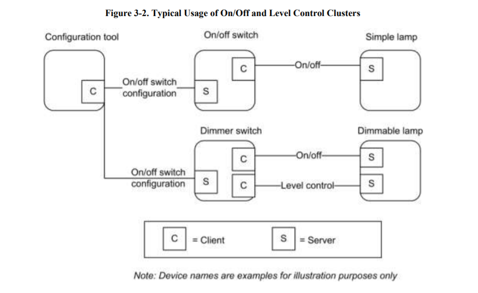
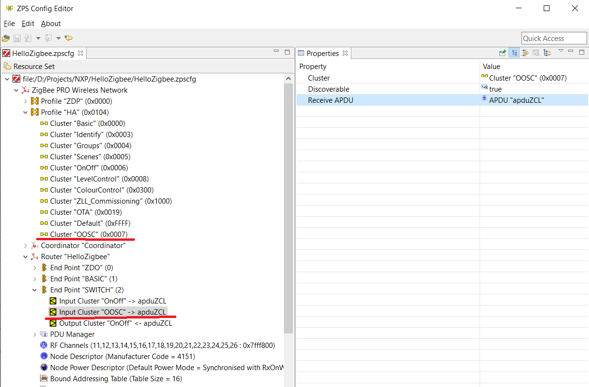
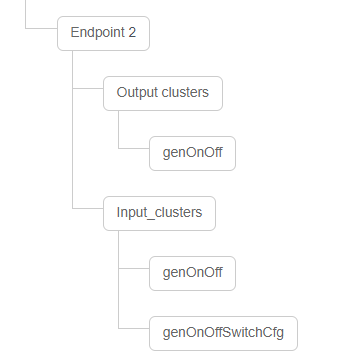
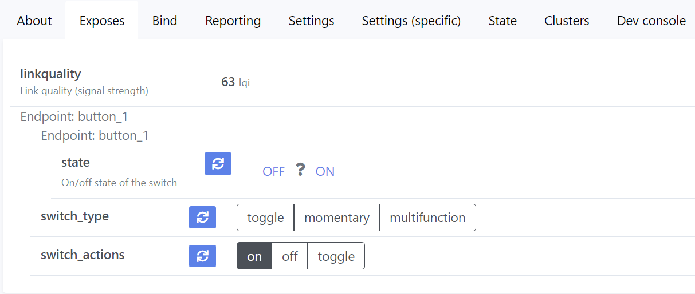
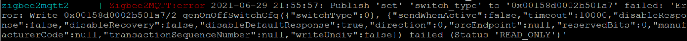
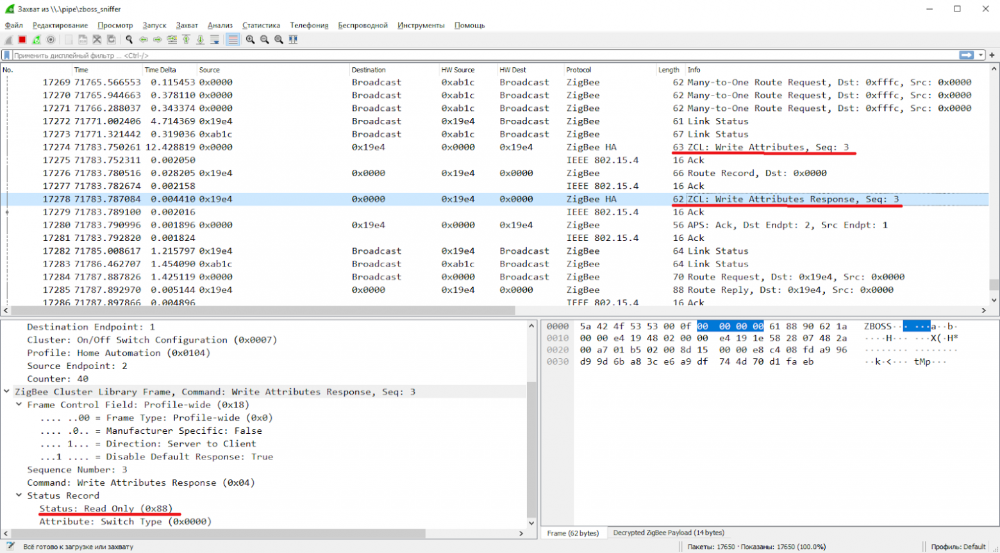
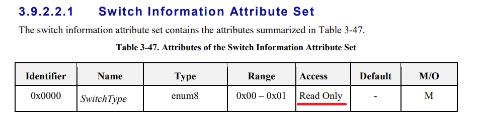
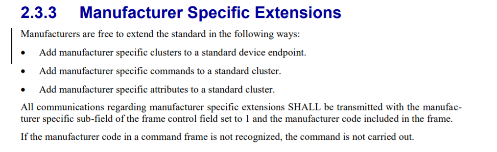

# Hello Zigbee World, Part 17 - Custom cluster for smart switch configuration

The Zigbee Class Library specification standardizes many different building blocks for various Zigbee devices. Here you have switches and dimmers, relays and sensors, climatic and security devices. But sometimes typical building blocks do not provide necessary functionality, and you may think about writing your own Zigbee clusters. That is not that hard.

The [smart switch we created earlier](part16_multistate_action.md) has a number of operating modes (all sorts of single/double/triple/long presses). These modes are selected by a few settings, but there is no way to change the switch settings at the moment. Today we will make it possible to fine-tune the operating modes. 

This is the next article in the [Hello Zigbee series](part0_plan.md), describing building a Zigbee device firmware from scratch. My code will be based on the code created in the previous articles. As a development board I'll be using the same [EBYTE E75–2G4M10S module based on the NXP JN5169 microcontroller](part1_bring_up.md).

## On/Off Switch Configuration Cluster

Browsing the documentation I noticed an interesting cluster - On/Off Switch Configuration Cluster (OOSC). This is a standard cluster for managing settings of a switch. In this chapter I would like to try this cluster to control my device.

Here is the typical usage of the cluster.



So. The On/Off Switch Configuration Cluster allows other devices (or the coordinator) to customize the behavior of our switch. Typically this cluster offers 2 attributes:

- The `switch type` describes the general behavior of the button.

  - `Toggle` - each press of the button toggles the state of the relay. The button remains in the same state until the next press. This mode matches the typical light switch behavior.
  - `Momentary` - turns on the relay when the button is pressed, and turns off when released. This mode matches the behavior of a doorbell button - the bell sounds while the button is pressed, and stops when released.
  - `Multistate` - any non-standard behavior that differs from the first two. This mode is not standardized, and Implemented on the device manufacturer choice. 

- The `action type` describes which commands are sent when the switch is triggered
  - `Direct value` - send "on" when the button is pressed, and "off" when the button is released
  - `Inverse` - send "off" when the button is pressed, and "on" when the button is released
  - `Toggle` - send a toggle command every time

Let's try to add this cluster to our device. But first we need to add this in the ZPS Configuration Editor, and [regenerate zps_gen.c with ZPSConfg.exe utility](part5_zigbee_init.md).



Now we need to enable the implementation of the server On Off Switch Configuration cluster in zcl_options.h with the following defines. I spied the defines to use in the implementation of this cluster in the OOSC.h/c files.

```cpp
#define CLD_OOSC
#define OOSC_SERVER
```

Then, as you already know, register the cluster in the endpoint.

```cpp
struct OnOffClusterInstances
{
...
   tsZCL_ClusterInstance sOnOffConfigServer;
...


class SwitchEndpoint: public Endpoint
{   
...
   tsCLD_OOSC sOnOffConfigServerCluster;
...


void SwitchEndpoint::registerOnOffConfigServerCluster()
{
   // Initialize On/Off config server cluser
   teZCL_Status status = eCLD_OOSCCreateOnOffSwitchConfig(&sClusterInstance.sOnOffConfigServer,
                                                          TRUE,                              // Server
                                                          &sCLD_OOSC,
                                                          &sOnOffConfigServerCluster,
                                                          &au8OOSCAttributeControlBits[0]);
   if( status != E_ZCL_SUCCESS)
       DBG_vPrintf(TRUE, "SwitchEndpoint::init(): Failed to create OnOff switch config server cluster instance. status=%d\n", status);
}
```

The device now claims it supports `genOnOffSwitchCfg` input cluster. Do not forget to completely remove the device in zigbee2mqtt and reboot Z2M before rejoining, otherwise Z2M will cache previous device structure.



Unfortunately, no additional settings appeared in the Exposes tab in zigbee2mqtt. That is because zigbee2mqtt does not really know how to display this tab correctly. 

Populating the Exposes tab is performed by an external converter - a special plugin to zigbee2mqtt that adds support for a particular device. We developed a simple converter a few articles ago. It uses standard building blocks provided by the zigbee-herdsman-converters project. Fortunately I found the diyruz_freepad_on_off_config converter that adds the On/Off Configuration cluster.

After some fiddling with the code, the converter code for my device looked like this.

```js
const fz = require('zigbee-herdsman-converters/converters/fromZigbee');
const tz = require('zigbee-herdsman-converters/converters/toZigbee');
const exposes = require('zigbee-herdsman-converters/lib/exposes');
const reporting = require('zigbee-herdsman-converters/lib/reporting');
const e = exposes.presets;
const ea = exposes.access;

const device = {
    zigbeeModel: ['Hello Zigbee Switch'],
    model: 'Hello Zigbee Switch',
    vendor: 'NXP',
    description: 'Hello Zigbee Switch',
    fromZigbee: [fz.on_off, fz.diyruz_freepad_config],
    toZigbee: [tz.on_off, tz.diyruz_freepad_on_off_config],
    exposes: [e.switch().withEndpoint('button_1'),
              exposes.enum('switch_type', ea.ALL, ['toggle', 'momentary', 'multifunction']).withEndpoint('button_1'),
              exposes.enum('switch_actions', ea.ALL, ['on', 'off', 'toggle']).withEndpoint('button_1')
             ],
    endpoint: (device) => {
        return {button_1: 2};
    },
};

module.exports = device;
```

Here is how it looks on the zigbee2mqtt dashboard.



Let’s try to change switch_type value... and see the error in Z2M logs:



What? Read only? What can the sniffer tell us?




Hmm... The device indeed returns a read only status. But it's probably some kind of bug somewhere in the code..... but no, the specification says that this attribute is really read-only.



But why is the Switch Type field read only? In fact, this field shall describe the physical construction of the switch. If the switch has two stable positions, then this attribute contains the 'toggle' value. And if it's a doorbell button - then the value is 'momentary'. The client is only given the opportunity to find out what type this switch is, but this parameter cannot be changed from the outside.

The second attribute, Switch Action, by the way, is read-write. A write request for this attribute succeeds without error.


## Building custom On/Off Configuration Cluster

I realized that the standard On/Off Configuration cluster does not provide me enough flexibility to implement all the options I want. In the previous article I described in detail what options and settings I would like to implement in my switch. Just for the reader’s convenience, I would outline them again.

- `Switch Mode` - Button operation mode. The parameter has similar meaning as a standard Switch Type parameter, but read-write. This parameter describes how the button will behave - act as a toggle switch, momentary button, or multi-action device generating long/double/triple presses.
- `Action` - The parameter is absolutely the same as a standard one. Specify which commands the switch will generate in Momentary mode
- `Relay Mode` - built-in relay operation mode - unlinked, or tied to a single/double/triple/log press.
- `Max Pause` and `Min Long Press` - specify timings for consecutive and long pressing actions

Let’s take a look at the NXP documentation on how they propose to extend standard functionality.



Adding new commands is not necessary for our task. We can either extend an existing cluster, or write our own. Adding a few attributes to the existing cluster looks more preferable, especially if my implementation will only expand, and not replace the standard functionality. The implementation of the OnOff Switch Configuration cluster is located in the OOSC.c/.h files, and the code is quite simple. This cluster does not accept or send any commands, and provides only attributes.

The ZigBee Cluster Library (for ZigBee 3.0) User Guide JN-UG-3115 document suggests changing files directly in the SDK. But we, perhaps, will do it more accurately and copy these files to our project directory. Include paths needs a little correction so that the new header is used instead of one in SDK.

Now we can declare identifiers for new attributes.

```cpp
typedef enum
{
   E_CLD_OOSC_ATTR_ID_SWITCH_TYPE              = 0x0000,   /* Mandatory */
   E_CLD_OOSC_ATTR_ID_SWITCH_ACTIONS           = 0x0010,   /* Mandatory */

   // Custom attributes
   E_CLD_OOSC_ATTR_ID_SWITCH_MODE              = 0xff00,
   E_CLD_OOSC_ATTR_ID_SWITCH_RELAY_MODE        = 0xff01,
   E_CLD_OOSC_ATTR_ID_SWITCH_MAX_PAUSE         = 0xff02,
   E_CLD_OOSC_ATTR_ID_SWITCH_LONG_PRESS_DUR    = 0xff03
} teCLD_OOSC_ClusterID;
```

The first 2 attributes are standard and obligated by the specification. I added new attributes with identifiers 0xFFxx. The specification does not describe ID selection for the attributes, the only requirement is that new attributes shall not intersect with existing IDs.

I added the `SWITCH_MODE` attribute even though it duplicates the standard `SWITCH_TYPE` attribute. I just decided not to deviate from the specification - let the `SWITCH_TYPE` attribute remain read-only, and `SWITCH_MODE` be read-write. In fact they both will actually point to the same variable.

The enumerations for the Switch Mode (aka Switch Type) and Actions attributes are already in the OOSC.h file. We need to add enums for Relay Mode.

```cpp
typedef enum
{
   RELAY_MODE_UNLINKED,
   RELAY_MODE_FRONT,
   RELAY_MODE_SINGLE,
   RELAY_MODE_DOUBLE,
   RELAY_MODE_TRIPPLE,
   RELAY_MODE_LONG,
} RelayMode;
```

Now, let’s define variables where the attributes will be stored (I added 3 fields to the existing `tsCLD_OOSC` structure). 16-bit wide type shall be enough.

```cpp
/* On/Off Switch Configuration Cluster */
typedef struct
{
#ifdef OOSC_SERVER   
   zenum8                  eSwitchMode;                /* Mandatory */
   zenum8                  eSwitchActions;             /* Mandatory */

   // Custom attrs
   zenum8                  eRelayMode;
   zuint16                 iMaxPause;
   zuint16                 iMinLongPress;
#endif   

   zuint16                 u16ClusterRevision;

} tsCLD_OOSC;
```

Let’s see the attributes table, their options flags, and pointers to storage variables. All new attributes are declared with the `E_ZCL_AF_RD|E_ZCL_AF_WR` (read/write) and `E_ZCL_AF_MS` (manufacturer specific) flags. The last flag disables reporting of such non-standard attributes. If some other device will somehow subscribe to OOSC cluster attribute reports, it will not get confused with our non-standard attributes. Sometimes vendors add their non-standard attributes without the manufacturer specific flag, but we will do it according to the specification.

```cpp
const tsZCL_AttributeDefinition asCLD_OOSCClusterAttributeDefinitions[] = {
#ifdef OOSC_SERVER
   {E_CLD_OOSC_ATTR_ID_SWITCH_TYPE,            E_ZCL_AF_RD,                            E_ZCL_ENUM8,    (uint32)(&((tsCLD_OOSC*)(0))->eSwitchMode),0},    /* Mandatory */
   {E_CLD_OOSC_ATTR_ID_SWITCH_ACTIONS,         (E_ZCL_AF_RD|E_ZCL_AF_WR),              E_ZCL_ENUM8,    (uint32)(&((tsCLD_OOSC*)(0))->eSwitchActions),0}, /* Mandatory */

   // Custom attributes
   {E_CLD_OOSC_ATTR_ID_SWITCH_MODE,            (E_ZCL_AF_RD|E_ZCL_AF_WR|E_ZCL_AF_MS),  E_ZCL_ENUM8,    (uint32)(&((tsCLD_OOSC*)(0))->eSwitchMode),0},
   {E_CLD_OOSC_ATTR_ID_SWITCH_RELAY_MODE,      (E_ZCL_AF_RD|E_ZCL_AF_WR|E_ZCL_AF_MS),  E_ZCL_ENUM8,    (uint32)(&((tsCLD_OOSC*)(0))->eRelayMode),0},
   {E_CLD_OOSC_ATTR_ID_SWITCH_MAX_PAUSE,       (E_ZCL_AF_RD|E_ZCL_AF_WR|E_ZCL_AF_MS),  E_ZCL_UINT16,   (uint32)(&((tsCLD_OOSC*)(0))->iMaxPause),0},
   {E_CLD_OOSC_ATTR_ID_SWITCH_LONG_PRESS_DUR,  (E_ZCL_AF_RD|E_ZCL_AF_WR|E_ZCL_AF_MS),  E_ZCL_UINT16,   (uint32)(&((tsCLD_OOSC*)(0))->iMinLongPress),0},
#endif       

   {E_CLD_GLOBAL_ATTR_ID_CLUSTER_REVISION,     (E_ZCL_AF_RD|E_ZCL_AF_GA),              E_ZCL_UINT16,   (uint32)(&((tsCLD_OOSC*)(0))->u16ClusterRevision),0},   /* Mandatory  */
};
```

The implementation of the cluster consists of just one function - `eCLD_OOSCCreateOnOffSwitchConfig()`. It is responsible for registering the attribute table using the `vZCL_InitializeClusterInstance()` function. It also sets the initial values for the attributes.

```cpp
PUBLIC  teZCL_Status eCLD_OOSCCreateOnOffSwitchConfig(
               tsZCL_ClusterInstance              *psClusterInstance,
               bool_t                              bIsServer,
               tsZCL_ClusterDefinition            *psClusterDefinition,
               void                               *pvEndPointSharedStructPtr,
               uint8                              *pu8AttributeControlBits)
{
...
       if(pvEndPointSharedStructPtr != NULL)
       {
#ifdef OOSC_SERVER           
           /* Set attribute defaults */
           ((tsCLD_OOSC*)psClusterInstance->pvEndPointSharedStructPtr)->eSwitchMode = E_CLD_OOSC_TYPE_TOGGLE;
           ((tsCLD_OOSC*)psClusterInstance->pvEndPointSharedStructPtr)->eSwitchActions = E_CLD_OOSC_ACTION_TOGGLE;
           ((tsCLD_OOSC*)psClusterInstance->pvEndPointSharedStructPtr)->eRelayMode = RELAY_MODE_FRONT;
           ((tsCLD_OOSC*)psClusterInstance->pvEndPointSharedStructPtr)->iMaxPause = 250;
           ((tsCLD_OOSC*)psClusterInstance->pvEndPointSharedStructPtr)->iMinLongPress = 1000;
#endif
           ((tsCLD_OOSC*)psClusterInstance->pvEndPointSharedStructPtr)->u16ClusterRevision = CLD_OOSC_CLUSTER_REVISION;
...
}
```

So adding custom attributes to the cluster is that simple. We can even create your own new cluster by simply assigning it a new identifier (but we will not do this). But if you decide to do so, manufacturer-specific cluster numbers must start with 0xfc00. Here is an example of how this could be done.

```cpp
//#define GENERAL_CLUSTER_ID_ONOFF_SWITCH_CONFIGURATION   0x0007
#define GENERAL_CLUSTER_ID_MY_ONOFF_SWITCH_CONFIGURATION   0xfc01
```

That is it for the cluster implementation. But since we added a number of new fields, we need to inform the SwitchEndpoint if their states have changed. ZCL will automatically process read and write attribute requests. In case if an attribute changes its value, the `handleWriteAttributeCompleted()` handler will be called. The implementation in `SwitchEndpoint` class will just redirect these settings to the `ButtonHandler` object.

```cpp
void SwitchEndpoint::handleWriteAttributeCompleted(tsZCL_CallBackEvent *psEvent)
{
   uint16 clusterId = psEvent->psClusterInstance->psClusterDefinition->u16ClusterEnum;
   uint16 attrId = psEvent->uMessage.sIndividualAttributeResponse.u16AttributeEnum;

   // Update buttons state machine with received value
   if(clusterId == GENERAL_CLUSTER_ID_ONOFF_SWITCH_CONFIGURATION)
   {
       if(attrId == E_CLD_OOSC_ATTR_ID_SWITCH_MODE)
           buttonHandler.setSwitchMode((SwitchMode)sOnOffConfigServerCluster.eSwitchMode);

       if(attrId == E_CLD_OOSC_ATTR_ID_SWITCH_RELAY_MODE)
           buttonHandler.setRelayMode((RelayMode)sOnOffConfigServerCluster.eRelayMode);

       if(attrId == E_CLD_OOSC_ATTR_ID_SWITCH_MAX_PAUSE)
           buttonHandler.setMaxPause(sOnOffConfigServerCluster.iMaxPause);

       if(attrId == E_CLD_OOSC_ATTR_ID_SWITCH_LONG_PRESS_DUR)
           buttonHandler.setMinLongPress(sOnOffConfigServerCluster.iMinLongPress);
   }

   // Store received values into PDM
   saveConfiguration();
}
```

Also it may be reasonable to store these settings in the EEPROM so that they survive on reboots.

```cpp
void SwitchEndpoint::saveConfiguration()
{
   PDM_eSaveRecordData(getPdmIdForEndpoint(getEndpointId(), 0),
                       &sOnOffConfigServerCluster,
                       sizeof(sOnOffConfigServerCluster));
}

void SwitchEndpoint::restoreConfiguration()
{
   // Read values from PDM
   uint16 readBytes;
   PDM_eReadDataFromRecord(getPdmIdForEndpoint(getEndpointId(), 0),
                           &sOnOffConfigServerCluster,
                           sizeof(sOnOffConfigServerCluster),
                           &readBytes);

   // Configure buttons state machine with read values
   buttonHandler.setSwitchMode((SwitchMode)sOnOffConfigServerCluster.eSwitchMode);
   buttonHandler.setRelayMode((RelayMode)sOnOffConfigServerCluster.eRelayMode);
   buttonHandler.setMaxPause(sOnOffConfigServerCluster.iMaxPause);
   buttonHandler.setMinLongPress(sOnOffConfigServerCluster.iMinLongPress);
}

void SwitchEndpoint::init()
{
...
   // Restore previous configuration from PDM
   restoreConfiguration();
...
```

## Summary

Today we added our custom cluster to control settings of our smart switch. Now it is possible to change the behavior of the device in runtime, according to the implementation we created in the previous article. Building a custom cluster appears to be not too hard, and extending an existing one is even simpler.

Obviously the new cluster needs an implementation from zigbee2mqtt, but this is worth a separate article. Next time we will discuss in detail how to develop external converters for zigbee2mqtt, and how to add a support of our custom cluster there.

## Links

- Documentation
  - [JN-UG-3113 ZigBee 3.0 Stack User Guide](https://www.nxp.com/docs/en/user-guide/JN-UG-3113.pdf)
  - [JN-UG-3114 ZigBee 3.0 Devices User Guide](https://www.nxp.com/docs/en/user-guide/JN-UG-3114.pdf)
  - [JN-UG-3076 ZigBee Home Automation User Guide](https://www.nxp.com/docs/en/user-guide/JN-UG-3076.pdf)
  - [JN-UG-3101 ZigBee PRO Stack User Guide](https://www.nxp.com/docs/en/user-guide/JN-UG-3101.pdf)
  - [ZigBee specification](https://zigbeealliance.org/wp-content/uploads/2019/11/docs-05-3474-21-0csg-zigbee-specification.pdf)
  - [ZigBee Class Library specification](https://zigbeealliance.org/wp-content/uploads/2019/12/07-5123-06-zigbee-cluster-library-specification.pdf)
- Code
  - [Project on github](https://github.com/grafalex82/hellozigbee/tree/hello_zigbee_custom_cluster)
