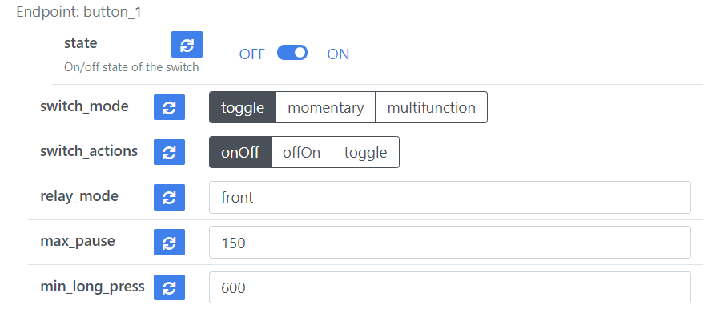
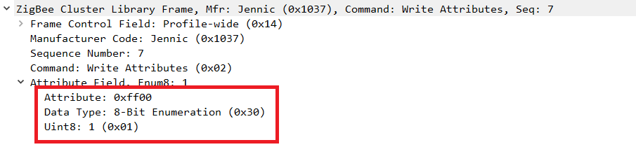
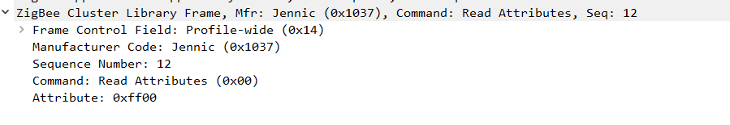
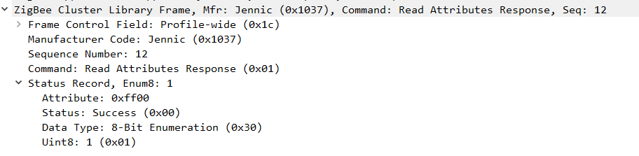
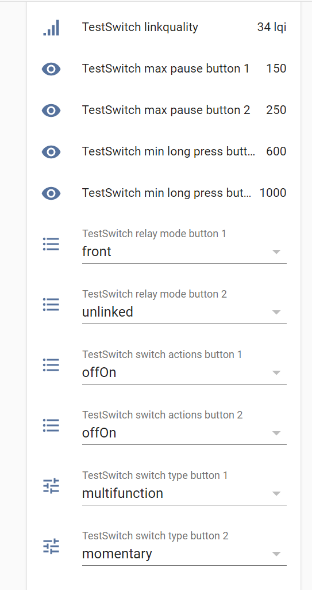

# Hello Zigbee World, Part 18 - Custom zigbee2mqtt external converter

In the last two articles we implemented support for [multiple actions for our smart switch](part16_multistate_action.md), so that it can handle and report single/double/triple/long presses via Multistate Input cluster. We also implemented a set of settings for the device, controlled by [custom extension of the On/Off Switch Configuration Cluster](part17_custom_cluster.md). With this addition users will be able to configure the device at runtime using Zigbee facilities.

But there is a problem: although we implemented this from the device side, other systems, such as zigbee2mqtt, do not know how to work with these additions. This article describes in detail how to write an external converter - a special plugin for zigbee2mqtt, that will add support for our device.

As usual, my code will be based on the code created in the previous articles. As a development board I’ll be using the same [EBYTE E75–2G4M10S module based on the NXP JN5169 microcontroller](part1_bring_up.md). This article will be a great addition for the [Hello Zigbee series](part0_plan.md), describing how to build a Zigbee device firmware from scratch. 

## Zigbee2mqtt external converter

Unfortunately external converters are [documented quite poorly](https://www.zigbee2mqtt.io/advanced/support-new-devices/01_support_new_devices.html), and I have not found a good description of what exactly the functions should do. There are a few vague examples, which I have a lot of questions about.

Let’s start with supporting our custom On/Off Switch Configuration Cluster. I had to write my own converter actively using the poke method, and looking through dozens of existing converters to figure out how they shall behave. Here is what I studied about the converters, while I was working on mine.

Every converter starts with imports.

```js
const fz = require('zigbee-herdsman-converters/converters/fromZigbee');
const tz = require('zigbee-herdsman-converters/converters/toZigbee');
const exposes = require('zigbee-herdsman-converters/lib/exposes');
const reporting = require('zigbee-herdsman-converters/lib/reporting');
const e = exposes.presets;
const ea = exposes.access;
```

Since we have added a number of custom fields, we will need to describe the types and data structures associated with them. There are a whole bunch of all possible types defined in the herdsman converters project. Unfortunately, I have not figured out how to import structures from TypeScript into JavaScript code, so I just had to duplicate the values ​​for the types I needed.

```js
const DataType = {
    uint16: 0x21,
    enum8: 0x30,
}
```

Let’s define enumeration values for the new attributes. The order of values is the same as described in the firmware code, so the converter code can simply match the position number in the list with the value.

```js
const switchTypeValues = ['toggle', 'momentary', 'multifunction'];
const switchActionValues = ['onOff', 'offOn', 'toggle'];
const relayModeValues = ['unlinked', 'front', 'single', 'double', 'tripple', 'long'];
```

When referring to manufacturer-specific attributes, we must specify not only attribute identifiers, but also the manufacturer code, otherwise ZCL firmware code will reject the request.

```js
const manufacturerOptions = {
    jennic : {manufacturerCode: 0x1037}
}
```

Now we need to register the corresponding fields on the z2m web form. These fields will be displayed in the Exposes tab for our device.

```js
function genSwitchEndpoint(epName) {
   return [
       e.switch().withEndpoint(epName),
       exposes.enum('switch_mode', ea.ALL, switchModeValues).withEndpoint(epName),
       exposes.enum('switch_actions', ea.ALL, switchActionValues).withEndpoint(epName),
       exposes.enum('relay_mode', ea.ALL, relayModeValues).withEndpoint(epName),
       exposes.numeric('max_pause', ea.ALL).withEndpoint(epName),
       exposes.numeric('min_long_press', ea.ALL).withEndpoint(epName),
   ]
}

function genSwitchEndpoints(endpoinsCount) {
   let features = [];

   for (let i = 1; i <= endpoinsCount; i++) {
       const epName = `button_${i}`;
       features.push(...genSwitchEndpoint(epName));
   }

   return features;
}
```

For a given number of endpoints, the first function will generate a switch widget (`e.switch()`) as well as a series of configuration fields. The result will look like this.



Enumeration fields with 2-3 values have turned into buttons, other fields (`relay_mode`) became drop-down lists. The last two numeric fields are input fields with increment/decrement arrows.

Now we need to breathe life into this, and write 3 conversion functions. These 3 functions should be organized into 2 structures codenamed toZigbee and fromZigbee. What exactly the naming means I will explain below.

When changing a value on the form, zigbee2mqtt calls `convertSet()` function from the `toZigbee` structure. The key field also specifies a list of parameters that our converter can process.

```js
const toZigbee_OnOffSwitchCfg = {
   key: ['switch_mode', 'switch_actions', 'relay_mode', 'max_pause', 'min_long_press'],

   convertSet: async (entity, key, value, meta) => {
       let payload = {};
       let newValue = value;

       switch(key) {
           case 'switch_mode':
               newValue = switchModeValues.indexOf(value);
               payload = {65280: {'value': newValue, 'type': DataType.enum8}};
               await entity.write('genOnOffSwitchCfg', payload, manufacturerOptions.jennic);
               break;

           case 'switch_actions':
               newValue = switchActionValues.indexOf(value);
               payload = {switchActions: newValue};
               await entity.write('genOnOffSwitchCfg', payload);
               break;

           case 'relay_mode':
               newValue = relayModeValues.indexOf(value);
               payload = {65281: {'value': newValue, 'type': DataType.enum8}};
               await entity.write('genOnOffSwitchCfg', payload, manufacturerOptions.jennic);
               break;

           case 'max_pause':
               payload = {65282: {'value': value, 'type': DataType.uint16}};
               await entity.write('genOnOffSwitchCfg', payload, manufacturerOptions.jennic);
               break;

           case 'min_long_press':
               payload = {65283: {'value': value, 'type': DataType.uint16}};
               await entity.write('genOnOffSwitchCfg', payload, manufacturerOptions.jennic);
               break;

           default:
               break;
       }

       result = {state: {[key]: value}}
       return result;
   },
```

The `toZigbee_OnOffSwitchCfg::convertSet()` function accepts textual attribute names and attribute values to be set. The aim of the function is to convert this into structures that can be sent over the network. For standard attributes (for example, `switch_actions`), this will be just an attribute key-value pair, but the value is converted to a number. The herdsman converters code knows about standard attributes and their types, and how to pass it to the network. For non-standard attributes (for example, `relay_mode`), we need to convert to triples:

- numeric attribute identifier (has to be set in decimal form - for example 65280)
- attribute type (type identifier)
- value (a value index, in case of enumeration)

These values are then packaged into a low-level Zigbee message and sent over the network. The `entity` object is an endpoint on which read and write commands are executed. It is mandatory to specify manufacturer-specific code for non-standard attributes (using `manufacturerOptions.jennic`).

The function must return a new state of the attribute. The result shall be organized in a tricky kind of structure, otherwise the value of the button on the web form will not change.

In the sniffer sending a new attribute value would look something like this.



On the device side, ZCL implementation will parse incoming requests, and automatically set the new values to the corresponding field.

```
ZPS_EVENT_APS_DATA_INDICATION: SrcEP=1 DstEP=2 SrcAddr=0000 Cluster=0007 () Status=0
ZCL Write Attribute: Clustter 0007 Attrib ff00
ZCL Endpoint Callback: Write attributes completed
ZPS_EVENT_APS_DATA_CONFIRM: SrcEP=2 DstEP=1 DstAddr=0000 Status=0
ZPS_EVENT_APS_DATA_ACK: SrcEP=1 DrcEP=2 DstAddr=0000 Profile=0104 Cluster=0007 ()
```

Reading the attribute appears to be more difficult. By default, the zigbee2mqtt UI does not display the current attribute values. If you click on the “update” button next to one of the attributes, the `toZigbeeConverter::convertGet()` function will be called.

At first, I was very confused with the name - **to**Zigbee::converter**Get**(). Why not **from**Zigbee, as we are getting data **from** the network? But after studying the code more precisely, it became clearer: **to**Zigbee component is responsible for preparing a request **to** the network (even if it's a read request). A little later, the device will respond with a read attribute response message, containing the read value. In turn, the **from**Zigbee component parses what has arrived **from** the network (but more on that below).

```js
  convertGet: async (entity, key, meta) => {
       if(key == 'switch_actions') {
           await entity.read('genOnOffSwitchCfg', ['switchActions']);
       }
       else {
           const lookup = {
               switch_mode: 65280,
               relay_mode: 65281,
               max_pause: 65282,
               min_long_press: 65283
           };
           await entity.read('genOnOffSwitchCfg', [lookup[key]], manufacturerOptions.jennic);
       }
   },
```

Most of the converters implementations use one bulk request to get all the attributes at once - the Zigbee specification allows this. Unfortunately, since we are using standard attributes (`switchActions`) and manufacturer-specific ones, it is impossible to get them with a single request. So my implementation will get one attribute at a time. Of course, non-standard attributes reading will require the manufacturer code.

This is how the read request looks in the sniffer.



And this is the response.



Once the coordinator has received the packet from the device, `fromZigbee` component performs the parsing of the request.

```js
const getKey = (object, value) => {
    for (const key in object) {
        if (object[key] == value) return key;
    }
};

const fromZigbee_OnOffSwitchCfg = {
   cluster: 'genOnOffSwitchCfg',
   type: ['attributeReport', 'readResponse'],

   convert: (model, msg, publish, options, meta) => {

       const ep_name = getKey(model.endpoint(msg.device), msg.endpoint.ID);
       const result = {};

       // switch type
       if(msg.data.hasOwnProperty('65280')) {
           result[`switch_mode_${ep_name}`] = switchModeValues[msg.data['65280']];
       }

       // switch action
       if(msg.data.hasOwnProperty('switchActions')) { // use standard 'switchActions' attribute identifier
           result[`switch_actions_${ep_name}`] = switchActionValues[msg.data['switchActions']];
       }

       // relay mode
       if(msg.data.hasOwnProperty('65281')) {
           result[`relay_mode_${ep_name}`] = relayModeValues[msg.data['65281']];
       }


       // Maximum pause between button clicks in a multiclick
       if(msg.data.hasOwnProperty('65282')) {
           result[`max_pause_${ep_name}`] = msg.data['65282'];
       }

       // Minimal duration for the long press
       if(msg.data.hasOwnProperty('65283')) {
           result[`min_long_press_${ep_name}`] = msg.data['65283'];
       }

       return result;
   },
}
```

The function tries to parse out the values of the corresponding attributes from the report, and decompose them into a Z2M structure as <attribute_name>_<endpoint_name> records.

That's almost it with the converter. Only one the last structure is missing, which will gather everything together.

```js
const device = {
    zigbeeModel: ['Hello Zigbee Switch'],
    model: 'Hello Zigbee Switch',
    vendor: 'NXP',
    description: 'Hello Zigbee Switch',
    fromZigbee: [fz.on_off, fromZigbee_OnOffSwitchCfg],
    toZigbee: [tz.on_off, toZigbee_OnOffSwitchCfg],
    exposes: genEndpoints(2),
    configure: async (device, coordinatorEndpoint, logger) => {
        device.endpoints.forEach(async (ep) => {
            await ep.read('genOnOff', ['onOff']);
            await ep.read('genOnOffSwitchCfg', ['switchActions']);
            await ep.read('genOnOffSwitchCfg', [65280, 65281, 65282, 65283], manufacturerOptions.jennic);
        });
    },
    endpoint: (device) => {
        return {button_1: 2, button_2: 3};
    },
};

module.exports = device;
```

This code registers a new device, as well as converters for it. For On/Off functionality a standard `fz/tz.on_off` converters are used, and our functions `to/fromZigbee_OnOffSwitchCfg` will handle switch configuration.

Since the device supports 2 switch endpoints already, the converter registers 2 sets of settings. Also, if you remember, Basic Cluster lives on endpoint #1, and the switch endpoints start from endpoint #2. I had to add endpoints-to-buttons renumbering, so that everything looks and works correctly.

Additionally I would like to highlight the `configure()` function. When Z2M starts it does not know the current state of the switch, as well as settings values - all fields in the settings section will be empty. Most of the converters that I have studied set up attribute reporting - the device will report its state and attributes, say, once a minute. That is why some devices do not display the value immediately at startup, but values appear some time later. This is a good option for a device like temperature sensors. In my version of the converter I decided to simply read the actual values on startup.

The final step is to register the converter in zigbee2mqtt. Just add the following lines in the configuration.yaml, and reboot Z2M.

```yaml
external_converters:
  - myswitch.js
```

When the device is joining, zigbee2mqtt will request the device name, and use the corresponding converter.

## Multi-actions support

As you remember, we added a Multistate input cluster to the device, so that it can report single/double/triple/long presses. These events are reported as attribute change reports. But now we need to teach Z2M to understand these reports, and generate proper actions. Let’s just add another `fromZigbee` converter for this. There is no need to add `toZigbee` converter as we are not going to write anything to the device in this cluster.

```js
const fromZigbee_MultistateInput = {
   cluster: 'genMultistateInput',
   type: ['attributeReport', 'readResponse'],

   convert: (model, msg, publish, options, meta) => {
       const actionLookup = {0: 'release', 1: 'single', 2: 'double', 3: 'tripple', 255: 'hold'};
       const value = msg.data['presentValue'];
       const action = actionLookup[value];

       const result = {action: utils.postfixWithEndpointName(action, msg, model)};
       return result;
   },
}
```

The converter is inspired by `ptvo_multistate_action` converter. It simply pulls out the `presentValue` cluster attribute and turns it into the corresponding action text.

The converter can also advertise actions the device may generate, so that other systems like Home Assistant can get prepared.

```js
function genSwitchActions(endpoinsCount) {
   let actions = [];

   for (let i = 1; i <= endpoinsCount; i++) {
       const epName = `button_${i}`;
       actions.push(... ['single', 'double', 'triple', 'hold', 'release'].map(action => action + "_" + epName));
   }

   return actions;
}

...

const device = {
...
   fromZigbee: [fz.on_off, fromZigbee_OnOffSwitchCfg, fromZigbee_MultistateInput],
...
   exposes: [
       e.action(genSwitchActions(2)),
       ...genSwitchEndpoints(2)
   ],
...
```

I really wanted the actions from each endpoint to be declared along with the rest of the  endpoint stuff (say, in the `genSwitchEndpoint()` function). but the zigbee2mqtt architecture does not allow this. All actions should be defined only once using the `e.action()` function in the exposes field (here is the explanation).

Let's press the button and see how this works from the zigbee2mqtt side.

```
Zigbee2MQTT:debug 2021-10-19 22:31:53: Received Zigbee message from 'TestSwitch', type 'attributeReport', cluster 'genMultistateInput', data '{"presentValue":255}' from endpoint 3 with groupID 0
Zigbee2MQTT:info  2021-10-19 22:31:53: MQTT publish: topic 'zigbee2mqtt2/TestSwitch', payload '{"action":"hold_button_2","last_seen":1634671913843,"linkquality":70,"max_pause_button_1":null,"max_pause_button_2":null,"min_long_press_button_1":null,"min_long_press_button_2":null,"relay_mode_button_1":"front","relay_mode_button_2":"unlinked","state_button_1":"OFF","state_button_2":"OFF","switch_actions_button_1":null,"switch_actions_button_2":null,"switch_type_button_1":null,"switch_type_button_2":"momentary"}'
Zigbee2MQTT:info  2021-10-19 22:31:53: MQTT publish: topic 'zigbee2mqtt2/TestSwitch', payload '{"action":"","last_seen":1634671913843,"linkquality":70,"max_pause_button_1":null,"max_pause_button_2":null,"min_long_press_button_1":null,"min_long_press_button_2":null,"relay_mode_button_1":"front","relay_mode_button_2":"unlinked","state_button_1":"OFF","state_button_2":"OFF","switch_actions_button_1":null,"switch_actions_button_2":null,"switch_type_button_1":null,"switch_type_button_2":"momentary"}'
Zigbee2MQTT:info  2021-10-19 22:31:53: MQTT publish: topic 'zigbee2mqtt2/TestSwitch/action', payload 'hold_button_2'
```

As we can see, `genMultistateInput` cluster messages are handled normally and turned into MQTT messages. The last message is short and essential - there was a button press event on the second button. Any system that can subscribe to MQTT events can easily process such a message.

The other two messages may be a little confusing - it sends `"action":"hold_button_2"`, and then immediately sends `"action":""`. But as it turned out this is a normal behavior, which is described in the Zigbee2mqtt FAQ.

**Side note:**
As I mentioned earlier, the Multistate input cluster is used in a non-standard way - instead of values themselves, we are interested in value change events. It's just a convenient cluster whose main attribute can take on many different values.

But Multistate Input is not the only way to signal various button events. So the Xiaomi WXKG01LM switch implements a non-standard extension of the OnOff cluster. Besides standard 0 and 1 values of the state attribute, it can use other values indicating the number of clicks. Other devices also implement non-standard extensions of the On/Off cluster and add additional attributes indicating various events.

Some devices do not implement the logic of multiple clicks logic on the firmware side at all. Instead, an absolutely standard OnOff cluster is used, and multiple clicks are counted in the z2m converter using timers.

Finally, manufacturers may decide to develop a very custom cluster, to transfer information  in their favorite format.

## Home Assistant automation

Although the switch is exposed in Home Assistant pretty much automatically, the integration has a few issues. First, by default, most of the settings are disabled and hidden in Home Assistant. You need to manually enable each setting, and then restart Home Assistant. After enabling the parameters, the device page looks like this.



Secondly, the numeric parameters are not editable. Unfortunately I haven't found a way to fix this at all. As a workaround, these parameters can be edited on the zigbee2mqtt dashboard, or by sending corresponding mqtt messages.

As for actions, things are not super smooth here. Despite the converter advertises the list of possible actions, Home Assistant ignores this list. If you try to create an automation, HA will not offer double/triple/long presses as an automation trigger...  until such an action occurs at least once. Then the action will appear in the list, and will be available in the automation wizard. 

Well, now let's try to do something useful, and write an interesting automation. Right now, I really miss the possibility of partially opening/closing curtains with my Xiaomi switch. I usually wake up very hard. If the curtains open instantly to the full, it hits the eyes very hard. I would like to have the possibility to control the degree of the curtains with the same switch.

In just a few minutes, right in the Home Assistant visual editor I created a few automation rules.

The first automation fully opens/closes the curtain with a double press of a button.

```yaml
- id: '1635018171508'
  alias: TestSwitch Open/Close curtain
  description: 'TestSwitch Open/Close curtain'
  trigger:
  - platform: mqtt
    topic: zigbee2mqtt2/TestSwitch/action
    payload: double_button_1
  condition: []
  action:
  - service: cover.toggle
    target:
      entity_id: cover.living_room_curtain
  mode: single
```

Second automation opens the curtain for 50% on the button triple click.

```yaml
- id: '1635017708545'
  alias: TestSwitch Half-open curtains
  description: 'TestSwitch Half-open curtains'
  trigger:
  - platform: mqtt
    topic: zigbee2mqtt2/TestSwitch/action
    payload: triple_button_1
  condition: []
  action:
  - service: cover.set_cover_position
    target:
      entity_id: cover.living_room_curtain
    data:
      position: 50
  mode: single
```

Next two automations use long press - on pressing the button the curtain starts moving, and stops upon button release.

```yaml
- id: '1635017908150'
  alias: TestSwitch toggle curtain on button press
  description: 'TestSwitch toggle curtain on button press'
  trigger:
  - platform: mqtt
    topic: zigbee2mqtt2/TestSwitch/action
    payload: hold_button_1
  condition: []
  action:
  - service: cover.toggle
    target:
      entity_id: cover.living_room_curtain
  mode: single

- id: '1635017981037'
  alias: TestSwitch stop curtain
  description: 'TestSwitch stop curtain'
  trigger:
  - platform: mqtt
    topic: zigbee2mqtt2/TestSwitch/action
    payload: release_button_1
  condition: []
  action:
  - service: cover.stop_cover
    target:
      entity_id: cover.living_room_curtain
  mode: single
```

As you see, with such simple automations it is possible to control curtains with a single button - open, close, and even set it to a specific opening degree. Moreover a regular single press of the button still can toggle the main lights.

## Summary 

Congratulations, we have just reinvented the Xiaomi Aqara switch! Well, a similar smart switch. Perhaps our device offers a little more settings, but in general everything is almost the same. But after all, the goal was different - to understand the creation of custom clusters, genOnOffSettingCfg and genMultistateInput clusters, as well as writing external converters for zigbee2mqtt.

It turned out that there is nothing complicated in creating your own or extending standard clusters. I had to tinker with zigbee2mqtt, mainly due to the lack of intelligible documentation. Now this gap is filled :)

## Links

- Documentation
  - [JN-UG-3113 ZigBee 3.0 Stack User Guide](https://www.nxp.com/docs/en/user-guide/JN-UG-3113.pdf)
  - [JN-UG-3114 ZigBee 3.0 Devices User Guide](https://www.nxp.com/docs/en/user-guide/JN-UG-3114.pdf)
  - [JN-UG-3076 ZigBee Home Automation User Guide](https://www.nxp.com/docs/en/user-guide/JN-UG-3076.pdf)
  - [JN-UG-3101 ZigBee PRO Stack User Guide](https://www.nxp.com/docs/en/user-guide/JN-UG-3101.pdf)
  - [ZigBee specification](https://zigbeealliance.org/wp-content/uploads/2019/11/docs-05-3474-21-0csg-zigbee-specification.pdf)
  - [ZigBee Class Library specification](https://zigbeealliance.org/wp-content/uploads/2019/12/07-5123-06-zigbee-cluster-library-specification.pdf)
  - [How to support new device in zigbee2mqtt](https://www.zigbee2mqtt.io/advanced/support-new-devices/01_support_new_devices.html)
- Code
  - [Project on github](https://github.com/grafalex82/hellozigbee/tree/hello_zigbee_custom_cluster)
