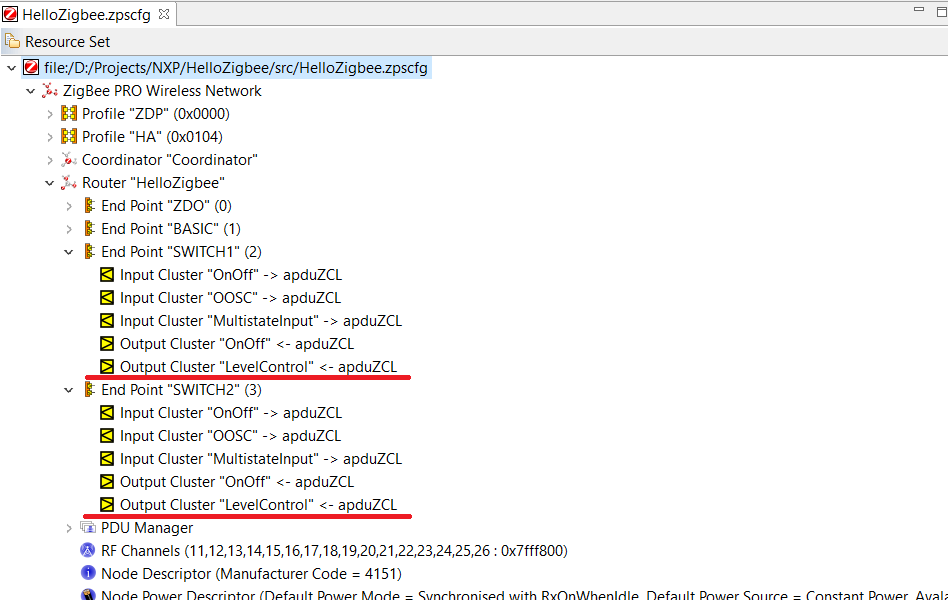
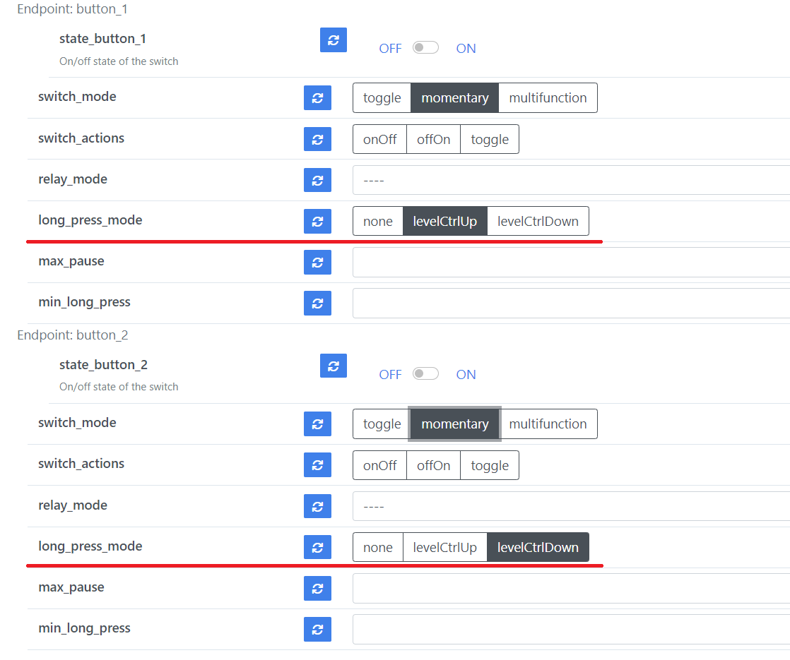
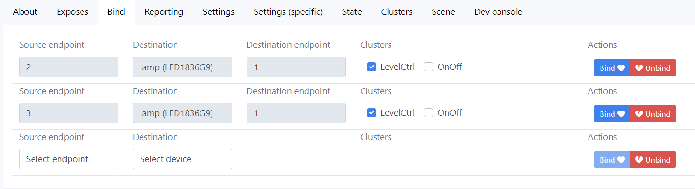
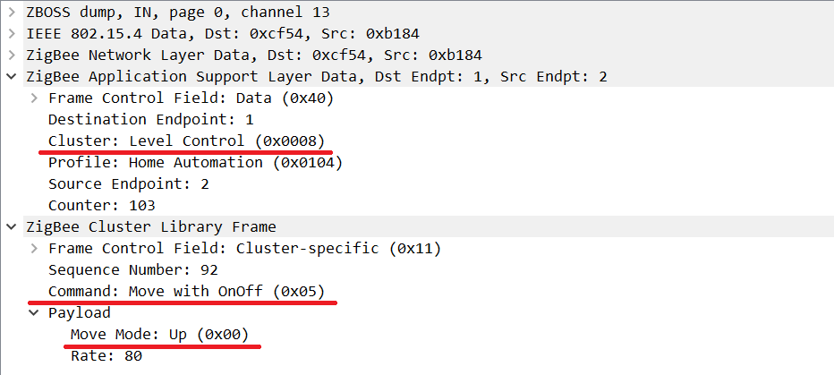

# Hello Zigbee World, Part 19 - Dimming the light via Level Control Cluster

Recently I purchased an IKEA On/Off switch and a bulb. The first thing I did after unboxing is sniffing how they communicate, which commands they send, what clusters declare. I was particularly interested in how these devices bind together and how light dimming works.

Previously [I mentioned that binding can happen only for matching clusters](part16_multistate_action.md). That is why it was impossible to bind a double press of the button (which emits a multistate input attribute change report) with a light On/Off action. Today we will add support for the Level Control cluster to our device, so that it can generate dimming commands that could be directly bound to a dimmable light.

This is the next part in the [Hello Zigbee series](part0_plan.md), describing how to build a Zigbee device firmware from scratch. As usual, my code will be based on the code created in the previous articles. As a development board I’ll be using the same [EBYTE E75–2G4M10S module based on the NXP JN5169 microcontroller](part1_bring_up.md). 

## Level Control Cluster

The Level Control cluster represents a discrete value in a 1 - 254 range. It also provides commands to set a particular value, as well as commands to increase/decrease the value with a certain rate. This cluster can be used to control different physical values - light dimming level, sound volume, fan speed, light color temperature, shades opening level, etc.

Since we are building a switch that would control other devices, we need a Client version of the cluster. As you remember, the Client does not have its internal state, but can issue commands to the bound devices. The cluster offers the following commands:

- **Move to level** - allows to instantly set the new value of the cluster, or ask the device to move to the value gradually with the selected rate. 
- **Step** - increment/decrement the value by the specified step. Same as the previous command it allows instant change of the value, or gradual.
- **Move** up or down - start incrementing/decrementing the value with the specified rate, until stop command is issued
- **Stop** - stop previously requested moving up/down.

As an option, Move and Step commands can be linked with the On/Off cluster of the same endpoint. For example when the value drops down to 1 (minimum), it can automatically generate an Off command, and if the value goes up it can issue an On command (described behavior is an option). That is why this cluster perfectly suits the light dimming case.

I would like my switch to control dimming similarly to IKEA On/Off button - long press on one button will gradually increase the brightness, and long press of another button will dim the light. Currently the switch generates press/release actions on the long press. Let’s add a mode that will generate Level Control Move/Stop commands.

Adding the Level Control Cluster to our SwitchEndpoint class is no different from adding other clusters, which was described several times. 

First, add the cluster in Zigbee3ConfigurationEditor



Now we need to [generate zps_gen.c/h files](part5_zigbee_init.md) (at some point this became a part of the build process).

In order to enable Level Control Client cluster in the code, a few defines must be declared in zcl_options.h.

```cpp
#define CLD_LEVEL_CONTROL
#define LEVEL_CONTROL_CLIENT
```

Level Control cluster implementation shall be also added to the project.

```cmake
SET(ZIGBEE_SRC
       ${SDK_PREFIX}/Components/ZCL/Clusters/General/Source/LevelControl.c
       ${SDK_PREFIX}/Components/ZCL/Clusters/General/Source/LevelControlClientCommands.c
       ${SDK_PREFIX}/Components/ZCL/Clusters/General/Source/LevelControlCommandHandler.c
```

Now add cluster definition and cluster attribute storage to the SwitchEndpoint class

```cpp
struct OnOffClusterInstances
{
...
   tsZCL_ClusterInstance sLevelControlClient;
...

class SwitchEndpoint: public Endpoint
{   
....
   tsCLD_LevelControl sLevelControlClientCluster;
   tsCLD_LevelControlCustomDataStructure sLevelControlClientCustomDataStructure;
```

Finally, register the cluster at the endpoint

```cpp
void SwitchEndpoint::registerLevelControlClientCluster()
{
   // Initialize Level Control client cluser
   teZCL_Status status = eCLD_LevelControlCreateLevelControl(&sClusterInstance.sLevelControlClient,
                                                             FALSE,                              // Client
                                                             &sCLD_LevelControl,
                                                             &sLevelControlClientCluster,
                                                             &au8LevelControlAttributeControlBits[0],
                                                             &sLevelControlClientCustomDataStructure);
   if( status != E_ZCL_SUCCESS)
       DBG_vPrintf(TRUE, "SwitchEndpoint::init(): Failed to create Level Control client cluster instance. status=%d\n", status);
}
```

The Level Control cluster does not require any special initialization.

As soon as we add a setting to select which actions shall happen during a long press/release, we need to adjust the On/Off Settings Cluster and add the new attribute.

```cpp
/* On/Off switch configuration attribute ID's (3.9.2.2) */
typedef enum
{
...
   E_CLD_OOSC_ATTR_ID_SWITCH_LONG_PRESS_MODE   = 0xff04,
} teCLD_OOSC_ClusterID;
```

Here is a list of actions which can be assigned to long press. 

```cpp
/* Long Press modes */
typedef enum
{
   E_CLD_OOSC_LONG_PRESS_MODE_NONE,
   E_CLD_OOSC_LONG_PRESS_MODE_LEVEL_CTRL_UP,
   E_CLD_OOSC_LONG_PRESS_MODE_LEVEL_CTRL_DOWN
} teCLD_OOSC_LongPressMode;
```

Then add the storage variable

```cpp
/* On/Off Switch Configuration Cluster */
typedef struct
{
...
   zenum8                  eLongPressMode;
...
} tsCLD_OOSC;
```

... add the attribute definition

```cpp
const tsZCL_AttributeDefinition asCLD_OOSCClusterAttributeDefinitions[] = {
...
   {E_CLD_OOSC_ATTR_ID_SWITCH_LONG_PRESS_MODE, (E_ZCL_AF_RD|E_ZCL_AF_WR|E_ZCL_AF_MS),  E_ZCL_ENUM8,    (uint32)(&((tsCLD_OOSC*)(0))->eLongPressMode),0},
```

And attribute initialization

```cpp
PUBLIC  teZCL_Status eCLD_OOSCCreateOnOffSwitchConfig(
               tsZCL_ClusterInstance              *psClusterInstance,
               bool_t                              bIsServer,
               tsZCL_ClusterDefinition            *psClusterDefinition,
               void                               *pvEndPointSharedStructPtr,
               uint8                              *pu8AttributeControlBits)
{
...
           ((tsCLD_OOSC*)psClusterInstance->pvEndPointSharedStructPtr)->eLongPressMode = E_CLD_OOSC_LONG_PRESS_MODE_NONE;
```

I decided to leave the `SwitchEndpoint::reportAction()` method as is - it will continue emitting multistate input cluster reports even for long press/release actions. In addition there will be a `SwitchEndpoint::reportLongPress()` function dedicated to long press/release specifically.

```cpp
void SwitchEndpoint::reportLongPress(bool pressed)
{
   switch(sOnOffConfigServerCluster.eLongPressMode)
   {
   case E_CLD_OOSC_LONG_PRESS_MODE_LEVEL_CTRL_UP:
       if(pressed)
           sendLevelControlMoveCommand(true);
       else
           sendLevelControlStopCommand();
       break;

   case E_CLD_OOSC_LONG_PRESS_MODE_LEVEL_CTRL_DOWN:
       if(pressed)
           sendLevelControlMoveCommand(false);
       else
           sendLevelControlStopCommand();
       break;

   default:
       break;
   }
}
```

Depending on selected mode and action, it will redirect to either Move Up/Down or Stop functions. 

```cpp
void SwitchEndpoint::sendLevelControlMoveCommand(bool up)
{
   // Destination address does not matter - we will send to all bound devices
   tsZCL_Address addr;
   addr.uAddress.u16DestinationAddress = 0x0000;
   addr.eAddressMode = E_ZCL_AM_BOUND;

   // Send the move command
   uint8 sequenceNo;
   tsCLD_LevelControl_MoveCommandPayload payload = {
       up ? (uint8)0x00 : (uint8)0x01, // u8MoveMode
       80,                             // u8Rate
       0,                              // u8OptionsMask
       0                               // u8OptionsOverride
   };
   teZCL_Status status = eCLD_LevelControlCommandMoveCommandSend(getEndpointId(),
                                                                 1,
                                                                 &addr,
                                                                 &sequenceNo,
                                                                 TRUE,
                                                                 &payload);
   DBG_vPrintf(TRUE, "Sending Level Control Move command status: %02x\n", status);
}

void SwitchEndpoint::sendLevelControlStopCommand()
{
   // Destination address does not matter - we will send to all bound devices
   tsZCL_Address addr;
   addr.uAddress.u16DestinationAddress = 0x0000;
   addr.eAddressMode = E_ZCL_AM_BOUND;

   // Send the move command
   uint8 sequenceNo;
   tsCLD_LevelControl_StopCommandPayload payload = {
       0,          // u8OptionsMask
       0           // u8OptionsOverride
   };
   teZCL_Status status = eCLD_LevelControlCommandStopCommandSend(getEndpointId(),
                                                                 1,
                                                                 &addr,
                                                                 &sequenceNo,
                                                                 TRUE,
                                                                 &payload);
   DBG_vPrintf(TRUE, "Sending Level Control Stop command status: %02x\n", status);
}
```

Sending commands are very similar to On/Off commands we used earlier. Commands are sent in AM_BOUND mode, which means a light shall be bound to the device first.

These commands will be sent from the `ButtonHandler` context. It seems reasonable to emit move/stop commands in `Momentary` mode as well as long press/release in `Multistate` mode. Commands will be emitted immediately in `Momentary` mode, and with a little delay in `Multistate`.

```cpp
void ButtonHandler::buttonStateMachineMomentary(bool pressed)
{
   // The state machine
   switch(currentState)
   {
       case IDLE:
           if(pressed)
           {
               changeState(PRESSED1);
               endpoint->reportAction(BUTTON_PRESSED);

               if(relayMode != RELAY_MODE_UNLINKED)
                   endpoint->switchOn();

               endpoint->reportLongPress(true);
           }
           break;

       case PRESSED1:
           if(!pressed)
           {
               changeState(IDLE);
               endpoint->reportAction(BUTTON_RELEASED);

               if(relayMode != RELAY_MODE_UNLINKED)
                   endpoint->switchOff();

               endpoint->reportLongPress(false);
           }

           break;

       default:
           changeState(IDLE); // How did we get here?
           break;
   }
}
```

The calls to `endpoint->reportLongPress()` are implemented in a similar way for `Multistate` mode. Previously implemented multistate action reporting, as well as handling the internal relay remains untouched.

We also need to add support for the new setting to the zigbee2mqtt external converter. Here is the list of possible values for the new setting. There is also nothing new here, compared to the previous article.

```js
const longPressModeValues = ['none', 'levelCtrlUp', 'levelCtrlDown'];
```

Let’s also add support for this setting in from/toZigbee functions.

```js
const fromZigbee_OnOffSwitchCfg = {
...
    convert: (model, msg, publish, options, meta) => {
...
        // Long press mode
        if(msg.data.hasOwnProperty('65284')) {
            result[`long_press_mode_${ep_name}`] = msg.data['65284'];
        }
...


const toZigbee_OnOffSwitchCfg = {
    key: ['switch_mode', 'switch_actions', 'relay_mode', 'max_pause', 'min_long_press', 'long_press_mode'],


    convertGet: async (entity, key, meta) => {
...
            const lookup = {
                switch_mode: 65280,
                relay_mode: 65281,
                max_pause: 65282,
                min_long_press: 65283,
                long_press_mode: 65284
            };
            await entity.read('genOnOffSwitchCfg', [lookup[key]], manufacturerOptions.jennic);
...


    convertSet: async (entity, key, value, meta) => {
...
            case 'long_press_mode':
                newValue = longPressModeValues.indexOf(value);
                payload = {65284: {'value': newValue, 'type': DataType.enum8}};
                await entity.write('genOnOffSwitchCfg', payload, manufacturerOptions.jennic);
                break;
...
```

The new setting shall be also added to the dashboard.

```js
function genSwitchEndpoint(epName) {
...
        exposes.enum('long_press_mode', ea.ALL, longPressModeValues).withEndpoint(epName),
...
```

Here is how the dashboard looks like



You may wonder why there are 2 separate settings for Up and Down? That is because each button lives in its separate endpoint, and every button/endpoint has its independent set of settings. Obviously if we were building a double button device that is supposed to do a single function (such as dimming a single light, like IKEA On/Off button), it would be reasonable to create a single endpoint with 2 buttons. But since we are working on a versatile 2-gang switch firmware, where each button can potentially do an independent action, we have to have these 2 sets of settings.

Earlier I said that Move/Stop commands are sent in the AM_BOUND mode. This means that our buttons must be bound to a device. Let’s bind them to the light. Please note that we need to create 2 bindings, one for each button/endpoint.



Trying this in action, and dimming the light with our smart switch works perfectly. Here is how the Move Up command looks in the sniffer.




## Other approaches

Good news: we could successfully bind long press/release actions of our DIY smart switch with a dimming function of a light. 

Bad news: despite this approach works perfectly for a dimming light, controlling other physical parameters may be a little complicated. Below are a few examples.

Let’s talk about another popular parameter that could be controlled remotely - color temperature. I do not have enough different devices to test with, so most of my observations are based on studying herdsman-converters code.

First off, I’d like to admit that color temperature can be controlled by a Level Control cluster that we just studied. The color temperature can be simply mapped to the cluster's 1-254 range. The problem is that we can’t add several clusters of the same type to a single endpoint. So if you have a Level Control cluster already for dimming the light, you can’t add another one for color temperature. Well, technically it is possible to create a separate endpoint just for color temperature level control, but this is weird from the architecture and cluster layout point of view.

Fortunately there is a standard cluster that can control light color temperature - `lightingColorCtrl` (0x0300). This cluster has move/step/stop commands for color temperature, similar to ones in the Level Control cluster. Moreover, the Lighting Color Control cluster also offers commands to manipulate with color values (hue, saturation) and even more sophisticated color modes. I am pretty sure it is easy to extend our smart switch firmware so that it emits Lighting Control Cluster commands, if needed.

On other hand, manufacturers may not be happy with standard clusters, and implement different extensions. Thus, IKEA TRADFRI remotes use custom extensions of the Scenes cluster to change color temperature. Perhaps this is because the same remotes are supposed to also control colorful lights, and buttons shall use something more generic rather than change color temperature or change hue commands. 

One more use case I am personally interested in is controlling shades and curtains. In most cases this could also be controlled with Level Control clustery. The opening degree perfectly conforms with a proposed 1 - 254 value range. But manufacturers again have their own view.

Thus some of the Xiaomi curtain motors expose the Analog Output cluster, which is another way to present a value. In order to get the current position of the shades, it is needed to read the presentValue attribute of genAnalogOutput cluster.

At the same time, there is a standard cluster for covers and shades - Windows Covering Cluster. It offers a much richer possibility to control not only percentage of closure, but also tilt (for jalousie type shades), movement acceleration and limits. Some of the Xiaomi motors also implement this cluster. Unfortunately NXP does not provide an implementation for this cluster (but implementing client commands should not be too hard).

Tuya devices (including curtain motors) implement a very custom application protocol on top of the Zigbee cluster infrastructure. Instead of defining commands and attributes on the ZCL level in a cluster, it provides commands to read and write a variable defined on the application level. Controlling a curtain means reading and writing a variable responsible for curtain position.

I was studying only the devices I have. Perhaps other devices/vendors may use some other ways to control color temperature and shades parameters.

Taking into account described above, it may not be reasonable to build a generic versatile switch device that can control every possible device type or attribute. If you have a specific use case - it can be implemented in a way described in the first part of the article. But perhaps using Home Assistant automation could be a more flexible way of binding devices.

## Summary

Today we studied one more cluster type - level control cluster. It allows dimming the light, or a similar type of parameter. The benefits of this cluster is that we could bind some of the switch actions directly to the light dimming function. 

Adding this cluster was easy and straightforward. This article is just a demonstration of how simple it could be adding a new functionality to the device. Perhaps implementation of server side functionality may be quite complex, but implementation for client devices (such as controllers and remote switches) is simple.

## Links

- Documentation
  - [JN-UG-3113 ZigBee 3.0 Stack User Guide](https://www.nxp.com/docs/en/user-guide/JN-UG-3113.pdf)
  - [JN-UG-3114 ZigBee 3.0 Devices User Guide](https://www.nxp.com/docs/en/user-guide/JN-UG-3114.pdf)
  - [JN-UG-3076 ZigBee Home Automation User Guide](https://www.nxp.com/docs/en/user-guide/JN-UG-3076.pdf)
  - [JN-UG-3101 ZigBee PRO Stack User Guide](https://www.nxp.com/docs/en/user-guide/JN-UG-3101.pdf)
  - [ZigBee specification](https://zigbeealliance.org/wp-content/uploads/2019/11/docs-05-3474-21-0csg-zigbee-specification.pdf)
  - [ZigBee Class Library specification](https://zigbeealliance.org/wp-content/uploads/2019/12/07-5123-06-zigbee-cluster-library-specification.pdf)
  - [How to support new device in zigbee2mqtt](https://www.zigbee2mqtt.io/advanced/support-new-devices/01_support_new_devices.html)
- Code
  - [Project on github](https://github.com/grafalex82/hellozigbee/tree/hello_zigbee_level_control)
