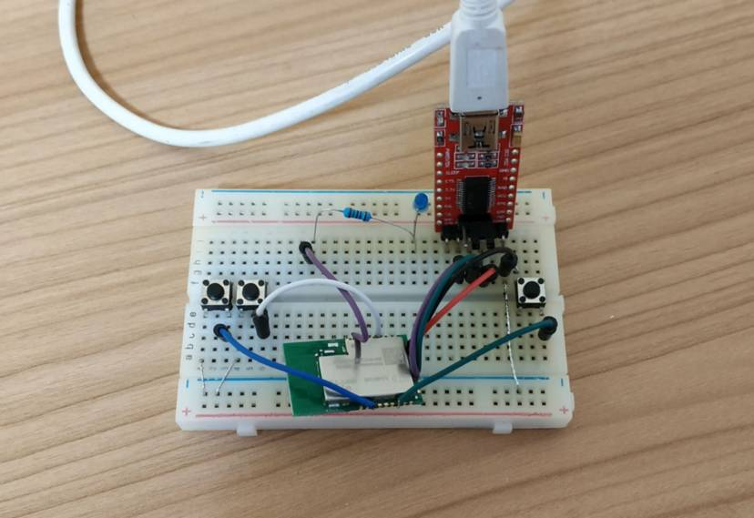
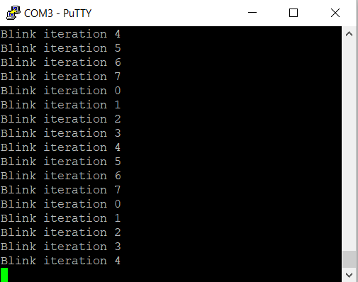

# Hello Zigbee World, Part 1 — Bringing up NXP JN5169 MCU


In the [previous article](part0_plan.md) I described some plans to develop alternative firmware for some Xiaomi ZigBee devices. But there is a problem: I have never worked with NXP JN5169 microcontrollers, which are used in Xiaomi devices. NXP provides an IDE, several thousand pages of documentation, a \$650 development board, and several megabytes of complicated sample code. But there was no intelligible step-by-step tutorial on the Internet on how to build an application.

In this article I’ll try to fill in the educational gap and try to write a small Hello World for the NXP JN5169 microcontroller. Let’s go.

## Motivation

As I said, NXP provides a ready-to-go development platform for their devices:
- An Eclipse-based BeyondStudio IDE that includes several JN5169 plugins to help develop ZigBee devices
- An SDK with the implementation of peripheral functions, as well as ZigBee stack
- All this is backed up by fairly detailed documentation, datasheets, an API Reference, and numerous Application Notes.

But this whole thing looks monstrous even for a professional, and a beginner will drown in this at all and won’t even be able to build a simple application. To my shame, even following the instructions for compiling an example from the SDK took me more than a day — BeyondStudio could not find the make tool, a compiler, libraries, or something else. It all depends on numerous environment variables, project settings, and who knows what else.

But this is only a part of the difficulty. Examples of ZigBee applications take up several megabytes, the code of subprojects is heavily intertwined. The names of functions and variables use obscure abbreviations, Hungarian notation, and are 2 times longer than they could be. The code itself is a spaghetti of defines and hundreds of lines of Makefiles. High-level code is interspersed with byte-by-byte assembly of network-level MAC packets, all this is built on a callback system, and you won’t figure out where the program starts at all. Particularly I was looking at the JN-AN-1219-Zigbee-3–0-Controller-and-Switch example.

I’m pretty sure that it’s possible to figure it all out over time, but most likely my interest will fade away by this time. I needed another approach here. Usually, if I want to understand a new technology, I try to do something simple. Megabytes of examples and thousands of pages of documentation are great, but I think it’s better to start with an LED blinker. Thus, I decided to write a small example from scratch in order to understand JN5169 development step by step.

## Hardware

Spending $650 on an official development board just to blink an LED is too much. Fortunately, EBYTE released a cheap module E75–2G4M10S (on the picture above), and I am going to experiment with it. For this I soldered a simple circuit.


In the circuit has one user button and one LED. The GPIO pins are randomly chosen. It is possible to flash the module via UART. To do this the SPI_MISO pin shall be tied to the ground during reset. That is why 2 additional buttons were added as well.

Here is the assembly on the breadboard (red board is an USB-UART adapter).



That is it for hardware. It is time to switch to a firmware part.

## Toolchain file

I will be using CMake for building the code. There was no ready to use toolchain file on the Internet, but it is easy to create it ourselves. It just requires setting a few variables that point CMake to the compiler and tools, as well as numerous flags.

I will use the compiler that comes with BeyondStudio (not sure if it can be downloaded separately). In fact, this is a regular gcc cross compiler.

```cmake
SET(CMAKE_SYSTEM_NAME Generic)

IF(NOT TOOLCHAIN_PREFIX)
     MESSAGE(STATUS "No TOOLCHAIN_PREFIX specified")
ENDIF()

IF (WIN32)
    SET(TOOL_EXECUTABLE_SUFFIX ".exe")
ELSE()
    SET(TOOL_EXECUTABLE_SUFFIX "")
ENDIF()

SET(TARGET_PREFIX "ba-elf")

SET(TOOLCHAIN_BIN_DIR ${TOOLCHAIN_PREFIX}/bin)
SET(TOOLCHAIN_INC_DIR ${TOOLCHAIN_PREFIX}/include)
SET(TOOLCHAIN_LIB_DIR ${TOOLCHAIN_PREFIX}/lib)

SET(CMAKE_C_COMPILER ${TOOLCHAIN_BIN_DIR}/${TARGET_PREFIX}-gcc${TOOL_EXECUTABLE_SUFFIX})
SET(CMAKE_CXX_COMPILER ${TOOLCHAIN_BIN_DIR}/${TARGET_PREFIX}-g++${TOOL_EXECUTABLE_SUFFIX})

SET(CMAKE_OBJCOPY ${TOOLCHAIN_BIN_DIR}/${TARGET_PREFIX}-objcopy${TOOL_EXECUTABLE_SUFFIX} CACHE INTERNAL "objcopy tool")
SET(CMAKE_OBJDUMP ${TOOLCHAIN_BIN_DIR}/${TARGET_PREFIX}-objdump${TOOL_EXECUTABLE_SUFFIX} CACHE INTERNAL "objdump tool")
SET(CMAKE_SIZE ${TOOLCHAIN_BIN_DIR}/${TARGET_PREFIX}-size${TOOL_EXECUTABLE_SUFFIX} CACHE INTERNAL "size tool")
SET(CMAKE_DEBUGER ${TOOLCHAIN_BIN_DIR}/${TARGET_PREFIX}-gdb${TOOL_EXECUTABLE_SUFFIX} CACHE INTERNAL "debugger")
SET(CMAKE_CPPFILT ${TOOLCHAIN_BIN_DIR}/${TARGET_PREFIX}-c++filt${TOOL_EXECUTABLE_SUFFIX} CACHE INTERNAL "C++filt")

SET(CMAKE_C_FLAGS_DEBUG "-Og -g" CACHE INTERNAL "c compiler flags debug")
SET(CMAKE_CXX_FLAGS_DEBUG "-Og -g" CACHE INTERNAL "cxx compiler flags debug")
SET(CMAKE_ASM_FLAGS_DEBUG "-g" CACHE INTERNAL "asm compiler flags debug")
SET(CMAKE_EXE_LINKER_FLAGS_DEBUG "" CACHE INTERNAL "linker flags debug")
SET(CMAKE_C_FLAGS_RELEASE "-Os -g" CACHE INTERNAL "c compiler flags release")
SET(CMAKE_CXX_FLAGS_RELEASE "-Os -g" CACHE INTERNAL "cxx compiler flags release")
SET(CMAKE_ASM_FLAGS_RELEASE "-g" CACHE INTERNAL "asm compiler flags release")
SET(CMAKE_EXE_LINKER_FLAGS_RELEASE "" CACHE INTERNAL "linker flags release")

SET(CMAKE_C_FLAGS "" CACHE INTERNAL "c compiler flags")
SET(CMAKE_CXX_FLAGS "" CACHE INTERNAL "cxx compiler flags")
SET(CMAKE_ASM_FLAGS "" CACHE INTERNAL "asm compiler flags")
SET(CMAKE_EXE_LINKER_FLAGS "" CACHE INTERNAL "executable linker flags")
SET(CMAKE_MODULE_LINKER_FLAGS "" CACHE INTERNAL "module linker flags")
SET(CMAKE_SHARED_LINKER_FLAGS "" CACHE INTERNAL "shared linker flags")

SET(CMAKE_FIND_ROOT_PATH ${TOOLCHAIN_PREFIX} ${EXTRA_FIND_PATH})
SET(CMAKE_FIND_ROOT_PATH_MODE_PROGRAM NEVER)
SET(CMAKE_FIND_ROOT_PATH_MODE_LIBRARY ONLY)
SET(CMAKE_FIND_ROOT_PATH_MODE_INCLUDE ONLY)
```

At first glance, this may seem complicated, but it’s actually quite simple. This script expects the TOOLCHAIN_PREFIX variable as input (in my case it points to `C:/NXP/bstudio_nxp/sdk/Tools/ba-elf-ba2-r36379` — the path where the toolchain is located). The toolchain file calculates the rest of the paths from this variable — compiler, objdump, objcopy, and other GNU stuff. The compiler and linker keys are also set here (for now, let’s leave them empty and fill it later).

Let’s create a small test project

```cmake
SET(CMAKE_BUILD_TYPE Release)
SET(CMAKE_TOOLCHAIN_FILE JN5169.cmake)

PROJECT(GPSLogger)
CMAKE_MINIMUM_REQUIRED(VERSION 3.8)
ENABLE_LANGUAGE(CXX)

ADD_EXECUTABLE(Test Test.c)
```

```cpp
#include <stdio.h>
#include <stdlib.h>

int main(void)
{
  return EXIT_SUCCESS;
}
```

Obviously this code does nothing, but at least it compiles.

```
D:\Projects\NXP\HelloJN5169World\build>cmake -G "MinGW Makefiles" -DTOOLCHAIN_PREFIX=C:/NXP/bstudio_nxp/sdk/Tools/ba-elf-ba2-r36379 ..
-- ======================
-- Toolchain paths
-- TOOLCHAIN_BIN_DIR = C:/NXP/bstudio_nxp/sdk/Tools/ba-elf-ba2-r36379/bin
-- TOOLCHAIN_INC_DIR = C:/NXP/bstudio_nxp/sdk/Tools/ba-elf-ba2-r36379/include
-- TOOLCHAIN_LIB_DIR = C:/NXP/bstudio_nxp/sdk/Tools/ba-elf-ba2-r36379/lib
-- CMAKE_C_COMPILER = C:/NXP/bstudio_nxp/sdk/Tools/ba-elf-ba2-r36379/bin/ba-elf-gcc.exe
-- CMAKE_CXX_COMPILER = C:/NXP/bstudio_nxp/sdk/Tools/ba-elf-ba2-r36379/bin/ba-elf-g++.exe
-- CMAKE_OBJCOPY = C:/NXP/bstudio_nxp/sdk/Tools/ba-elf-ba2-r36379/bin/ba-elf-objcopy.exe
-- CMAKE_OBJDUMP = C:/NXP/bstudio_nxp/sdk/Tools/ba-elf-ba2-r36379/bin/ba-elf-objdump.exe
-- CMAKE_SIZE = C:/NXP/bstudio_nxp/sdk/Tools/ba-elf-ba2-r36379/bin/ba-elf-size.exe
-- CMAKE_DEBUGER = C:/NXP/bstudio_nxp/sdk/Tools/ba-elf-ba2-r36379/bin/ba-elf-gdb.exe
-- CMAKE_CPPFILT = C:/NXP/bstudio_nxp/sdk/Tools/ba-elf-ba2-r36379/bin/ba-elf-c++filt.exe
-- ======================
-- Compiler flags
-- CMAKE_C_FLAGS =
-- CMAKE_CXX_FLAGS =
-- CMAKE_ASM_FLAGS =
-- CMAKE_EXE_LINKER_FLAGS =
-- CMAKE_MODULE_LINKER_FLAGS =
-- CMAKE_SHARED_LINKER_FLAGS =
-- CMAKE_C_FLAGS_DEBUG = -Og -g
-- CMAKE_CXX_FLAGS_DEBUG = -Og -g
-- CMAKE_ASM_FLAGS_DEBUG = -g
-- CMAKE_EXE_LINKER_FLAGS_DEBUG =
-- CMAKE_C_FLAGS_RELEASE = -Os -g
-- CMAKE_CXX_FLAGS_RELEASE = -Os -g
-- CMAKE_ASM_FLAGS_RELEASE = -g
-- CMAKE_EXE_LINKER_FLAGS_RELEASE =
-- Configuring done
-- Generating done
-- Build files have been written to: D:/Projects/NXP/HelloJN5169World/build

D:\Projects\NXP\HelloJN5169World\build>mingw32-make
[ 50%] Building C object CMakeFiles/Test.dir/Test.c.obj
[100%] Linking C executable Test
[100%] Built target Test
```

## Hello JN5169 World — Attempt 1

Let’s try to breathe a little life here and blink the LED.

The code for managing GPIO (and other peripherals) is provided in the SDK. NXP also provides a 416-page document that describes the hardware API (JN-UG-3087 JN516x Integrated Peripherals API User Guide).

The following code is supposed to turn on the LED connected to DIO17.

```cpp
#include <stdio.h>
#include <stdlib.h>

#include "AppHardwareApi.h"

#define BOARD_LED_BIT               (17)
#define BOARD_LED_PIN               (1UL << BOARD_LED_BIT)
#define BOARD_LED_CTRL_MASK         (BOARD_LED_PIN)


int main(void)
{
  // Initialize hardware
  vAHI_DioSetDirection(0, BOARD_LED_CTRL_MASK);
  vAHI_DioSetOutput(0, BOARD_LED_PIN);

  return EXIT_SUCCESS;
}
```

The code is using several functions from the microcontroller API, and requires adding an appropriate libraries.

```cmake
IF(NOT SDK_PREFIX)
     MESSAGE(FATAL_ERROR "No SDK_PREFIX specified")
ENDIF()


INCLUDE_DIRECTORIES(
 ${SDK_PREFIX}/Components/Common/Include
 ${SDK_PREFIX}/Components/HardwareAPI/Include
)

LINK_DIRECTORIES(
 ${SDK_PREFIX}/Components/Library
)

ADD_DEFINITIONS(
 -DJENNIC_CHIP_NAME=_JN5169
 -DJENNIC_CHIP_FAMILY_NAME=_JN516x
)

ADD_EXECUTABLE(HelloWorld HelloWorld.cpp)
TARGET_LINK_LIBRARIES(HelloWorld
 HardwareApi_JN5169
)
```

However, I had to add one more Cmake configuration parameter — `SDK_PREFIX`, which should point to the SDK root.

Unfortunately the flasher refused to consume the output .elf file, so I also added a conversion to the raw binary.

```cmake
FUNCTION(ADD_HEX_BIN_TARGETS TARGET)
    IF(EXECUTABLE_OUTPUT_PATH)
      SET(FILENAME "${EXECUTABLE_OUTPUT_PATH}/${TARGET}")
    ELSE()
      SET(FILENAME "${TARGET}")
    ENDIF()
    ADD_CUSTOM_TARGET(${TARGET}.hex DEPENDS ${TARGET} COMMAND ${CMAKE_OBJCOPY} -Oihex ${FILENAME} ${FILENAME}.hex)
    ADD_CUSTOM_TARGET(${TARGET}.bin DEPENDS ${TARGET} COMMAND ${CMAKE_OBJCOPY} -Obinary ${FILENAME} ${FILENAME}.bin)
ENDFUNCTION()
```

This thing compiles without problems. Let’s try to upload the firmware to the microcontroller using BeyondStudio. First the device shall be switched to the programming state (hold down the BOOT button, and without releasing press RESET), then go to Devices-> Program Device. But unfortunately something went wrong, the flasher complained that the binary image is not valid.

## Hello JN5169 World — Attempt 2

It’s time to see how BeyondStudio compiles firmware for the microcontroller. In fact it passes HUGE number of compiler parameters that are not yet a part of my toolchain.

Obviously, some of the parameters are important (for instance, specifying the MCU and architecture), while others refer to the example that was compiled and are not relevant to the compiler settings. Let’s try to pick up only the most necessary.

```cmake
SET(CMAKE_C_FLAGS "-march=ba2 -mcpu=jn51xx -mredzone-size=4 -mbranch-cost=3 -fomit-frame-pointer -fshort-enums -Wall -Wpacked -Wcast-align -fdata-sections -ffunction-sections" CACHE INTERNAL "c compiler flags")
SET(CMAKE_CXX_FLAGS "-march=ba2 -mcpu=jn51xx -mredzone-size=4 -mbranch-cost=3 -fomit-frame-pointer -fshort-enums -Wall -Wpacked -Wcast-align -fdata-sections -ffunction-sections" CACHE INTERNAL "cxx compiler flags")
SET(CMAKE_ASM_FLAGS "-march=ba2 -mcpu=jn51xx -mredzone-size=4 -mbranch-cost=3 -fomit-frame-pointer -fshort-enums -Wall -Wpacked -Wcast-align -fdata-sections -ffunction-sections" CACHE INTERNAL "asm compiler flags")
SET(CMAKE_EXE_LINKER_FLAGS "-Wl,--gc-sections -Wl,-u_AppColdStart -Wl,-u_AppWarmStart -march=ba2 -mcpu=jn51xx -mredzone-size=4 -mbranch-cost=3 -fomit-frame-pointer -Os -fshort-enums -nostartfiles -Wl,--gc-sections -Wl,--defsym=__stack_size=5000 -Wl,--defsym,__minimum_heap_size=2000 " CACHE INTERNAL "executable linker flags")
```

Also, in the objcopy call, there are clearly more parameters than I have — we will also take them to our project (although, as it turned out, they have no effect)

```cmake
ADD_CUSTOM_TARGET(${TARGET}.bin DEPENDS ${TARGET} COMMAND ${CMAKE_OBJCOPY} -j .version -j .bir -j .flashheader -j .vsr_table -j .vsr_handlers  -j .rodata -j .text -j .data -j .bss -j .heap -j .stack -S -O binary ${FILENAME} ${FILENAME}.bin)
```

But the whole thing still didn’t work. I needed to dig further.

## Hello JN5169 World — Attempt 3

Looking carefully at the linker parameters I noticed the `-TAppBuildZBPro.ld` command line switch. Of course, I forgot the linker script!

When we create a program, even the simplest one like Hello World, we need a compiler. It will turn the program into machine code. But this is not enough — this code must be correctly placed in memory so that the microcontroller can execute it. This is the linker job. And the linker does this according to the script, which states what memory address space to use for program code, stack, interrupt vectors, constants, static variables, etc.

Structure of the binary is also described in the script: magic constants and their offsets, locations of code and data sections, service headers and structures. Looks like that is what the flasher was not happy about.

Let’s add `-TAppBuildZBPro.ld` switch to `CMAKE_EXE_LINKER_FLAGS`

```
c:/nxp/bstudio_nxp/sdk/tools/ba-elf-ba2-r36379/bin/../lib/gcc/ba-elf/4.7.4/../../../../ba-elf/bin/ld.exe: invalid data statement
collect2.exe: error: ld returned 1 exit status
```

No clear error message, and no line number caused the error. I spent a number of hours trying to understand what was wrong. I also tried to copy additional switches from the BeyondStudio command line hoping to find the right one. Eventually I found out the reason.

Among other things, this linker script specifies an entry point. Before calling classic `main()` function, the microcontroller must perform some other initial initialization first — the initial configuration of the CPU, clearing the memory, setting the stack and heap pointers. This is usually done by a special function like `_start()` or something similar. The script from NXP refers to 2 functions — `AppColdStart()` and `AppWarmStart()`. These functions are implemented in the `libPWRM_JN516x.a` library (there are no sources in the SDK). After adding this library the error changed to a more meaningful.

```
pwrm_cold_start.c:(.text.AppColdStart+0xc): undefined reference to `vAppRegisterPWRMCallbacks'
pwrm_cold_start.c:(.text.AppColdStart+0xc): relocation truncated to fit: R_BA_18_PCREL against undefined symbol `vAppRegisterPWRMCallbacks'
pwrm_cold_start.c:(.text.AppColdStart+0x1b): undefined reference to `vAppMain'
pwrm_cold_start.c:(.text.AppColdStart+0x1b): relocation truncated to fit: R_BA_10_PCREL against undefined symbol `vAppMain'
```

Description of these functions can be found in the [JN-UG-3116 JN51xx Core Utilities User Guide](https://www.nxp.com/docs/en/user-guide/JN-UG-3116.pdf). The bottom line is that the `libPWRM_JN516x.a` library just implements the initial initialization, but instead of the classic `main()`, this library calls `vAppMain()`. Well, it’s not a big deal to rename the function.

```cpp
PUBLIC void vAppMain(void)
{
  int i;

  // Initialize hardware
  vAHI_DioSetDirection(0, BOARD_LED_CTRL_MASK);

  while(1)
  {
    vAHI_DioSetOutput(0, BOARD_LED_PIN);

    for(i=0; i<200000; i++)
      vAHI_DioSetOutput(0, BOARD_LED_PIN);

    vAHI_DioSetOutput(BOARD_LED_PIN, 0);

    for(i=0; i<1000000; i++)
      vAHI_DioSetOutput(BOARD_LED_PIN, 0);
  }
}
```

In the `vAppMain()` function I implemented the classic blinker. Delay functions are not yet implemented, so I just call `vAHI_DioSetOutput()` in a loop.

By the way, an interesting feature of the `vAHI_DioSetOutput()` function is that it simultaneously turns on pins specified in the first parameter, and turns off ones in the second parameter. Thus, the functions for turning on and off the LED look very similar, only the order of the parameters is different.

We also need `vAppRegisterPWRMCallbacks()` — it serves for sleep/wake functionality, which is not yet implemented. Let’s leave it empty for now.

This time, the flasher was satisfied with the binary format, and the LED on the board blinked happily.


## Hello Debug UART

Probably the most difficult stage is behind. But we won’t stop there, right? Let’s add something else useful to this project, for example UART for debug logging. I will use the same UART that is used for flashing the firmware as I have USB-UART converter there already.

First of all UART0 and debug output module needs to be initialized at 115200 baud (it can run faster, but there is extra initialization needed — look for `vAppMain()` in the examples). After that it is possible to use `DBG_vPrintf()` calls to the code and print debug information.


```cpp
PUBLIC void vAppMain(void)
{
    int i;
    int iteration = 0;

    // Initialize UART
    DBG_vUartInit(DBG_E_UART_0, DBG_E_UART_BAUD_RATE_115200);

    // Initialize hardware
    vAHI_DioSetDirection(0, BOARD_LED_CTRL_MASK);


    while(1)
    {
        DBG_vPrintf(TRUE, "Blink iteration %d\n", iteration++);

        vAHI_DioSetOutput(0, BOARD_LED_PIN);

        for(i=0; i<1000000; i++)
            vAHI_DioSetOutput(0, BOARD_LED_PIN);

        vAHI_DioSetOutput(BOARD_LED_PIN, 0);

        for(i=0; i<1000000; i++)
            vAHI_DioSetOutput(BOARD_LED_PIN, 0);
    }
}
```

The first parameter in `DBG_vPrintf()` can be used to enable or disable debug logging. And this can be switched in runtime — that’s cool.

Compiling…. and the size of the binary does not change. Looking into dbg.h, it becomes clear that all debugging code is simply disabled by the `DBG_ENABLE` definition. Let’s just enable it in the project settings, as well as connect a whole bunch of libraries.

```cmake
TARGET_LINK_LIBRARIES(HelloWorld
            -Wl,--start-group

            PWRM_JN516x
            HardwareApi_JN5169
            DBG_JN516x
            Boot_JN516x

            -Wl,--end-group
)
```

Please note that the SDK libraries had to be pushed into the group. The linker works sequentially, selecting the necessary symbols from the libraries and discarding the rest. Moreover, the linker does not return to already processed libraries. Because the `DBG_JN516x` library uses UART functions from `HardwareApi_JN5169` that has already been processed it leads to unresolved UART functions. With the `-Wl, --start-group`/`-Wl,--end-group` switches, we tell the linker not to discard already processed libraries, but instead interpret all the libraries in the group as one big library .Then all the necessary symbols are resolved.

The size of the binary has increased noticeably, and now we can see the treasured lines in the console.



## Hello Watchdog

Don’t you find it strange that the microcontroller can only count only up to 7?

In fact, this is because of the watchdog timer. By default, the watchdog timer starts when the microcontroller is initialized and expires in approximately 16 seconds. All we need to do is restart the watchdog timer with the `vAHI_WatchdogRestart()` function on each iteration.

By the way, using the `bAHI_WatchdogResetEvent()` function it is possible to find out the reason of the microcontroller reset — was it due to the timer running out, or for some other reason.

```cpp
PUBLIC void vAppMain(void)
{
    int i;
    int iteration = 0;
    int debugEnabled = 1;

    // Initialize UART
    DBG_vUartInit(DBG_E_UART_0, DBG_E_UART_BAUD_RATE_115200);

    // Initialize hardware
    vAHI_DioSetDirection(0, BOARD_LED_CTRL_MASK);

    if (bAHI_WatchdogResetEvent())
    {
        DBG_vPrintf(TRUE, "APP: Watchdog timer has reset device!\n");
        DBG_vDumpStack();
    }   

    while(1)
    {
        DBG_vPrintf(debugEnabled, "Blink iteration %d\n", iteration++);

        vAHI_DioSetOutput(0, BOARD_LED_PIN);

        for(i=0; i<1000000; i++)
            vAHI_DioSetOutput(0, BOARD_LED_PIN);

        vAHI_DioSetOutput(BOARD_LED_PIN, 0);

        for(i=0; i<1000000; i++)
           vAHI_DioSetOutput(BOARD_LED_PIN, 0);

        vAHI_WatchdogRestart();
    }
}
```

## Conclusion

Getting started with the JN5169 microcontroller turned out to be not very difficult, although the path proposed by the manufacturer could have been simpler. I managed to turn something big and incomprehensible into small and understandable, where I understand the essence of (almost) every line.

Of course, this is just a Hello World — blinking a LED on a new device. I still need to dig into more hardware features, as well as ZigBee. This is only the first part in a long series of articles regarding Zigbee and writing custom firmware for Xiaomi devices.


## Links:

- [Project on github](https://github.com/grafalex82/hellojn5169world)
- https://www.nxp.com/docs/en/user-guide/JN-UG-3113.pdf
- https://www.nxp.com/docs/en/user-guide/JN-UG-3116.pdf
- https://www.nxp.com/docs/en/user-guide/JN-UG-3087.pdf
- https://www.rcscomponents.kiev.ua/datasheets/e75-2g4m10s_usermanual_en_v1_1.pdf