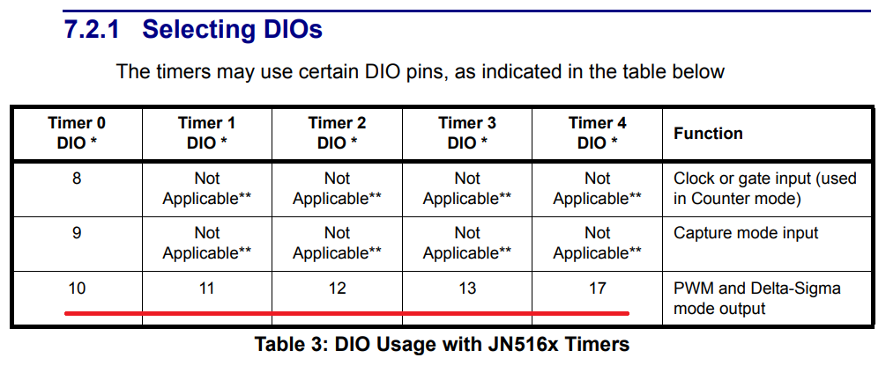
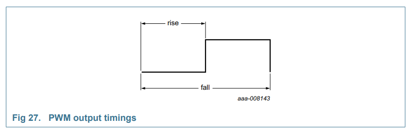
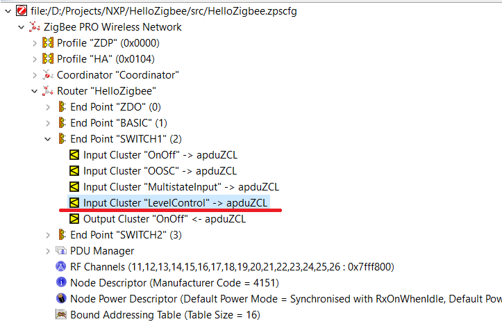
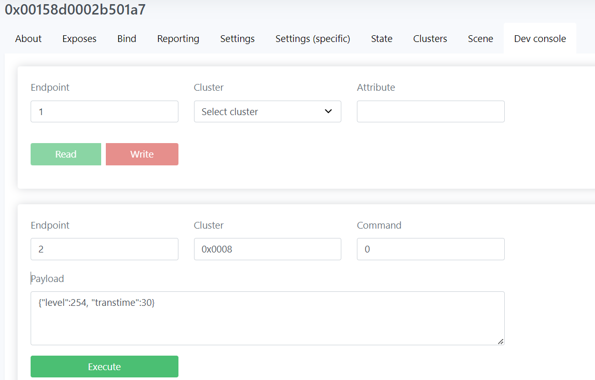
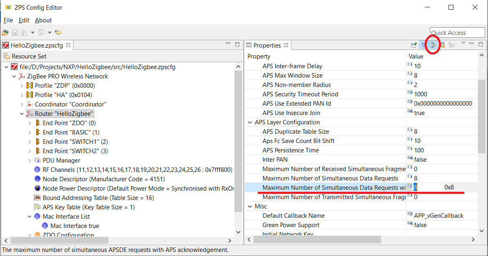

# Hello Zigbee World, Part 20 - Dimmable light

[Last time](part19_level_control.md) we discussed controlling/dimming a light with a client version of the Level Control Cluster. Although we are working on a smart switch, I was also curious how dimmable light works. So let’s make another spin off and try a server version of the Level Control cluster.

Obviously there is no power part in our device that would control a real light. But there is a LED that we can control with PWM, and set different brightness levels. The device will implement not only On and Off commands, but also setting a brightness degree, as well as gradually change the level over time.

This is the next part in the [Hello Zigbee series](part0_plan.md), describing how to build a Zigbee device firmware from scratch. As usual, my code will be based on the code created in the previous articles. As a development board I’ll be using the same [EBYTE E75–2G4M10S module based on the NXP JN5169 microcontroller](part1_bring_up.md). 

## PWM features of JN5169

The JN5169 microcontroller has 5 timers, each timer has a single PWM channel. Unlike STM32 or ATMega microcontrollers we have to use a dedicated timer for each LED. Also we cannot use an arbitrary pin for driving a LED - each timer is hardwired with a particular pin that cannot be changed (well, there is an alternate pin possible for some of the timers, but the alternate pin number is also predefined).



I had to change the pin number for the second LED, so that it is using one of the pins outlined above.


Overall, configuring a timer in PWM mode is not that hard. 

```cpp
const uint8 PWM_MAX = 255;

// Use the following table to map timerIDs to a pin number
// - E_AHI_TIMER_0 - 10
// - E_AHI_TIMER_1 - 11
// - E_AHI_TIMER_2 - 12
// - E_AHI_TIMER_3 - 13
// - E_AHI_TIMER_4 - 17

class PWMPin
{
public:
   uint8_t timerId;

public:
   PWMPin()
   {
       timerId = 0;
   }

   void init(uint8 timer)
   {
       timerId = timer;

       vAHI_TimerEnable(timerId, 6, FALSE, FALSE, TRUE);
       vAHI_TimerConfigureOutputs(timerId, TRUE, TRUE);
       setLevel(0);
   }

   void setLevel(uint8 level)
   {
       vAHI_TimerStartRepeat(timerId, (PWM_MAX - level), PWM_MAX);
   }
};
```

The `vAHI_TimerEnable()` call configures the timer at 16MHz/(2^6)=250kHz rate. Interrupts on raising/falling edge are disabled, but PWM mode is enabled. `vAHI_TimerConfigureOutputs()` call configures the output pin in inverting mode - our LED connection assumes the output pin works in an open drain mode. This means that the LED is on when pin level is low, and off on high level.

The `vAHI_TimerStartRepeat()` function (re)starts the timer in the PWM mode. The second and third parameters specify timings of high and low levels on the pin. Thus the timer will tick from 0 to 255, and the `level` parameter sets the duty cycle value.



Each endpoint will drive its own LED. There is no longer a need for a BlinkTask as our LEDs will not be blinking any more. 

```cpp
class SwitchEndpoint: public Endpoint
{   
protected:
...
   PWMPin ledPin;
...


void SwitchEndpoint::setPins(uint8 ledTimer, uint32 pinMask)
{
   ledPin.init(ledTimer);
...
}
```


## Integrating Level Control Server cluster

Registering the Level Control Server cluster is no different from registering other clusters in the endpoint. 

First, declare the cluster in the Zigbee3ConfigurationEditor.



Then enable the cluster in the zcl_options.h

```cpp
#define CLD_LEVEL_CONTROL
#define LEVEL_CONTROL_SERVER
```

The cluster must be registered in the endpoint.

```cpp
void SwitchEndpoint::registerLevelControlServerCluster()
{
   // Initialize Level Control client cluser
   teZCL_Status status = eCLD_LevelControlCreateLevelControl(&sClusterInstance.sLevelControlServer,
                                                             TRUE,                              // Server
                                                             &sCLD_LevelControl,
                                                             &sLevelControlServerCluster,
                                                             &au8LevelControlAttributeControlBits[0],
                                                             &sLevelControlServerCustomDataStructure);

   if( status != E_ZCL_SUCCESS)
       DBG_vPrintf(TRUE, "SwitchEndpoint::init(): Failed to create Level Control server cluster instance. status=%d\n", status);
}
```

Do not forget to re-generate zps_get.c/h files, and do a full rebuild. On the zigbee2mqtt side it is recommended to delete the device from the network first, and then restart zigbee2mqtt, so that it does a full interview on re-adding the device. 

One more note about zigbee2mqtt - it needs adding a brightness control bar to the dashboard. 


```js
function genSwitchEndpoint(epName) {
     return [
         e.light_brightness().withEndpoint(epName),
...
```

Also we need to let zigbee2mqtt know how to send brightness commands, there are building blocks for this already.

```js
const device = {
...
    fromZigbee: [fz.on_off, fz.brightness, fz.level_config, fromZigbee_OnOffSwitchCfg, fromZigbee_MultistateInput],
    toZigbee: [tz.light_onoff_brightness, toZigbee_OnOffSwitchCfg],
```

Back to the firmware. Architecture of the ZCL library from NXP handles all the level control commands automatically, and updates internal structures and cluster attributes as necessary. Level Control cluster implementation is even connected with On/Off Cluster, so that it switches OnOff cluster `On` when brightness exceeds a minimum level, and switches it `Off` when brightness goes beyond the minimum.

The ZCL code will notify our application if the value of LevelCtrl or OnOff attributes change. For this Custom Cluster and Cluster Update events are used. Previously I incorrectly stated these events are technically the same. This was coincidentally true for OnOff cluster, but in general these are different events:
- **Custom Cluster Event** notifies the application when a cluster command has been received. Typically the ZCL cluster implementation handles the command, and changes internal attributes. We are just notified, giving firmware a chance to make some extra actions if needed. For example on receiving On and Off commands we may want to trigger the relay.
- The **Cluster Update** message is needed to notify the application that a cluster attribute value has changed for some reason. This may be a direct reaction to an external command, or due to other internal processes (e.g. gradual change of the brightness, which we will see in the next sections).
]
Since these commands are now separated, they have to have separate handlers. Events dispatching is performed in the Endpoint class.

```cpp
void Endpoint::handleZclEvent(tsZCL_CallBackEvent *psEvent)
{
   switch (psEvent->eEventType)
   {
...
       case E_ZCL_CBET_CLUSTER_CUSTOM:
           handleCustomClusterEvent(psEvent);
           break;


       case E_ZCL_CBET_CLUSTER_UPDATE:
           handleClusterUpdate(psEvent);
           break;
```

In the case of the Level Control cluster we may not be super interested in handling commands. There are a number of them (Move To Level, Move Up/Down with a rate, Step, Stop, and their variations), and it will require some effort to implement them properly. Fortunately ZCL already has these commands implemented, and Custom Cluster Events can be safely ignored in our case.

```cpp
void SwitchEndpoint::handleCustomClusterEvent(tsZCL_CallBackEvent *psEvent)
{
   uint16 u16ClusterId = psEvent->uMessage.sClusterCustomMessage.u16ClusterId;
   tsCLD_OnOffCallBackMessage * msg = (tsCLD_OnOffCallBackMessage *)psEvent->uMessage.sClusterCustomMessage.pvCustomData;
   uint8 u8CommandId = msg->u8CommandId;

   DBG_vPrintf(TRUE, "SwitchEndpoint EP=%d: Cluster custom message ClusterID=%04x Cmd=%02x\n",
               psEvent->u8EndPoint,
               u16ClusterId,
               u8CommandId);
}
```

We no longer need to handle OnOff commands as well - this functionality is superseded with Level Control cluster implementation, which will send us level value update messages. Thus `handleCustomClusterEvent()` ended up doing no useful work, just dumping the message.

All the useful work happens now in the `handleClusterUpdate()` method.

```cpp
void SwitchEndpoint::handleClusterUpdate(tsZCL_CallBackEvent *psEvent)
{
   uint16 u16ClusterId = psEvent->psClusterInstance->psClusterDefinition->u16ClusterEnum;
   DBG_vPrintf(TRUE, "SwitchEndpoint EP=%d: Cluster update message ClusterID=%04x\n",
               psEvent->u8EndPoint,
               u16ClusterId);

   if(u16ClusterId == GENERAL_CLUSTER_ID_LEVEL_CONTROL)
       doLevelChange(sLevelControlServerCluster.u8CurrentLevel);
}
```

There is no way to identify which exact attribute has changed, but we are given with the clusterID at least. 

As I said previously, the LevelControl cluster is tightly integrated with the OnOff cluster implementation. Thus turning On and Off via OnOff cluster will be converted to corresponding LevelCtrl value updates. We just need to pass the received value to the LED PWM.

## Brightness level

Let’s talk about level meaning. The specification is a little bit vague here. 
- [Official Zigbee ZCL specification](https://zigbeealliance.org/wp-content/uploads/2019/12/07-5123-06-zigbee-cluster-library-specification.pdf) sets the range of the current value attribute as 0 - 254
- [NXP ZCL User guide](https://www.nxp.com/docs/en/user-guide/JN-UG-3115.pdf) declares valid range of the value as 1 - 254, while the 0 value is claimed as unused.

As per NXP the value of 1 represents the `Off` state, while values >1 means `On`. This looks quite odd to me, that non-zero values may turn the device on and off, while the zero value is unused. I would interpret the specification as follows:
- values 1-254 represent different non-zero brightness values, and the OnOff state is considered as `On`.
- value 0 is reserved to represent the `Off` value

It looks like other dimmable lights also interpret the value the same way. The zigbee2mqtt brightness control also offers the range 0-254. Fortunately the implementation from NXP is flexible enough, and the minimum level can be easily fixed in the zcl_options.h file.

```cpp
#define CLD_LEVELCONTROL_MIN_LEVEL			(0)
```

Also, there is an issue with passing the level value to the `PWMPin` class directly - brightness perception is not linear. Change from 10 to 20 changes the brightness dramatically, while the change from 240 to 250 is almost not noticeable. We need to apply some exponential adjustment so that brightness level is perceived linearly.

I used some formulas found on the internet. Unfortunately the result was too slow growing. It produced almost no value change for input levels up to 70. So I just mixed in some linearity (see factor value). Here is the pseudo code I used.

```
m = 253
p = 255
r = m*log10(2)/log10(p)
factor = 5

Yexp[level] = 2^((level-1)/r)-1         // fixing logarithmic brightness perception
Y[level] = (Yexp[level] + factor*level)/(factor+1)    // mixing in some linear portion
```

The table was calculated in Excel and converted to the code with a simple script.

```cpp
void SwitchEndpoint::doLevelChange(uint8 level)
{
   DBG_vPrintf(TRUE, "SwitchEndpoint EP=%d: do level change %d\n", getEndpointId(), level);

   static const uint8 level2pwm[256] = {
       0x00, 0x01, 0x01, 0x01, 0x02, 0x02, 0x02, 0x02, 0x02, 0x02, 0x03, 0x03, 0x03, 0x03, 0x03, 0x04,
       0x04, 0x04, 0x04, 0x04, 0x05, 0x05, 0x05, 0x05, 0x05, 0x06, 0x06, 0x06, 0x06, 0x06, 0x07, 0x07,
       0x07, 0x07, 0x07, 0x08, 0x08, 0x08, 0x08, 0x08, 0x09, 0x09, 0x09, 0x09, 0x09, 0x0a, 0x0a, 0x0a,
       0x0a, 0x0b, 0x0b, 0x0b, 0x0b, 0x0b, 0x0c, 0x0c, 0x0c, 0x0c, 0x0d, 0x0d, 0x0d, 0x0d, 0x0e, 0x0e,
       0x0e, 0x0e, 0x0e, 0x0f, 0x0f, 0x0f, 0x0f, 0x10, 0x10, 0x10, 0x10, 0x11, 0x11, 0x11, 0x12, 0x12,
       0x12, 0x12, 0x13, 0x13, 0x13, 0x13, 0x14, 0x14, 0x14, 0x15, 0x15, 0x15, 0x15, 0x16, 0x16, 0x16,
       0x17, 0x17, 0x17, 0x18, 0x18, 0x18, 0x19, 0x19, 0x19, 0x1a, 0x1a, 0x1a, 0x1b, 0x1b, 0x1b, 0x1c,
       0x1c, 0x1d, 0x1d, 0x1d, 0x1e, 0x1e, 0x1e, 0x1f, 0x1f, 0x20, 0x20, 0x21, 0x21, 0x21, 0x22, 0x22,
       0x23, 0x23, 0x24, 0x24, 0x25, 0x25, 0x26, 0x26, 0x27, 0x27, 0x28, 0x28, 0x29, 0x29, 0x2a, 0x2b,
       0x2b, 0x2c, 0x2c, 0x2d, 0x2e, 0x2e, 0x2f, 0x2f, 0x30, 0x31, 0x31, 0x32, 0x33, 0x34, 0x34, 0x35,
       0x36, 0x37, 0x37, 0x38, 0x39, 0x3a, 0x3b, 0x3b, 0x3c, 0x3d, 0x3e, 0x3f, 0x40, 0x41, 0x42, 0x43,
       0x44, 0x45, 0x46, 0x47, 0x48, 0x49, 0x4a, 0x4b, 0x4d, 0x4e, 0x4f, 0x50, 0x51, 0x53, 0x54, 0x55,
       0x57, 0x58, 0x59, 0x5b, 0x5c, 0x5e, 0x5f, 0x61, 0x62, 0x64, 0x66, 0x67, 0x69, 0x6b, 0x6d, 0x6e,
       0x70, 0x72, 0x74, 0x76, 0x78, 0x7a, 0x7c, 0x7e, 0x80, 0x83, 0x85, 0x87, 0x8a, 0x8c, 0x8e, 0x91,
       0x93, 0x96, 0x99, 0x9b, 0x9e, 0xa1, 0xa4, 0xa7, 0xaa, 0xad, 0xb0, 0xb3, 0xb7, 0xba, 0xbd, 0xc1,
       0xc4, 0xc8, 0xcc, 0xd0, 0xd3, 0xd7, 0xdb, 0xdf, 0xe4, 0xe8, 0xec, 0xf1, 0xf5, 0xfa, 0xff, 0xff
   };

   uint8 pwm = sOnOffServerCluster.bOnOff ? level2pwm[level] : 0;
   ledPin.setLevel(pwm);
}
```

You may wonder why the `level2pwm` table is located in `SwitchEndpoint`, and not in the `PWMPin`. That is because I wanted to leave `PWMPin` class as generic as possible. Perhaps somewhere I need a linear PWM without any exponential corrections.

One important note about this line

```cpp
   uint8 pwm = sOnOffServerCluster.bOnOff ? level2pwm[level] : 0;
```

Sometimes the ZCL framework may set some strange levels internally. This happens on the joint of OnOff and LevelCtrl clusters implementation, while the light gets on or off. Following level update messages blindly cause unpleasant spikes of the LED. Fortunately these incorrect values come only when the `bOnOff` variable was in a false state - let’s just simply ignore these updates.

## Gradual brightness change

I like when a light does not just go on or off instantly, but gradually moves to the target brightness. This looks nice. Standard brightness controls on the zigbee2mqtt dashboard send instant change commands, but it is possible to send gradual move commands via zigbee2mqtt Dev Console.



The first form is intended to read/write cluster attributes - this is not our case. Custom commands can be sent using the second form:
- The switch endpoint has ID=2 (as you remember we dedicated endpoint #1 for some basic stuff)
- Cluster ID is 0x0008 - Level Control Cluster
- Command #0 represents moveToLevel command

In order to properly fill payload structure, you should go to herdsman-converter sources
- Open [src\zcl\definition\cluster.ts](https://github.com/Koenkk/zigbee-herdsman/blob/master/src/zcl/definition/cluster.ts)
- Search for a corresponding cluster description (genLevelCtrl in our case)
- Search for a command (moveToLevel, ID=0 in our case)
- the `parameters` section will give you an idea of what parameters are expected in the payload.
- Parameters meaning and possible values can be found in the ZCL specification

In a similar way you can build other commands if needed.

As per specification, transition time parameter is measured in 1/10 of a second intervals. Unfortunately if we run this command, the desired effect will not be reached - commands with non-zero transition time simply do not work. The reason is that there is no (yet) a code that measures these 1/10s intervals. Fortunately this is easy to implement, and there is a handy place for this - ZCLTimer class. Previously it was measuring 1 second intervals for the Parent Poll procedure. It is easy to add 1/10s intervals as well.

```cpp
class ZCLTimer: public PeriodicTask
{
   uint32 tick1s;
   uint32 tick100ms;
...


void ZCLTimer::init()
{
   PeriodicTask::init(10);
   tick1s = 0;
   tick100ms = 0;
}

void ZCLTimer::timerCallback()
{
   tick1s++;
   tick100ms++;

   if(tick100ms >= 10)
   {
       eZCL_Update100mS();

       tick100ms = 0;
   }

   if(tick1s >= 100)
   {
       // Process ZCL timers
       tsZCL_CallBackEvent sCallBackEvent;
       sCallBackEvent.pZPSevent = NULL;
       sCallBackEvent.eEventType = E_ZCL_CBET_TIMER;
       vZCL_EventHandler(&sCallBackEvent);

       tick1s = 0;
   }
}
```

The implementation is quite simple - just 2 counters. One counter measures 100ms (1/10s) intervals, the other counts for 1 second intervals. Perhaps time measurement is not super accurate here, but OK for our needs.

One more thing to do is let the LevelCtrl code know how often it shall recalculate the level value. This is done in zcl_options.h - Level Control cluster provides a number of defines for this.

```cpp
#define CLD_LEVELCONTROL_ATTR_ON_OFF_TRANSITION_TIME        (10)
#define CLD_LEVELCONTROL_TICKS_PER_SECOND                   10
#define CLD_LEVELCONTROL_OPTIONS                            (0)
```

The first option also enables transition time for regular On/Off commands - the light will turn on and off gradually within 1 second (ten 100ms steps). 


## Reporting status back

I have an IKEA Remote double button switch, which can be bound with our light. Short press of the buttons turns on and off the light (via OnOff cluster commands).  Long press of the button generates Level Control Move Up/Down commands, and the button release emits a Stop command. Move Up/Down commands are time based - brightness is changing over time with a certain rate until the button is released, and a Stop command is received. With the code we implemented in the previous chapter, the dimming function works fine.

But there is one annoying issue - the device does not report back its new state. Z2m dashboard remains unchanged, displaying some old values. Fortunately, this is easy to fix.

```cpp
void SwitchEndpoint::reportState()
{
   // Destination address - 0x0000 (coordinator)
   tsZCL_Address addr;
   addr.uAddress.u16DestinationAddress = 0x0000;
   addr.eAddressMode = E_ZCL_AM_SHORT;

   // Send the OnOff attribute report
   DBG_vPrintf(TRUE, "Reporting attribute EP=%d OnOff value=%d... ", getEndpointId(), sOnOffServerCluster.bOnOff);
   PDUM_thAPduInstance myPDUM_thAPduInstance = hZCL_AllocateAPduInstance();
   teZCL_Status status = eZCL_ReportAttribute(&addr,
                                              GENERAL_CLUSTER_ID_ONOFF,
                                              E_CLD_ONOFF_ATTR_ID_ONOFF,
                                              getEndpointId(),
                                              1,
                                              myPDUM_thAPduInstance);
   DBG_vPrintf(TRUE, "status: %02x\n", status);

   // Send the Level Control attribute report
   DBG_vPrintf(TRUE, "Reporting attribute EP=%d LevelCtrl value=%d... ", getEndpointId(), sLevelControlServerCluster.u8CurrentLevel);
   status = eZCL_ReportAttribute(&addr,
                                              GENERAL_CLUSTER_ID_LEVEL_CONTROL,
                                              E_CLD_LEVELCONTROL_ATTR_ID_CURRENT_LEVEL,
                                              getEndpointId(),
                                              1,
                                              myPDUM_thAPduInstance);

   PDUM_eAPduFreeAPduInstance(myPDUM_thAPduInstance);
   DBG_vPrintf(TRUE, "status: %02x\n", status);
}
```

The `reportState()` function just sends 2 reports - one for the OnOff state, another for the LevelCtrl current level attribute.

The function is called from the `doLevelChange()` function:

```cpp
void SwitchEndpoint::doLevelChange(uint8 level)
{
...
       reportState();
}
```

Each time the level value changes (even if this is an internal change due to gradual movement to the new brightness level), the new value is reported to the network.

For some reason the `reportState()` function fails intermittently with the error in the console:

```
ERROR: Extended status 83
```

The documentation on this error states:
> There are no free APS acknowledgement handles.  The number of handles is set in the "Maximum Number of Simultaneous Data Requests with Acks" field of the "APS layer configuration" section of the config editor

In other words, we are sending reports too often, and some of them just do not yet get the response, while we are trying to send more reports. By default the firmware tracks just 3 simultaneous messages. Let’s just increase this value to 8. The only difficulty here is to find the ‘Advanced Properties’ section.



The change fixed mentioned errors, and gradual brightness change reports the value normally.


## Summary

As you can see, creating a dimmable light is not super hard. All needed infrastructure is already in place. Most of the dimming functionality, as well as gradual change of the brightness is already provided by the NXP ZCL implementation. We just need to handle level changes, and set the corresponding LED mode.

In this article we also learned how to run PWM mode on a pin, so that we can set different brightness levels of the LED.

As I mentioned, this is a spin off from the main series, where I build the switch, not a light. So this article is just an example of how to work with the LevelCtrl server cluster. The code still has a number of leftovers from the switch implementation - button handlings (which may not be working correctly), binding/commands support, etc. So if you will ever use this code as a base for your dimmable light, you will need to perform some cleanup.

## Links

- Documentation
  - [JN-UG-3113 ZigBee 3.0 Stack User Guide](https://www.nxp.com/docs/en/user-guide/JN-UG-3113.pdf)
  - [JN-UG-3114 ZigBee 3.0 Devices User Guide](https://www.nxp.com/docs/en/user-guide/JN-UG-3114.pdf)
  - [JN-UG-3115 NXP ZigBee Cluster Library User Guide](https://www.nxp.com/docs/en/user-guide/JN-UG-3115.pdf)
  - [JN-UG-3076 ZigBee Home Automation User Guide](https://www.nxp.com/docs/en/user-guide/JN-UG-3076.pdf)
  - [JN-UG-3101 ZigBee PRO Stack User Guide](https://www.nxp.com/docs/en/user-guide/JN-UG-3101.pdf)
  - [ZigBee specification](https://zigbeealliance.org/wp-content/uploads/2019/11/docs-05-3474-21-0csg-zigbee-specification.pdf)
  - [ZigBee Class Library specification](https://zigbeealliance.org/wp-content/uploads/2019/12/07-5123-06-zigbee-cluster-library-specification.pdf)
  - [How to support new device in zigbee2mqtt](https://www.zigbee2mqtt.io/advanced/support-new-devices/01_support_new_devices.html)
- Code
  - [Project on github](https://github.com/grafalex82/hellozigbee/tree/hello_zigbee_dimming_light)
