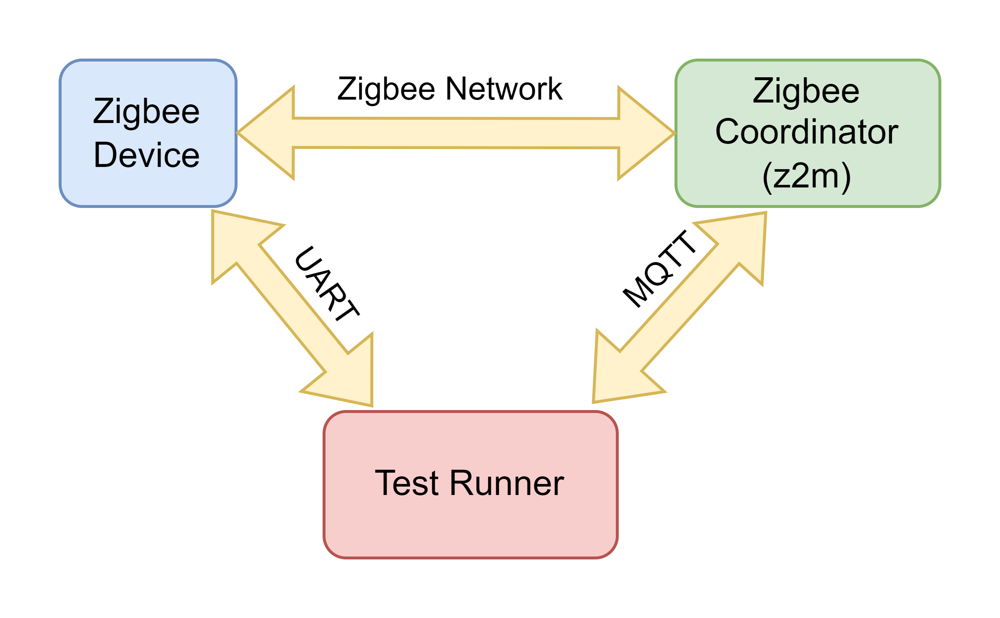
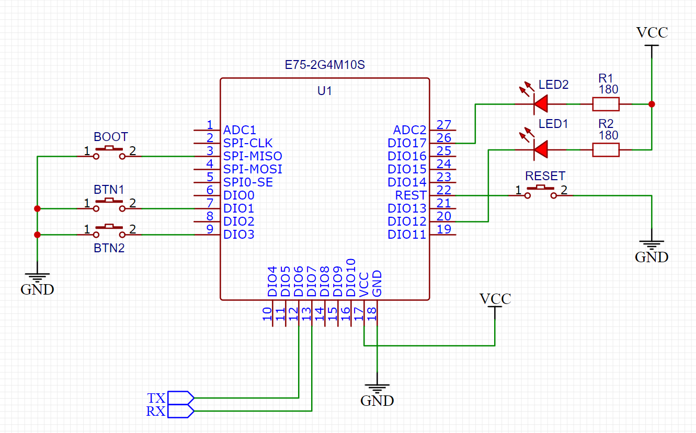

# Hello Zigbee World, Part 21 - Test Automation for Zigbee Device

Making changes to the code might mess up other things it does. This isn't a big deal for basic devices with only a few features – you can check them by hand pretty easily. But when the device gets fancier, testing all the ways it can be used takes more and more time. Sometimes, a feature stops working, and this is discovered only a few days later when a lot of changes are made on top of the breaking change. It can be really tough to figure out what caused the problem, and fixing it later on can be even harder.

I am a huge fan of automated testing. It's a way to keep the code in good shape without spending too much time checking everything manually. Some people might say it's tricky because we're dealing with a network device that talks to other devices on the network. Plus, everything happens at different times in this world, and the device works with the hardware parts. But I'm sure it's doable, and we can still test the main stuff automatically.

This is just another (though optional) part in the [Hello Zigbee series](part0_plan.md). The series shows how to make a Zigbee device's firmware right from the beginning. Like always, I'm using the code from the previous articles. And for the development board, I'm sticking with the [EBYTE E75–2G4M10S module with the NXP JN5169 microcontroller](part1_bring_up.md).

#  Testing approach

First, let's establish the testing approach. As I mentioned earlier, we're dealing with devices that communicate asynchronously on the Zigbee Network. Here's the setup we'll be relying on:
- The Zigbee network is managed by zigbee2mqtt.
- Our device under test is registered in the network with the predefined name, which is `my_test_switch`.

The core idea is to generate an event and check how the device responds to it. The tests themselves will run on a separate computer, capable of triggering these events and verifying their processing.



The testing computer is linked to the device through UART. It listens to the device log, scanning for lines that indicate the event has been processed. The testing computer can also instruct the device to generate events on its side (e.g., simulate a button press). In this scenario, we anticipate the device to transmit appropriate messages to the network.

Obviously, this testing approach doesn't cover the hardware aspects of the device, like polling a button or adjusting a specific PWM duty. These elements are still expected to be tested manually. Our focus is on ensuring that events initiated via UART match those generated by the hardware. For output events, such as adjusting the LED brightness level, we can control and validate them by identifying specific lines in the UART log.

The test suite typically comprises various test scenarios, roughly falling into the following categories:
- The device receives a network command and executes a corresponding action. This action might involve sending a logical response back to the network. It may also include performing a hardware action, such as toggling a light.
- The device reacts to a physical event, such as a button click or a change in temperature. Subsequently, the device transmits a signal to the network, indicating the occurrence of the physical event.

The network aspect of the device can be manipulated using MQTT. Zigbee2mqtt typically manages crucial network events and broadcasts messages to the MQTT topic. Through MQTT, we have the capability to instruct Zigbee2mqtt to send messages to the device, allowing us to control the network side of the device during testing.

In essence, this testing approach allows us to systematically evaluate how well the device responds to events in an asynchronous Zigbee network. The UART connection and event logging provide a way to automate and monitor the testing process, offering a balance between comprehensive testing and practicality. These test scenarios cover both the network-driven and physically-triggered aspects of the device's behavior. By utilizing MQTT, we can effectively interact with the Zigbee2mqtt network, simulate events, and validate the device's responses in a controlled testing environment.


# Sending network commands to the device

To develop my automated tests I typically use python and pytest framework. It allows creating tests and test frameworks in a very compact way. 

Let's start by making some preparations. To keep things flexible and avoid hardcoding, we'll establish a configuration file for our test framework. The recommended place for these parameters, according to pytest, is the `pytest.ini` file.

```ini
[pytest]
addopts = -rfeEsxXwa --verbose --showlocals
port = COM5
mqtt_server = 192.168.1.15
mqtt_port = 1883
device_mqtt_topic = zigbee2mqtt/my_test_switch
bridge_mqtt_topic = zigbee2mqtt/bridge
```

The `addopts` parameter embodies my preferred pytest command line options, which I typically employ when running tests. These options are enumerated in the .ini file, alleviating the need for manual input in the command line. The remaining parameters pertain to either my device or my Zigbee network.

To inform pytest about these new parameters we need to create a `conftest.py` file. This file, a specialized repository for common test settings and functions, facilitates the incorporation of our custom parameters into the pytest configuration. Upon initiation, the pytest framework will automatically invoke the `pytest_addoption()` function, seamlessly integrating our new parameters. Subsequently, these parameters become accessible within the test code.

```python
import pytest

def pytest_addoption(parser):
    parser.addini('port',               'COM port where the Zigbee Device is connected to')
    parser.addini('mqtt_server',        'IP or network name of the MQTT server')
    parser.addini('mqtt_port',          'MQTT server port')
    parser.addini('device_mqtt_topic',  'Base MQTT topic of the tested device')
    parser.addini('bridge_mqtt_topic',  'Base MQTT topic for the zigbee2mqtt instance')
```

Let’s also create a few helper classes. Our tests will communicate with the Zigbee network by posting messages to a certain MQTT topic

```python
import pytest
import paho.mqtt.client as mqtt

class ZigbeeNetwork():
    def __init__(self, options):
        self.client = mqtt.Client()
        self.client.connect(options.getini('mqtt_server'), int(options.getini('mqtt_port')))
        self.topic = options.getini('device_mqtt_topic')


    def publish(self, subtopic, message):
        topic = self.topic + '/' + subtopic
        print(f"Sending message to '{topic}'")
        self.client.publish(topic, message)


    def disconnect(self):
        self.client.disconnect()
```


This class handles the connection to the MQTT server, and provides a way to publish a message to an MQTT topic.

This class will be available to the tests in a form of fixture. Fixture is a beautiful way to make some initialization before the test, and finalization after.

```python
@pytest.fixture(scope="session")
def zigbee(pytestconfig):
    net = ZigbeeNetwork(pytestconfig)
    yield net
    net.disconnect()
```

The syntax may look odd for those who are not familiar with pytest fixtures, but it is very compact and clever. The part before the `yield` command is executed on start, and line after is executed when all tests are completed. This allows initialization and de-initialization code to be located close to each other, and even use the same local variables. The `scope="session"` line tells pytest to make a single Zigbee network connection for the whole test session, and close the connection before exit. The `pytestconfig` is a standard pytest fixture that provides access to the .ini file we created above.

The following class maintains the UART connection with the device.

```python
class ZigbeeDevice():
    def __init__(self, port):
        self._port = port


    def reset(self):
        self._port.dtr = True
        time.sleep(0.1)
        self._port.dtr = False

        self._port.reset_input_buffer()

        self.wait_str("vAppMain(): Starting the main loop")


    def wait_str(self, str, timeout=5):
        tstart = time.time()
        while True:
            if tstart + timeout < time.time():
                raise TimeoutError()

            line = self._port.readline().decode().rstrip()
            print("    " + line)
            if str in line:
                return
```

This code requires adding a 100n capacitor between the DTR pin of the UART converter and the Reset pin of the EBYTE module. 



With this addition I can twiddle the reset line right from the test code, and ensure that the state of the microcontroller is fresh and clean on each test. The reset procedure also clears the input buffer to ensure the new test is not using previous test data. The function also waits until the microcontroller is up and running the main loop.

Here are a few device related fixtures.

```python
@pytest.fixture(scope="session")
def port(pytestconfig):
    ser = serial.Serial(pytestconfig.getini("port"), baudrate=115200, timeout=1)
    ser.dtr = False # Release reset signal so that the device can boot
    yield ser


@pytest.fixture(scope="session")
def device_session(port):
    dev = ZigbeeDevice(port)
    yield dev


@pytest.fixture(scope="function")
def device(device_session):
    device_session.reset()
    yield device_session
```

The `port` fixture creates and initializes the UART port object, the other two are responsible for creating the ZigbeeDevice object. Pay attention to the `scope` parameter - `device_session` fixture will create and maintain a single ZigbeeDevice object for the whole test session, while the `device` fixture will reset this device before each test.

The main method of device testing involves initiating network events and examining the device log for a particular message that indicates normal event processing. Let's explore a simple test. Please note that `device` and `zigbee` are fixtures defined earlier. These fixtures will be executed before the test, and the objects they generate will be conveyed to the test as parameters.

```python
def test_on_off(device, zigbee):
    zigbee.publish('set', '{"state_button_2":"ON"}')
    device.wait_str("SwitchEndpoint EP=3: do state change 1")

    zigbee.publish('set', '{"state_button_2":"OFF"}')
    device.wait_str("SwitchEndpoint EP=3: do state change 0")
```

This test dispatches ON and OFF payloads to the `zigbee2mqtt/my_test_switch/set` topic (the payload structure is detailed in the [z2m documentation](https://www.zigbee2mqtt.io/devices/DLKZMK11LM.html#exposes)). Subsequently, zigbee2mqtt translates this request into a corresponding Zigbee network message, transmitting it to the switch device. The device, in turn, processes the On/Off command on the endpoint #3 (second button channel) and adjusts the LED to a new state.

It's valid to argue that the test examines the log message rather than the actual LED state, and that's accurate. However, let's take a look at the handler code for further clarification.


```cpp
void SwitchEndpoint::doStateChange(bool state)
{
    if(runsInServerMode())
    {
        DBG_vPrintf(TRUE, "SwitchEndpoint EP=%d: do state change %d\n", getEndpointId(), state);
        sOnOffServerCluster.bOnOff = state ? TRUE : FALSE;
        led.setState(state);
    }
}

class GPIOOutput : public GPIOPin
{
...
    void setState(bool value)
    {
        if(value)
            vAHI_DioSetOutput(pinMask, 0);
        else
            vAHI_DioSetOutput(0, pinMask);
    }
```

In this context, the `setState()` function straightforwardly adjusts a pin level. Given that this function has demonstrated robustness during manual testing, we can place confidence in its reliability. Consequently, the test can regard the log message as an authentic representation of a hardware pin change.


# Getting data from Zigbee

In the previous example, we triggered a network command from zigbee2mqtt to the device, examined some device logs, but we did not check the response from z2m. Let's augment the test to include the inspection of the network response.

First we need to extend the ZigbeeNetwork object to listen to the specified MQTT topic.

```python
class ZigbeeNetwork():
    def __init__(self, options):
        self.topic = options.getini('device_mqtt_topic')
        self.message_received = None

        self.client = mqtt.Client()
        self.client.on_message = self.on_message_received
        self.client.connect(options.getini('mqtt_server'), int(options.getini('mqtt_port')))


    def on_message_received(self, client, userdata, msg):
        print(f"Received message on topic {msg.topic}: {msg.payload.decode()}")
        self.message_received = msg.payload


    def get_topic(self, subtopic):
        if subtopic:
            return self.topic + '/' + subtopic
       
        return self.topic


    def subscribe(self, subtopic = ""):
        self.client.subscribe(self.get_topic(subtopic))
        self.message_received = None


    def publish(self, subtopic, message):
        topic = self.get_topic(subtopic)

        if isinstance(message, dict):
            message = json.dumps(message)

        print(f"Sending message to '{topic}': {message}")
        self.client.publish(topic, message)


    def wait_msg(self, timeout=5):
        start_time = time.time()

        while self.message_received is None:
            self.client.loop(timeout=1)

            elapsed_time = time.time() - start_time
            if elapsed_time > timeout:
                raise TimeoutError
       
        payload = self.message_received.decode()
        self.message_received = None
        return json.loads(payload)
```

The concept here involves subscribing to an MQTT topic using the `subscribe()` method and then running the MQTT client loop until a message directed to that topic is received, which is accomplished through the `wait_msg()` method. It's noteworthy that both the `publish()` and `wait_msg()` functions accept and return a dictionary, aligning well with the JSON format utilized in the payload.

Anticipating the recurrent use of the functionality to set the device state in multiple tests, it is pragmatic to encapsulate this code within a function. Additionally, the device exposes various options through our custom On/Off Switch Configuration Cluster. Surprisingly, both the modification of the device state and the adjustment of configuration options follow a similar process – accomplished by dispatching a `{"<attribute>": "<new_value>"}` JSON payload to the `<device base topic>/set` MQTT topic. Consequently, the setter function will be structured as follows.


```python
def set_device_attribute(device, zigbee, attribute, state, expected_response):
    # Make json payload like {"state_button_3", "ON"}
    payload = {attribute: state}

    # Prepare for waiting a zigbee2mqtt message on the default device topic
    zigbee.subscribe()

    # Publish the 'set state' command
    zigbee.publish('set', payload)

    # Verify that the device has received the state change command
    device.wait_str(expected_response)

    # Wait the reply from zigbee2mqtt with the device state
    return zigbee.wait_msg()[attribute]
```

The `subscribe()` function employs the default `""` subtopic to indicate that we will listen to the basic topic of the device - `zigbee2mqtt/my_test_switch`. This is where zigbee2mqtt publishes the device state.

It's crucial to note that we must subscribe to a topic _before_ dispatching the `set` message. This precaution is necessary to address the scenario where the response arrives between sending a `set` message and calling `zigbee.wait_msg()`.

Zigbee2mqtt transmits all device attributes as a JSON dictionary. In the test, we can verify that the requested attribute has the correct value.

The modified on/off test will be structured as follows:

```python
EP3_ON = "SwitchEndpoint EP=3: do state change 1"
EP3_OFF = "SwitchEndpoint EP=3: do state change 0"

def test_on_off(device, zigbee):    
    assert set_device_attribute(device, zigbee, 'state_button_2', 'ON', EP3_ON) == "ON"
    assert set_device_attribute(device, zigbee, 'state_button_2', 'OFF', EP3_OFF) == "OFF"
```

As you may recall, endpoint #0 is reserved for Zigbee communication, allowing the network to interact with the device as a whole. Endpoint #1, in my setup, accommodates general Zigbee clusters such as Basic and OTA. Meanwhile, endpoints #2 and #3 correspond to the left and right switch buttons. Interestingly, on the zigbee2mqtt side, these state variables on these endpoints are symbolically named as `button_1` and `button_2` (I acknowledge the slight inconsistency in numbering, but these names are purely symbolic and may potentially be renamed in the future).

Because setting various device states and options can produce different log messages, the specific message is determined on the test side and then passed to the `set_device_attribute()` function in the `expected_response` parameter.

# Getting data from device

In the previous test we depend on a default reply from zigbee2mqtt that includes the new device state. However, is there a method to directly inquire about the device's state value? Indeed, zigbee2mqtt provides the `get` topic for this purpose. Similar to the `set` function, the `get` function enables the retrieval of not only the device state but also other exposed attributes. Let's construct a helper function for this.


```python
def get_device_attribute(device, zigbee, attribute, expected_response):
    # Make json payload like {"state_button_2", ""}
    payload = {attribute: ""}

    # Prepare for waiting a zigbee2mqtt message on the default device topic
    zigbee.subscribe()

    # Request the device state
    zigbee.publish('get', payload)                      

    # Verify the device received read attribute command
    device.wait_str(expected_response)

    # Wait the reply from zigbee2mqtt with the device state
    return zigbee.wait_msg()[attribute]
```

Even though it closely resembles the setter, its purpose is to execute the `get` operation. Zigbee2mqtt will dispatch the `Read Attribute` command to the device, and the device, in turn, will reply with the `Read Attribute Response` message. The network response is then translated into an MQTT message and parsed within the function.

Let’s create something meaningful using the new function.

```python
EP3_SET_MODE = "ZCL Write Attribute: Cluster 0007 Attrib ff00"
EP3_GET_MODE = "ZCL Read Attribute: EP=3 Cluster=0007 Command=00 Attr=ff00"

@pytest.mark.parametrize("switch_mode", ["toggle", "momentary", "multifunction"])
def test_oosc_attribute_switch_mode(device, zigbee, switch_mode):
    assert set_device_attribute(device, zigbee, 'switch_mode_button_2', switch_mode, EP3_SET_MODE) == switch_mode
    assert get_device_attribute(device, zigbee, 'switch_mode_button_2', EP3_GET_MODE) == switch_mode
```

This test verifies that the setter and getter correctly process all possible values for the `switch_mode` parameter. Although this test looks very simple and somewhat synthetic, surprisingly it helped to catch a copy-paste mistake in the z2m converter.

It's important to ensure test robustness, no matter what actions or tests came before. Both `set` and `get` commands produce the same MQTT state message. While it might seem okay to skip listening for the MQTT response in the setter, doing so could lead to issues. The next `get` command might capture the response from a previous `set`, giving an incorrect value. Therefore, the setter must listen to the response, regardless of whether it's actively used or not. This especially gets important when there are multiple get and set commands co-exist in a single test.

Note another nice feature of pytest - test parametrization. It allows running the same test for different values listed in the parametrize line. In a similar way it is possible to test other OOSC attributes.

Let's formulate another test that utilizes the `get` function. One of the device’s features is to store settings in the EEPROM so that these settings are actual after reboot. Let’s make a test that verifies that OOSC cluster settings survive on device reset.

```python
EP3_SET_RELAY_MODE = "ZCL Write Attribute: Cluster 0007 Attrib ff01"
EP3_GET_RELAY_MODE = "ZCL Read Attribute: EP=3 Cluster=0007 Command=00 Attr=ff01"
EP3_SET_MAX_PAUSE = "ZCL Write Attribute: Cluster 0007 Attrib ff02"
EP3_GET_MAX_PAUSE = "ZCL Read Attribute: EP=3 Cluster=0007 Command=00 Attr=ff02"
EP3_SET_MIN_LONG_PRESS = "ZCL Write Attribute: Cluster 0007 Attrib ff03"
EP3_GET_MIN_LONG_PRESS = "ZCL Read Attribute: EP=3 Cluster=0007 Command=00 Attr=ff03"
EP3_SET_LONG_PRESS_MODE = "ZCL Write Attribute: Cluster 0007 Attrib ff04"
EP3_GET_LONG_PRESS_MODE = "ZCL Read Attribute: EP=3 Cluster=0007 Command=00 Attr=ff04"

def test_oosc_attributes_survive_reboot(device, zigbee):
    # Set a specific OOSC options
    assert set_device_attribute(device, zigbee, 'switch_mode_button_2', "multifunction", EP3_SET_MODE) == "multifunction"
    assert set_device_attribute(device, zigbee, 'relay_mode_button_2', "double", EP3_SET_RELAY_MODE) == "double"
    assert set_device_attribute(device, zigbee, 'long_press_mode_button_2', "levelCtrlUp", EP3_SET_LONG_PRESS_MODE) == "levelCtrlUp"
    assert set_device_attribute(device, zigbee, 'max_pause_button_2', "152", EP3_SET_MAX_PAUSE) == "152"
    assert set_device_attribute(device, zigbee, 'min_long_press_button_2', "602", EP3_SET_MIN_LONG_PRESS) == "602"

    # Reset the device
    device.reset()

    # Expect the OOSC settings survive the reboot
    assert get_device_attribute(device, zigbee, 'switch_mode_button_2', EP3_GET_MODE) == "multifunction"
    assert get_device_attribute(device, zigbee, 'relay_mode_button_2', EP3_GET_RELAY_MODE) == "double"
    assert get_device_attribute(device, zigbee, 'long_press_mode_button_2', EP3_GET_LONG_PRESS_MODE) == "levelCtrlUp"
    assert get_device_attribute(device, zigbee, 'max_pause_button_2', EP3_GET_MAX_PAUSE) == 152
    assert get_device_attribute(device, zigbee, 'min_long_press_button_2', EP3_GET_MIN_LONG_PRESS) == 602
```

This test is pretty straightforward. It sets some of the OOSC cluster settings, resets the device, and verifies that settings are still correct.


# Generating device side events

Up to this point, we've been generating events through zigbee2mqtt and examining the device's response. Now, let's reverse the scenario - induce an event on the device and observe how zigbee2mqtt manages it.

The device is presently linked to the computer via UART, primarily utilized for logging data from the device. However, we can leverage the opposite direction to dispatch commands to the device and request emulation of a hardware event, such as pressing a button.

To achieve this, let's create a device side class responsible for reading UART, accumulating string commands in its buffer.

```cpp
class DebugInput
{
    static const int BUF_SIZE = 32;
    char buf[BUF_SIZE];
    char * ptr;
    bool hasData;

public:
    DebugInput()
    {
        reset();
    }

    void handleDebugInput()
    {
        // Avoid buffer overrun
        if(ptr >= buf + BUF_SIZE)
            return;

        // Receive the next symbol, if any
        while(u16AHI_UartReadRxFifoLevel(E_AHI_UART_0) > 0)
        {
            char ch;
            u16AHI_UartBlockReadData(E_AHI_UART_0, (uint8*)&ch, 1);

            if(ch == '\r' || ch == '\n')
            {
                *ptr = 0;
                hasData = true;
            }
            else
                *ptr = ch;

            ptr++;
        }
    }

    bool hasCompletedLine() const
    {
        return hasData;
    }

    bool matchCommand(const char * command) const
    {
        int len = strlen(command);
        if(strncmp(command, buf, len) == 0 && buf[len] == 0)
            return true;

        return false;
    }

    void reset()
    {
        ptr = buf;
        hasData = false;
    }
};
```

While it might be possible to employ UART interrupts for receiving data, opting for a polling approach by periodically invoking the `handleDebugInput()` function proved simpler. The UART functions come equipped with their internal FIFO buffer, ensuring that no data is overlooked even if characters are not read fast enough.

The `handleDebugInput()` function retrieves the next character from the UART (if available) and stores it in the buffer. The `matchCommand()` function serves to compare the received command with the one provided.

Here's how it is utilized in the main function.


```cpp
extern "C" PUBLIC void vAppMain(void)
{
...
    // Initialize UART
    DBG_vUartInit(DBG_E_UART_0, DBG_E_UART_BAUD_RATE_115200);
    DebugInput debugInput;
...
    DBG_vPrintf(TRUE, "\nvAppMain(): Starting the main loop\n");
    while(1)
    {
...
        APP_vHandleDebugInput(debugInput);
...
```

The `APP_vHandleDebugInput()` function is tasked with comparing received commands and carrying out corresponding actions. We'll define `BTN1_PRESS` and `BTN2_PRESS` to simulate the respective button presses, along with the corresponding `BTN*_RELEASE` commands to mimic button releases.


```cpp
PRIVATE void APP_vHandleDebugInput(DebugInput & debugInput)
{
    debugInput.handleDebugInput();
    if(debugInput.hasCompletedLine())
    {
        if(debugInput.matchCommand("BTN1_PRESS"))
        {
            DBG_vPrintf(TRUE, "Matched BTN1_PRESS\n");
            ButtonsTask::getInstance()->setButtonsOverride(SWITCH1_BTN_MASK);
        }

        if(debugInput.matchCommand("BTN2_PRESS"))
        {
            DBG_vPrintf(TRUE, "Matched BTN2_PRESS\n");
            ButtonsTask::getInstance()->setButtonsOverride(SWITCH2_BTN_MASK);
        }

        if(debugInput.matchCommand("BTN1_RELEASE") || debugInput.matchCommand("BTN2_RELEASE"))
        {
            DBG_vPrintf(TRUE, "Matched BTNx_RELEASE\n");
            ButtonsTask::getInstance()->setButtonsOverride(0);
        }

        debugInput.reset();
    }
}
```

As mentioned earlier, commands received over the UART will simulate specific hardware events, in this case, emulating a button press. In my design, buttons are polled using the `ButtonTask` periodic function, and it's straightforward to substitute the actual value read from the pin with the emulated one.


```cpp
void ButtonsTask::setButtonsOverride(uint32 override)
{
    buttonsOverride = override;
}

void ButtonsTask::timerCallback()
{
    uint32 input = u32AHI_DioReadInput();
    input &= ~buttonsOverride;
...
```

Negating the `buttonsOverride` value is necessary because a pressed button actually produces a low level on the pin. Applying the emulated value alongside `u32AHI_DioReadInput()` ensures that the subsequent code processes the emulated value in the same manner as it would handle a real button press.

On the testing side, we need to instruct the ZigbeeDevice class to dispatch commands to the device.

```python
class ZigbeeDevice():
...
    def send_str(self, str):
        print(f"Sending UART command: {str}")
        self._port.write((str + '\n').encode())
        self._port.flush()
```

Upon the button press, we anticipate the device to transmit a message to the coordinator. Zigbee2mqtt will translate this network event into a device MQTT message, which we will handle in the test. The attribute's value is parsed from the message and returned to the test.

Now, let's delve into the most intriguing part - the test itself.


```python
def test_btn_press(device, zigbee):
    # Ensure the switch is off on start, and the mode is 'toggle'
    assert set_device_attribute(device, zigbee, 'state_button_2', 'OFF', EP3_OFF) == "OFF"
    assert set_device_attribute(device, zigbee, 'switch_mode_button_2', "toggle", EP3_SET_MODE) == "toggle"

    zigbee.subscribe()

    # Emulate short button press
    device.send_str("BTN2_PRESS")
    device.wait_str("Switching button 3 state to PRESSED1")

    # In the toggle mode the switch is triggered immediately on button press
    device.wait_str(EP3_ON)

    # Release the button
    time.sleep(0.1)
    device.send_str("BTN2_RELEASE")
    device.wait_str("Switching button 3 state to IDLE")

    # Check the device state changed, and the action is generated (in this particular order)
    assert zigbee.wait_msg()['action'] == "single_button_2"
    assert zigbee.wait_msg()['state_button_2'] == "ON"
```

The behavior of the smart switch is more intricate than it might seem initially. As a reminder, the device operates a [button-handling state machine](part16_multistate_action.md) that functions differently based on the current switch mode selected. Since the test addresses a specific scenario, we must ensure the device is in the correct state for this scenario - switch is `OFF`, and the mode is `toggle`.

In the `toggle` mode, the switch detects the button press and promptly alters the state of the relay switch. This is why we need to check for the switch mode change immediately after the button press. The device doesn't wait for the button release to modify the LED state.

The button release event doesn't trigger any actions. We just ensure that the button state machine returns to the IDLE state.

The expected behavior on the button press involves not only toggling the LED state but also dispatching a network message to the coordinator. Additionally, the switch implements not only an On/Off state change signal but also a `single press` event using the Multistate input cluster. This network signal is converted to the `action` field by zigbee2mqtt. Both events are transmitted to MQTT as attribute state messages.

Now, let's test a more complex scenario. The `multifunction` mode of my switch allows assigning a toggle action to a double click.


```python
def test_double_click(device, zigbee):
    # Ensure the switch is off on start, the mode is 'multifunction', and relay mode is 'double'
    assert set_device_attribute(device, zigbee, 'state_button_2', 'OFF', EP3_OFF) == "OFF"
    assert set_device_attribute(device, zigbee, 'switch_mode_button_2', "multifunction", EP3_SET_MODE) == "multifunction"
    assert set_device_attribute(device, zigbee, 'relay_mode_button_2', "double", EP3_SET_RELAY_MODE) == "double"

    zigbee.subscribe()

    # Emulate the first click
    device.send_str("BTN2_PRESS")
    device.wait_str("Switching button 3 state to PRESSED1")
    time.sleep(0.1)
    device.send_str("BTN2_RELEASE")
    device.wait_str("Switching button 3 state to PAUSE1")

    # Emulate the second click
    device.send_str("BTN2_PRESS")
    device.wait_str("Switching button 3 state to PRESSED2")
    time.sleep(0.1)
    device.send_str("BTN2_RELEASE")
    device.wait_str("Switching button 3 state to PAUSE2")

    # We expect the LED to toggle after the second button click
    device.wait_str(EP3_ON)

    # Check the device state changed, and the double click action is generated
    assert zigbee.wait_msg()['action'] == "double_button_2"
    assert zigbee.wait_msg()['state_button_2'] == "ON"
```

The test verifies that the multifunction mode state machine adheres to the IDLE -> PRESSED1 -> PAUSE1 -> PRESSED2 -> PAUSE2 path. Following a pause, the device recognizes this sequence as a double click, generating corresponding network events - a double click action via the Multistate input cluster and a state change via the On/Off cluster.

# Interaction with other devices

In the previous sections, our smart switch functioned as a standalone device, managing On/Off commands from the network or generating network events when the user pressed a button. In these scenarios, only the device and the coordinator were involved, allowing the test to control both.

However, the ultimate objective of the smart switch is to command other devices, such as lights or shades. In the [preceding article](part19_level_control.md), we implemented the control of a dimmable light by dispatching LevelControl cluster commands directly to the bound light.

Can we establish a setup with our switch and a light under test? Yes, we can. The following scenario is achievable:
- The switch is bound with a light.
- Upon a button press, the switch generates a LevelControl cluster command.
- The command is automatically forwarded to the bound device (the light).
- The light acknowledges this command and reports a new state to the coordinator.
- Zigbee2mqtt transforms this event into an MQTT state message, controllable in the test.

Implementing this test scenario is feasible, but it comes with several challenges:
- The switch sends a direct message to the light, which we don't control in our test, making it challenging to verify the message's correctness.
- There's no guarantee that the light will process the message correctly.
- Tests will require the exact same light for the test setup, limiting the audience who can run these tests.

Fortunately, there's a more controlled approach - we can designate our zigbee2mqtt coordinator as the target device for level control messages. Additionally, we can instruct Zigbee2mqtt on how to process these messages by crafting an additional external converter.

```js
const fromZigbee_LevelCtrl = {
    cluster: 'genLevelCtrl',
    type: ['commandMoveToLevel', 'commandMoveToLevelWithOnOff', 'commandMove', 'commandMoveWithOnOff',
           'commandStop', 'commandStopWithOnOff', 'commandStep', 'commandStepWithOnOff'],

    convert: (model, msg, publish, options, meta) => {
        const cmd = msg['type'];
        const payload = msg['data'];

        const result = {level_ctrl: {command: cmd, payload: payload}};
        return result;
    },
}
...
const device = {
...
    fromZigbee: [..., fromZigbee_LevelCtrl],
```

The purpose of this code is to capture everything originating from the switch via the `genLevelCtrl` cluster and store it in the device's state under the `level_ctrl` field. Zigbee2mqtt will automatically broadcast a state update to MQTT, allowing us to handle it from the test.

Additionally, our test scenario requires binding our device to the Coordinator. Although the use case may seem somewhat contrived, this ensures that our device generates bound messages that we aim to validate.

To bind the device, we need to dispatch a bind request to the `zigbee2mqtt/bridge/request/device/bind` topic. Let's enhance the ZigbeeNetwork class to facilitate sending messages to the Zigbee2mqtt bridge.

```python
class ZigbeeNetwork():
    def __init__(self, options):
        ...
        self.z2m_topic = options.getini('bridge_mqtt_topic')


    def get_topic(self, subtopic, bridge=False):
        if bridge:
            return self.z2m_topic + '/' + subtopic

        if subtopic:
            return self.topic + '/' + subtopic
       
        return self.topic


    def publish(self, subtopic, message, bridge=False):
        topic = self.get_topic(subtopic, bridge)

        if isinstance(message, dict):
            message = json.dumps(message)

        print(f"Sending message to '{topic}': {message}")
        self.client.publish(topic, message)
```

The binding helper function:

```python
def send_bind_request(zigbee, clusters, src, dst):
    # clusters attribute must be a list
    if isinstance(clusters, str):
        clusters = [clusters]

    # Send the bind request
    payload = {"clusters": clusters, "from": src, "to": dst}
    zigbee.publish('request/device/bind', payload, bridge=True)

```

So, here is the test.

```python
def test_level_control(device, zigbee):
    # Bind the endpoint with the coordinator
    send_bind_request(zigbee, "genLevelCtrl", "my_test_switch/3", "Coordinator")
   
    # Ensure the switch will generate levelCtrlDown messages on long press
    assert set_device_attribute(device, zigbee, 'switch_mode_button_2', "multifunction", EP3_SET_MODE) == "multifunction"
    assert set_device_attribute(device, zigbee, 'relay_mode_button_2', "unlinked", EP3_SET_RELAY_MODE) == "unlinked"
    assert set_device_attribute(device, zigbee, 'long_press_mode_button_2', "levelCtrlDown", EP3_SET_LONG_PRESS_MODE) == "levelCtrlDown"

    zigbee.subscribe()

    # Emulate the long button press, wait until the switch transits to the long press state
    device.send_str("BTN2_PRESS")
    device.wait_str("Switching button 3 state to PRESSED1")
    device.wait_str("Switching button 3 state to LONG_PRESS")
    device.wait_str("Reporting multistate action EP=3 value=255... status: 00")
    device.wait_str("Sending Level Control Move command status: 00")

    # Verify the Level Control Move command has been received by the coordinator
    assert zigbee.wait_msg()['action'] == "hold_button_2"
    assert zigbee.wait_msg()['level_ctrl'] == {'command': 'commandMove', 'payload': {'movemode': 1, 'rate': 80}}

    # Do not forget to release the button
    device.send_str("BTN2_RELEASE")
    device.wait_str("Switching button 3 state to IDLE")
    device.wait_str("Reporting multistate action EP=3 value=0... status: 00")
    device.wait_str("Sending Level Control Stop command status: 00")

    # Verify the Level Control Move command has been received by the coordinator
    assert zigbee.wait_msg()['action'] == "release_button_2"
    assert zigbee.wait_msg()['level_ctrl']['command'] == 'commandStop'
```

Initially, we need to bind our device to a Coordinator, specifically the `genLevelCtrl` cluster that our device can generate. The Coordinator will capture these LevelCtrl messages, allowing us to retrieve the information.

As described in the [LevelCtrl article](part19_level_control.md), the device will transmit LevelCtrl messages upon a long button press. Additionally, the button must be configured in `multifunction` mode, with the action set to one of the level control actions.

During a long press, the device will generate the `hold_button_2` action, and more importantly for this test, the genLevelCtrl Change Level (Move) command. Our converter code will receive this command and store it in the `level_ctrl` field. The test can inspect the payload of the command and verify that the data precisely matches what we sent.

Upon button release, the device generates `release_button_2` action, and genLevelCtrl Stop Move command with no payload.


# Running tests for both button channels

In the preceding examples, we focused on a single button channel. However, to ensure a comprehensive test suite, it is essential to cover both button channels implemented in the device. Instead of duplicating all tests, the pytest framework offers a parameterization feature, which we are already acquainted with.

However, a challenge arises. Different button channels use distinct Zigbee2mqtt names, endpoint numbers, button IDs, and so on. These details frequently appear in device logs and MQTT messages. Tests might become cluttered if these strings are constructed and parameterized within each test.

Fortunately, a solution exists to encapsulate this complexity within a helper test harness object. This object can handle all endpoint-dependent elements internally, providing a simplified interface.


```python
class SmartSwitch:
    def __init__(self, device, zigbee, ep, z2m_name):
        # Remember parameters for further use
        self.device = device
        self.zigbee = zigbee
        self.ep = ep
        self.button = ep-1
        self.z2m_name = z2m_name

        # Most of the tests will require device state MQTT messages. Subscribe for them
        self.zigbee.subscribe()


    def reset(self):
        self.device.reset()


    def get_state_change_msg(self, expected_state):
        return f"SwitchEndpoint EP={self.ep}: do state change {1 if expected_state else 0}"


    def switch(self, cmd, expected_state):
        msg = self.get_state_change_msg(expected_state)
        return set_device_attribute(self.device, self.zigbee, 'state_'+self.z2m_name, cmd, msg)


    def get_state(self):
        msg = f"ZCL Read Attribute: EP={ep} Cluster=0006 Command=00 Attr=0000"
        return get_device_attribute(self.device, self.zigbee, 'state_'+self.z2m_name, msg)


    def wait_state_change_msg(self, expected_state):
        msg = self.get_state_change_msg(expected_state)
        self.device.wait_str(msg)
```

Technically, there's nothing new here, all these routines are detailed above. They are simply encapsulated within a class to reduce the number of parameters exposed by a function. Other functions, such as getting/setting OOSC attributes, simulating button presses/releases, searching for multistate report messages, and so on, are implemented in a similar fashion.

Now, let's explore a particularly useful feature - fixture parameterization.


```python
# Make each test that uses switch fixture to run twice for both buttons.
# Using the ids parameter the button name will be displayed as a test parameter
@pytest.fixture(params = [(2, "button_1"), (3, "button_2")], ids=lambda x: x[1])
def switch(device, zigbee, request):
    return SmartSwitch(device, zigbee, request.param[0], request.param[1])
```

This fixture creates a SmartSwitch object. Moreover, each test that is using the `switch` fixture will be executed twice - one for first button channel (endpoint #2, zigbee2mqtt name `button_1`), and another for the second button channel (endpoint #3, zigbee2mqtt name `button_2`). The `ids` parameter is used to display button names in the test execution log.

The tests get simpler - all the string matching logic is moved to the SmartSwitch object, while the test is focusing only on the test scenario.

```python
def test_btn_press(switch):
    # Ensure the switch is off on start, and the mode is 'toggle'
    assert switch.switch('OFF', False) == 'OFF'
    assert switch.set_attribute('switch_mode', 'toggle') == 'toggle'

    # Emulate short button press
    switch.press_button()
    switch.wait_button_state("PRESSED1")

    # In the toggle mode the switch is triggered immediately on button press
    switch.wait_state_change_msg(True)

    # Release the button
    switch.release_button()
    switch.wait_button_state("IDLE")

    # Check the device state changed, and the action is generated (in this particular order)
    assert switch.wait_zigbee_state()['action'] == "single_" + switch.z2m_name
    assert switch.wait_zigbee_state()['state_' + switch.z2m_name] == "ON"
```

# Summary

That concludes this article. As demonstrated, automated testing of network devices is not an insurmountable task and can be established relatively easily. Using this approach, tests can verify how the device responds to network commands and generate device-side events transmitted to the network.

The article outlines a general approach to developing automated tests. Now, the next step is to write numerous tests covering all the implemented functionality. The test suite will be extended as the switch functionality is expected to grow.

Regarding the limitations of the proposed approach, it's easier to validate that the system is doing expected things but challenging to ensure that it is NOT doing something. It's uncertain whether a checked event was not generated or simply delayed. Fortunately, the goal is not to cover every possibility with tests. Instead, the test suite should be comprehensive enough to detect breaking changes.

# Links
- Documents
  - [JN-UG-3087 JN516x Integrated Peripherals API User Guide](https://www.nxp.com/docs/en/user-guide/JN-UG-3087.pdf)
  - [ZigBee Class Library specification](https://zigbeealliance.org/wp-content/uploads/2019/12/07-5123-06-zigbee-cluster-library-specification.pdf)
  - [How to support new device in zigbee2mqtt](https://www.zigbee2mqtt.io/advanced/support-new-devices/01_support_new_devices.html)
- Code
  - [Project on github](https://github.com/grafalex82/hellozigbee/tree/hellozigbee_auto_tests)


