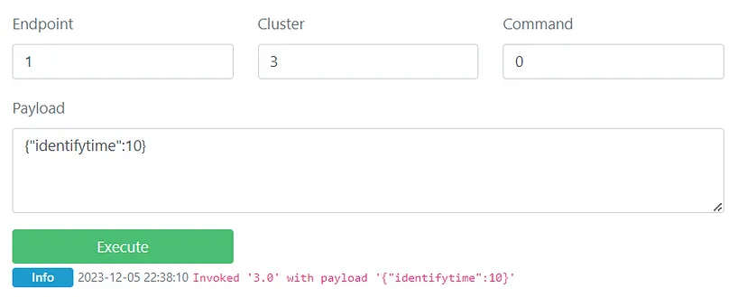
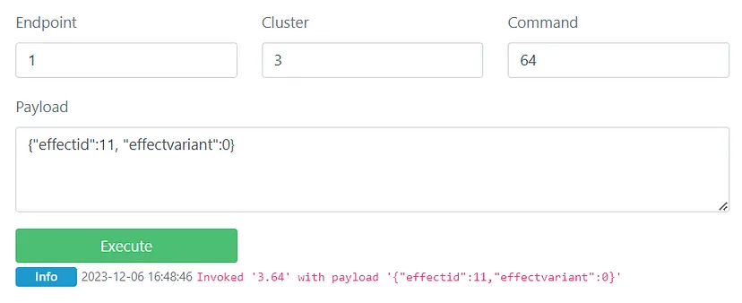

# Hello Zigbee World, Part 22 - Identify Cluster

Sometimes, you might need to identify one specific Zigbee device from a group of similar ones. Imagine you have several identical ceiling spotlights, and you want to control just one zone individually. It's tricky to match each device's ID with the right light on the ceiling, especially if it's already installed and connected to other devices. Here, the Identify cluster comes in handy. By sending an identification request to the device, it will start blinking to show which one it is.

The Identify cluster is also useful when linking devices, like pairing a light with a control button. This is common with some products, like those from IKEA, where you don't need the Coordinator. You just do things like press buttons or switch the light on and off to connect them. But how do you know if you've linked the right devices? The Identify cluster helps by making the light show special signals, like a pulsing glow to show it's ready to pair, and a double blink to confirm a successful link.

Even though these examples might seem a bit unusual or not too crucial, having an Identify cluster is required for all Zigbee devices according to Zigbee standards. In this article, we'll explore the Identify cluster more.

Remember, in [this series of articles](part0_plan.md), I'm working on creating custom firmware for a Xiaomi Zigbee smart switch. This device uses the NXP JN5169 microcontroller, and it's built on the [EBYTE E75–2G4M10S module](part1_bring_up.md). We're using the infrastructure and code developed in earlier articles.

# Explore the Identify cluster

As usual, let's start by looking at the documentation to understand how the Identify cluster functions. Apart from the Find-and-Bind situations, which we'll examine later, the Identify cluster essentially involves a set of commands that activate visual effects on the chosen device.

Now, let's experiment with the Identify cluster. We'll use the Development Console tab found on the page for a light device. For this demonstration, I'll be using my IKEA light.



Command #0 is known as the Identify command. It uses the `identifytime` parameter to determine how long the device should identify itself. According to the ZCL (Zigbee Cluster Library) specifications, this usually involves a flashing light effect that happens every 0.5 seconds. For an IKEA light, using this command will cause the light to gradually pulsate. We can set the duration for this identification effect, like 10 seconds, for example.

There's also another command called the Trigger Effect command. Its code is 64, or in hexadecimal, 0x40. This command is used to start a chosen effect or to stop an effect that was previously activated.



The specifications suggest several effects that can be implemented using the Identify cluster:
- **Blink** (0): The light turns on and off once.
- **Breathe** (1): The light turns on and off over 1 second, repeated 15 times.
- **Okay** (2): For colored lights, it turns green for 1 second; non-colored lights flash twice. This effect can indicate a successful request to the device, like confirming a successful binding.
- **Channel Change** (11): Colored lights turn orange for 8 seconds; non-colored lights go to maximum brightness for 0.5 seconds and then to minimum brightness for 7.5 seconds.

These are just recommendations, and actual implementation can vary. For example, IKEA lights use a gradual change in brightness for the Breathe effect, alternating between bright and dim levels approximately every 2 seconds. The Channel Change effect involves switching between full and minimum brightness for 0.5 seconds before returning to the normal state.

The `effectid` parameter can include two special values:	

- 254 (0xfe): This value ends the effect after the current breathe cycle.
- 255 (0xff): This value stops the effect as soon as possible.

Interestingly, the Identify cluster isn't limited to light devices. It's a mandatory feature for other devices too, as per the Zigbee Light Link (ZLL) specification. For instance, the IKEA TRADFRI button and the Tuya Smart Knob also have the Identify cluster, using their onboard LED for effects. Note that these devices need to be activated (like by pressing a button) to receive the Identify command. However, non-light devices may not fully support all these effects. The Tuya knob, for example, only implements the Identify command without additional effects, whereas IKEA knobs may only support double-blink and breath effects.

# Schematics update

In this series, while we are exploring various Zigbee topics, our main objective is to develop alternative firmware for the 2019 Xiaomi Aqara switch, one of the earliest versions of their smart switches. This double-gang switch is equipped with four LEDs, featuring one red and one blue LED for each of its two channels.

In the new schematics I've created, we also use four LEDs, but the pin connections differ. Remember, the JN5169 microcontroller has five PWM (Pulse Width Modulation) channels assigned to specific pins. In my schematic, all four LEDs are connected to these PWM pins. However, this differs from the original Xiaomi design, where only the blue LEDs are connected to PWM pins, and the red LEDs are connected to regular pins.

Additionally, I've incorporated a fifth LED into the schematic. This LED serves as a heartbeat indicator: if it's blinking, it means the device is functioning properly and hasn't frozen.


Apart from these changes in LEDs and pin assignments, the overall schematic remains largely unchanged from the original design.

It seems that by default, UART0, which is used for flashing and debugging, operates in a 4-wire mode. In this mode, the DIO4 pin is utilized as a UART0 CTS signal. However, if we want to use this pin in GPIO mode, which is necessary for operating the heartbeat LED, we need to change the configuration of UART0 to a 2-wire mode.


```cpp
    // Initialize UART
    vAHI_UartSetRTSCTS(E_AHI_UART_0, FALSE);
    DBG_vUartInit(DBG_E_UART_0, DBG_E_UART_BAUD_RATE_115200);
```


# LED handler state machine

The Identify functionality is closely linked to different LED indicators. To manage this efficiently, let's develop a helper class dedicated to controlling a single LED. This class will enable us to set a specific brightness level for the LED and also allow for smooth transitions between different brightness levels. To handle these changes in LED states effectively, we'll employ a straightforward state machine within the class.

This approach will provide a structured and flexible way to control LED behavior, especially in response to various Identify cluster commands. By using a state machine, the class can easily switch between different states, like increasing brightness, decreasing brightness, or maintaining a steady brightness level, depending on the specific requirements of the Identify functionality.

```cpp
class LEDHandler
{
    PWMPin pin;             // The Pin object where the LED is connected
    uint8 curLevel;         // Currently active brightness level (changes gradually on setting new brightness)
    uint8 targetLevel;      // Target brightness level while gradually increasing/decreasing brightness
    uint8 idleLevel;        // Selected brightness level when no effect active
    uint8 increment;        // Increment/decrement step when gradually changing brightness
    uint8 pauseCycles;      // Number of cycles to wait before switching to IDLE state

    enum HandlerState
    {
        STATE_IDLE,
        STATE_INCREMENTING,
        STATE_DECREMENTING,
        STATE_PAUSE
    };

    HandlerState handlerState;


public:
    LEDHandler();
    void init(uint8 timer);
    void update();

protected:
    void handleStateMachine();
    void handleStateIncrementing();
    void handleStateDecrementing();
    void handleStatePause();

    void moveToLevel(uint8 target, uint8 step);
    void pause(uint8 cycles);
```

As you remember, the JN5169 microcontroller firmware cannot run static object constructors, so initialization has to be performed by calling an explicit initialization function.

```cpp
void LEDHandler::init(uint8 timer)
{
    pin.init(timer);
    idleLevel = 0;
    curLevel = 0;
    targetLevel = 0;
    increment = 0;

    handlerState = STATE_IDLE;
}
```

The state machine we're using is quite straightforward. It's designed to smoothly increase or decrease the brightness of the LED. One of the states in this machine is the 'pause' state, which acts as a delay timer. This will be particularly useful for creating timed visual effects with the LED.

The key difference between the 'pause' and 'idle' states is that the 'pause' state has a specific duration, whereas the 'idle' state is indefinite. In other words, when the LED is in the 'pause' state, it waits for a set amount of time before transitioning to another state. 

On the other hand, the 'idle' state indicates that the LED is not actively transitioning or pausing. The 'idle' state also serves as a marker to signal that a current pause or transition has completed. This helps in managing the transitions between different states effectively, ensuring the LED behaves as expected according to the commands received.

```cpp
void LEDHandler::handleStateIncrementing()
{
    int level = (int)curLevel + (int)increment;

    if(level > targetLevel)
        level = targetLevel;

    if(level > 255)
        level = 255;

    if(level == targetLevel)
        handlerState = STATE_IDLE;

    curLevel = (uint8)level;
    pin.setLevel(curLevel);
}


void LEDHandler::handleStateDecrementing()
{
    int level = (int)curLevel - (int)increment;

    if(level < 0)
        level = 0;

    if(level < targetLevel)
        level = targetLevel;

    if(level == targetLevel)
        handlerState = STATE_IDLE;

    curLevel = (uint8)level;
    pin.setLevel(curLevel);
}

void LEDHandler::handleStatePause()
{
    pauseCycles--;
    if(pauseCycles == 0)
        handlerState = STATE_IDLE;
}

void LEDHandler::handleStateMachine()
{
    switch(handlerState)
    {
        case STATE_INCREMENTING:
            handleStateIncrementing();
            break;

        case STATE_DECREMENTING:
            handleStateDecrementing();
            break;

        case STATE_PAUSE:
            handleStatePause();
            break;

        case STATE_IDLE:
        default:
            break;
    }
}
```

Here is the internal API for switching the LEDHandler to a specific state.

```cpp
void LEDHandler::moveToLevel(uint8 target, uint8 step)
{
    targetLevel = target;
    increment = step;
    handlerState = curLevel < targetLevel ? STATE_INCREMENTING : STATE_DECREMENTING;
}

void LEDHandler::pause(uint8 cycles)
{
    pauseCycles = cycles;
    handlerState = STATE_PAUSE;
}
```

The class we've designed is versatile, going beyond just managing simple transitions in brightness. It's also equipped to execute visual effects by interpreting a straightforward program. 

This program consists of a sequence of instructions, with each instruction capable of having up to two parameters. The set of instructions includes those for setting or adjusting the brightness level, along with control instructions for looping the execution. It's important that each program concludes with the Stop instruction, ensuring a defined end to the sequence.

```cpp
enum LEDProgramCommand
{
    LED_CMD_STOP,               // no params
    LED_CMD_MOVE_TO_LEVEL,      // param1 - target level, param2 - brightness increment per 50 ms
    LED_CMD_PAUSE,              // param1 - pause duration (in 50ms quants)
    LED_CMD_REPEAT              // param1 - target program index, param2 - number of iterations
};

struct LEDProgramEntry
{
    LEDProgramCommand command;
    uint8 param1;
    uint8 param2;
};
```

Let’s make the program interpreter.

```cpp
class LEDHandler
{
...
    const LEDProgramEntry * programPtr; // Pointer to the currently executed effect program, or NULL of no effect selected
    uint8 programIterations;            // Number of program iterations executed (used for LED_CMD_REPEAT command)
...

void LEDHandler::handleProgramCommand()
{
    LEDProgramEntry command = *programPtr;
    programPtr++;

    switch(command.command)
    {
        // Schedule gradual movement to desired level (up or down)
        case LED_CMD_MOVE_TO_LEVEL:
            moveToLevel(command.param1, command.param2);
            break;

        // Schedule a short pause
        case LED_CMD_PAUSE:
            pause(command.param1);
            break;

        // Repeat few previous commands (number is in param1), until iterations counter matches param2
        case LED_CMD_REPEAT:
            programIterations++;

            if(programIterations >= command.param2)
                break;

            programPtr -= (command.param1 + 1);
            break;

        // Abandon program, transit to idle level
        case LED_CMD_STOP:  
            programPtr = NULL;
            moveToLevel(idleLevel, 10);
            break;

        default:
            break;
    }
}
```

The REPEAT command lets us run multiple program instructions repeatedly in a loop until the `programIterations` counter reaches a set number. On the other hand, the STOP command ends the current program and returns the LED to its last chosen brightness level.

An external source triggers the `update()` function every 50 milliseconds. This regular timing enables the LED brightness to change smoothly in small steps and also allows the processing of program commands. When in the STATE_IDLE mode, it means that the LED has completed the previous command and is ready to receive a new one.

```cpp
void LEDHandler::update()
{
    handleStateMachine();

    if(handlerState == STATE_IDLE && programPtr != NULL)
        handleProgramCommand();
}
```

The class includes a public API, which provides functionalities for initiating a visual effect or setting a specific brightness level. Additionally, it features a method named `stopEffect()`. This method is used to discontinue the currently running program and revert the LED back to the brightness level that was set prior to the start of the current effect. This capability allows for flexible and dynamic control over the LED's behavior.

```cpp
void LEDHandler::setFixedLevel(uint8 level, uint8 step)
{
    programPtr = NULL;
    idleLevel = level;
    moveToLevel(level, step);
}

void LEDHandler::startEffect(const LEDProgramEntry * effect)
{
    programPtr = effect;

    if(programPtr)
    {
        // Set state to IDLE just to force switching to the program mode
        handlerState = STATE_IDLE;  

        // The new program will start from the very first iteration
        programIterations = 0;
    }
    else
        stopEffect();
}

void LEDHandler::stopEffect()
{
    // Abandon current program and get back to the previously set brightness level
    programPtr = NULL;
    moveToLevel(idleLevel, 10);
}
```

Let’s check out how the visual effects work. Here is the Blink effect program.

```cpp
const LEDProgramEntry BLINK_EFFECT[] =
{
    {LED_CMD_MOVE_TO_LEVEL, 0, 64},     // Start with black
    {LED_CMD_PAUSE, 5, 0},              // Stay there for a 250 ms

    {LED_CMD_MOVE_TO_LEVEL, 255, 64},   // Blink fast to maximum, and then back to 0
    {LED_CMD_MOVE_TO_LEVEL, 0, 64},

    {LED_CMD_PAUSE, 5, 0},              // Stay for another 250 ms

    {LED_CMD_STOP, 0, 0},
};
```

The OK effect is very similar, but blinks twice.

```cpp
const LEDProgramEntry OK_EFFECT[] =
{
    {LED_CMD_MOVE_TO_LEVEL, 0, 64},     // Start with black
    {LED_CMD_PAUSE, 5, 0},              // Stay there for a 250 ms

    {LED_CMD_MOVE_TO_LEVEL, 255, 80},   // Blink fast to maximum, and then back to 0
    {LED_CMD_MOVE_TO_LEVEL, 0, 80},
    {LED_CMD_MOVE_TO_LEVEL, 255, 80},   // Blink fast to maximum, and then back to 0
    {LED_CMD_MOVE_TO_LEVEL, 0, 80},

    {LED_CMD_PAUSE, 5, 0},              // Stay for another 250 ms

    {LED_CMD_STOP, 0, 0},
};
```

The breathe effect uses the `REPEAT` command, and runs 8 times (16 seconds) before stop.

```cpp
const LEDProgramEntry BREATHE_EFFECT[] =
{
    {LED_CMD_MOVE_TO_LEVEL, 200, 10},   // Gradually move to the bright level
    {LED_CMD_PAUSE, 5, 0},              // Stay there for a 250 ms
    {LED_CMD_MOVE_TO_LEVEL, 50, 10},    // Gradually move to the dimmed level
    {LED_CMD_PAUSE, 5, 0},              // Stay there for a 250 ms

    {LED_CMD_REPEAT, 4, 8},             // Jump 4 steps back, Repeat 8 times

    {LED_CMD_STOP, 0, 0},
};
```

Here is the Channel Change effect.

```cpp
const LEDProgramEntry CHANNEL_CHANGE_EFFECT[] =
{
    {LED_CMD_MOVE_TO_LEVEL, 255, 64},   // Maximum brightness for 0.5 sec
    {LED_CMD_PAUSE, 10, 0},
    {LED_CMD_MOVE_TO_LEVEL, 10, 80},    // The to minimum brightness for 7.5 seconds
    {LED_CMD_PAUSE, 150, 0},

    {LED_CMD_STOP, 0, 0},
};
```

In addition to displaying effects from the Identify cluster, the LED is also programmed to indicate network connection statuses. The original Xiaomi switch design uses both red LEDs blinking simultaneously during the network search and connection process. However, in my design, I've chosen a different approach. I use two LEDs that blink in an alternating manner: as one LED dims, the other brightens. This opposite blinking effect requires two separate programs to control each of the LEDs, ensuring they operate in this coordinated yet contrasting pattern.

```cpp
const LEDProgramEntry NETWORK_CONNECT1_EFFECT[] =
{
    {LED_CMD_MOVE_TO_LEVEL, 0, 255},    // Start with black, change instantly

    {LED_CMD_MOVE_TO_LEVEL, 255, 25},   // Blink medium fast
    {LED_CMD_MOVE_TO_LEVEL, 0, 25},

    {LED_CMD_REPEAT, 2, 25},            // Jump 2 steps back, Repeat 25 times (hopefully connect will happen earlier)

    {LED_CMD_STOP, 0, 0},
};

const LEDProgramEntry NETWORK_CONNECT2_EFFECT[] =
{
    {LED_CMD_MOVE_TO_LEVEL, 255, 255},  // Start with white, change instantly

    {LED_CMD_MOVE_TO_LEVEL, 0, 25},     // Blink medium fast
    {LED_CMD_MOVE_TO_LEVEL, 255, 25},  

    {LED_CMD_REPEAT, 2, 25},            // Jump 2 steps back, Repeat 25 times (hopefully connect will happen earlier)

    {LED_CMD_STOP, 0, 0},
};
```

# LED Pair

Like the original Xiaomi switch, which uses a red or blue LED to indicate whether the device is connected to the network, our device will follow a similar approach. To manage this, we'll use a class named LEDPair. This class is designed to control a pair of LEDs, toggling between them based on the device's network connection status. It ensures that the correct LED is lit - red or blue - depending on whether the device is connected or not.

```cpp
class LEDPair
{
    LEDHandler red;
    LEDHandler blue;

    LEDHandler & active();
    LEDHandler & inactive();

public:
    LEDPair();
    void init(uint8 redTimer, uint8 blueTimer);
```

The `LEDPair` class introduces the concept of active and inactive LEDs. The active LED corresponds to the blue LED when the device is connected to the network, and switches to the red LED when the device is not connected. Conversely, the inactive LED is simply the opposite one. This means if the active LED is blue (indicating a network connection), the inactive LED would be red, and vice versa. This system provides a clear visual indication of the device's network status at any given time.

```cpp
void LEDPair::init(uint8 redTimer, uint8 blueTimer)
{
    red.init(redTimer);
    blue.init(blueTimer);
}

LEDHandler & LEDPair::active()
{
    if(ZigbeeDevice::getInstance()->isJoined())
        return blue;
    else
        return red;
}

LEDHandler & LEDPair::inactive()
{
    if(ZigbeeDevice::getInstance()->isJoined())
        return red;
    else
        return blue;
}
```

Both LEDs are updated periodically by the external handler.

```cpp
void LEDPair::update()
{
    red.update();
    blue.update();
}
```

The class is tasked with sending the appropriate brightness level or effect to the active LED, while simultaneously turning off the inactive one. This functionality ensures that only the relevant LED – either indicating a network connection or its absence – is illuminated at any given time, based on the device's current network status.

```cpp
void LEDPair::setFixedLevel(uint8 level, uint8 step)
{
    active().setFixedLevel(level, step);
    inactive().setFixedLevel(0, step);
}

void LEDPair::startEffect(const LEDProgramEntry * effect)
{
    active().startEffect(effect);
    inactive().setFixedLevel(0);
}

void LEDPair::stopEffect()
{
    active().stopEffect();
    inactive().setFixedLevel(0);
}
```

# The LED task

The original Xiaomi switch uses LEDs to show the current state of each channel (whether it's On or Off) and the progress of network connection. However, my device will offer a more comprehensive LED indication system:
- **Channel Status Indication**: LEDs corresponding to a button channel will indicate the channel's status – whether it's On, Off, or set to a specific brightness level. Like the original Xiaomi switch, the LED color changes depending on the network connection; red indicates the device is not connected to the network, and blue signifies it is connected.
- **Identify Effects**: When the Identify command targets the entire device, both blue LEDs will be used. Interestingly, the Identify cluster can also be directed at a specific button channel. In such cases, the Identify effect will only activate the LED corresponding to that channel.
- **Network Joining Indication**: For showing the network joining process, a special indication might be used, such as both red LEDs blinking rapidly.

These scenarios involve both global indications for the device and specific indications for each channel. Previously, such indications were managed by the button channel implementation (`SwitchEndpoint` class), but now they need to be controlled at a global level. Therefore, before delving into the Zigbee-related aspects, I plan to create a global `LEDTask` class. This class will manage all LED indications across the device and will be designed as a singleton, making it accessible to all other components.

```cpp
class LEDTask : public PeriodicTask
{
    LEDPair ch1;
    LEDPair ch2;

private:
    LEDTask();

public:
    static LEDTask * getInstance();
...

LEDTask * LEDTask::getInstance()
{
    static LEDTask instance;
    return &instance;
}
```

This component will run a Periodic Task. The `timerCallback()` will be called every 50 ms, and will update all the LEDs connected.

```cpp
LEDTask::LEDTask()
{
    PeriodicTask::init(50);

    ch1.init(E_AHI_TIMER_3, E_AHI_TIMER_4);
    ch2.init(E_AHI_TIMER_1, E_AHI_TIMER_2);
}

void LEDTask::start()
{
    stopEffect();
    startTimer(50);
}

void LEDTask::timerCallback()
{
    ch1.update();
    ch2.update();
}
```

Given that the Identify cluster can trigger an effect either on a specific channel or for the entire device, the class API is designed to specify which endpoint should be affected. Recall that endpoint #1 handles the common features of the device, while endpoints #2 and #3 correspond to individual button channels, designated as `HELLOZIGBEE_SWITCH1_ENDPOINT` and `HELLOZIGBEE_SWITCH2_ENDPOINT`, respectively. The functions within the class are tailored to direct the request to the appropriate LED pair and select the desired visual effect based on the specified endpoint. This setup ensures that the correct LED response is activated, whether it's a device-wide signal or a channel-specific indication.

```cpp
void LEDTask::setFixedLevel(uint8 ep, uint8 level)
{
    if(ep == HELLOZIGBEE_SWITCH1_ENDPOINT)
        ch1.setFixedLevel(level);
    if(ep == HELLOZIGBEE_SWITCH2_ENDPOINT)
        ch2.setFixedLevel(level);
}

void LEDTask::triggerEffect(uint8 ep, uint8 effect)
{
    bool setCh1 = ep != HELLOZIGBEE_SWITCH2_ENDPOINT;
    bool setCh2 = ep != HELLOZIGBEE_SWITCH1_ENDPOINT;

    const LEDProgramEntry * program = NULL;
    if(effect == 0)
        program = BLINK_EFFECT;
    if(effect == 1)
        program = BREATHE_EFFECT;
    if(effect == 2)
        program = OK_EFFECT;
    if(effect == 11)
        program = CHANNEL_CHANGE_EFFECT;

    if(setCh1)
        ch1.startEffect(program);
    if(setCh2)
        ch2.startEffect(program);
}

void LEDTask::triggerSpecialEffect(LEDTaskSpecialEffect effect)
{
    const LEDProgramEntry * program1 = NULL;
    const LEDProgramEntry * program2 = NULL;

    // Network joining effect
    if(effect == LED_TASK_NETWORK_CONNECT_EFFECT)
    {
        program1 = NETWORK_CONNECT1_EFFECT;
        program2 = NETWORK_CONNECT2_EFFECT;
    }

    // Other effects TBD

    // Apply the effect
    ch1.startEffect(program1);
    ch2.startEffect(program2);
}
```

# Handling Identify Cluster commands

Now, let's look at how to integrate the functionality we've discussed with Zigbee. As mentioned earlier, the device needs to respond to the Identify cluster's Identify and Trigger Effect commands. Handling these commands is typically built into the ZCL (Zigbee Cluster Library) implementation. Our task is to link the Identify cluster implementation with the LED effects we've just created.

Integrating the Identify cluster follows the same steps as for other clusters, which we've covered in previous articles. Here's a quick rundown of those steps:
- Add Identify Server Cluster: Incorporate the Identify server cluster into the device endpoints using Zigbee3ConfigEditor.
- Enable options in zcl_options.h: Turn on `CLD_IDENTIFY` and `IDENTIFY_SERVER` options. For the Trigger Effect command, also enable the `CLD_IDENTIFY_CMD_TRIGGER_EFFECT` option.
- Register cluster instances: Call `eCLD_IdentifyCreateIdentify()` function on the respective endpoints.
- Update Z2M configuration: Kick the device instance from Zigbee2MQTT, restart Z2M, and rejoin the device. This process is necessary to initiate a new device joining interview, allowing the device to expose the newly added cluster.

Regarding which endpoint to add the Identify cluster to:
- Basic Endpoint (#1): This will handle Identify requests for the device as a whole, triggering effects on both channel LEDs.
- Switch Endpoints (#2 and #3): Each switch endpoint will have its own instance of the Identify cluster, activating visual effects specific to the corresponding LED.

The commands from the Identify Cluster will arrive as `E_ZCL_CBET_CLUSTER_CUSTOM` events, managed by the `handleCustomClusterEvent()` function. However, as an endpoint may contain multiple clusters, further dispatching might be required to ensure the correct handling of these commands.

```cpp
void BasicClusterEndpoint::handleCustomClusterEvent(tsZCL_CallBackEvent *psEvent)
{
    uint16 clusterId = psEvent->uMessage.sClusterCustomMessage.u16ClusterId;

    switch(clusterId)
    {
        case GENERAL_CLUSTER_ID_IDENTIFY:
            handleIdentifyClusterEvent(psEvent);
            break;
...
        default:
            DBG_vPrintf(TRUE, "BasicClusterEndpoint EP=%d: Warning: Unexpected custom cluster event ClusterID=%04x\n", clusterId);
            break;
    }
}
```

The `handleIdentifyClusterEvent()` triggers a selected effect, depending on what Identify cluster command is received.

```cpp
void BasicClusterEndpoint::handleIdentifyClusterEvent(tsZCL_CallBackEvent *psEvent)
{
    tsCLD_IdentifyCallBackMessage * msg = (tsCLD_IdentifyCallBackMessage *)psEvent->uMessage.sClusterCustomMessage.pvCustomData;
    uint8 commandId = msg->u8CommandId;

    DBG_vPrintf(TRUE, "BasicClusterEndpoint EP=%d: Identify cluster command Cmd=%d\n",
                psEvent->u8EndPoint,
                commandId);

    switch(commandId)
    {
        case E_CLD_IDENTIFY_CMD_IDENTIFY:
            LEDTask::getInstance()->triggerEffect(HELLOZIGBEE_BASIC_ENDPOINT, E_CLD_IDENTIFY_EFFECT_BREATHE);
            break;

        case E_CLD_IDENTIFY_CMD_TRIGGER_EFFECT:
            LEDTask::getInstance()->triggerEffect(HELLOZIGBEE_BASIC_ENDPOINT, msg->uMessage.psTriggerEffectRequestPayload->eEffectId);
            break;

        default:
            break;
    }
}
```

The Identify cluster can also send update messages, known as `E_ZCL_CBET_CLUSTER_UPDATE`, which are managed through the `handleClusterUpdate()` method. Similar to our previous approach, we should incorporate dispatching of this event depending on the Cluster ID to a dedicated handler.

```cpp
void BasicClusterEndpoint::handleClusterUpdate(tsZCL_CallBackEvent *psEvent)
{
    uint16 clusterId = psEvent->psClusterInstance->psClusterDefinition->u16ClusterEnum;

    switch(clusterId)
    {
        case GENERAL_CLUSTER_ID_IDENTIFY:
            handleIdentifyClusterUpdate(psEvent);
            break;
...
        default:
            DBG_vPrintf(TRUE, "BasicClusterEndpoint EP=%d: Warning: Unexpected cluster update message ClusterID=%04x\n", clusterId);
            break;
    }
}
```

The Identify cluster utilizes the Update message to count down the identification timer. This feature is particularly useful, as we can employ this event to automatically cease the identification effect once the timer has elapsed. 

```cpp
void BasicClusterEndpoint::handleIdentifyClusterUpdate(tsZCL_CallBackEvent *psEvent)
{
    zuint16 identifyTime = sIdentifyServerCluster.u16IdentifyTime;
    DBG_vPrintf(TRUE, "BasicClusterEndpoint EP=%d: Identify cluster update event. Identify Time = %d\n",
                psEvent->u8EndPoint,
                identifyTime);

    if(identifyTime == 0)
        LEDTask::getInstance()->stopEffect();
}
```

Adding the Identify cluster to the `SwitchEndpoint` follows the same procedure as previously described, with the code being nearly identical. 

To test the Identification functionality, we can utilize the Zigbee2MQTT development console. In this console, we can send Identify requests to a specific device endpoint, just as we demonstrated earlier. This testing method allows us to verify that the Identify cluster is functioning correctly and that the device responds appropriately to Identify commands, ensuring that our implementation is effective and reliable.

# Visual effects while joining the network

Like the original Xiaomi Aqara switch, which uses a specific pattern of LED blinking to signal that the device is in the process of joining a network, we will implement a similar indication on our device.

As outlined in [the article that focused on network joining](part10_joining_rejoining.md), we developed several functions to initiate the network joining process and to manage the outcomes, whether successful or unsuccessful. These functions are ideal for starting and stopping the visual effects related to network joining. By incorporating the LED blinking patterns into these functions, we can provide a clear visual indication of the device's network joining status, enhancing the user's understanding and interaction with the device during this crucial process.

```cpp
void ZigbeeDevice::joinNetwork()
{
...
    // Indicate we are joining    LEDTask::getInstance()->triggerSpecialEffect(LED_TASK_NETWORK_CONNECT_EFFECT);
...

void ZigbeeDevice::handleNetworkJoinAndRejoin()
{
...
    // Stop network joining effect
    LEDTask::getInstance()->stopEffect();
...

void ZigbeeDevice::handleRejoinFailure()
{
...
        LEDTask::getInstance()->stopEffect();
        handleLeaveNetwork();
...
}
```

The code above is the easiest way to enable network joining indication. 

# Summary

In this article the focus is on the Identify Cluster, crucial for distinguishing specific Zigbee devices in a network. This feature becomes particularly useful when dealing with multiple identical devices, like ceiling spotlights. The Identify Cluster allows a device to visually signal its identity, typically through blinking, when receiving an identification request from a coordinator or other device.

Despite seeming specialized, the Identify Cluster is mandatory for all Zigbee devices as per Zigbee specifications. The article proceeds to explore its implementation in a custom Xiaomi Zigbee smart switch firmware. 

In this article we also improved the visual representation of the device. It now not only shows the current state of the switch, but also allows the user to identify the device or its individual button channels among other similar devices. Also, the recent changes adds a visual effects while joining the device to the network.

# Links

- Documents
  - [JN-UG-3087 JN516x Integrated Peripherals API User Guide](https://www.nxp.com/docs/en/user-guide/JN-UG-3087.pdf)
  - [ZigBee Class Library specification](https://zigbeealliance.org/wp-content/uploads/2019/12/07-5123-06-zigbee-cluster-library-specification.pdf)
  - [How to support new device in zigbee2mqtt](https://www.zigbee2mqtt.io/advanced/support-new-devices/01_support_new_devices.html)
- Code
  - [Project on github](https://github.com/grafalex82/hellozigbee/tree/hello_zigbee_identify)


