# Hello Zigbee World, Part 23 - Groups of Zigbee devices

Sometimes you may want to control a group of similar devices. Typical use case is controlling multiple lights with a single switch, but this is not limited to lights only. Zigbee offers group addressing on the network level, so that multiple devices can handle the same command. In order to assign devices to a group the Groups cluster is used. Let’s explore this cluster in this article.

As you know I am building a smart Zigbee switch from scratch. Groups functionality can be a good addition to a switch, so that it controls a group of lights. The smart switch can also act as a light relay, and be controlled by a home automation system or another switch. The Groups functionality may also suit here, so this device can be a part of the group. Let’s check out both cases today.

This is the next part in the [Hello Zigbee series](part0_plan.md), describing how to build a Zigbee device firmware from scratch. As usual, my code will be based on the code created in the previous articles. As a development board I’ll be using the same [EBYTE E75–2G4M10S module based on the NXP JN5169 microcontroller](part1_bring_up.md). 

# Studying Zigbee Groups Cluster

As usual, let’s first digest information provided in specifications. 

Typically in computer networks there are 2 types of messages:
- Unicast, when the message is sent to a specific receiver.
- Broadcast, when the message is sent to all devices in the network.

Zigbee group messages are something in between. Technically, a group message is a broadcast packet that is propagated through the network to all the nodes. At the same time this message has a group address in the receiver field. Devices internally maintain a list of group addresses that this device belongs to. If a device is a part of the target group, it will consume the message, other devices simply discard the packet. 

Thus a switch can send an On command to a light group. Every light that is a part of this group will turn the light on.

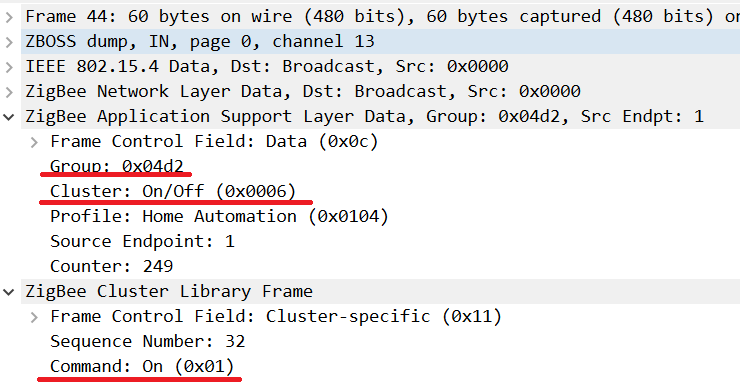


Although the group transfer is handled by the network layer, controlling the groups is performed by the Groups cluster. This is a special cluster that allows adding the device endpoint to a group, list groups that device belongs to, or remove the device from the group. 

It is worth noting that the Groups cluster is an endpoint entity, rather than the whole device one. Imagine you have a multichannel relay switch, where each endpoint controls a specific zone of lights. You will want to have each zone to be a part of its own group in order to be controlled separately, rather than controlling all lines all together just because they exist in the same device. In other words each endpoint that shall work independently must have its own Groups cluster instance. 

The group address is a virtual 16-bit network address assigned to a group by the network administrator. In zigbee2mqtt system groups are created in the Groups tab. 

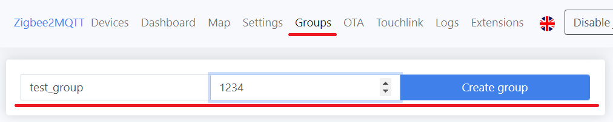

Once created, the new group is still just a virtual concept - it exists only in the coordinator’s database. Devices must be added to the group, so that they now know they are now a part of the group. The groups tab offers an easy to use mechanism of adding a device to the group. 

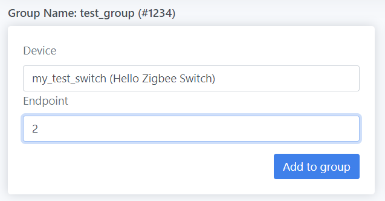

Under the hood, the Zigbee coordinator sends AddGroup message to the device endpoint, indicating the device must now listen to group messages sent to the mentioned Group ID. 


# Mass Produced Devices’ Behavior

Let’s try to analyze how groups work. The easiest way is to learn how mass produced devices behave. Let’s just create a group in zigbee2mqtt and add a few lights there.

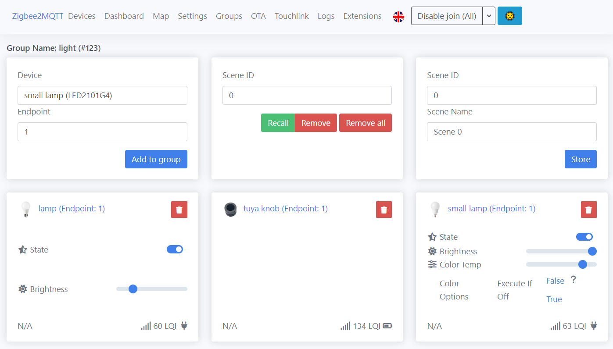

As for switches, the specification is a bit vague. It explains the group concept, says that the device can be a part of a group, lists possible messages that device can send or receive. But the specification does not describe whether the controller device shall be a part of the group it is controlling, or not. I found 2 kinds of devices laying around, but they behave quite differently.

For instance, IKEA Tradfri and IKEA Styrbar controllers do not allow adding them to a group. When trying to add them to the group they do not generate an error, but the default response indicates that the operation is not supported.

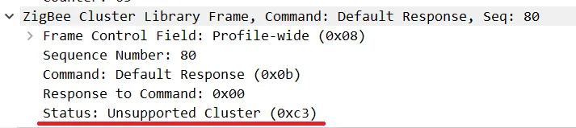

In order to let these devices control a group, a new binding to the group shall be created. The device can potentially control several groups just by adding additional bindings.

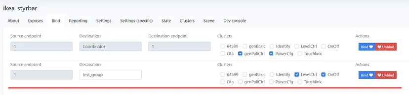

This is how the bind request looks like.

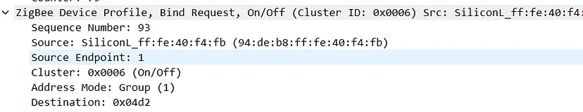

From now on these controllers generate not just regular messages to the coordinator, reporting the button press, but also a On and Off commands to the bound group.


As expected all the lights in the group turn on and off simultaneously, as expected.

Let’s check another type of device, and particularly how Tuya Smart Knob behaves. This device ALLOWS adding itself to a group, and immediately can control all the lights in the group. Each time the knob is pressed or turned, the device sends a corresponding On/Off or LevelCtrl command to the group it belongs to. No additional preparation steps (such as binding) is necessary, so that it is more comfortable for the user.

Tuya Smart Knob does not support binding to a group. Although it technically accepts the bind request, the commands are sent to the group `0x0000` instead of the group stated in the binding request.

Also, the Tyua Smart Knob can participate only in one group at a time. If the device is added to another group, the new group settings supersede the previous group ones. This makes it impossible for this device to control several groups.

Another drawback for this approach is that you’ll often see the `Failed to poll onOff from tuya knob` message in zigbee2mqtt. By default Z2M treats all devices in the group as actuator devices. It tries to set up periodic reporting of On/Off clusters for this device, and once this is impossible it tries to periodically poll the device for the cluster state. But since this is a controller device it has no On/Off cluster state to report in any way, that is why this message is displayed.

Although these observations are limited to a few device types, it makes me think that the approach of adding controllers to the group is not very correct. In this project I will stick to the first approach - controllers shall not be a part of a group, but rather allow binding commands to the group receivers.

Before we jump to the coding part, let’s also check a few light devices. I wanted to explore whether the light can be a part of several groups. And yes, it can. The number of groups for a single device is limited by the size or its internal group tables. Do not expect the light to participate in hundreds of groups, but assigning the device to a few groups is doable.

Pay attention that groups are not synchronized in any way - a group is just a way to deliver a message to several recipients at a time. Consider the following scenario:
- There are 2 lights and 2 groups. Group1 contains Light1 and Light2, while Group2 contains only Light2.
- You send the Toggle command to Group2 - Light2 turns on.
- You send the Toggle command to Group1 - Light1 turns on, but Light2 also toggles and switches off.

This may be undesired behavior in some cases. You should use controllers that send specific On and Off commands, instead of the Toggle. Similar reasoning for LevelControl commands. If the controller sends a `Set light level to 50%` command - it will be handled in the same way for all devices in the group. But `Decrease light level by 10%` will depend on the initial level of the light.

Final note in this section is autonomous work. Bound messages work fine even if the coordinator is down. The controller device will send On/Off and LevelCtrl commands which are handled by the light, and this does not require z2m to be involved (other than set up binding). This severely improves the resilience of the system. You will not be in a situation where you can’t turn on the light because your home server is not working.

# Implementing Groups Support

Let’s do some coding now. But first let me remind you that my smart switch has both buttons  (controller) and LED (light). It can be used together (button controls the internal LED), as well as separately (buttons control some other light, while the internal LED is controlled by external controllers). In the context of Groups Cluster we will explore both cases - controlling a group with the device buttons, and letting the device LEDs to be a part of a group and controlled by external devices.

For the first case where the device buttons control a group we do not need to write any new code - everything is already in place since implementing the binding feature. You just need to create a binding to a group, and the device will start sending Toggle commands to that group.

Moreover, different buttons of our device can be bound to different groups.

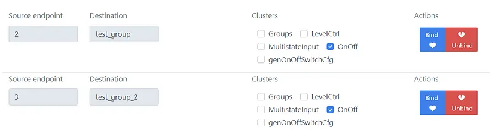

The other case is a bit trickier. The LED has its own state, and can be a part of a group as well. And this requires adding the Groups cluster to the endpoint. Since the device has 2 switch channels, both endpoints will need their own Groups cluster instance. If you follow the reasoning regarding client and server cluster you’ll see that we need a server version of the cluster here, as it accepts commands to add/remove devices to the group.

Adding Groups cluster to the project does not differ from adding other clusters we did earlier:
- In Zigbee3ConfigurationEditor add the Groups Server (Input) cluster to both of the SWITCH endpoints. 
- Generate zps_gen.c/h files
- Declare `CLD_GROUPS` and `GROUPS_SERVER` in the zcl_options.h
- Add the groups cluster ZCL implementation files to the project build
- Set groups table size

The only non-trivial change here is setting the size of the groups table in the Zigbee3ConfigurationEditor, otherwise the groups table is generated too small.

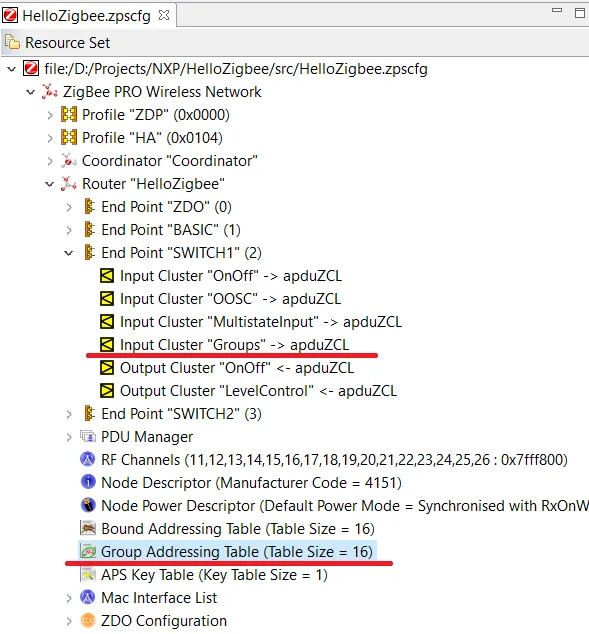

Initialization of the Groups cluster instance is no different compared to previous clusters:

```cpp
struct OnOffClusterInstances
{
...
    tsZCL_ClusterInstance sGroupsServer;
...

class SwitchEndpoint: public Endpoint
{    
protected:
...
    tsCLD_Groups sGroupsServerCluster;
    tsCLD_GroupsCustomDataStructure sGroupsServerCustomDataStructure;
```


```cpp
void SwitchEndpoint::registerGroupsCluster()
{
    // Create an instance of a groups cluster as a server
    teZCL_Status status = eCLD_GroupsCreateGroups(&sClusterInstance.sGroupsServer,
                                                  TRUE,
                                                  &sCLD_Groups,
                                                  &sGroupsServerCluster,
                                                  &au8GroupsAttributeControlBits[0],
                                                  &sGroupsServerCustomDataStructure,
                                                  &sEndPoint);
    if( status != E_ZCL_SUCCESS)
        DBG_vPrintf(TRUE, "SwitchEndpoint::init(): Failed to create Groups Cluster instance. status=%d\n", status);
}
```

That is surprisingly all we need to enable groups server clusters. Having this code in place, the Zigbee framework will automatically route groups requests to the default groups cluster implementation. 

Here is how the device is added to the group

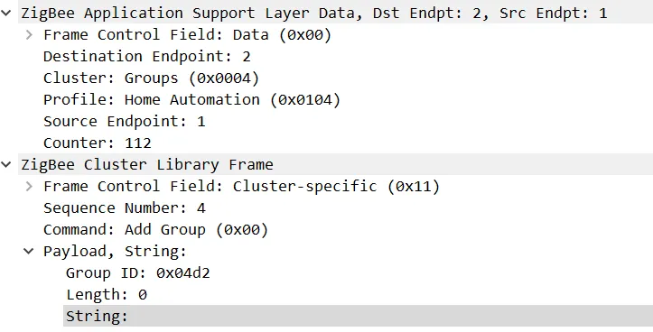

The ZCL code will automatically handle AddGroup requests, and add the mentioned endpoint to the groups list. Once the endpoint is added to a group it will automatically handle On/Off commands targeted to that group. The Zigbee network code translates received group On/Off/Toggle commands to the regular OnOff cluster ones, similar to one we discussed while making basic switch functionality.

In order to ensure that groups information survives reboots we can write a groups table dumping function. Note that this function is optional, added for curiosity, and is not required for the production code.

```cpp
void vDisplayGroupsTable()
{
    // Get pointers
    ZPS_tsAplAib * aib = ZPS_psAplAibGetAib();
    ZPS_tsAplApsmeAIBGroupTable * groupTable = aib->psAplApsmeGroupTable;
    uint32 groupTableSize = groupTable->u32SizeOfGroupTable;
    ZPS_tsAplApsmeGroupTableEntry * groupEntries = groupTable->psAplApsmeGroupTableId;

    // Print the table
    DBG_vPrintf(TRUE, "\n+++++++ Groups Table:\n");
    for(uint32 i = 0; i < groupTableSize; i++)
    {
        DBG_vPrintf(TRUE, "    Group %04x:", groupEntries[i].u16Groupid);
        for(uint8 j=0; j<(242 + 7)/8; j++)
            DBG_vPrintf(TRUE, " %02x", groupEntries[i].au8Endpoint[j]);

        DBG_vPrintf(TRUE, "\n");
    }
}
```

Having this function called when booting the device it is easy to see that group membership is stored in the EEPROM, and stays intact when the device reboots.

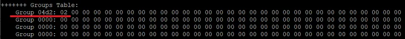

The device sets a bit that corresponds to the endpoint #2, which indicates the device endpoint belongs to the mentioned group.

Surprisingly group messaging delivers not only On/Off commands, but other clusters as well. If the device receives a message to the group that this device belongs to, it propagates the message to the respective cluster as if it would be sent directly to this cluster. For example, let’s send the Identify request to the group. There is no dedicated UI on the z2m dashboard, but we can send the mqtt command using MQTT explorer.

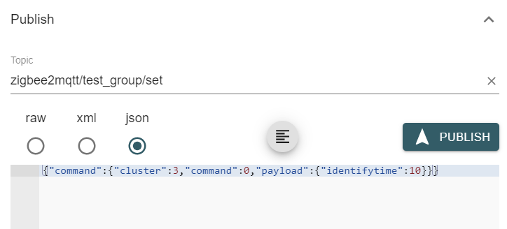

This request will generate a command 0 (Identify Request) in the cluster 3 (Identify cluster), and send it to the test_group group. As result the device endpoint #2 that is currently registered in the group will handle this request and start blinking its LED.


# Tests

As you remember, I am a huge automated testing fan. And of course I tried to develop automated tests for the groups functionality. I do not want to describe every single step I did, moreover I made some refactoring unrelated to the groups functionality for better test readability. I will just mention a few key changes that are relevant for the Groups testing.

First, I created a Bridge helper class that would handle Z2M Bridge requests.

```python
class Bridge:
    ...
    def get_request_topic(self, subtopic):
        return 'bridge/request/' + subtopic

    def get_response_topic(self, subtopic):
        return 'bridge/response/' + subtopic

    def request(self, topic, payload):
        # Prepare for waiting a zigbee2mqtt response
        self.zigbee.subscribe(self.get_response_topic(topic))

        # Publish the request
        self.zigbee.publish(self.get_request_topic(topic), payload)

        # Wait the response from zigbee2mqtt
        return self.zigbee.wait_msg(self.get_response_topic(topic))
```

This is a handy way to send requests to the `zigbee2mqtt/bridge/request/*` topics and listen for response in the corresponding `zigbee2mqtt/bridge/response/*` topic. The Bridge is responsible for creating and deleting groups, as well adding/removing the device to the group. 

In order to handle the group, a new Group class was created.

```python
class Group:
    def __init__(self, zigbee, bridge, name, id):
        self.zigbee = zigbee
        self.bridge = bridge
        self.name = name
        self.id = id

    def create(self):
        payload = {"friendly_name": self.name, "id": self.id}
        return self.bridge.request('group/add', payload)

    def delete(self):
        payload = {"friendly_name": self.name, "id": self.id}
        return self.bridge.request('group/remove', payload)

    def add_device(self, device):
        payload = {
            "device": device.get_full_name(),
            "group": self.name,
            "skip_disable_reporting": "true"
            }
        return self.bridge.request('group/members/add', payload)

    def remove_device(self, device):
        payload = {
            "device": device.get_full_name(),
            "group": self.name,
            "skip_disable_reporting": "true"
            }
        return self.bridge.request('group/members/remove', payload)
```

These functions call corresponding bridge API to maintain groups and their membership as per [API description](https://www.zigbee2mqtt.io/guide/usage/groups.html#mqtt-commands). 

But the non-trivial part here is the `skip_disable_reporting` option. Some devices when added to or removed from the group change their reporting. In turn z2m tries to reset this reporting and creates additional bindings from the device to coordinator. As you remember from the [commands binding article](part15_commands_binding.md), our device changes its behavior when it gets bound to the group, and automated tests may fail because of that. Fortunately this undesired behavior can be switched off with this option.

In order to create a good setup for our tests a few fixtures shall be created.

```python
# A fixture that creates a test_group, and cleans it up after all tests completed
@pytest.fixture(scope="session")
def group(zigbee, bridge):
    grp = Group(zigbee, bridge, 'test_group', 1234)

    # Remove previously created groups (if any). Ignore errors if there was no group before.
    resp = grp.delete()

    # Create a brand new group
    resp = grp.create()
    assert resp['status'] == 'ok'

    # Use the group
    yield grp

    # Cleanup our group
    resp = grp.delete()
    assert resp['status'] == 'ok'
```

This fixture removes previously created groups (just in case) and creates a new one. The test also cleans up the created group when exiting. Perhaps this code could be simplified to just create a new group. 

In a similar way the device can be added to the group

```python
# A fixture that adds the switch to the test group
@pytest.fixture(scope="function")
def switch_on_group(switch, group):
    # Remove device from the group if it was there already
    resp = group.remove_device(switch)

    # Create a brand new group
    resp = group.add_device(switch)
    assert resp['status'] == 'ok'

    yield switch

    # Cleanup group membership
    resp = group.remove_device(switch)
    assert resp['status'] == 'ok'
```

It is time to get to the test. A simple test would sending On/Off/Toggle commands to the group, and check that the device correctly receives and processes these commands.

```python
class Group:
    ...

    def switch(self, state):
        # Prepare for waiting a group state response
        self.zigbee.subscribe(self.name)

        # Publish the request
        payload = {"state": state}
        self.zigbee.publish(self.name + "/set", payload)

        # Wait the response from zigbee2mqtt (actually the state may not be really relevant, but returning just in case)
        return self.zigbee.wait_msg(self.name)
```

In the previous article we managed to send On/Off commands to the device, and check the device response in the same function. In the new design the group and the device are separate entities, and have to be processed separately.

```python
def test_on_off(group, switch_on_group):
    group.switch('ON')
    switch_on_group.wait_device_state_change('ON')
    switch_on_group.wait_zigbee_state_change()  # Ignore the state change generated by z2m, wait for the one generated by the device
    assert switch_on_group.wait_zigbee_state_change() == 'ON'

    group.switch('OFF')
    switch_on_group.wait_device_state_change('OFF')
    switch_on_group.wait_zigbee_state_change()  # Ignore the state change generated by z2m, wait for the one generated by the device
    assert switch_on_group.wait_zigbee_state_change() == 'OFF'
```

The `wait_device_state_change()` expects a state change reported via the *device UART*. As you may guess from the name, the `wait_zigbee_state_change()` waits for the report from the device through the *Zigbee network*.

Pay attention to the double `wait_zigbee_state_change()` call. This is because of the z2m groups implementation. When sending On/Off commands to the group, the zigbee2mqtt will automatically respond on behalf of all group devices guessing their state change. The test ignores these messages. Instead it waits for the real device state report that comes next.

# Summary

The Groups cluster is a mandatory component according to the Zigbee Light Link (ZLL) specification. It enables the transmission of a command to multiple devices that are part of the same group.

Each controller, such as a switch, must have the capability to control a group. Similarly, every light device should support being added to a group. As we have learned, controlling a group essentially involves the ability to bind the On/Off and Level Control clusters to a light device. This process doesn’t require any special coding beyond what we have already covered in the binding article.

On the other hand, adding a light device to a group involves integrating the Groups cluster into the device's endpoint. Thankfully, this process also doesn't demand any specific coding apart from initializing the groups cluster. This is because the functionality needed for group management is already built into the Groups cluster implementation in the SDK (Software Development Kit). Once a device is added to a group, it will automatically receive and respond to commands sent to that group, as though the commands were directly targeted at the device itself.

# Links

- Documents
  - [JN-UG-3087 JN516x Integrated Peripherals API User Guide](https://www.nxp.com/docs/en/user-guide/JN-UG-3087.pdf)
  - [ZigBee Class Library specification](https://zigbeealliance.org/wp-content/uploads/2019/12/07-5123-06-zigbee-cluster-library-specification.pdf)
  - [How to support new device in zigbee2mqtt](https://www.zigbee2mqtt.io/advanced/support-new-devices/01_support_new_devices.html)
- Code
  - [Project on github](https://github.com/grafalex82/hellozigbee/tree/hello_zigbee_groups)
