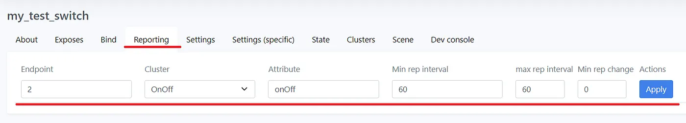
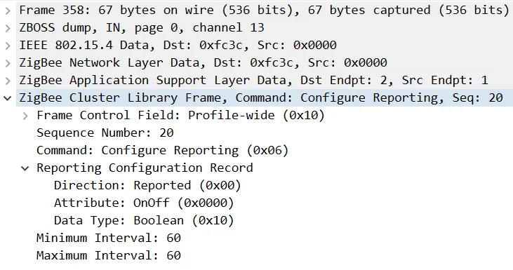
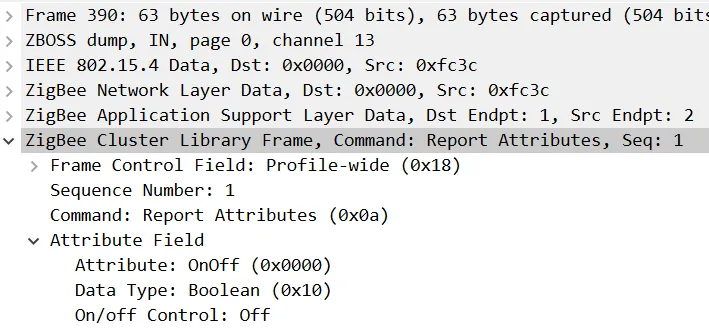
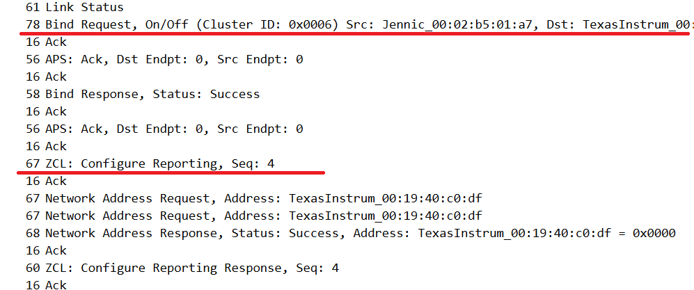
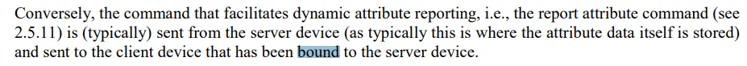
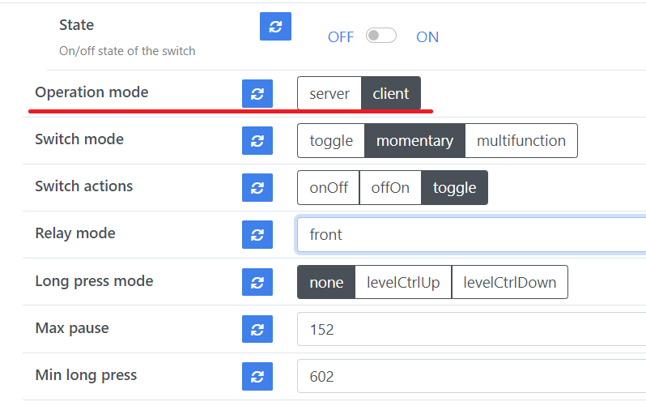
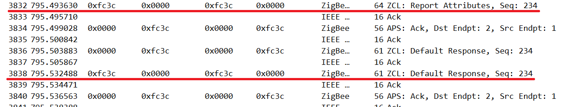
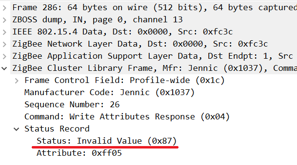
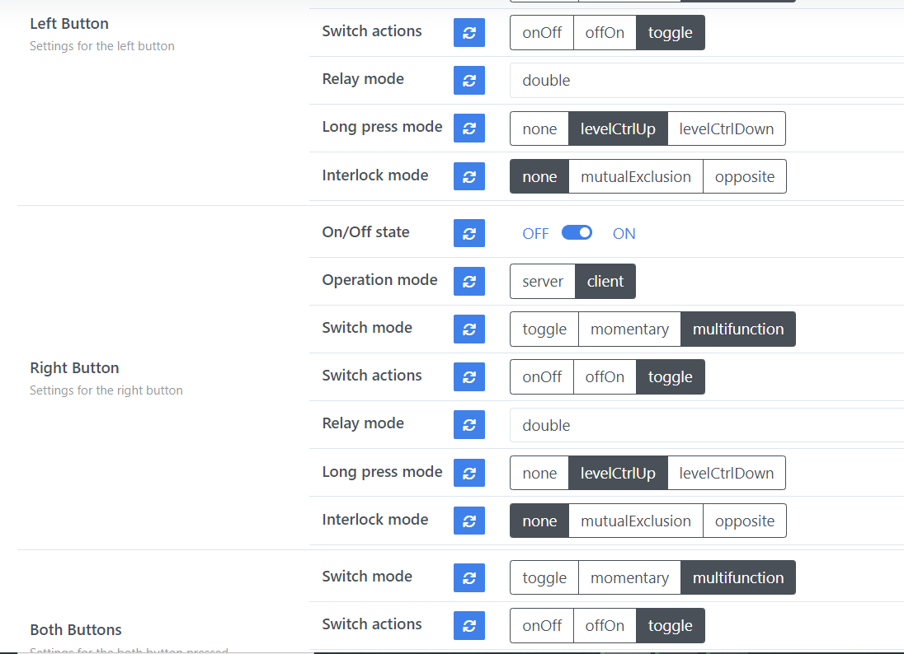

# Hello Zigbee World, Part 24 - Configure Reporting, Client-only clusters, Both Buttons support

Welcome back to our [Hello Zigbee series](part0_plan.md), where we delve into creating Zigbee device firmware from the ground up. Recently, I've made several enhancements to the Zigbee Smart Switch firmware. These updates, while minor, are significant enough to warrant mention, though not quite extensive enough for their own article.

In this piece, we'll explore the Configure Reporting feature, delve again into the Client and Server modes of the switch, introduce support for pressing both buttons at the same time, and discuss the interlock mode.

Continuing with our tradition, I will use the code developed in earlier posts. For the development board, I'll stick with the [EBYTE E75–2G4M10S module](part1_bring_up.md), which utilizes the NXP JN5169 microcontroller, and a [little bit improved schematics](part22_identify_cluster.md).

# Configure Reporting

While working on the groups functionality, I encountered an odd message in the zigbee2mqtt log stating “Failed to set up reporting for the device”. This was peculiar because the device does report its state upon changes.

Upon examining sniffer logs, it became apparent that zigbee2mqtt was explicitly issuing the Configure Reporting Command, requesting the device to periodically report its state, at least once every hour.

It turns out that the device firmware does not, by default, enable handling of such commands. To rectify this, the following lines must be added to the zcl_options.h file, and the corresponding ZCL SDK files must also be included in the build.

```cpp
#define ZCL_ATTRIBUTE_REPORTING_SERVER_SUPPORTED
#define ZCL_CONFIGURE_ATTRIBUTE_REPORTING_SERVER_SUPPORTED
```

Given that the device features two button channels, it's expected that zigbee2mqtt will configure reporting for at least two On/Off attributes. Therefore, it's necessary to instruct the ZCL implementation to allocate sufficient space in its internal structures for reporting.

```cpp
#define ZCL_NUMBER_OF_REPORTS     10
```

Moreover, although ZCL can send reports as infrequently as every 60 seconds, for debugging purposes, I preferred a more frequent reporting interval. Despite the misleading use of the term "MAX" in its name, the following setting specifies the minimum allowable value for the MaxReportInterval parameter.

```cpp
#define ZCL_SYSTEM_MAX_REPORT_INTERVAL  15
```

Handling the Configure Reporting command requires no special processing - the ZCL implementation manages it automatically. Nevertheless, it will signal our code when reporting has been configured for a specific attribute. ZCL generates two types of events for this purpose:

- `E_ZCL_CBET_REPORT_INDIVIDUAL_ATTRIBUTES_CONFIGURE`: Emitted for each attribute listed in the Configure Reporting Command, as each attribute is configured separately.
- `E_ZCL_CBET_REPORT_ATTRIBUTES_CONFIGURE`: Generated once all listed attributes in the Configure Reporting Command have been processed.

No special handling is required for these events, but for curiosity's sake, let's dump them to monitor their occurrence.

```cpp
void vDumpAttributeReportingConfigureRequest(tsZCL_CallBackEvent *psEvent)
{
    tsZCL_AttributeReportingConfigurationRecord * psRecord = &psEvent->uMessage.sAttributeReportingConfigurationRecord;
    DBG_vPrintf(TRUE, "ZCL Configure Reporting: Cluster %04x Attrib %04x: min=%d, max=%d (Status=%02x)\n",
        psEvent->psClusterInstance->psClusterDefinition->u16ClusterEnum,
        psRecord->u16AttributeEnum,
        psRecord->u16MinimumReportingInterval,
        psRecord->u16MaximumReportingInterval,
        psEvent->eZCL_Status);
}

void Endpoint::handleZclEvent(tsZCL_CallBackEvent *psEvent)
{
    switch (psEvent->eEventType)
    {
...
        case E_ZCL_CBET_REPORT_INDIVIDUAL_ATTRIBUTES_CONFIGURE:
            vDumpAttributeReportingConfigureRequest(psEvent);
            break;

        case E_ZCL_CBET_REPORT_ATTRIBUTES_CONFIGURE:
            DBG_vPrintf(TRUE, "ZCL Endpoint Callback: Attributes reporting request has been processed\n");
            break;
...
    }
}
```


The Configure Reporting command can be generated on zigbee2mqtt dashboard.




This is how the request looks like on the network level



Once reporting is configured, the device will periodically send the requested attribute reports once a minute.




# Storing report configuration in PDM

Storing report configurations in the Persistent Data Manager (PDM) is essential for ensuring your Zigbee device maintains its configured reporting settings across reboots. Unlike bindings or group settings, which are saved in non-volatile memory by default, report configurations are not persisted. This leads to a device ceasing to send periodic reports upon reboot - a situation that might surprise client devices expecting these reports.

To address this, report configurations could be stored in PDM as an array of records. Because reports are configured per endpoint, it's practical to maintain a separate array for each endpoint. For simplicity, each array can consist of a predetermined number of records, dictated by `ZCL_NUMBER_OF_REPORTS`, which effectively limits the number of attributes that the SDK can report. Although most details of a configured report are already encapsulated within the `tsZCL_AttributeReportingConfigurationRecord`, the cluster ID is not included in this structure. Therefore, it is advisable to add it separately to ensure complete configurability.

```cpp
// A reporting configuration record to save in PDM
struct ReportConfiguration
{
    uint8 clusterID;
    tsZCL_AttributeReportingConfigurationRecord record;
};

class SwitchEndpoint: public Endpoint
{    
...
    ReportConfiguration reportConfigurations[ZCL_NUMBER_OF_REPORTS];
```

Arrays should be set up during the first boot. After initialization, the array is also stored in PDM. This way, future starts will use the previously set configuration.

```cpp
void SwitchEndpoint::initReportingConfigurations()
{
    memset(reportConfigurations, 0, sizeof(reportConfigurations));
    saveReportingConfigurations();
}

void SwitchEndpoint::saveReportingConfigurations()
{
    DBG_vPrintf(TRUE, "SwitchEndpoint EP=%d: Save reporting configuration\n", getEndpointId());
    PDM_eSaveRecordData(getPdmIdForEndpoint(getEndpointId(), PARAM_ID_REPORTING_CONFIG),
                        reportConfigurations,
                        sizeof(reportConfigurations));
}
```

Loading configuration records involves more than just retrieving the array. The function must go through each record and specifically re-enable reporting for them.

```cpp
void SwitchEndpoint::restoreReportingConfigurations()
{
    // Read values from PDM
    uint16 readBytes;
    PDM_teStatus status = PDM_eReadDataFromRecord(getPdmIdForEndpoint(getEndpointId(), PARAM_ID_REPORTING_CONFIG),
                                                  reportConfigurations,
                                                  sizeof(reportConfigurations),
                                                  &readBytes);

    // During the first run it may happen that there is no record in PDM, and we need to initialize it
    if(status != PDM_E_STATUS_OK)
    {
        DBG_vPrintf(TRUE, "SwitchEndpoint EP=%d: No PDM record for reporting configuration. Create a new one. status=%d\n", getEndpointId(), status);
        initReportingConfigurations();
        return;
    }

    // Iterate over the loaded array and re-register all reporting configurations
    for(int i = 0; i < ZCL_NUMBER_OF_REPORTS; i++)
    {
        if(reportConfigurations[i].clusterID != 0)
        {
            DBG_vPrintf(TRUE, "SwitchEndpoint EP=%d: Restore reporting configuration: ClusterID=%04x, AttrID=%04x, Min=%d, Max=%d, Timeout=%d\n",
                        getEndpointId(),
                        reportConfigurations[i].clusterID,
                        reportConfigurations[i].record.u16AttributeEnum,
                        reportConfigurations[i].record.u16MinimumReportingInterval,
                        reportConfigurations[i].record.u16MaximumReportingInterval,
                        reportConfigurations[i].record.u16TimeoutPeriodField);

            eZCL_SetReportableFlag( getEndpointId(),
                                    reportConfigurations[i].clusterID,
                                    TRUE,
                                    FALSE,
                                    reportConfigurations[i].record.u16AttributeEnum);
            eZCL_CreateLocalReport( getEndpointId(),
                                    reportConfigurations[i].clusterID,
                                    0,
                                    TRUE,
                                    &reportConfigurations[i].record);
        }
    }
}
```

After the initial setup, the array doesn't contain any configured reportings. To address this, functions are designed to find an empty slot and add the new report configuration there. 

```cpp
uint8 SwitchEndpoint::findReportingConfiguration(uint16 clusterID, uint16 attributeID)
{
    for(int i = 0; i < ZCL_NUMBER_OF_REPORTS; i++)
    {
        // Check if we found an empty slot
        if(reportConfigurations[i].clusterID == 0)
            return i;

        // Search for a record that match passed parameters
        if(reportConfigurations[i].clusterID == clusterID && reportConfigurations[i].record.u16AttributeEnum == attributeID)
            return i;
    }

    // We have not found a record, and there is no empty slot to store a new one
    return ZCL_NUMBER_OF_REPORTS;
}

void SwitchEndpoint::addReportConfiguration(uint16 clusterID, tsZCL_AttributeReportingConfigurationRecord * record)
{
    uint8 index = findReportingConfiguration(clusterID, record->u16AttributeEnum);
    if(index == ZCL_NUMBER_OF_REPORTS)
    {
        DBG_vPrintf(TRUE, "SwitchEndpoint EP=%d: Warning: No space for new reporting configuration\n", getEndpointId());
        return;
    }

    // Store the new configuration
    reportConfigurations[index].clusterID = clusterID;
    reportConfigurations[index].record = *record;
    DBG_vPrintf(TRUE, "SwitchEndpoint EP=%d: Store reporting configuration record at index %d\n", getEndpointId(), index);
    saveReportingConfigurations();
}
```

As highlighted in the previous section, the SDK notifies us about new attribute report configuration requests through the `E_ZCL_CBET_REPORT_INDIVIDUAL_ATTRIBUTES_CONFIGURE` event. This event doesn't just include configuration parameters for the attribute report, it also indicates whether the SDK has successfully processed this request. If the SDK processes the request successfully, we can then handle this event on our side and store the new configuration record in the PDM.

```cpp
void Endpoint::handleZclEvent(tsZCL_CallBackEvent *psEvent)
{
...
        case E_ZCL_CBET_REPORT_INDIVIDUAL_ATTRIBUTES_CONFIGURE:
            vDumpAttributeReportingConfigureRequest(psEvent);
            if(psEvent->eZCL_Status == E_ZCL_SUCCESS)
                handleReportingConfigureRequest(psEvent);
            break;
...

void SwitchEndpoint::handleReportingConfigureRequest(tsZCL_CallBackEvent *psEvent)
{
    uint16 clusterID = psEvent->psClusterInstance->psClusterDefinition->u16ClusterEnum;
    tsZCL_AttributeReportingConfigurationRecord * record = &psEvent->uMessage.sAttributeReportingConfigurationRecord;
    addReportConfiguration(clusterID, record);
}
```

Obviously the reporting configuration must be loaded during the device boot.

```cpp
void SwitchEndpoint::init()
{
...
    restoreReportingConfigurations();
```

# Extra binding when creating reporting

While working on the group features, I also noticed that the main device functionality sometimes breaks. After looking into it, I discovered this issue was related to the reporting functionality too. When a device joins a group, zigbee2mqtt sets up reporting so the device attributes display correctly on the dashboard. But prior the Configure Reporting command zigbee2mqtt sends a Bind Request to the device.



Remember from a previous article, we introduced a neat way to select between server and client modes for the device:

- In Server mode, with no bindings set, the switch keeps track of its state, reports this state to the Coordinator, and responds to On/Off/Toggle commands from the network.
- If at least one binding from the switch to another device is set, the switch works in the Client mode. In this mode the switch sends Toggle commands to the bound light. Here, the device doesn't keep track of its On/Off state and acts more like a remote switch.

I attempted to disable these extra bindings to preserve the client/server mode selection logic, but noticed that reporting stops working if the binding is removed. The specifications don't clearly state how reports should be sent to subscribers.



It seems like nothing technically prevents periodic reports from being sent to subscribers via unicast messages. However, the ZCL uses bound transfers to publish reports. It might have been simpler to use the existing bound transfer method to deliver reports to multiple subscribers instead of creating another similar mechanism for attribute reporting.

This leads to the conclusion that using bind requests to choose between client and server modes isn't reliable - bindings can be part of both modes. So, I added an explicit On/Off Settings Cluster option for the button channel to select the operation mode.



The switch endpoint class now includes a function to determine the current mode.

```cpp
bool SwitchEndpoint::runsInServerMode() const
{
    if(clientOnly)
        return false;

    bool serverMode = (sOnOffConfigServerCluster.eOperationMode == E_CLD_OOSC_OPERATION_MODE_SERVER);
    return serverMode;
}
```

The internal logic has been updated. Some functions now work differently based on the operating mode. For example, in server mode, the class maintains the On/Off state for the channel, while in client mode, it sends a command to the bound device.

```cpp
void SwitchEndpoint::toggle()
{
    if(runsInServerMode())  
        // In Server mode we will toggle internal relay state
        doStateChange(!getState());
    else
        // In Client mode we will send Toggle command
        sendCommandToBoundDevices(E_CLD_ONOFF_CMD_TOGGLE);
}
```

These changes were tested thoroughly, covering both client and server functionality with a number of automated tests.

One unanswered question is why devices send reports directly to the coordinator. I haven't found any guidelines for smart switches to do this. The Zigbee Specifications also don't explain it. However, recent findings suggest the correct approach might be:

- The device doesn't send direct reports to the coordinator (or any other device).
- The Coordinator binds the device to itself and subscribes for reports.
- Thus, the device sends reports and commands to the bound devices without needing to know their addresses in advance.


# Intermittent test failures in Client mode

Smart switches are more versatile than regular switches, offering various usage possibilities. You can create automations for switch reports using Home Assistant or directly bind a light to the switch. You can even use both features at the same time.

In client mode, the device can send two types of signals:

- Multistate Input Cluster reports - these indicate if a single, double, triple, or long button press was detected. Previously, we made the switch send these reports straight to the Coordinator via a unicast network message.
- On/Off commands - the switch can send these commands directly to a connected light using bound transfer.

Both types of messages come from the same place in the code:

```cpp
void ButtonHandler::buttonStateMachineToggle(bool pressed)
{
    // The state machine
    switch(currentState)
    {
        case IDLE:
            if(pressed)
            {
                changeState(PRESSED1);

                endpoint->reportAction(BUTTON_ACTION_SINGLE);

                if(relayMode != RELAY_MODE_UNLINKED)
                    endpoint->toggle();
            }
...
```

The `reportAction()` function sends the Multistate Input Cluster attribute report, and the `toggle()` function sends the Toggle command to the bound light. This method works well for most cases, sending attribute reports and then toggle commands as expected.


However, in a few instances, strange issues occur. 



The incoming Default Response message interferes with the outgoing OnOff command, changing it into an outgoing Default Response. Despite various tests, this seems to be a data race within the SDK's networking code, although the client code appears correct.

I tried adjusting network settings and increasing buffer sizes, but without success. Even separating the network packet buffers (PDUs) for OnOff and Multistate Input Clusters didn't solve the issue.

Switching to sending commands using `E_ZCL_AM_BOUND_NON_BLOCKING` instead of `E_ZCL_AM_BOUND` improved test stability. This suggests the non-blocking mode might use an internal queue for sending messages when the transport channel is clear, although the exact difference between these two modes isn't fully explained in the documentation.

```cpp
void SwitchEndpoint::sendCommandToBoundDevices(teCLD_OnOff_Command cmd)
{
...
    // Destination address does not matter - we will send to all bound devices
    tsZCL_Address addr;
    addr.uAddress.u16DestinationAddress = 0x0000;
    addr.eAddressMode = E_ZCL_AM_BOUND_NON_BLOCKING;

    // Send the toggle command
    uint8 sequenceNo;
    teZCL_Status status = eCLD_OnOffCommandSend(getEndpointId(),
                                   1,
                                   &addr,
                                   &sequenceNo,
                                   cmd);
    DBG_vPrintf(TRUE, "Sending On/Off command status: %02x\n", status);
}
```

This change has significantly improved test stability, especially when preparing several outgoing packets consecutively.


# Both buttons support and Client-Only endpoints

A typical 2-gang switch can not only respond to individual button presses but also allows for actions to be assigned to simultaneous presses of both buttons. The SwitchEndpoint class and ButtonHandler infrastructure were developed with this dual-button press capability in mind. To add support for pressing both buttons at the same time, we simply introduce an additional endpoint linked to the corresponding pin mask.

```cpp
extern "C" PUBLIC void vAppMain(void)
{
...
    SwitchEndpoint switch1;
    switch1.setConfiguration(SWITCH1_BTN_MASK);
    EndpointManager::getInstance()->registerEndpoint(HELLOZIGBEE_SWITCH1_ENDPOINT, &switch1);

    SwitchEndpoint switch2;
    switch2.setConfiguration(SWITCH2_BTN_MASK);
    EndpointManager::getInstance()->registerEndpoint(HELLOZIGBEE_SWITCH2_ENDPOINT, &switch2);

    SwitchEndpoint switchBoth;
    switchBoth.setConfiguration(SWITCH1_BTN_MASK | SWITCH2_BTN_MASK, true);
    EndpointManager::getInstance()->registerEndpoint(HELLOZIGBEE_SWITCHB_ENDPOINT, &switchBoth);
```

The virtual endpoint for both button presses shares similar functionalities with regular buttons, like detecting single, double, triple, or long button presses, generating actions, supporting endpoint configuration, and binding to light devices. The only limitation is it cannot control a local LED/relay, meaning it supports client features only, not server ones.

It's simpler to restrict the existing `SwitchEndpoint` class to client-only mode rather than creating a separate endpoint implementation. This mode is determined at class initialization and remains fixed.

The changes in the `SwitchEndpoint` class to introduce client and server modes are mainly about data handling and invoking the right methods based on the selected mode. Two aspects are particularly noteworthy from a Zigbee perspective.

First off, the client-only endpoint does not expose the On/Off and Groups server clusters, preventing any attempts to alter the state of an endpoint that should not do so.

```cpp
// List of cluster instances (descriptor objects) that are included into the endpoint
// The clusters defined in this list work for both client and server modes.
//
// Note: Do not mix up endpoint client/server mode with individual cluster client/server instance
//       The switch client mode means it can work only like a controller device (e.g. smart button), but does not
//       have relay control and internal state. At the same time it has number of server clusters (Multistate Input,
//       OOSC) for configuration and reporting actions.
struct OnOffClientClusterInstances
{
    tsZCL_ClusterInstance sOnOffClient;
    tsZCL_ClusterInstance sOnOffConfigServer;
    tsZCL_ClusterInstance sMultistateInputServer;
    tsZCL_ClusterInstance sLevelControlClient;
    tsZCL_ClusterInstance sIdentifyServer;
} __attribute__ ((aligned(4)));

// List of additional clusters for server mode
// Note: In server mode the switch has its internal state, can report state attributes, and can be assigned to a group
struct OnOffServerClusterInstances
{
    tsZCL_ClusterInstance sOnOffServer;
    tsZCL_ClusterInstance sGroupsServer;
} __attribute__ ((aligned(4)));

// This structure is used just to ensure client and server clusters are layed out consecutively in memory
struct OnOffClusterInstances
{
    OnOffClientClusterInstances client;
    OnOffServerClusterInstances server;
} __attribute__ ((aligned(4)));

....

void SwitchEndpoint::initEndpointStructure()
{
    // Calculate number of clusters, depending on client/server mode
    uint16 numClusters = sizeof(OnOffClientClusterInstances) / sizeof(tsZCL_ClusterInstance);
    if(!clientOnly)
        numClusters = sizeof(OnOffClusterInstances) / sizeof(tsZCL_ClusterInstance);

    // Initialize endpoint structure
    sEndPoint.u8EndPointNumber = getEndpointId();
    sEndPoint.u16ManufacturerCode = ZCL_MANUFACTURER_CODE;
    sEndPoint.u16ProfileEnum = HA_PROFILE_ID;
    sEndPoint.bIsManufacturerSpecificProfile = FALSE;
    sEndPoint.u16NumberOfClusters = numClusters;
    sEndPoint.psClusterInstance = (tsZCL_ClusterInstance*)&sClusterInstance;
    sEndPoint.bDisableDefaultResponse = ZCL_DISABLE_DEFAULT_RESPONSES;
    sEndPoint.pCallBackFunctions = &EndpointManager::handleZclEvent;
}

void SwitchEndpoint::init()
{
    // Register all clusters and endpoint itself
    initEndpointStructure();
    registerClientCluster();
    registerOnOffConfigServerCluster();
    registerMultistateInputServerCluster();
    registerLevelControlClientCluster();
    registerIdentifyCluster();
    if(!clientOnly)
    {
        registerServerCluster();
        registerGroupsCluster();
    }
    registerEndpoint();
...
```

Second, a client/server operation mode field is provided by the extended On/Off Switch Configuration cluster. Technically, someone could try switching a client-only endpoint to server mode by modifying this attribute. 

Fortunately, Zigbee's value validation mechanism can prevent incorrect value assignments. When a Write Attribute command is received, ZCL triggers an `E_ZCL_CBET_CHECK_ATTRIBUTE_RANGE` event for value validation, which can be overridden in the SwitchEndpoint class to block switching to server mode for client-only endpoints.

```cpp
teZCL_CommandStatus Endpoint::handleCheckAttributeRange(tsZCL_CallBackEvent *psEvent)
{
    // By default we do not perform attribute value validation
    return E_ZCL_CMDS_SUCCESS;
}

void Endpoint::handleZclEvent(tsZCL_CallBackEvent *psEvent)
{
    switch (psEvent->eEventType)
    {
...
        case E_ZCL_CBET_CHECK_ATTRIBUTE_RANGE:
            psEvent->uMessage.sIndividualAttributeResponse.eAttributeStatus = handleCheckAttributeRange(psEvent);
            DBG_vPrintf(TRUE, "ZCL Endpoint Callback: Check attribute %04x on cluster %04x range status %d\n",
                        psEvent->uMessage.sIndividualAttributeResponse.u16AttributeEnum,
                        psEvent->psClusterInstance->psClusterDefinition->u16ClusterEnum,
                        psEvent->uMessage.sIndividualAttributeResponse.eAttributeStatus);
            break;
```

In the SwitchEndpoint class validation method can be overridden, and disable setting server mode for client only endpoints.

```cpp
teZCL_CommandStatus SwitchEndpoint::handleCheckAttributeRange(tsZCL_CallBackEvent *psEvent)
{
    uint16 attribute = psEvent->uMessage.sIndividualAttributeResponse.u16AttributeEnum;
    uint16 cluster = psEvent->psClusterInstance->psClusterDefinition->u16ClusterEnum;

    // Prevent switching client only endpoint to a server mode
    if(cluster == GENERAL_CLUSTER_ID_ONOFF_SWITCH_CONFIGURATION && attribute == E_CLD_OOSC_ATTR_ID_SWITCH_OPERATION_MODE)
    {
        uint8 value = *(uint8*)psEvent->uMessage.sIndividualAttributeResponse.pvAttributeData;
        if(clientOnly && value != E_CLD_OOSC_OPERATION_MODE_CLIENT)
            return E_ZCL_CMDS_INVALID_VALUE;
    }

    // By default we do not perform attribute value validation
    return E_ZCL_CMDS_SUCCESS;
}
```

The method returns `E_ZCL_CMDS_INVALID_VALUE` value, which is propagated to the Zigbee Network in the Write Attribute Response command.



To prevent users from selecting incorrect values, the switch option can simply be omitted from the dashboard by not registering the dashboard item in the device converter.

```js
function addSwitchSettings(sw) {
    sw.withFeature(e.enum('switch_mode', ea.ALL, switchModeValues));
    sw.withFeature(e.enum('switch_actions', ea.ALL, switchActionValues));
    sw.withFeature(e.enum('relay_mode', ea.ALL, relayModeValues));
    sw.withFeature(e.enum('long_press_mode', ea.ALL, longPressModeValues));
    // sw.withFeature(e.numeric('max_pause', ea.ALL));
    // sw.withFeature(e.numeric('min_long_press', ea.ALL));

    return sw;
}

function genSwitchEndpoint(epName) {
    // Create composite section for switch settings
    let sw = e.composite(epName + " Button", epName, ea.ALL);
    sw.withDescription('Settings for the ' + epName + ' button');

    // The switch toggle
    sw.withFeature(e.binary('On/Off state', ea.ALL, 'ON', 'OFF').withValueToggle('TOGGLE').withProperty('state'));

    sw.withFeature(e.enum('operation_mode', ea.ALL, operationModeValues));

    // Add other switch settings
    addSwitchSettings(sw);

    // Make sure whole created block acts as a group of parameters, rather than a single composite object
    sw.withProperty('').withEndpoint(epName);

    return sw;
}

function genBothButtonsEndpoint(epName) {
    // Create composite section for switch settings
    let sw = e.composite("Both Buttons", epName, ea.ALL);
    sw.withDescription('Settings for the both button pressed together');

    // Add other switch settings
    addSwitchSettings(sw);

    // Make sure whole created block acts as a group of parameters, rather than a single composite object
    sw.withProperty('').withEndpoint(epName);

    return sw;
}
```

The `genSwitchEndpoint()` and `genBothButtonsEndpoint()` functions are used to register an endpoint for a standard switch and a client-only endpoint with limited functionality, like configuring both button presses. The `addSwitchSettings()` function creates settings that are common to all endpoints, while the other two functions might add specific options for a certain type of endpoint.

Additionally, this approach utilizes the Composite building block. This is a unique visual tool that groups parameters into visually distinct sections. It helps in clearly separating similar settings assigned to different endpoints, making it simpler for users to navigate and configure settings for various endpoints within the device converter.



# Buttons Interlock

A typical 2-gang smart switch offers an interlock feature, meaning the two relays cannot be on at the same time. This is particularly useful for devices like motorized water valves or shades, where using one relay to open and another to close is necessary. Activating both relays together could damage the motor.

To implement the interlock feature, I introduced three modes:

- **None** - the button channels operate independently without restrictions.
- **Mutual Exclusion** - both button channels cannot be on at the same time. If one channel is turned on, the other must turn off, but both can be off simultaneously.
- **Opposite** - the two button channels always maintain opposite states. If one is on, the other is off, and vice versa.

To enable communication between button channels, the simplest solution was to use pointers to link the endpoints, known as buddy endpoints.

```cpp
class SwitchEndpoint: public Endpoint
{    
...
    SwitchEndpoint * interlockBuddy;

...
public:
    void setInterlockBuddy(SwitchEndpoint * buddy) 
    {
        interlockBuddy = buddy;
    }
```

In the Main.cpp the 2 button endpoints are linked.

```cpp
    switch1.setInterlockBuddy(&switch2);
    switch2.setInterlockBuddy(&switch1);
```

To select the interlock mode, I added a setting to the dashboard for each button channel. This was done through the OOSC cluster, allowing the new setting to be easily integrated into the SwitchEndpoint class. Perhaps it would be reasonable to allocate a section and endpoint for device-wide settings, but there is no such section at the moment. So adding the option to existing endpoint settings sections was just easier.

Thus this approach means there are two interlock settings, one for each button endpoint, which must be synchronized. Fortunately writing an attribute value to the buddy endpoint is not a big deal.

```cpp
// Executed on endpoint getting the attribute write request
void SwitchEndpoint::handleWriteAttributeCompleted(tsZCL_CallBackEvent *psEvent)
{
...
            case E_CLD_OOSC_ATTR_ID_SWITCH_INTERLOCK_MODE:
                if (interlockBuddy)
                {
                    interlockBuddy->setInterlockMode((teCLD_OOSC_InterlockMode)sOnOffConfigServerCluster.eInterlockMode);
                    interlockBuddy->setInterlockState(getState());
                    buttonHandler.resetButtonStateMachine();
                }
                break;

// Executed on interlock buddy endpoint
void SwitchEndpoint::setInterlockMode(teCLD_OOSC_InterlockMode mode)
{
    sOnOffConfigServerCluster.eInterlockMode = mode;
}
```

While this method updates both endpoints' interlock mode attribute, it won't reflect on the Z2M dashboard. Unfortunately the SDK doesn't allow sending reports for manufacturer-specific attributes like interlock mode. The solution is to manage this through the Z2M converter side.

Here's an example of handling attribute set requests in zigbee2mqtt, including scheduling reads from the buddy endpoint to update the dashboard settings.

```js
function getInterlockEp(ep) {
    // endpoints 2 (left) and 3 (right) are interlocked to each other
    if (ep == 2) return 3;
    if (ep == 3) return 2;
    return null;
}

const toZigbee_OnOffSwitchCfg = {
    convertSet: async (entity, key, value, meta) => {
...
            case 'interlock_mode':
                newValue = interlockModeValues.indexOf(value);
                payload = {65286: {'value': newValue, 'type': DataType.enum8}};
                // Intentionally no `await` as interlocked endpoint may send state change message
                // and tests will go out of sync.
                /*await*/ entity.write('genOnOffSwitchCfg', payload, manufacturerOptions.jennic);

                // Schedule reading of buddy endpoint setting to update setting on the Z2M dashboard.
                // Intentionally no `await` here to keep the order of requests for automated tests
                // Just schedule the read which will happen some time later.
                const interlockEp = getInterlockEp(entity.ID);
                if(interlockEp)                    
                    /*await*/ meta.device.getEndpoint(interlockEp).read('genOnOffSwitchCfg', [65286], manufacturerOptions.jennic);
                break;
```

This approach allows the converter to write the value to one device endpoint and schedule a read from the interlock buddy endpoint, ensuring dashboard settings are updated accordingly without disrupting automated testing processes.

Using the `await` keyword in the zigbee2mqtt converter can disrupt automated testing by changing the expected order of MQTT state messages. Here's a summary of the process and the impact of using await:

- Zigbee2mqtt receives a set attribute request: The converter sends a Write Attribute command to the device.
- The converter schedules a Read Attribute command to the buddy endpoint. Using await here causes the function to wait until the Read Attribute request finishes.
- The device responds with the Read Attribute Response. The Zigbee2mqtt prepares an MQTT state report indicating the buddy endpoint's interlock mode value has changed.
- The converter resumes execution, and another MQTT state report is generated to confirm the original set request.

Automated tests expect a one-to-one correspondence between requests and MQTT state messages, anticipating the set attribute confirmation first. When await is used, the MQTT state message for the buddy endpoint's attribute change precedes the confirmation of the set request, disrupting the test's expected order. Removing `await` addresses this issue, normalizing the order of MQTT state responses.

To manage state changes between interlocked endpoints in the device firmware, the `SwitchEndpoint::doStateChange()` and `SwitchEndpoint::setInterlockState()` functions are implemented.

```cpp
// Executed on endpoint that changes its state with a button, or network request
void SwitchEndpoint::doStateChange(bool state, bool sourcedFromInterlockBuddy = false)
{
...
    // Let the buddy know about our state change
    if(!sourcedFromInterlockBuddy && interlockBuddy)
        interlockBuddy->setInterlockState(state);
}

// Executed on interlock buddy endpoint
void SwitchEndpoint::setInterlockState(bool buddyState)
{
    // In mutual exclusion mode prevent both endpoints to be ON
    if(sOnOffConfigServerCluster.eInterlockMode == E_CLD_OOSC_INTERLOCK_MODE_MUTEX)
        // Always call doStateChange() to prevent tests go out of sync
        doStateChange(getState() && !buddyState, true);

    // In opposite mode endpoints always have different states
    if(sOnOffConfigServerCluster.eInterlockMode == E_CLD_OOSC_INTERLOCK_MODE_OPPOSITE)
        doStateChange(!buddyState, true);
}
```

The `sourcedFromInterlockBuddy` parameter prevents cyclic updates between the two endpoints. When one endpoint changes state, it triggers a corresponding state change in its buddy endpoint, ensuring the interlock functionality operates correctly without creating endless loops.

# Summary

This article discusses enhancements to Zigbee Smart Switch firmware, emphasizing the Configure Reporting feature, Client and Server modes, simultaneous button press support, and an interlock mode. It elaborates on the necessity of storing report configurations in the PDM to maintain settings across reboots and outlines the process for implementing and synchronizing the interlock feature across endpoints. The piece combines theoretical insights with practical code examples, illustrating the updates' application in real-world scenarios, thereby offering a comprehensive guide to improving Zigbee device functionality.

As soon as we were pretty close to porting this code to the real Xiaomi hardware, it was necessary to finalize all these minor topics. And I believe items described in this article are valuable to understand Zigbee nuances.


# Links

- Documents
  - [JN-UG-3113 ZigBee 3.0 Stack User Guide](https://www.nxp.com/docs/en/user-guide/JN-UG-3113.pdf)
  - [JN-UG-3114 ZigBee 3.0 Devices User Guide](https://www.nxp.com/docs/en/user-guide/JN-UG-3114.pdf)
  - [JN-UG-3076 ZigBee Home Automation User Guide](https://www.nxp.com/docs/en/user-guide/JN-UG-3076.pdf)
  - [JN-UG-3101 ZigBee PRO Stack User Guide](https://www.nxp.com/docs/en/user-guide/JN-UG-3101.pdf)
  - [ZigBee Class Library specification](https://zigbeealliance.org/wp-content/uploads/2019/12/07-5123-06-zigbee-cluster-library-specification.pdf)
  - [How to support new device in zigbee2mqtt](https://www.zigbee2mqtt.io/advanced/support-new-devices/01_support_new_devices.html)
- Code
  - [Project on github](https://github.com/grafalex82/hellozigbee/tree/hello_zigbee_both_buttons_support)
