# Hello Zigbee World, Part 25 - OTA Firmware Updates

If your device includes a microcontroller, you'll eventually consider firmware updates. It's a bonus if the device supports easy update methods like USB or SD card update. Having a flashing tool and the possibility to connect this tool to the device is also a good option. But what to do if the device cannot be easily dismantled or a flashing tool cannot be connected to it?

Fortunately there's a solution: Zigbee's standardized firmware updates over the air (OTA). The NXP JN5169 microcontroller has enough flash memory to implement OTA firmware updates. The guidelines described in this article follow the Zigbee specification and can apply to other manufacturers' microcontrollers, although implementing OTA updates involves complexities.

This article continues the [Hello Zigbee series](part0_plan.md), focusing on developing Zigbee device firmware from the ground up. I will leverage the [EBYTE E75–2G4M10S module](part1_bring_up.md) equipped with an NXP JN5169 microcontroller, building upon code established in previous articles in the series. 

Let's figure it out.


# Zigbee OTA Theory
## OTA Update Protocol

The OTA cluster is pretty complex. It offers detailed settings for updating both the main firmware and any co-processor firmware, in case a device has multiple microcontrollers. The process includes ways to manage the download speed to avoid clogging the network. Additionally, the update procedure is guided by different timeouts and error codes to ensure smooth operation.

Despite its complexity, the firmware update process is straightforward at a higher level. It can be summarized with the following diagram.

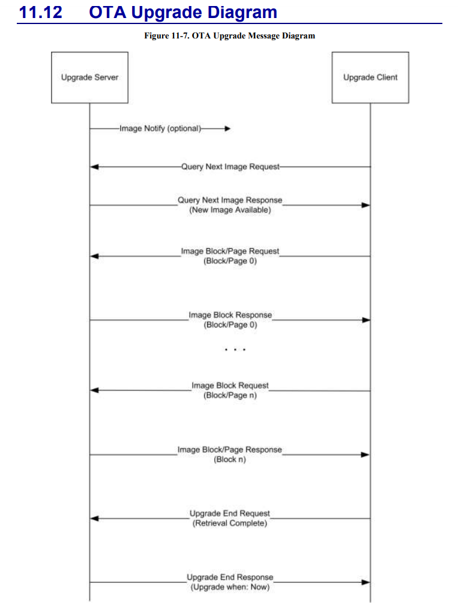

Two devices are involved in the process. The **server**, which can be the coordinator but isn't necessarily so, stores firmware for various client devices on board. The **client** device, if ready to update, sends requests to the server for information on available firmware updates and for the next portion of firmware data.

The client manages the firmware update process. It knows when it's ready to receive new information, while the server plays a passive role. The server does not keep any intermediate update status - all information is stored on the client. However, initiating the firmware update process may fall within the server's responsibilities.

Here’s is the firmware update process stages:
- With the **Image Notify** message, the server can inform a device that new firmware is available. Interestingly, this message might not contain specific information about the firmware itself. It's more of a "*heads up, I have something for you*", prompting the client device to inquire about what exactly the server has.
- The server can notify either a specific device or multiple devices of a certain type and manufacturer at once. For mass updates, end devices start updating their firmware after a random delay to avoid simultaneous updates and network congestion.
- Through a **Query Next Image** message, a device can request the firmware's specifics (version, size, and other parameters) from the server, mentioning its current firmware and hardware version.
- If a new firmware is available for that particular device model and hardware version, the server responds with a **Query Next Image Response** message.
- The device requests small data chunks using the **Image Block Request** message, specifying the number of bytes needed and their offset from the firmware's start. The server responds with the requested bytes in an **Image Block Response** message.
- Zigbee message size limits prevent sending too many bytes at once. For NXP devices, the typical value is 48 bytes. More could theoretically be sent, but messages would then be fragmented and transmitted in pieces, requiring intermediate devices to understand this transmission format and using additional logic and resources to reassemble fragmented packets. This might not necessarily speed up transmission, so it's avoided.
- After downloading the firmware, the device reports to the server with an **Upgrade End Request** message. The client device must verify the firmware for integrity, checksum, and possibly a digital signature, as mentioned in the request. The message also indicates if the device is ready to update, or it requires redownloading the firmware or downloading additional firmware for other microcontrollers in the device.
- The server responds with an **End Upgrade Response** message, specifying when to actually write the firmware to the flash memory. This might be needed for coordinated firmware updates across multiple devices or for coordinating updates within a device with multiple microcontrollers needing separate firmware.

Zigbee2mqtt generally follows this process and implements two scenarios - **check** for available firmware, and actually the firmware **update**.

Let’s talk about how the z2m checks for available updates. I used to think that zigbee2mqtt only looks for firmware updates on an external server and I couldn't understand why the device itself is involved in this process. Here’s how it works.

By default, Zigbee2mqtt (Z2M) doesn't know the current firmware version on the device or the hardware version (different hardware versions may require different firmware). Moreover, the firmware files may be located on an external server, and Z2M doesn't know in advance which firmware versions are available at any given moment. To find out all the necessary information, the following happens:

- Zigbee2mqtt sends an **Image Notify** message to the device ("*device, I have something for you, but I won't tell you what it is in this message*").
- The device sends a **Query Next Image Request** to the server, informing it of the current firmware and hardware version.
- Zigbee2mqtt does **NOT** respond (no **Query Next Image Response** message is sent), and after a timeout, the device returns to its initial state.
- But now, Z2M knows what firmware is installed on the device, what the hardware is, and it can check the external firmware server for updates.
- If an update is found and it is compatible with the device's hardware version, the Zigbee2mqtt dashboard displays this information with a red `Update device firmware` button.

If the user clicks the `Update Device Firmware` button, the process proceeds as described above: **Image Notify** -> **Query Next Image Request** -> **Image Block Request** -> **End Update Request**.

Concluding the description of the general OTA firmware update scheme, I will show a few screenshots from Wireshark. Here is the check for the current firmware version (to later understand if there is an update).

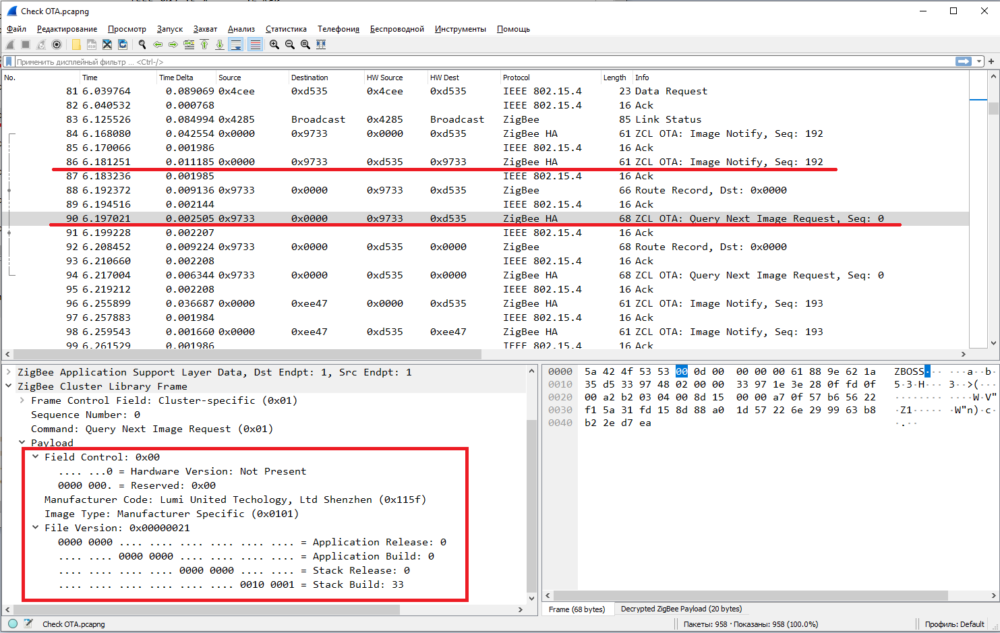

Here are a few screenshots on firmware update process

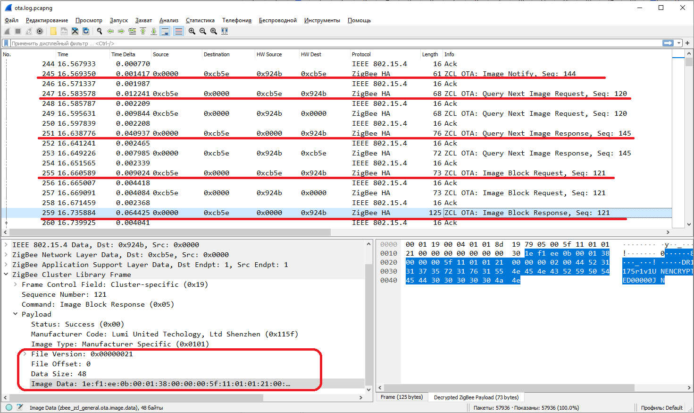

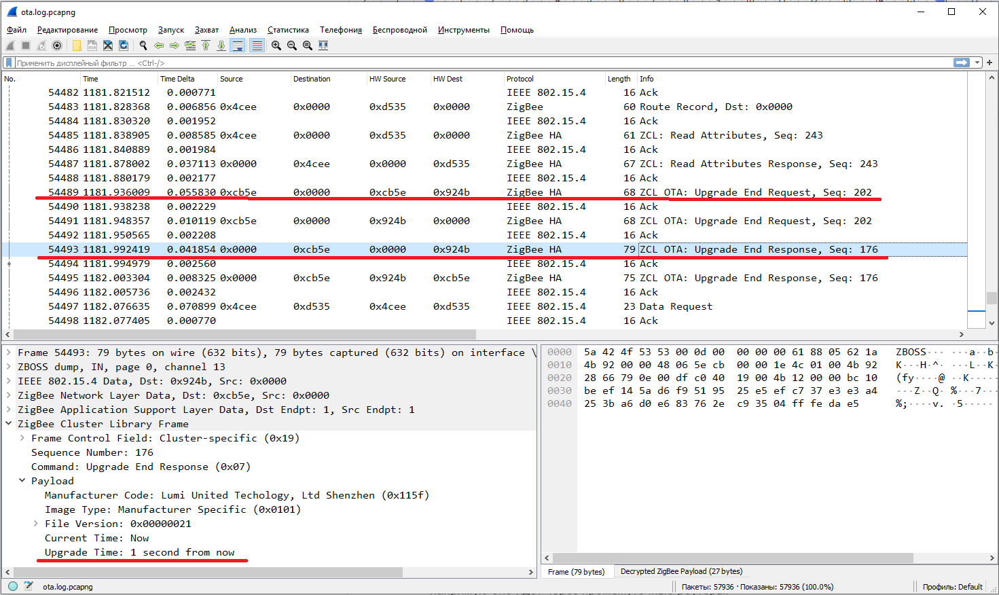

The overall structure of the update seems clear. However, things are not so simple. Now we start to delve into the nuances.

## Rate Limiting

In the screenshots above, you'll notice that OTA messages are just regular Zigbee messages. If a message can't be delivered directly, it goes through intermediate routers. The firmware data messages travel through the network along with normal messages from other devices. If a packet is lost, the message is resent.

Firmware updates for always-sleeping end devices also work. The device just needs to constantly poll the parent router for the next message. This is quite an active and energy-consuming process. So, for battery-powered devices, it's crucial to constantly check the battery level and not start an update if there's not enough charge left.

Also, remember that the Zigbee network's bandwidth isn't very high. The network operates at 250 kBaud rate, but in reality, the actual throughput is lower:
- Many devices share the same frequency, and while one device is updating, the rest must operate normally, sending and receiving their messages. 
- Network-level acknowledgments are sent for most messages, and sometimes application-level ones, which, although briefly, occupy the channel.
- If data is transmitted through an intermediate router, each message is transmitted at least twice - from the sender to the router and from the router to the recipient. All these share the same bandwidth.

Firmware updates involve a considerable amount of data, measured in tens or even hundreds of kilobytes. If streamed continuously, other devices won't be able to send their messages. Therefore, a procedure was devised to limit the data flow rate during firmware transmission.

Here's how it works. The device requests the next block of data with an Image Block Request message. If the network is relatively free, the server sends an Image Block Response with the `SUCCESS` status and the data bytes. But if the network is currently busy, the server responds with an Image Block Response message but with the `WAIT_FOR_DATA` status, indicating how many milliseconds the device should wait before sending another request.

Also, to avoid sending empty messages back and forth, the server can set the `MinBlockRequestDelay` attribute for the client in the OTA cluster, specifying the minimum time the device must wait between requests. For this, the OTA cluster needs to be subscribed to millisecond timer messages, with which the cluster will measure the required time intervals.

However, we won't be dealing with limiting the speed on the firmware side - this functionality is already built into zigbee2mqtt (more precisely, in herdsman-converters). The server itself will monitor the frequency of requests and will maintain intervals of 250ms between packets by simply delaying the Image Block Response packet.


## Persisting state

Since we're transmitting data in small chunks with pauses between packets, firmware updates can take a considerable amount of time, often measured in tens of minutes. During this time, various issues can occur - the battery could get out of power, the electricity could go out, the network could disappear, or the server could break down. In such cases, intermediate state saving in the microcontroller's EEPROM is used. Therefore, it's necessary to be able to restore this state and continue the firmware download.

Fortunately most of this functionality is implemented in the SDK. We only need to provide functions for saving and restoring the state.

## [Optional] Upgrade Server Discovery

I previously outlined scenarios for checking update availability and the update process initiated by the server. In reality, there's another update scenario - nothing prevents the device from initiating the firmware update itself by directly sending a Query Next Image Request to the server.

Generally, the OTA update server and the coordinator don't have to be the same device - the update server might be located at a different address. By default, the device doesn't know where the update server is, requiring certain preliminary steps to configure the client device. This is where the Update Server Discovery procedure comes in.

The process is straightforward. The client device sends a broadcast **Match Descriptor Request** asking, "who supports the OTA Server Cluster?" In response, the server sends back a Match Descriptor Response.

However, that's not all. This way, the client device only learns the server's short 16-bit address, which can change over time. Therefore, a further Lookup IEEE Address request is necessary.

This might seem like a linear algorithm that's easily implemented with async/await in high-level languages like JavaScript or Python. Unfortunately, firmware lacks await, so we must build a state machine, carefully handling requests, responses, and timeouts between them. This is an optional part of the standard and is not implemented in the SDK. In examples from NXP, such a state machine is implemented in about a thousand lines of code.

But there's good news. If we forego the ability for the device to initiate updates and assume that zigbee2mqtt acts as both the coordinator and the update server, we can skip the Update Server Discovery procedure. The server will approach our device with the Image Notify message.


## OTA File Format

Zigbee devices can be built using microcontrollers from various manufacturers and architectures. Naturally, the firmware formats for these microcontrollers will differ. Nevertheless, zigbee2mqtt must somehow distinguish one firmware file from another to offer the correct firmware version to different devices.

Therefore, Zigbee OTA uses a unified firmware format for all manufacturers and microcontroller architectures. This format is detailed in the [Zigbee ZCL specification](https://zigbeealliance.org/wp-content/uploads/2019/12/07-5123-06-zigbee-cluster-library-specification.pdf).

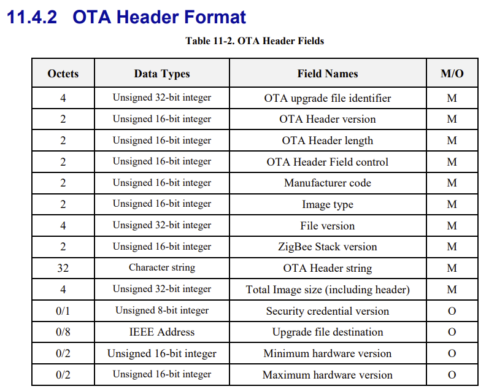

This format differs from what is produced by compilers and linkers. Moreover, an OTA firmware file can include several images, for instance, if the device comprises multiple microcontrollers whose firmware needs updating.

The good news is that this is merely a wrapper over firmware files produced by the compiler. However, creating such wrappers will still require some effort.

## Flash memory remapping feature

If the Zigbee protocol aspects should now be clearer, the JN-AN-1003: JN51xx Boot Loader Operation document explains how firmware is actually loaded into the microcontroller. This document also discusses the firmware format of the microcontroller and how UART firmware upload works.

The microcontroller contains 512 KB of flash memory divided into 16 sectors of 32 KB each. Some of these sectors host the current firmware of the microcontroller. The remaining blocks can be used to store the downloaded firmware. But how does one switch the microcontroller to the new firmware?

It turns out, the JN5169 microcontroller has a sector remapping feature. You can specify which sectors contain the current firmware and where to download the new firmware. The switch to the new firmware simply involves remapping sectors.

Consider an example of how physical and logical sectors are matched.Initially, the numbering of physical and logical sectors will coincide.

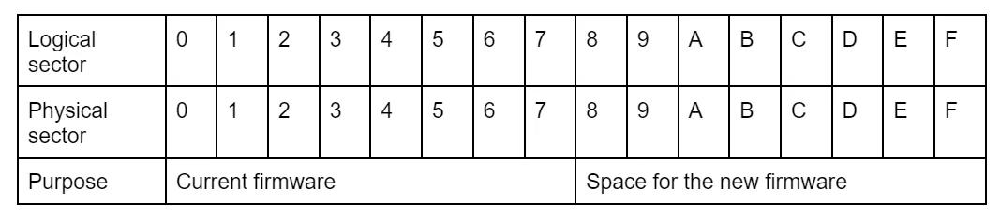

After the new firmware is downloaded into physical sectors 0x8 - 0xF, the microcontroller can carry out a sector remapping procedure - logical sector 0 will then point to physical sector 8, sector 1 to sector 9, and so on (and vice versa). Since the firmware operates on logical addresses, the new firmware will be loaded after reboot.

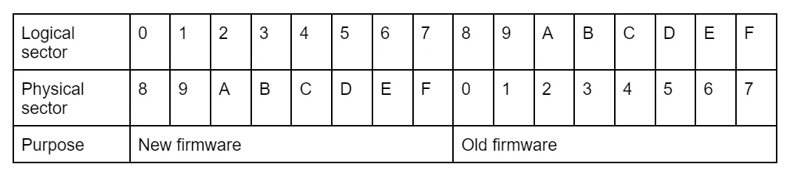

Example above outline the case if firmware size is around 256k and it occupies 8 sectors. The JN-AN-1003 document, as well as Appendix F of the JN-UG-3115 document have special notes for the case if the firmware size is less than 8 sectors. Let’s for example see what happens if the firmware size is just 6 sectors, and it is downloaded to sectors from 0x8 to 0xD, while sectors 0xE and 0xF are unused.

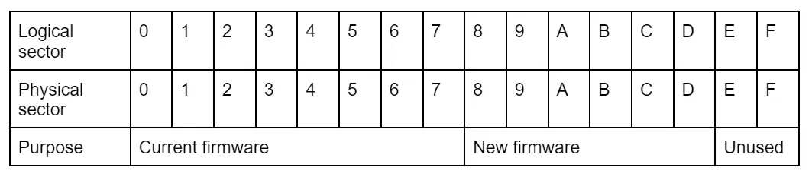

During reboot, the bootloader will remap sectors, but it will only do this for sectors containing the downloaded firmware data (sectors 0x8 to 0xD). This can be useful if we want to preserve some data in the remaining sectors 0xE and 0xF. 

Here is how sector mapping will look after reboot.

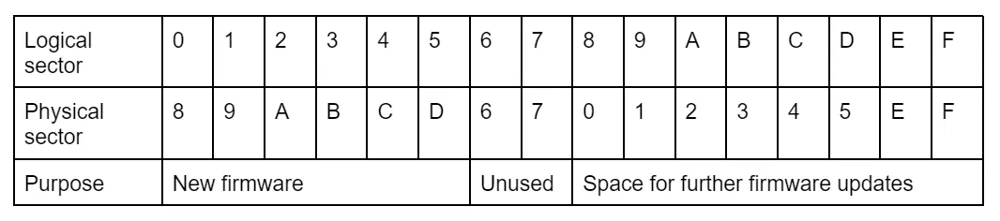

If we decide to update the firmware again, it will be downloaded into logical sectors 0x8 - 0x0F. However, if the next firmware will be larger and use 7 sectors instead of 6, it will be written into physical sectors 0-5 and 0xE. That means the firmware will be written in non-consecutive sectors. First, this may overwrite valuable data in sector 0xE that we possibly wanted to preserve. And second, bootloader requires the image to be located in consecutive sectors, otherwise the firmware will not be loaded correctly.

In our example we will not be using flash sectors for storing any data - the microcontroller has 4k EEPROM which should be enough for values persisted with PDM. In our model we will always swap 8 sectors 0-7 with sectors 8-0xF when performing the firmware update. This will help to avoid sector numbering fragmentation, and simplify the firmware code. Thus current firmware always occupies physical sectors 0-7, and the new firmware will be downloaded to the sectors 8-0xF, then roles swap.

Obviously, the firmware cannot be larger than 256 KB (half of the flash memory). However, the microcontroller (as well as the OTA implementation) supports loading firmware into external SPI flash memory if it's available on the board. So, for those who need more than 256 KB, exploring this option might be useful.


# Implementation
 
## Adding the OTA cluster

So, let's move on to the code. Adding the OTA cluster itself doesn't differ much from adding other clusters. First, we add the OTA cluster in the Zigbee Configuration Editor.

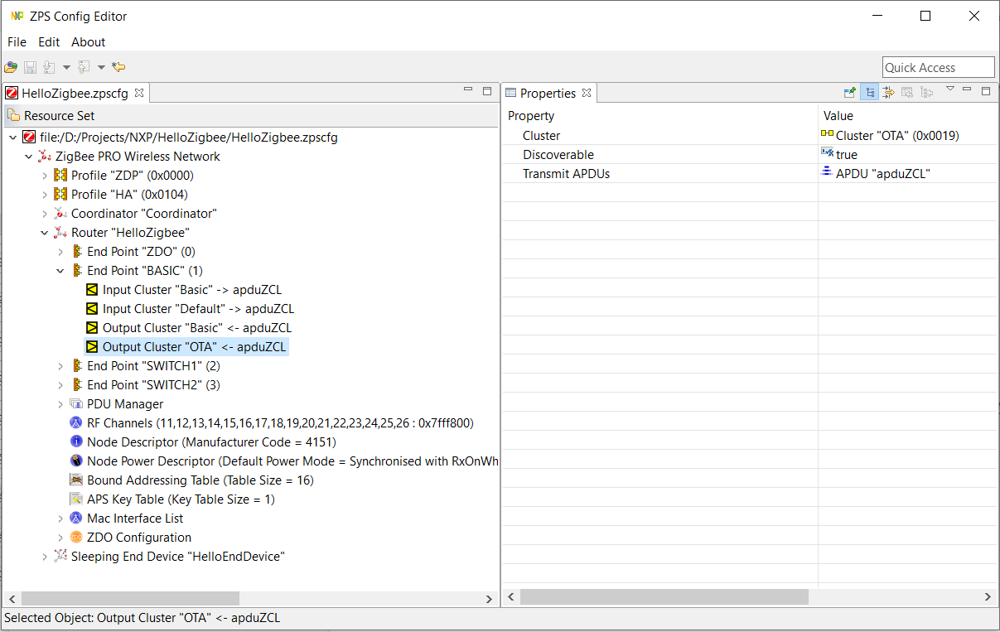

Changes made in the GUI above are translated to zps_gen.c/h files using the ZPSConfig tool, which is executed as a part of the build process.

Next, enable the cluster and its settings in zcl_options.h.

```cpp
#define CLD_OTA
#define OTA_CLIENT
#define OTA_NO_CERTIFICATE
#define OTA_CLD_ATTR_FILE_OFFSET
#define OTA_CLD_ATTR_CURRENT_FILE_VERSION
#define OTA_CLD_ATTR_CURRENT_ZIGBEE_STACK_VERSION
#define OTA_MAX_BLOCK_SIZE 48
#define OTA_TIME_INTERVAL_BETWEEN_RETRIES 10
#define OTA_STRING_COMPARE
#define OTA_UPGRADE_VOLTAGE_CHECK
```

Now, the interesting part begins. These settings warrant some explanation, as without some of them, the OTA cluster won't compile:

- `CLD_OTA` and `OTA_CLIENT` enable the implementation of the OTA cluster in client mode.
- `OTA_NO_CERTIFICATE` - we won't use encryption certificates. We simply don't have these certificates and the library that's used for digital signature verification.
- `OTA_CLD_ATTR_*` enables several OTA cluster attributes. They might not be used in zigbee2mqtt, but let's include them. I enabled attributes that might be interesting.
- `OTA_MAX_BLOCK_SIZE` sets the download block size to 48 bytes. This parameter must be a multiple of 16 to write data to flash memory. It also cannot be too large, as it might exceed the maximum Zigbee packet size.
- `OTA_TIME_INTERVAL_BETWEEN_RETRIES` - the interval in seconds between server request retry attempts (for example, if connection to the server is lost). Just so the client doesn't make requests to the server too frequently.
- `OTA_STRING_COMPARE` enables firmware validity checks, particularly the 32-byte string identifier in the OTA firmware header. If the string doesn't match the expected one, the firmware update stops with an error. Moreover, this check is done at the very beginning of the firmware download: a small piece with the header is downloaded, the string identifier is checked, and if it doesn't match, the firmware isn't even downloaded.
- `OTA_UPGRADE_VOLTAGE_CHECK` enables a battery level check before updating the firmware (and prevents the update if the battery is low). Not relevant for routers, but could be useful for battery-powered devices.

Also, add the define `OTA_INTERNAL_STORAGE` - this setting enables writing to the internal flash memory of the microcontroller (instead of an external flash drive). Although this define is only used in the OTA cluster code, I think this setting relates more to the physical characteristics of the board and microcontroller rather than to OTA cluster settings, so I decided to place it in CMakeList.txt.

```cmake
ADD_DEFINITIONS(
...
        -DOTA_INTERNAL_STORAGE
```

## OTA Cluster Initialization

With the general project settings covered, it's time to write some additional code. The documentation provides detailed descriptions of the initialization process. Interestingly, the NXP examples handle some aspects slightly differently. We'll also allow ourselves to deviate from the documentation, especially since it contains some inaccuracies.

The documentation describes the initialization process as follows.

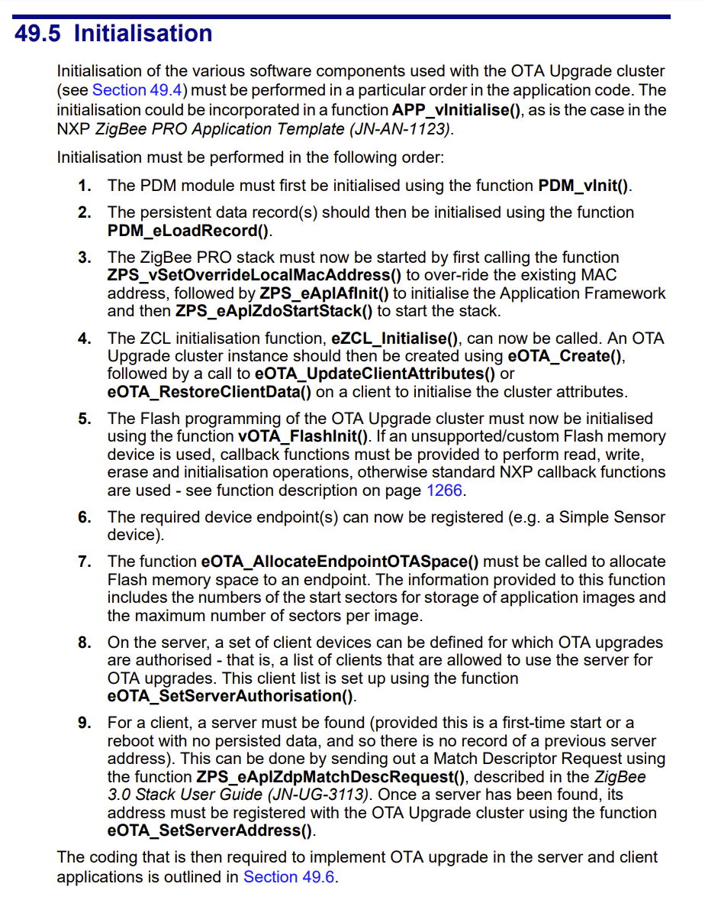

There are no issues with steps 1-3 - we've already done this for our firmware in the Main.cpp. However the fourth step description looks slightly inaccurate. The documentation suggests calling `eOTA_UpdateClientAttributes()` immediately after `eOTA_Create()`. But this doesn't work because `eOTA_UpdateClientAttributes()` requires that the OTA endpoint be registered first. That is, step 6 (registering endpoints) needs to be completed between `eOTA_Create()` and `eOTA_UpdateClientAttributes()`.

In my implementation the OTA cluster will reside along with other general device clusters in the BasicClusterEndpoint class.

```cpp
void BasicClusterEndpoint::init()
{
    registerBasicCluster();
    registerIdentifyCluster();
    registerOtaCluster();
    registerEndpoint();
...
    // Initialize OTA
    otaHandlers.initOTA(getEndpointId());
}
```

OTA Cluster registration is performed with the `eOTA_Create()` function.

```cpp
void BasicClusterEndpoint::registerOtaCluster()
{
    DBG_vPrintf(TRUE, "BasicClusterEndpoint::registerOtaCluster(): Registering ota cluster\n");
    // Create an instance of an OTA cluster as a client */
    teZCL_Status status = eOTA_Create(&clusterInstances.sOTAClient,
                                      FALSE,  /* client */
                                      &sCLD_OTA,
                                      &sOTAClientCluster,  /* cluster definition */
                                      getEndpointId(),
                                      NULL,
                                      &sOTACustomDataStruct);

    if(status != E_ZCL_SUCCESS)
        DBG_vPrintf(TRUE, "BasicClusterEndpoint::registerOtaCluster(): Failed to create OTA Cluster instance. Status=%d\n", status);
}
```

Now it's time to proceed with the OTA initialization. Everything related to OTA (perhaps with the exception of cluster registration) I've moved to a separate class, `OTAHandlers`, simply for the sake of grouping functionality.

```cpp
class OTAHandlers
{
    uint8 otaEp;
    PersistedValue<tsOTA_PersistedData, PDM_ID_OTA_DATA> sPersistedData;
...
```

As step 4 of the instructions suggests, we should initialize the OTA cluster attributes. As I've mentioned, the OTA implementation assumes that the firmware update state will be saved in EEPROM and will be restored after a reboot. I've implemented this as follows.

```cpp
void resetPersistedOTAData(tsOTA_PersistedData * persistedData)
{
    memset(persistedData, 0, sizeof(tsOTA_PersistedData));
}

void OTAHandlers::restoreOTAAttributes()
{
    // Reset attributes to their default value
    teZCL_Status status = eOTA_UpdateClientAttributes(otaEp, 0);
    if(status != E_ZCL_SUCCESS)
        DBG_vPrintf(TRUE, "OTAHandlers::restoreOTAAttributes(): Failed to create OTA Cluster attributes. status=%d\n", status);

    // Restore previous values or reset to zeroes
    sPersistedData.init(resetPersistedOTAData, "OTA Data");
    status = eOTA_RestoreClientData(otaEp, &sPersistedData, TRUE);
    if(status != E_ZCL_SUCCESS)
        DBG_vPrintf(TRUE, "OTAHandlers::restoreOTAAttributes(): Failed to restore OTA data. status=%d\n", status);
}
```

The `eOTA_UpdateClientAttributes()` function sets the cluster attributes to some initial values. 

The firmware upgrade progress is contained in the `tsOTA_PersistedData` structure. It contains all the information that allows the firmware upgrade process to suspend and resume after reboot - currently downloaded firmware metadata, size, current file offset, retries counter, etc. The OTA ZCL implementation periodically saves the current state in the EEPROM.

A second block of code will read the state from flash memory, and restores this information into OTA cluster internal structures. If this is the very first device startup and there's no state record in EEPROM, the `resetPersistedOTAData()` function will be called to initialize the structure with zeros.


## Flash memory initialization

Now it's time to focus on initializing the flash memory, where the firmware will be downloaded.

```cpp
void OTAHandlers::initFlash()
{
    // Fix and streamline possible incorrect or non-contiguous flash remapping
    if (u32REG_SysRead(REG_SYS_FLASH_REMAP) & 0xf)
    {
        vREG_SysWrite(REG_SYS_FLASH_REMAP,  0xfedcba98);
        vREG_SysWrite(REG_SYS_FLASH_REMAP2, 0x76543210);
    }
...
```

This code prepares sectors mapping, so that logical sectors 0-7 and 8-0xF use consecutive physical sectors. The remapping process is described in the dedicated section above.

Next, it's time to initialize the flash memory space where the new firmware will be written. As I've mentioned, the microcontroller supports external memory for firmware. But for now, the internal memory will suffice. (Yes, we've already enabled the define `OTA_INTERNAL_STORAGE`, but it seems that wasn't enough for the NXP developers).

```cpp
    // Initialize flash memory for storing downloaded firmwares
    tsNvmDefs sNvmDefs;
    sNvmDefs.u32SectorSize = 32*1024; // Sector Size = 32K
    sNvmDefs.u8FlashDeviceType = E_FL_CHIP_INTERNAL;
    vOTA_FlashInit(NULL, &sNvmDefs);
```

Here is one more interesting piece of code.

```cpp
    // Fill some OTA related records for the endpoint
    uint8 au8CAPublicKey[22] = {0};
    uint8 u8StartSector[1] = {8};
    teZCL_Status status = eOTA_AllocateEndpointOTASpace(
                            otaEp,
                            u8StartSector,
                            OTA_MAX_IMAGES_PER_ENDPOINT,
                            8,                                 // max sectors per image
                            FALSE,
                            au8CAPublicKey);
    if(status != E_ZCL_SUCCESS)
        DBG_vPrintf(TRUE, "OTAHandlers::initFlash(): Failed to allocate endpoint OTA space (can be ignored for non-OTA builds). status=%d\n", status);
```

This code specifies where to download the new firmware (in our case, starting from logical sector 8) and the maximum firmware size (8 sectors, which is 256k).


## ZCL Timer

Moving on, the firmware update protocol, despite its apparent simplicity, has many potential points of failure - a message might not arrive, arrive late, or contain incorrect data. The internal state machine must be as reliable as possible to handle these situations. If there's an inconsistent state or a timeout occurs, the state machine should return the device to normal operation. In practice, such situations occur quite frequently - in my observations, for my test network, it happens 3-4 times during a single firmware update.

Almost all the clusters we've used so far operate independently of time - they just process incoming requests or send status notifications if an internal event occurred. However, the OTA cluster needs to be aware of time to be able to count down timeouts. For this purpose, the OTA cluster relies on the ZCL timer that ticks once a second. 

We already added the ZCLTimer class while working on a gradual brightness change in this article. So no new code is required. 

```cpp
class ZCLTimer: public PeriodicTask
{
    uint32 tick1s;
    uint32 tick100ms;

public:
    ZCLTimer();
    void init();

protected:
    virtual void timerCallback();
}

void ZCLTimer::init()
{
    PeriodicTask::init(10);
    tick1s = 0;
    tick100ms = 0;
}

void ZCLTimer::timerCallback()
{
    tick1s++;
    tick100ms++;

    if(tick100ms >= 10)
    {
        eZCL_Update100mS();

        tick100ms = 0;
    }

    if(tick1s >= 100)
    {
        // Process ZCL timers
        tsZCL_CallBackEvent sCallBackEvent;
        sCallBackEvent.pZPSevent = NULL;
        sCallBackEvent.eEventType = E_ZCL_CBET_TIMER;
        vZCL_EventHandler(&sCallBackEvent);

        tick1s = 0;
    }
}
```

The internal timer ticks each 10 ms. Once 1 second period is due, the code generates `E_ZCL_CBET_TIMER`, and ZCL does all the OTA jobs for us.

## OTA Event Handling

The OTA cluster fully implements the firmware update process. From time to time, ZCL may send us notifications about the progress of the update. Since everything related to OTA is handled in a separate class, I've set up event redirection to the `OTAHandlers` class.

```cpp
void BasicClusterEndpoint::handleClusterUpdate(tsZCL_CallBackEvent *psEvent)
{
    uint16 clusterId = psEvent->psClusterInstance->psClusterDefinition->u16ClusterEnum;

    switch(clusterId)
    {
...
        case OTA_CLUSTER_ID:
            handleOTAClusterUpdate(psEvent);
            break;
...

void BasicClusterEndpoint::handleOTAClusterUpdate(tsZCL_CallBackEvent *psEvent)
{
    // Parse and process OTA message
    tsOTA_CallBackMessage *psCallBackMessage = (tsOTA_CallBackMessage *)psEvent->uMessage.sClusterCustomMessage.pvCustomData;
    otaHandlers.handleOTAMessage(psCallBackMessage);
}

...

void OTAHandlers::handleOTAMessage(tsOTA_CallBackMessage * pMsg)
{
    vDumpOTAMessage(pMsg);
...
}
```

Most of these events occur just for our information, and do not require a special processing. In fact, I managed to achieve stable firmware updates without implementing a single handler for these events.

However, these events offer the possibility for customization. For example, NXP's examples use OTA events to check the device's need for updates, the integrity of the downloaded firmware, additional timeouts, and to monitor the download status (they've really built a lot on top of the standard implementation).

## [Optional] Saving and restoring the context

The only event that seemed necessary for me to handle is the saving of context. The OTA cluster implementation occasionally saves its state, allowing the firmware download to resume after an unexpected reboot.

The code for saving the state looks like this. The state itself is stored inside the OTA cluster instance, and it needs to be extracted from there. In the NXP examples, they directly access the internals of the OTA, whereas I tried to maintain a semblance of decency and respect for module boundaries.

```cpp
void OTAHandlers::saveOTAContext(tsOTA_PersistedData * pData)
{
    DBG_vPrintf(TRUE, "Saving OTA Context... ");

    // Store the data
    sPersistedData = *pdData;

    DBG_vPrintf(TRUE, "Done\n");
}

void OTAHandlers::handleOTAMessage(tsOTA_CallBackMessage * pMsg)
{
    vDumpOTAMessage(pMsg);

    switch(pMsg->eEventId)
    {
    case E_CLD_OTA_INTERNAL_COMMAND_SAVE_CONTEXT:
        saveOTAContext(&pMsg->sPersistedData);
        break;
    default:
        break;
    }
}
```

State loading and restore also require some improvements (inspired by examples from NXP).

```cpp
void OTAHandlers::restoreOTAAttributes()
{
    // Reset attributes to their default value
    teZCL_Status status = eOTA_UpdateClientAttributes(otaEp, 0);
    if(status != E_ZCL_SUCCESS)
        DBG_vPrintf(TRUE, "OTAHandlers::restoreOTAAttributes(): Failed to create OTA Cluster attributes. status=%d\n", status);

    // Restore previous values or reset to zeroes
    sPersistedData.init(resetPersistedOTAData, "OTA Data");

    // Correct retry timer to force retry in 10 seconds
    if((&sPersistedData)->u32RequestBlockRequestTime != 0)
    {
        DBG_vPrintf(TRUE, "OTAHandlers::restoreOTAAttriutes(): Will retry current operation in 10 seconds (old value %d)\n", (&sPersistedData)->u32RequestBlockRequestTime);
        (&sPersistedData)->u32RequestBlockRequestTime = 10;
    }

    status = eOTA_RestoreClientData(otaEp, &sPersistedData, TRUE);
    if(status != E_ZCL_SUCCESS)
        DBG_vPrintf(TRUE, "OTAHandlers::restoreOTAAttributes(): Failed to restore OTA data. status=%d\n", status);
}
```

A piece of code was added to adjust the `u32RequestBlockRequestTime` variable. By default, it's set to some long timeouts (like one hour), but we'd prefer to resume the firmware download more quickly after a reboot (within 10 seconds).

Honestly, I'm not very confident about this code. At one point, this whole setup got stuck in some inconsistent state. Here's how it happened.

For testing purposes, during a firmware update, I turned off the device to see what would happen once a timeout occurred on zigbee2mqtt. After turning back on, the device restored its previous state. The device attempted to request the next block, which, of course, it didn't receive. After several attempts, the device gave up and returned to normal operation.

The problem was that this "normal state" wasn't saved in EEPROM, and my code wasn't informed about this at all. If the device is rebooted, it reads the incorrect state from EEPROM again and tries to continue the firmware update.

Apparently, to solve this issue, the folks at NXP added another timeout in their examples. When this timeout triggered, they forcibly fixed something in the depths of the OTA cluster, bringing it back to its original state.

I haven't decided yet whether I want to deal with this behavior or disable context saving altogether. It might be better to have the device start with a clean slate after a reboot, and simply restart the firmware update process.

## Fix firmware binary size

Writing to flash memory requires data to be in blocks that are multiples of 16 bytes. Yet, the firmware from the compiler might not always match this size requirement.

Ideally, adjusting the code to add extra bytes when needed should be straightforward. But, there's a glitch in NXP's OTA implementation: if the firmware isn't a 16-byte multiple, the device wrongly asks for more blocks beyond the firmware's actual size after getting the last block.

While it's possible to correct this glitch in the OTA code, changing the SDK code wasn't my choice. Instead, I looked for a method to round the binary size up to a 16-byte multiple, which proved difficult as I had no idea how to achieve this (except maybe adding bytes with a Python script).

Eventually, I managed to get the linker to do this with a specific script.

```
INCLUDE AppBuildZBPro.ld

SECTIONS
{
...
        /*
         * Make a dummy section, so that previous section is padded to a 16-byte boundary
         */
        .pad ((LOADADDR(.text) + SIZEOF(.text) + SIZEOF(.data) + 15) & ~ 15 ):
        {
            . = ALIGN (16);
            LONG(0x00000000)
            LONG(0x00000000)
            LONG(0x00000000)
            LONG(0x00000000)
        } > flash
}
```

The magic behind adjusting the firmware size begins with running the SDK's AppBuildZBPro.ld script first. This script builds the complete binary, inserting needed sections and placing everything correctly in the microcontroller's memory.

The trick involves adding a `.pad` section with 16 zeros. Crucially, this section is set to align with 16 bytes after the .text and .data sections. This alignment makes the linker add just enough bytes before the `.pad` section to ensure the firmware's total size is a 16-byte multiple. Although an extra 4 bytes are also added at the start as a file signature, these aren't considered part of the firmware for OTA updates.

The linker script is included in CMakeList.txt as follows:

```cmake
SET(CMAKE_EXE_LINKER_FLAGS "${CMAKE_EXE_LINKER_FLAGS} -T${HelloZigbee_SOURCE_DIR}/HelloZigbee.ld")
```

The compiler and linker produce an .elf file, which isn't directly loadable into the microcontroller. To convert the .elf file to a flashable binary, we use the `objcopy` utility. Calling this utility is already a part of the build scripts, but we must tell it to keep the `.pad` section. Otherwise, it would throw away the section, and remove the extra bytes before it. We achieve this by adding the `-j .ota` option to the objcopy command.

## Adding OTA Header

Just when you thought it was all figured out, there's more! To make this code function, another bit of linker magic is required. 

The OTA update server must identify the firmware loaded into the microcontroller, including the firmware version, hardware version, firmware file type, and other details. One could compile all this information into the firmware as constants or defines, but NXP developers chose to embed a complete OTA Header in the firmware. Since not all fields of this structure are known at compile time, the firmware code simply reserves space for the structure by adding a `.ro_ota_header` section. This structure is then filled out by the external **Jennic Encryption Tool (JET)** utility directly in the finished firmware binary.

However, there's an issue - JET must know the exact location of the OTA structure within the firmware. This requires the linker to place the .ro_ota_header section at a specific offset from the file's start.

Moreover, there needs to be another section before this one - `.ro_mac_address`. Each chip is assigned a unique MAC address at the factory, but sometimes, this address might need to be overridden using the JET tool. Although we're not using the overriding MAC addresses feature, the .ro_mac_address section has to be in the firmware, otherwise JET could miss the `.ro_ota_header` section.

To ensure all sections are kept in the file, even if unused, we can employ another linker technique. The `KEEP` keyword in the linker script helps achieve this by preserving all necessary sections.

```
SECTIONS
{
        .ro_mac_address :
        {
            KEEP(*(.ro_mac_address));
        } > flash

        .ro_ota_header :
        {
            KEEP(*(.ro_ota_header));
        } > flash
        
        .ro_se_lnkKey :
        {
            KEEP(*(.ro_se_lnkKey));
        } > flash
...
```

Earlier, I pointed out the need to tell the objcopy utility to keep all sections in the resulting binary. This is done by adding `-j .ro_mac_address -j .ro_ota_header` to its command line options.

Regarding the JET utility, which is included in the SDK, its operation is detailed in the [JN-UG-3081 document](https://www.nxp.com/docs/en/user-guide/JN-UG-3081.pdf). Unfortunately, this document doesn't fully clarify the underlying processes. It leaves out some details, assuming prior knowledge. Hence, I had to use a trial-and-error approach to figure out the correct settings.

```
C:\NXP\bstudio_nxp\sdk\JN-SW-4170\Tools\OTAUtils\JET.exe -m otamerge --embed_hdr -c HelloZigbee.bin -o HelloZigbee.ota.bin -v JN516x -n 1 -t 1 -u 0x1037 -j "HelloZigbee2021                 "
```

The meaning of the command line switches are as follows:
- `-m otamerge` activates the mode for merging various OTA information into a single binary.
- `--embed_hdr` activates the sub-mode for embedding the OTA Header into the binary.
- `-c HelloZigbee.bin` specifies the source firmware file obtained from objcopy. -c indicates the firmware is built for an OTA client.
- `-o HelloZigbee.ota.bin` names the resulting file. It can't be placed on the server yet, but it can already be flashed into the microcontroller.
- `-v JN516x` denotes the microcontroller family name (other microcontrollers have a different firmware format).
- `-n 1` sets the firmware file version.
- `-t 1` sets the firmware file type (relevant if we had multiple microcontrollers on board, each requiring its firmware. We will have only one type).
- `-u 0x1037` specifies the manufacturer ID. For now, I use NXP's.
- `-j "HelloZigbee2021                 "` (exactly like this, with lots of spaces) - flashes a 32-byte string into the OTA header. This string is then checked during firmware updating (the firmware to be updated must have exactly the same header string, otherwise the firmware will not be loaded).

Note, that firmware version embedded in the OTA header is not the same as the firmware version string reported by Basic Cluster and shown on the Z2M device info page - that is just a string, which does not participate in the firmware update process.

## ОТА Firmware

These steps allow us to create the proper firmware, ready to be flashed into the microcontroller. Once done, any function that needs to access the OTA header within the firmware will operate as intended. However, just creating the correct firmware isn't enough to upload it to the server for OTA updates.

As explained earlier, the structure for firmware intended for OTA updates is specified by the Zigbee standard. This firmware essentially wraps around the primary microcontroller firmware, providing a format suitable for wireless updating.

To prepare this type of file, we use the JET utility again, but with a different setting: the `--ota` option, instead of `--embed_hdr` used previously. This approach ensures the firmware is in the right format for OTA deployment.

```
JET.exe -m otamerge --ota -v JN516x -n 2 -t 1 -u 0x1037 -p 1 -c HelloZigbee.bin -o HelloZigbee.ota
```

Here is the parameters explanation:

- `-m otamerge` activates the mode for merging different OTA information into a single binary.
- `--ota` activates the sub-mode for compiling OTA format firmware from one or several binaries.
- `-c HelloZigbee.bin` specifies the source firmware file obtained in the previous step (with the embedded OTA header). -c is used because it's for an OTA client.
- `-o HelloZigbee.ota` names the resulting file, which can then be placed on the server.
- `-v JN516x` denotes the microcontroller family name (other microcontrollers have a different firmware format).
- `-n 2` sets the firmware file version.
- `-t 1` sets the firmware file type (relevant if we had multiple microcontrollers on board, each requiring its firmware. We will have only one type).
- `-u 0x1037` specifies the manufacture]r ID. For now, I use NXP's.
- `-p 1` is a very important switch. It adds a 4-byte signature at the beginning of the file. Without it, zigbee2mqtt refuses to accept such firmware.

Ideally, it would be good to set up some CI to automatically generate a version number that increments with each build. But since I was too lazy to set up CI at the moment, I use the following hack. When building firmware that will be flashed via the flash tool, I specify version #1. And when compiling firmware to be placed on the server, I embed #2 (see the `-n 2` key). This way, the version on the server is always newer than one in the microcontroller. Of course, for real devices, this should be done more professionally.

I've encapsulated all the above-described wizardry into several CMake functions.

```cmake
FUNCTION(ADD_HEX_BIN_TARGETS TARGET)
    IF(EXECUTABLE_OUTPUT_PATH)
      SET(FILENAME "${EXECUTABLE_OUTPUT_PATH}/${TARGET}")
    ELSE()
      SET(FILENAME "${TARGET}")
    ENDIF()
    ADD_CUSTOM_TARGET(OUTPUT "${TARGET}.hex"
        DEPENDS ${TARGET}
        COMMAND ${CMAKE_OBJCOPY} -Oihex ${FILENAME} ${FILENAME}.hex
    )
    ADD_CUSTOM_TARGET("${TARGET}.bin"
        DEPENDS ${TARGET}
        COMMAND ${CMAKE_OBJCOPY} -j .version -j .bir -j .flashheader -j .vsr_table -j .vsr_handlers -j .rodata -j .text -j .data -j .bss -j .heap -j .stack -j .ro_mac_address -j .ro_ota_header -j .pad -S -O binary ${FILENAME} ${FILENAME}.tmp.bin
        COMMAND "${SDK_PREFIX}\\Tools\\OTAUtils\\JET.exe" -m otamerge --embed_hdr -c ${FILENAME}.tmp.bin -v JN516x -n 1 -t 1 -u 0x1037 -o ${FILENAME}.bin
    )
ENDFUNCTION()

FUNCTION(ADD_OTA_BIN_TARGETS TARGET)
    IF(EXECUTABLE_OUTPUT_PATH)
      SET(FILENAME "${EXECUTABLE_OUTPUT_PATH}/${TARGET}")
    ELSE()
      SET(FILENAME "${TARGET}")
    ENDIF()
    ADD_CUSTOM_TARGET(${TARGET}.ota
        DEPENDS ${TARGET}.bin
	# HACK/TODO: setting file version to 2 (-n 2), so that OTA image is always newer than current version
        COMMAND "${SDK_PREFIX}\\Tools\\OTAUtils\\JET.exe" -m otamerge --ota -v JN516x -n 2 -t 1 -u 0x1037 -p 1 -c ${FILENAME}.bin -o ${FILENAME}.ota
    )
ENDFUNCTION()
```

It's important to note that the resulting OTA file will contain two OTA headers:
- The first is an outer wrapper, ensuring the firmware adheres to the Zigbee standard. This header informs zigbee2mqtt about the characteristics of the firmware file.
- The second is embedded within the firmware itself. During the OTA update process, the outer wrapper is discarded, leaving the embedded OTA header as the source for the firmware to understand its own details, such as version, name string, manufacturer code, etc.

## OTA firmware update with zigbee2mqtt

To initiate an OTA firmware upgrade via the zigbee2mqtt dashboard, we must first configure our device converter to recognize that the device supports OTA updates. We'll employ the standard OTA procedures facilitated by the herdsman-converter for this purpose.

```js
const ota = require('zigbee-herdsman-converters/lib/ota')

const device = {
...
    ota: ota.zigbeeOTA
};
```

The OTA firmware update is performed at the OTA tab on the z2m dashboard. 

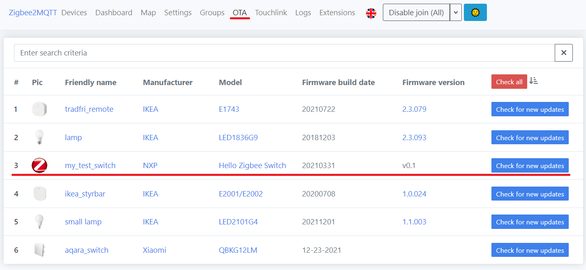

When you click the 'Check for new updates' button in the zigbee2mqtt dashboard, the zigbee herdsman queries [an online list](https://github.com/Koenkk/zigbee-OTA/blob/master/index.json) for available firmware updates. Naturally, this list won't include our custom firmware. However, Zigbee Herdsman allows for the use of index override files, which can specify local files. For these local files, we don't need to fill out all the details - just the file location is required. So, our index file will be set up accordingly.

```json
[
    {
        "url": "HelloZigbee.ota",
        "force": true
    }
]
```

Zigbee2mqtt checks the firmware version available on the server against the version currently on the device and suggests an upgrade only if the server version is newer. During development, it might be useful to compel zigbee2mqtt to upgrade to a specific firmware, regardless of the version comparison. For this purpose, we include the `"force": true` option in the index file. This setting instructs zigbee2mqtt to proceed with the firmware update even if the version on the device is the same or newer than the one on the server.

Now this index shall be enabled in the configuration.yaml.

```yaml
ota:
    zigbee_ota_override_index_location: index.json
```

The HelloZigbee.ota firmware file and the index.json need to be placed in the data directory, right alongside the configuration.yaml file. After restarting, zigbee2mqtt will recognize the index file and include our firmware in the list of available updates.

When you click on the 'Check for new updates' button, zigbee2mqtt will inquire about the device's current firmware version. If the firmware on the server is newer than the one on the device, or if the "force" option is enabled, zigbee2mqtt will then propose a firmware update.

# Summary

Phew, that was probably the most challenging part. It's not that there's a lack of information - on the contrary, I had to digest too much all at once. However, once I figured it out and everything was organized, it turned out not to be so difficult.

In this article, I've shown how to perform an over-the-air firmware update for your Zigbee device. I tried to provide not only a step-by-step guide but also explained the purpose of each step and what would happen if things were done differently. 

# Links

- Documents
  - [ZigBee Class Library specification](https://zigbeealliance.org/wp-content/uploads/2019/12/07-5123-06-zigbee-cluster-library-specification.pdf)
  - [JN-UG-3113 ZigBee 3.0 Stack User Guide](https://www.nxp.com/docs/en/user-guide/JN-UG-3113.pdf)
  - [JN-UG-3115 ZigBee Cluster Library (for ZigBee 3.0) User Guide](https://www.nxp.com/docs/en/user-guide/JN-UG-3115.pdf)
  - [Application Note: JN-AN-1003: JN51xx Boot Loader Operation](https://www.nxp.com/docs/en/application-note/JN-AN-1003.pdf)
  - [JN-UG-3081 JN51xx Encryption Tool (JET) User Guide](https://www.nxp.com/docs/en/user-guide/JN-UG-3081.pdf)
  - [How to support new device in zigbee2mqtt](https://www.zigbee2mqtt.io/advanced/support-new-devices/01_support_new_devices.html)
- Code
  - [Project on github](https://github.com/grafalex82/hellozigbee)
