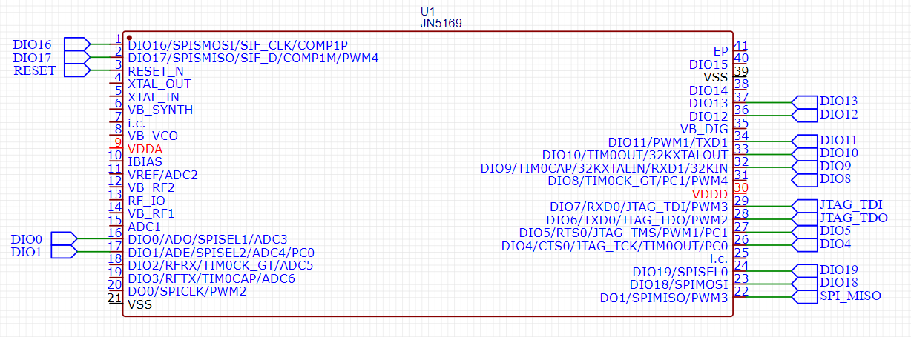
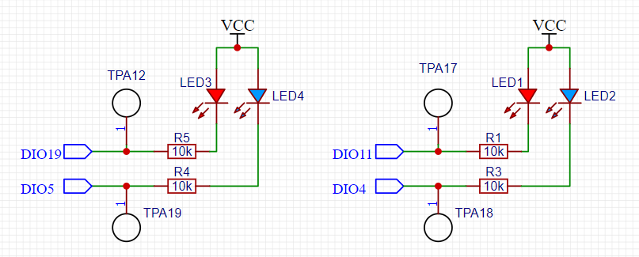
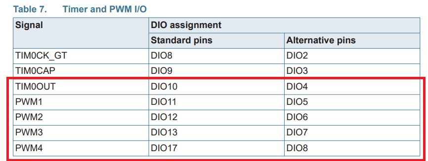
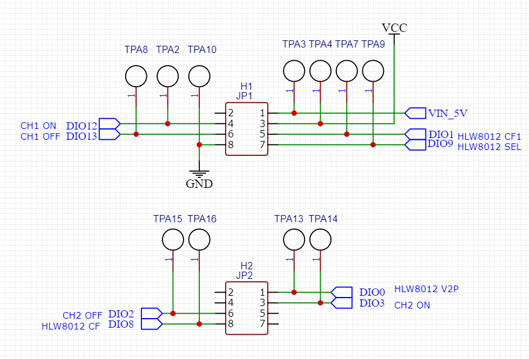
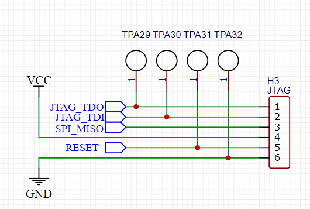
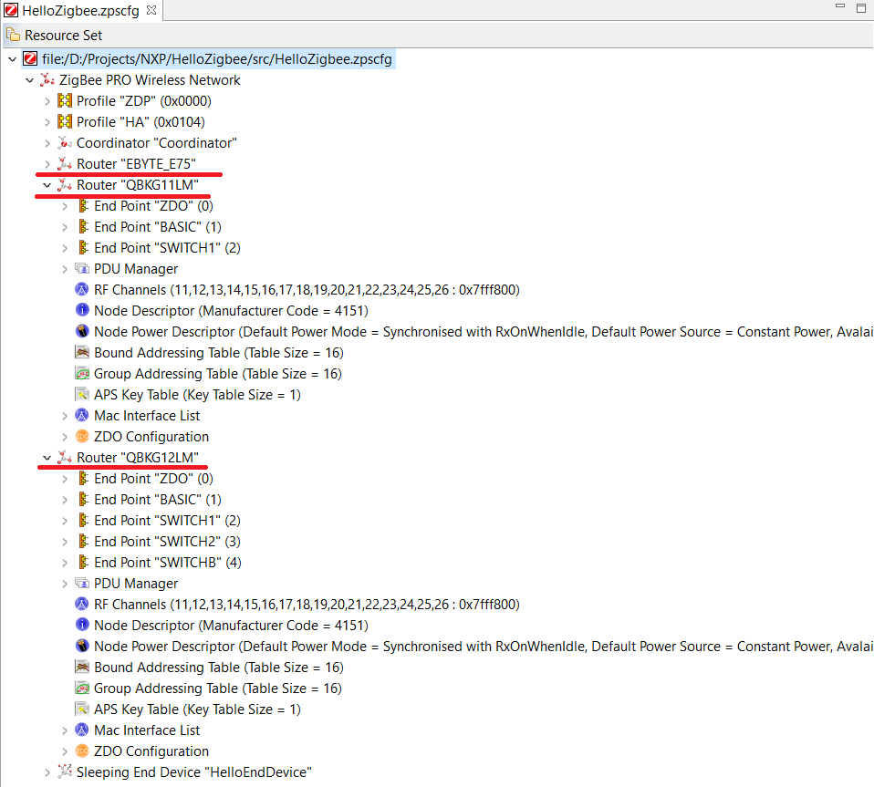

# Hello Zigbee World, Part 26 - Running custom firmware on Xiaomi Aqara QBKG12LM hardware

Welcome back to our [Hello Zigbee series](part0_plan.md), where we're building firmware for a Zigbee smart switch from the ground up. Today, we're applying what we've learned. After covering basics, setting up our work environment, and delving into Zigbee's complex network features, we're moving to an exciting phase: putting our work into action on a real device, the Xiaomi Aqara QBKG12LM smart switch.

As you might recall, we chose the NXP JN5169 microcontroller for this project because Xiaomi devices use it in their devices. In this article, we'll dive into the Aqara QBKG12LM switch, understanding its schematics, and adapting the firmware we've developed. Additionally, as Xiaomi's devices often share design elements, we'll write our code to be extendable for more models in future.

**Warning!!!** We are entering a danger zone. The Xiaomi Aqara device contains high-voltage parts. Incorrect firmware updates or testing can cause injury, damage the switch, or harm connected devices like laptops. The firmware work is ongoing, and not yet tested well. Use it at your own risk. Always disconnect the switch from the main power source before connecting it to the laptop. Safety first!


## Reverse engineer the schematics

To adapt our firmware to a mass-produced device, we need to reverse engineer its schematics. This helps us understand the connections for onboard LEDs and buttons, how it controls the device relays, and how to connect it to a flashing tool. With a good magnifying glass and a multimeter, this task is quite manageable.

The device features a CPU board, which houses the microcontroller, antenna, buttons, and LEDs, and a power board that contains the power supply and relays. Interestingly, both the QBKG12LM 2-gang switch and the QBKG11LM 1-gang switch use the same CPU and power boards. The only difference is the number of buttons and relays soldered on it. Therefore, this article will focus on porting to both QBKG11LM and QBKG12LM switches.

It's important to note that the board part number discussed in this article is `LM15-LNS-PA-A-T0`. The QBKG03LM and QBKG04LM switches (ones without a neutral line)  use a different board version - `LM15-NN-A-T2`. While the schematics of these boards are very similar, there are differences in header pinouts and the CPU pins used. Porting the code to these boards is not covered in this article and remains an ongoing task. 

The MCU itself does not feature any complex schematics.



Here is the buttons part. 


The design for both button channels is very similar. Pressing the buttons connects the CPU pins to the ground. When released, the pins are pulled high again by an external resistor. For the 1-gang switch, the center button is wired in parallel with the right button of the 2-gang switch, but only one is soldered on at any given time.

The way LEDs are connected is also quite simple.



It should be noted that on our development board, LEDs were linked to pins capable of PWM. Sadly, not all LEDs on the Xiaomi device are connected to PWM-compatible pins. We might be able to use PWM for the blue LEDs, but the red LEDs can only be used in on/off mode.



For this project, the linear power supply, MCU reset circuit, and antenna amplifier components are not our focus, so these parts were not reverse engineered. What matters for our work is the connection with the power board, and pins assignment.



Let's concentrate on the relay circuits on the power board.


The circuit utilizes the Panasonic ADW1203HL bi-stable relay, which is essential for preserving the relay's state during power outages. Toggling the relay on or off requires two separate signal lines. However, there's no feedback line to the CPU board, so it must track the state in EEPROM.

The relay can operate on either 3.3V or 5V, depending on the specific relay model (only one of the jumper resistors is soldered at a time). The coils are activated using a transistor. The schematics presented only illustrate one channel, the second channel follows a similar design.

Shifting focus back to the CPU board, the lines needed to program the chip are also accessible on programming pads.



The CPU board typically receives power from a 5V supply through the H1 header. The board includes a 3.3V linear stabilizer that supplies power to the MCU and relays. The 3.3V VCC line is also available on the JTAG header (H3), allowing the board to be powered via a standard USB-UART converter.

Recalling from the article on bringing up the JN5169 MCU, the MISO line needs to be connected to ground while reset to switch the MCU to bootloader mode. For ease of use, I've designed an adapter board that incorporates reset and boot buttons into the schematic, as well as a capacitor for programmatic reset through the DTR pin. 


This concludes reverse engineering of the hardware for this article. The power management feature using the HLW8012 chip is beyond the scope of this article, so this part of the schematics has not been reverse-engineered yet.


## Target board selection infrastructure

Clearly, the firmware developed for the dev board based on the EBYTE E75–2G4M10S module won't work on the Xiaomi device due to the use of different pins. The 1-gang and 2-gang switches have a varying number of Zigbee endpoints, which also affects the firmware. Therefore, we need a method to define multiple configurations, and select the target board for the firmware. It would also be wise to create an adaptable infrastructure to support other types of switches in future, such as those without a neutral line or wireless relays. We shouldn't overlook the development board used in earlier articles either, as it could serve for further development.

Let's begin by introducing a CMake option.

```cmake
# Select the board
set(SUPPORTED_BOARDS
    "EBYTE_E75" # Custom 2-gang switch board based on EBYTE E75-2G4M20S1E module
    "QBKG11LM"  # Aqara Wall Switch (1-gang)
    "QBKG12LM"  # Aqara Wall Switch (2-gang)
    )
if(NOT DEFINED BOARD)
    set(BOARD "EBYTE_E75" CACHE STRING "Select the board to build for (${SUPPORTED_BOARDS})")
endif()

list(FIND SUPPORTED_BOARDS "${BOARD}" BOARD_INDEX)
if(BOARD_INDEX EQUAL -1)
    message(FATAL_ERROR "Unsupported BOARD specified. Supported options are: ${SUPPORTED_BOARDS}")
endif()
```

Given that various devices might have distinct endpoints and clusters within those endpoints, it makes sense to define device configurations individually. Luckily, the Zigbee3ConfigurationEditor allows for the inclusion of multiple devices within a single file, facilitating this process.



The configurations can be easily identified by their names when using the ZPS Config and PDUM Config tools. This is done by passing the board name as a parameter to the tool commands.

```cmake
# Every Zigbee application would need zps_gen.c and pdum_gen.c generated files
function(generate_zps_and_pdum_targets ZPSCFG_FILE)
    add_custom_command(
        OUTPUT
            zps_gen.c
            zps_gen.h
        COMMAND ${ZPS_CONFIG}
                -n ${BOARD}
                -f ${ZPSCFG_FILE}
                -o ${CMAKE_CURRENT_BINARY_DIR}
                -t ${JENNIC_CHIP}
                -l ${SDK_PREFIX}/Components/Library/libZPSNWK_${JENNIC_CHIP_FAMILY}.a
                -a ${SDK_PREFIX}/Components/Library/libZPSAPL_${JENNIC_CHIP_FAMILY}.a
                -c ${TOOLCHAIN_PREFIX}
        DEPENDS ${ZPSCFG_FILE}
    )

    add_custom_command(
        OUTPUT
            pdum_gen.c
            pdum_gen.h
            pdum_apdu.S
        COMMAND ${PDUM_CONFIG}
                -z ${BOARD}
                -f ${ZPSCFG_FILE}
                -o ${CMAKE_CURRENT_BINARY_DIR}
        DEPENDS ${ZPSCFG_FILE}
    )
```

Obviously,  the firmware code needs to be aware of which board is selected. This selection is made using a specific define, which is passed from the CMakeLists.txt.

```cmake
add_definitions(
        -DTARGET_BOARD_${BOARD}
...
```

Based on the selected board, the firmware needs to choose the correct pins for LEDs and buttons, register the appropriate endpoints, and set up Zigbee configurations. Given we'll adjust a multitude of Zigbee and non-Zigbee settings based on the chosen board, it makes sense to centralize this process. A suitable location for such settings is zcl_options.h.

Let's start by examining the settings for the board we've used before, as it seems to have the most comprehensive configuration.

```cpp
#elif defined(TARGET_BOARD_QBKG12LM)    // This section describes QBKG12LM Xiaomi Aqara 2-gang switch
    #define CLD_BAS_MODEL_ID_STR        "hello.zigbee.QBKG12LM"
    #define CLD_BAS_MODEL_ID_SIZE       21

    //#define HEARTBEAT_LED_PIN           (X)  // No spare pins for the heartbeat LED
    //#define HEARTBEAT_LED_MASK          (1UL << HEARTBEAT_LED_PIN)

    #define SWITCH1_BTN_PIN             (18)
    #define SWITCH1_BTN_MASK            (1UL << SWITCH1_BTN_PIN)
    #define SWITCH2_BTN_PIN             (10)
    #define SWITCH2_BTN_MASK            (1UL << SWITCH2_BTN_PIN)

    //#define SUPPORTS_PWM_LED          // LEDs on the QBKG12LM are connected to non-PWM pins
    #define LED1_RED_PIN                (19)
    #define LED1_RED_MASK_OR_TIMER      (1UL << LED1_RED_PIN)
    #define LED1_BLUE_PIN               (5)
    #define LED1_BLUE_MASK_OR_TIMER     (1UL << LED1_BLUE_PIN)
    #define LED2_RED_PIN                (11)
    #define LED2_RED_MASK_OR_TIMER      (1UL << LED2_RED_PIN)
    #define LED2_BLUE_PIN               (4)
    #define LED2_BLUE_MASK_OR_TIMER     (1UL << LED2_BLUE_PIN)

    #define RELAY1_ON_PIN               (17)
    #define RELAY1_ON_MASK              (1UL << RELAY1_ON_PIN)
    #define RELAY1_OFF_PIN              (16)
    #define RELAY1_OFF_MASK             (1UL << RELAY1_OFF_PIN)
    #define RELAY2_ON_PIN               (13)
    #define RELAY2_ON_MASK              (1UL << RELAY2_ON_PIN)
    #define RELAY2_OFF_PIN              (12)
    #define RELAY2_OFF_MASK             (1UL << RELAY2_OFF_PIN)

    #define BASIC_ENDPOINT              (QBKG12LM_BASIC_ENDPOINT)
    #define SWITCH1_ENDPOINT            (QBKG12LM_SWITCH1_ENDPOINT)
    #define SWITCH2_ENDPOINT            (QBKG12LM_SWITCH2_ENDPOINT)
    #define SWITCHB_ENDPOINT            (QBKG12LM_SWITCHB_ENDPOINT)
    #define ZCL_NUMBER_OF_ENDPOINTS     (4)
```

While the names of these settings are self explanatory, some deserve extra notes:
- **CLD_BAS_MODEL_ID_STR**: This setting is linked to the Basic Cluster. Zigbee2mqtt uses this string to identify the correct converter. Naturally, this string will vary across different target boards.
- **Heartbeat LED**: The E75–2G4M10S module-based board features a dedicated heartbeat LED, useful for indicating whether the device is active or not. Unfortunately, the Xiaomi boards do not have any spare pins available for soldering, so we must forgo the heartbeat functionality.
- **SUPPORTS_PWM_LED**: This define activates PWM functionality for LEDs, assuming they're connected to suitable PWM-capable pins. As mentioned, the Xiaomi boards connect LEDs to regular GPIO pins, requiring us to disable the PWM feature.
- **Endpoint IDs in ZPS Config**: The ZPS Config tool assigns endpoint IDs with defines that incorporate the board name prefix (e.g., QBKG12LM), leading to different defines for different boards. We need to redefine these constants so the client code can use a universal name across all boards.
- **Endpoints Number Constant**: Surprisingly, despite ZPS Config having comprehensive knowledge about the device's Zigbee setup, it doesn't generate a constant for the number of endpoints, requiring manual definition.

Although directly working with pin numbers might seem intuitive, there are scenarios where accessing multiple pins simultaneously is necessary. For instance, the QBKG11LM board has two pairs of LEDs connected to different pins that need to be toggled together, making a pin mask the better choice in such cases.

```cpp
#elif defined(TARGET_BOARD_QBKG11LM)    // This section describes QBKG11LM Xiaomi Aqara 1-gang switch
...
    //#define SUPPORTS_PWM_LED          // LEDs on the QBKG11LM are connected to non-PWM pins
    #define LED1_RED_PIN_1              (19)    // The QBKG11LM has 2 pairs of LEDs, but they are used synchronously
    #define LED1_RED_PIN_2              (11)
    #define LED1_RED_MASK_OR_TIMER      (1UL << LED1_RED_PIN_1) | (1UL << LED1_RED_PIN_2)
    #define LED1_BLUE_PIN_1             (5)
    #define LED1_BLUE_PIN_2             (4)
    #define LED1_BLUE_MASK_OR_TIMER     (1UL << LED1_BLUE_PIN_1) | (1UL << LED1_BLUE_PIN_2)
```

## Adjusting LEDs code

Remarkably, transitioning our previously developed code to the Xiaomi Aqara board required no significant modifications. The adjustments were minor, such as using #ifdef statements to exclude the heartbeat LED or the second button channel on 1-gang switch boards.

The most substantial adaptation involved getting LEDs connected to regular GPIO pins to work. As you might recall, we had established a framework for controlling LEDs connected to PWM pins, which allowed us to create simple visual effects for the Identify cluster and gradual brightness change. Now, it's time to tweak our code to accommodate regular LEDs as well.

The choice between PWM and non-PWM modes is managed by the `SUPPORTS_PWM_LED` define.

```cpp
class LEDHandler
{
#ifdef SUPPORTS_PWM_LED
    PWMPin pin;             // The Pin object where the LED is connected
#else
    GPIOOutput pin;         // The Pin object where the LED is connected
#endif
```

Identifying pins differs between these modes: PWM mode needs a timer ID, where each timer is linked to a specific pin, whereas GPIO mode uses a pin mask.

```cpp
void LEDHandler::init(uint32 pinMaskOrTimer)
{
    pin.init(pinMaskOrTimer);
    ...
```

The effects engine will continue to use 0-255 brightness level values, but in GPIO mode, only two levels are distinguished - 0 (OFF) and non-0 (ON).

```cpp
void LEDHandler::setPWMLevel(uint8 level)
{
#ifdef SUPPORTS_PWM_LED
...
    pin.setLevel(level2pwm[level]);
#else // SUPPORTS_PWM_LED
    pin.setState(level == 0);   // 0 - OFF, Non-0 - ON, pin is inverted
#endif // SUPPORTS_PWM_LED
}
```

The visual effects were modified to suit regular GPIO values. As a result, the breathe effect has been simplified to a blinking LED.

```cpp
const LEDProgramEntry BREATHE_EFFECT[] =
{
    {LED_CMD_MOVE_TO_LEVEL, 255, 255},  // Turn on for 0.5s
    {LED_CMD_PAUSE, 10, 0},              
    {LED_CMD_MOVE_TO_LEVEL, 0, 255},    // Turn off for 0.5s
    {LED_CMD_PAUSE, 10, 0},              

    {LED_CMD_REPEAT, 4, 15},            // Jump 4 steps back, Repeat 15 times

    {LED_CMD_STOP, 0, 0},
};
```

## Relay Driver

Now, we'll tackle the core part of this project - creating a class to control the relay. The Xiaomi board employs a bi-state relay, which requires two GPIO pins: one to turn the relay on and another to switch it off.

To toggle the relay, we send a 300ms pulse to the appropriate line. This duration is sufficient to activate the relay, and there's no need to maintain power to the relay coil beyond this. Using a `sleep()` function for these 300ms isn't viable, as it would halt other device functionalities. Instead, we'll utilize a timer-based state machine for this operation.

Let's introduce a class dedicated to managing a single relay with on and off pins.

```cpp
class RelayHandler
{
    GPIOOutput onPin;
    GPIOOutput offPin;
    uint8 remainingTicks;

public:
    bool pulseInProgress() const {return remainingTicks > 0;}
```

By default, the pins are set to low levels.

```cpp
void RelayHandler::init(uint32 onPinMask, uint32 offPinMask)
{
    onPin.init(onPinMask);
    onPin.off();
    offPin.init(offPinMask);
    offPin.off();
    remainingTicks = 0;
}
```

To change the relay state, a pulse is generated on one of the pins for 300 ms.

```cpp
const uint8 PULSE_DURATION = 300 / 50; // 300 ms pulse duration / 50 ms per tick

void RelayHandler::setState(bool state)
{
    onPin.setState(state);
    offPin.setState(!state);

    remainingTicks = PULSE_DURATION;
}
```

The driver will be updated externally every 50 ms.

```cpp
void RelayHandler::update()
{
    if(remainingTicks > 0)
    {
        remainingTicks--;
        if(remainingTicks == 0)
        {
            onPin.off();
            offPin.off();
        }
    }
}
```

The relay task is a timer-based entity responsible for controlling both device relays.

```cpp
class RelayTask : public PeriodicTask
{
    RelayHandler ch1;
    RelayHandler ch2;

public:
    static RelayTask * getInstance();
```

Initializing relay drivers and managing state change requests are straightforward processes, although they are somewhat cluttered with #ifdefs.

```cpp
RelayTask::RelayTask()
{
    PeriodicTask::init(50);

#ifdef RELAY1_ON_MASK
    ch1.init(RELAY1_ON_MASK, RELAY1_OFF_MASK);
#endif

#ifdef RELAY2_ON_MASK
    ch2.init(RELAY2_ON_MASK, RELAY2_OFF_MASK);
#endif
}

void RelayTask::setState(uint8 ep, bool on)
{
#ifdef RELAY1_ON_MASK
    if(ep == SWITCH1_ENDPOINT)
        ch1.setState(on);
#endif

#ifdef RELAY2_ON_MASK
    if(ep == SWITCH2_ENDPOINT)
        ch2.setState(on);
#endif

    startTimer(50);
}
```

To save CPU cycles, the timer only ticks when a pulse is active. Once the pulse has ended, the timer is stopped.

```cpp
void RelayTask::timerCallback()
{
    bool pulseInProgress = false;

#ifdef RELAY1_ON_MASK
    ch1.update();
    pulseInProgress |= ch1.pulseInProgress();
#endif
#ifdef RELAY2_ON_MASK
    ch2.update();
    pulseInProgress |= ch2.pulseInProgress();
#endif

    if(!pulseInProgress)
        stopTimer();
}
```

The relays are toggled by the relevant code in the SwitchEndpoint.

```cpp
void SwitchEndpoint::doStateChange(bool state, bool sourcedFromInterlockBuddy)
{
...
    RelayTask::getInstance()->setState(getEndpointId(), state);
...
}
```

## Extending zigbee2mqtt converter

The zigbee2mqtt converter needs to be modified to show different options based on the selected board. Some options are common across all boards, and these settings have been consolidated into a common definition.

```js
const common_definition = {
    vendor: 'DIY',
    fromZigbee: [fz.on_off, fromZigbee_OnOffSwitchCfg, fromZigbee_MultistateInput, fromZigbee_OnOff, fromZigbee_LevelCtrl, fz.device_temperature],
    toZigbee: [tz.on_off, toZigbee_OnOffSwitchCfg],
    configure: async (device, coordinatorEndpoint, logger) => {
...
    },
    meta: {multiEndpoint: true},
    ota: ota.zigbeeOTA
};
```

Board-specific settings have been relocated to a definitions array, which is made available from the converter module. Each definition builds upon the common definition, showcasing the necessary endpoints and their settings.

```js
const definitions = [
...
    {
        ...common_definition,
        zigbeeModel: ['hello.zigbee.QBKG12LM'],
        model: 'QBKG12LM',
        description: 'Hello Zigbee Switch firmware for Aqara QBKG12LM',
        exposes: [
            e.action(genSwitchActions(["left", "right", "both"])),
            genSwitchEndpoint("left", true),
            genSwitchEndpoint("right", true),
            genBothButtonsEndpoint("both"),
            ...getGenericSettings()
        ],
        endpoint: (device) => {
            return {
                "common": 1,
                "left": 2,
                "right": 3,
                "both": 4
            };
        },
    },
];
```

Because all the boards utilize the same building blocks and clusters, there was no need to modify the from- and to-zigbee converters.

The specific converter is determined by the zigbeeModel string, which needs to align with the one defined in the `CLD_BAS_MODEL_ID_STR` setting within zcl_options.h.

Interestingly, zigbee2mqtt employs the `model` string to display the device's picture and link to its page.


## OTA Firmware Updates

The OTA firmware update process is designed to be independent of any target board specifics, allowing for firmware updates as outlined in the previous article. An interesting question arises: Can the OTA update mechanism be used to replace stock firmware with our custom version?

Fortunately, the firmware files for the first series of Aqara devices are not encrypted and don't employ any specific protection mechanisms beyond those provided by the ZCL SDK and the examples from NXP. In particular, when a firmware binary is uploaded to the device, it checks for certain parameters: the manufacturer code, firmware type, link key, and a 32-character firmware string. If these parameters align with those of the current firmware, the device permits the new firmware to be flashed.

So, what's our approach? We simply use the same values that Aqara uses. The link key is standard and hardcoded in the code.

```cpp
// Pre-configured Link Key (Use one that match Xiaomi Aqara devices - ZigbeeAlliance09)
uint8 s_au8LnkKeyArray[16] __attribute__ ((section (".ro_se_lnkKey")))
= { 0x5A, 0x69, 0x67, 0x42, 0x65, 0x65, 0x41, 0x6C, 0x6C, 0x69, 0x61, 0x6E, 0x63, 0x65, 0x30, 0x39};
```

Other parameters we'll incorporate CMake code to set the default values for these firmware parameters.

```cmake
# Function that checks if a variable is provided, otherwise it will be set to a default value
function(set_build_param VAR_NAME DEFAULT_VALUE)
    if(NOT DEFINED ${VAR_NAME})
        set(${VAR_NAME} ${DEFAULT_VALUE} CACHE STRING "Default value for ${VAR_NAME}")
    endif()
endfunction()

# Set various build parameters
set_build_param(BUILD_NUMBER "1")
set_build_param(MANUFACTURER_ID "0x115F")
set_build_param(FIRMWARE_FILE_TYPE 257)
set_build_param(FIRMWARE_STRING "DR1175r1v1UNENCRYPTED00000JN5169")
```

Regarding the build number, the NXP SDK contains a verification process ensuring that the build number of the new firmware is higher than the current one. Although zigbee2mqtt has a force option allowing firmware of any version to be sent to the device, the device might still reject firmware that is older than its current version. In such scenarios, a flashing tool is required to upload the desired firmware.

The [most recent official firmware](https://github.com/Koenkk/zigbee-OTA/blob/master/images/Lumi/20230202185209_OTA_lumi.ctrl_ln2.aq1_0.0.0_0095_20220725_0B0798.ota) for the QBKG12LM switch was released in 2022, with version number 95 (as indicated by the byte at offset 0x0e). To successfully update our custom firmware over the air, it must be compiled with a version number of 96 or higher.

```
cmake ... -DBOARD=QBKG12LM -DBUILD_NUMBER=96 ...
```

To substitute the stock firmware with our custom firmware in zigbee2mqtt, we can utilize a [local OTA index](https://www.zigbee2mqtt.io/guide/usage/ota_updates.html#local-ota-index-and-firmware-files). This approach allows us to direct zigbee2mqtt to use our custom firmware for updates instead of the default, official firmware.

```json
[
    {
        "modelId": "lumi.ctrl_ln2.aq1",
        "url": "HelloZigbee.ota",
        "force": true
    }
]
```

Zigbee2mqtt identifies the firmware to use based on the modelId field (the stock firmware identifies itself as `lumi.ctrl_ln2.aq1`). Since we're keeping all other parameters (manufacturer ID, link key, and firmware type) the same as the original firmware, our custom firmware will be correctly matched for updates. To ensure that zigbee2mqtt always proposes the update, regardless of version numbers, we'll use the force setting. This method has successfully allowed the stock firmware to be updated to the Hello Zigbee firmware.

To revert to the stock firmware, a similar approach is needed. The necessary information should be added to the local OTA index to facilitate this process.

```json
[
    {
        "modelId": "hello.zigbee.QBKG12LM",
        "url": "20230202185209_OTA_lumi.ctrl_ln2.aq1_0.0.0_0095_20220725_0B0798.ota",
        "force": true
    }
]
```

When it comes to firmware updates, there are several important points to consider:
- The device does not check the firmware for compatibility. It's possible to accidentally flash firmware intended for a different device model. The checks in place only verify the ManufacturerID, firmware type, firmware string (and that the build version is higher than the current one).
- If the alternate firmware utilizes different parameters (like the 'HelloZigbee' firmware string mentioned in the previous article), the OTA firmware update process won't allow for switching between stock and alternate firmware. Therefore, to enable switching between stock and custom firmware, Aqara’s/Lumi’s parameter values must be used.
- After switching from stock to alternate firmware (or vice versa), zigbee2mqtt might still recognize the device as operating on the old firmware. To resolve this, the device should be removed from the network (e.g., kicking the device out), and zigbee2mqtt needs to be restarted to clear its runtime cache. Once the device is rejoined, zigbee2mqtt will re-interview the device, recognize the new device model string, and apply the correct converter.

## Tests adjustments

Tests need to consider the capabilities of the target board and exclude tests that are not relevant for the selected board. For instance, a 1-gang switch only supports 1 endpoint, lacks a distinct both-buttons endpoint, and the Interlock feature is completely irrelevant for it.

Incorporating an option into the pytest.ini file to indicate this is straightforward. Here is the fixture that reads the name from the INI file.

```python
# Ensure we are running tests for the proper board
@pytest.fixture(scope="session")
def target_board(pytestconfig, device_name, bridge):
    assert bridge.get_device_model(device_name) == pytestconfig.getini('target_board')
    yield pytestconfig.getini('target_board')
```

It's crucial to verify that the device is registered in zigbee2mqtt under the correct target board. Running tests intended for a different device model would lead to inaccurate results.

```python
class Bridge:
...
    def get_device_model(self, device_name):
        # Iterate on the list of all devices, look for the requested device
        info = self.zigbee.get_retained_topic(self.topic + '/devices')
        for device in info:
            if device['friendly_name'] != device_name:
                continue


            # All devices for this project must identify itself as hello.zigbee.<board_name>
            return device['model_id'].replace("hello.zigbee.", "")
```

Several functions are designed to specify a list of endpoints applicable to various boards, ensuring compatibility and functionality across different device models.

```python
# List of smart switch channels (endpoint number and z2m name)
def server_channels(target_board):
    if target_board == "E75-2G4M10S" or target_board == "QBKG12LM":
        return [
            {"id": 2, "name": "left", "allowInterlock": True},
            {"id": 3, "name": "right", "allowInterlock": True}
        ]
    if target_board == "QBKG11LM":
        return [{"id": 2, "name": "button", "allowInterlock": False}]


def client_channels(target_board):
    if target_board == "E75-2G4M10S" or target_board == "QBKG12LM":
        return [
            {"id": 2, "name": "left"},
            {"id": 3, "name": "right"},
            {"id": 4, "name": "both"}
        ]
    if target_board == "QBKG11LM":
        return [{"id": 2, "name": "button"}]


def is_one_button_device(target_board):
    return target_board == "QBKG11LM"
```

The most complex aspect involves adjusting test parameterization based on the selected board. Usually, tests leverage the `@pytest.mark.parametrize` feature, which allows defining a specific set of parameters for test execution. In our scenario, the list of parameters is determined by a function that returns a list of endpoints, which, in turn, is dependent on target board settings specified in pytest.ini or passed as command-line parameters. Luckily, pytest provides a way to perform some "magic". It allows enabling parameterization at runtime through a function, accommodating dynamic test setups based on board selection.

```python
# Make each test or fixture parameterized with server or client channel list
def pytest_generate_tests(metafunc):
    if "server_channel" in metafunc.fixturenames:
        target_board = metafunc.config.getini("target_board")
        metafunc.parametrize("server_channel", server_channels(target_board), ids=lambda x: x["name"])
    if "client_channel" in metafunc.fixturenames:
        target_board = metafunc.config.getini("target_board")
        metafunc.parametrize("client_channel", client_channels(target_board), ids=lambda x: x["name"])
```

When encountering a test that utilizes `server_channel` as a parameter, pytest invokes the `server_channels()` function mentioned earlier to generate a list of endpoints. This approach ensures the test is executed for each endpoint, with the lambda portion creating a user-friendly name for the test parameter.

Additionally, another technique is employed to skip tests for boards lacking support for specific features. This ensures that only relevant tests are run, aligning the testing process more closely with the capabilities of the targeted hardware configuration.

```python
# Skip tests that are not applicable to the current board
def pytest_collection_modifyitems(config, items):
    target_board = config.getini("target_board")
    for item in items:
        if "skip_on_one_button_devices" in item.keywords and is_one_button_device(target_board):
            item.add_marker(pytest.mark.skip(reason="Not supported on one-button devices"))
```

Based on the returned value of the `is_one_button_device()` function, tests annotated with the skip_on_one_button_devices mark will be automatically skipped. This ensures that tests irrelevant to single-button devices are not executed.

```python
@pytest.mark.skip_on_one_button_devices
def test_attribute_client_only_operation_mode(bswitch):
    ...
```

This specific test is designed to operate on the both buttons endpoint. However, this endpoint does not exist on the 1-gang switch, indicating that the test is not applicable for this device model.

## Summary

In this article, we successfully adapted our custom firmware for the Xiaomi Aqara QBKG12LM smart switch. The process involved reverse engineering the switch to learn about its buttons, LEDs, and relays. We made changes to handle LEDs connected to standard non-PWM pins and created a new relay control method. We also updated the zigbee2mqtt converter to recognize different switch models and prepared for over-the-air (OTA) firmware updates. Finally, we adjusted our testing approach to match the specific features of each switch model.

This effort enables our custom firmware to operate on Xiaomi Aqara switches, demonstrating how to customize software for mass produced devices. However, this project is ongoing, and some functionalities, like power monitoring, are yet to be developed.

While the firmware operates as intended, comprehensive testing is still pending. Please use it at your own discretion. Nevertheless, we welcome feedback and issue reports to refine our development further.

## Links

- Documents
  - [JN5169 Microcontroller Datasheet](https://www.nxp.com/docs/en/data-sheet/JN5169.pdf)
  - [JN-UG-3087 JN516x Integrated Peripherals API User Guide](https://www.nxp.com/docs/en/user-guide/JN-UG-3087.pdf)
  - [How to support new device in zigbee2mqtt](https://www.zigbee2mqtt.io/advanced/support-new-devices/01_support_new_devices.html)
  - [JN-UG-3081 JN51xx Encryption Tool (JET) User Guide](https://www.nxp.com/docs/en/user-guide/JN-UG-3081.pdf)
  - [ZigBee Class Library specification](https://zigbeealliance.org/wp-content/uploads/2019/12/07-5123-06-zigbee-cluster-library-specification.pdf)
- Code
  - [Project on github](https://github.com/grafalex82/hellozigbee)
