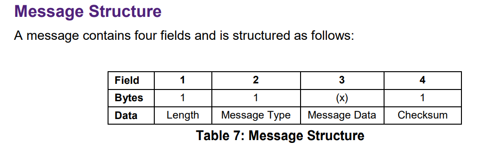

# Hello Zigbee World, Part 27 - Custom flash tool for JN5169 microcontroller

Welcome to the latest addition to our [Hello Zigbee series](part0_plan.md), where we delve into the intricacies of utilizing Zigbee technology for smart devices. In this article we will make a spin off of the main Zigbee topic, and dive into how to flash the NXP JN5169 microcontroller. This adventure not only demystifies the flashing protocol but also introduces a custom-built flash tool in Python. Our motivation springs from the need to extend the functionality of the original `JN51xxProgrammer.exe` tool, which is confined to Windows, to other platforms. 

Having our own flashing tool opens the door to a possibility of remote devices flashing over the network. This functionality is not just a luxury, but will be handy for flashing smart switches and relays that are already mounted, and can’t be dismantled for flashing a new firmware.

We will meticulously unravel the protocol, providing readers with a comprehensive guide on interacting with the microcontroller’s bootloader. Through hands-on examples and step-by-step instructions, we will guide readers through the process of building a versatile flash tool that transcends platform boundaries and introduces the possibility of network-based flashing. 

# Protocol sniffer

The protocol is partially described in the JN-AN-1003 document. It follows the request-response pattern, where the flashing tool drives the process. The protocol includes a few dozens of command types, each has the following structure.



Although the commands are straightforward (for example, reading a section of RAM or writing bytes to flash), the document doesn't explain the overall process of flashing. Luckily, the protocol is simple and can be captured from an actual device during the flashing process.

One could use a logic analyzer or a COM port sniffer, but I chose a more challenging and interesting approach. I plan to create a program that acts as a middleman between the flashing software and the device. This program will intercept messages, decode them, and record the protocol details in a log. Below is a diagram of this setup.

```
JN51xxProgrammer.exe <-> COM1 <-> COM2 <-> Proxy <-> COM3 <-> JN5169
```

I'll use the `HHD Virtual Serial Port Tools` app to set up virtual COM ports, COM1 and COM2 in my case (the free version doesn't let me choose port numbers). This setup will make the `JN51xxProgrammer.exe` believe it's communicating with a real port, COM1, but actually, the data will be sent over to COM2. Then, my custom sniffer program will act as a bridge between the virtual COM2 and the actual COM3 port, which is connected to the microcontroller. This sniffer will both capture and parse the data that flows through.

Let's start building this sniffing/proxy tool in Python.

```python
def main():
    parser = argparse.ArgumentParser(description="Proxy and dump JN5169 flashing messages")
    parser.add_argument("srcport", help="Source serial port (flasher side)")
    parser.add_argument("dstport", help="Destination serial port (device side)")
    parser.add_argument("-v", "--verbose", nargs='?', choices=["none", "protocol", "raw"], help="Set verbosity level", default="none")
    args = parser.parse_args()
   
    print(f"Starting proxy on {args.srcport} and {args.dstport} ports")
    src = serial.Serial(args.srcport, baudrate=38400)
    dst = serial.Serial(args.dstport, baudrate=38400)

    while True:
        transferMsg(">", src, dst, args.verbose)
        transferMsg("<", dst, src, args.verbose)
```

The program opens two COM ports: one facing the flashing tool and the other connected to the microcontroller. Given that the protocol works on a request-response basis, we can alternate the messages between the two ports.

To correctly transfer a message, we need to understand its size, which is given by the first byte of the message, and then proceed to read and forward the entire message based on this information.

```python
def transferMsg(direction, src, dst, verbose):
    header = src.read(2)
    msglen, msgtype = struct.unpack('BB', header)
    data = src.read(msglen - 1)

    if verbose != "none":
        dumpMessage(direction, msglen, msgtype, data, verbose == "raw")

    dst.write(header)
    dst.write(data)
```

Having the full message received we can make a raw dump as a hex.

```python
def dumpMessage(direction, msglen, msgtype, data):
    if verbose == "none":
        return

    # Dump all the message including msg length, type, data, and CRC as is
    if (verbose == "raw") or (msgtype not in dumpers):
        print(f"{direction} {msglen:02x} {msgtype:02x} {' '.join(f'{x:02x}' for x in data)}")
   
    # If there is a dumper for this message type, call it (strip CRC byte from data)
    if msgtype in dumpers:
        dumpers[msgtype](data[:-1])
```

The message payload differs depending on the message type. We can use it to parse the message, and dump it in a human readable form. The Python struct package is handy to parse binary structures.

```python
def dumpGetChipIDRequest(data):
    print(">>  Chip ID Request")


def dumpGetChipIDResponse(data):
    # As per documentation, the chip ID response has only status byte, and ChipID (4 bytes)
    # However the real device sends one more 4 byte value. As per `JN51xxProgrammer.exe` sources these 4 bytes might be the bootloader version.
    bootloaderVer = None
    if len(data) == 5:
        status, chipId = struct.unpack('>BI', data)
    else:
        status, chipId, bootloaderVer = struct.unpack('>BII', data)

    print(f"<<  Chip ID Response: Status=0x{status:02x}, ChipID=0x{chipId:08x}, BootloaderVer=0x{bootloaderVer:08x}")


def dumpRAMWriteRequest(data):
    addr = struct.unpack("<I", data[0:4])
    data = data[4:]
    print(f">>  Write RAM Request: Address=0x{addr[0]:08x}, Len=0x{len(data):02x}, Data: {' '.join(f'{x:02x}' for x in data)}")


def dumpRAMWriteResponse(data):
    status = data[0]
    print(f"<<  Write RAM Response: Status=0x{status:02x}")


def dumpRAMReadRequest(data):
    addr, len = struct.unpack("<IH", data)
    print(f">>  Read RAM Request: Address=0x{addr:08x}, Length=0x{len:04x}")


def dumpRAMReadResponse(data):
    status = data[0]
    print(f"<<  Read RAM Response: Status=0x{status:02x}, Data: {' '.join(f'{x:02x}' for x in data[1:])}")


def dumpSelectFlashTypeRequest(data):
    flash, addr = struct.unpack("<BI", data)
    print(f">>  Select Flash Type: FlashType={flash}, Address=0x{addr:08x}")


def dumpSelectFlashTypeResponse(data):
    status = data[0]
    print(f"<<  Select Flash Type Response: Status=0x{status:02x}")


def dumpReadFlashIdRequest(data):
    print(">>  Read Flash ID Request")


def dumpReadFlashIdResponse(data):
    status, manufacturerId, flashId = struct.unpack('>BBB', data)
    print(f"<<  Read Flash ID Response: Status=0x{status:02x}, ManufacturerID=0x{manufacturerId:02x}, FlashID=0x{flashId:02x}")


def dumpFlashEraseRequest(data):
    print(">>  Flash Erase Request")


def dumpFlashEraseResponse(data):
    status = data[0]
    print(f"<<  Flash Erase Response: Status=0x{status:02x}")


def dumpFlashReadRequest(data):
    addr, len = struct.unpack("<IH", data)
    print(f">>  Read Flash Request: Address=0x{addr:08x}, Length=0x{len:04x}")


def dumpFlashReadResponse(data):
    status = data[0]
    print(f"<<  Read Flash Response: Status=0x{status:02x}, Data: {' '.join(f'{x:02x}' for x in data[1:])}")


def dumpFlashWriteRequest(data):
    addr = struct.unpack("<I", data[0:4])
    data = data[4:]
    print(f">>  Write Flash Request: Address=0x{addr[0]:08x}, Len=0x{len(data):02x}, Data: {' '.join(f'{x:02x}' for x in data)}")


def dumpFlashWriteResponse(data):
    status = data[0]
    print(f"<<  Write Flash Response: Status=0x{status:02x}")


def dumpResetRequest(data):
    print(">>  Reset Request")


def dumpResetResponse(data):
    status = data[0]
    print(f"<<  Reset Response: Status=0x{status:02x}")


def dumpRunRequest(data):
    addr = struct.unpack("<I", data)
    print(f">>  Run Request: Address=0x{addr[0]:08x}")


def dumpRunResponse(data):
    status = data[0]
    print(f"<<  Run Response: Status=0x{status:02x}")


def dumpChangeBaudRateRequest(data):
    divisor = data[0]
    baudrate = "Unknown"
    match divisor:
        case 1: baudrate = 1000000
        case 2: baudrate = 500000
        case 9: baudrate = 115200
        case 26: baudrate = 38400
        case _: baudrate = f"Unknown (divisor={divisor})"
    print(f">>  Change Baud Rate Request: Baudrate={baudrate}")


def dumpChangeBaudRateResponse(data):
    status = data[0]
    print(f"<<  Change Baud Rate Response: Status=0x{status:02x}")


dumpers = {
    FLASH_ERASE_REQUEST: dumpFlashEraseRequest,
    FLASH_ERASE_RESPONSE: dumpFlashEraseResponse,
    FLASH_WRITE_REQUEST: dumpFlashWriteRequest,
    FLASH_WRITE_RESPONSE: dumpFlashWriteResponse,
    FLASH_READ_REQUEST: dumpFlashReadRequest,
    FLASH_READ_RESPONSE: dumpFlashReadResponse,
    RESET_REQUEST: dumpResetRequest,
    RESET_RESPONSE: dumpResetResponse,
    RAM_WRITE_REQUEST: dumpRAMWriteRequest,
    RAM_WRITE_RESPONSE: dumpRAMWriteResponse,
    RAM_READ_REQUEST: dumpRAMReadRequest,
    RAM_READ_RESPONSE: dumpRAMReadResponse,
    RUN_REQUEST: dumpRunRequest,
    RUN_RESPONSE: dumpRunResponse,
    READ_FLASH_ID_REQUEST: dumpReadFlashIdRequest,
    READ_FLASH_ID_RESPONSE: dumpReadFlashIdResponse,
    CHANGE_BAUD_RATE_REQUEST: dumpChangeBaudRateRequest,
    CHANGE_BAUD_RATE_RESPONSE: dumpChangeBaudRateResponse,
    SELECT_FLASH_TYPE_REQUEST: dumpSelectFlashTypeRequest,
    SELECT_FLASH_TYPE_RESPONSE: dumpSelectFlashTypeResponse,
    GET_CHIP_ID_REQUEST: dumpGetChipIDRequest,
    GET_CHIP_ID_RESPONSE: dumpGetChipIDResponse,
    EEPROM_READ_REQUEST: dumpEEPROMReadRequest,
    EEPROM_READ_RESPONSE: dumpEEPROMReadResponse,
    EEPROM_WRITE_REQUEST: dumpEEPROMWriteRequest,
    EEPROM_WRITE_RESPONSE: dumpEEPROMWriteResponse,
}
```

# Reverse engineering the protocol

So now we have a dumper tool in our hands and can sniff the real world data. But things are not so simple - the protocol has the possibility to change baud rate on the fly. The communication always starts at 38400, but after a few messages the flashing tool sends the request to bump the baud rate to 1000000. This is a nice feature for the flashing tool, which reduces flashing time from a minute to just a few seconds. But supporting this feature at this point may be quite complicated.

Fortunately the `JN51xxProgrammer.exe` has a command line option to limit the communication speed to 38400. Thus, the command line for flashing a firmware to the NXP JN5169 microcontroller will look as follows

```
"C:\NXP\ProductionFlashProgrammer\JN51xxProgrammer.exe" -V 0 -s COM1 -P 38400 -f HelloZigbee.bin
```

Let’s take a look at the protocol dump.

```
>>  Chip ID Request
<<  Chip ID Response: Status=0x00, ChipID=0x0100b686, BootloaderVer=0x000b0002
>>  Read RAM Request: Address=0x01001500, Length=0x0010
<<  Read RAM Response: Status=0x00, Data: ff ff ff ff ff ff ff ff ff ff ff ff ff ff ff ff
```

As per documentation, the flashing tool is versatile, supporting a range of microcontrollers from the JN5139 up to the JN5169, and potentially even models like the JN5179 and JN5189. Thus the first thing the flashing tool is performing is checking the microcontroller type. 

However, the official documentation falls short by not listing the ChipIDs for the all supported microcontrollers. Through some online research on forums, I stumbled upon a package named `JN-SW-4407-JN51xx-ProductionFlashProgrammer_v2123_FULL_SOURCE_NDA_ONLY.tar.gz`, which appears to contain the source code for the flashing tool. The naming suggests it's covered by an NDA, raising doubts about the legality of sharing these details publicly. Nevertheless, this source code revealed that the ChipID for the JN5169 is 0xb686, with the higher bits indicating a chip revision.

Interestingly, the ChipID Response command returns 9 bytes, contrary to the 5 bytes mentioned in the documentation. According to the source code of the flashing tool, the additional bytes indicate the bootloader version.

Moving forward, the flashing tool then requests 16 bytes from a certain RAM location, which the documentation vaguely refers to as for 'internal use'. However, the source code clarifies that these bytes actually detail some form of memory configuration.

The subsequent series of commands seem to be an effort to identify the type of flash memory connected to the microcontroller.

```
>>  Select Flash Type: FlashType=4, Address=0x00000000
<<  Select Flash Type Response: Status=0x00
>>  Read Flash ID Request
<<  Read Flash ID Response: Status=0xfe, ManufacturerID=0x00, FlashID=0x00
>>  Select Flash Type: FlashType=0, Address=0x00000000
<<  Select Flash Type Response: Status=0x00
>>  Read Flash ID Request
<<  Read Flash ID Response: Status=0xfe, ManufacturerID=0x00, FlashID=0x00
>>  Select Flash Type: FlashType=5, Address=0x00000000
<<  Select Flash Type Response: Status=0x00
>>  Read Flash ID Request
<<  Read Flash ID Response: Status=0xfe, ManufacturerID=0x00, FlashID=0x00
>>  Select Flash Type: FlashType=3, Address=0x00000000
<<  Select Flash Type Response: Status=0x00
>>  Read Flash ID Request
<<  Read Flash ID Response: Status=0xfe, ManufacturerID=0x00, FlashID=0x00
>>  Select Flash Type: FlashType=1, Address=0x00000000
<<  Select Flash Type Response: Status=0x00
>>  Read Flash ID Request
<<  Read Flash ID Response: Status=0xfe, ManufacturerID=0x00, FlashID=0x00
>>  Select Flash Type: FlashType=2, Address=0x00000000
<<  Select Flash Type Response: Status=0x00
>>  Read Flash ID Request
<<  Read Flash ID Response: Status=0xfe, ManufacturerID=0x00, FlashID=0x00
```

In our setup, because we're not utilizing external flash memory, these commands receive an error status in response.

Following that, the next series of commands are designed to retrieve information from specific memory areas within the microcontroller. These areas are typically reserved for crucial system information or configuration settings, indicating that the flashing tool is attempting to gather essential details about the microcontroller's environment and operational parameters.

```
>>  Read RAM Request: Address=0x01001570, Length=0x0008
<<  Read RAM Response: Status=0x00, Data: ff ff ff ff ff ff ff ff
>>  Read RAM Request: Address=0x01001580, Length=0x0008
<<  Read RAM Response: Status=0x00, Data: 00 15 8d 00 02 b5 01 a7
>>  Read RAM Request: Address=0x01001400, Length=0x0010
<<  Read RAM Response: Status=0x00, Data: ff ff ff ff ff ff ff ff ff ff ff ff ff ff ff ff
>>  Read RAM Request: Address=0x01001510, Length=0x0010
<<  Read RAM Response: Status=0x00, Data: ff ff ff ff ff ff ff ff ff ff ff ff ff ff ff ff
```

The memory address `0x01001570` is used for an overridden MAC address, which is not present in our setup. The addresses at `0x01001580` contain the MAC addresses flashed by the factory. The purpose of the data at `0x01001400` is not mentioned in the available documentation. According to the sources of the flashing tool this variable is named as IP2111 Configuration settings, the specifics of which remain unclear.

The data found at `0x01001510` pertain to Customer Configuration Settings. These settings instruct the bootloader on various operational aspects, such as whether the firmware is encrypted, the read/write protection status, and the burn-out voltage settings. For the EBYTE E75–2G4M10S module I'm working with, all bits are set to one, indicating that there's no active protection. Contrastingly, on the Xiaomi Aqara chips, these settings are used to disable JTAG functionality and prevent code reading.

Ultimately, the flashing tool proceeds to select the internal flash memory for operation, erases it, and then verifies that it has been completely cleared.

```
>>  Select Flash Type: FlashType=8, Address=0x00000000
<<  Select Flash Type Response: Status=0x00
>>  Flash Erase Request
<<  Flash Erase Response: Status=0x00
>>  Read Flash Request: Address=0x00000000, Length=0x0040
<<  Read Flash Response: Status=0x00, Data: ff ff ff ff ff ff ff ff ff ff ff ff ff ff ff ff ff ff ff ff ff ff ff ff ff ff ff ff ff ff ff ff ff ff ff ff ff ff ff ff ff ff ff ff ff ff ff ff ff ff ff ff ff ff ff ff ff ff ff ff ff ff ff ff
```

Once the chip is erased, the flashing begins in 128-byte chunks.

```
>>  Write Flash Request: Address=0x00030380, Len=0x70, Data: 02 00 e0 00 7f 7f ff ff ff fe 01 01 00 00 00 01 05 01 01 f4 3a 98 0a ba 05 05 01 05 05 14 04 00 ff ff ff ff 01 00 00 02 01 02 01 03 01 05 01 05 01 00 00 00 00 00 18 6a 00 08 42 1d 00 08 42 50 00 08 42 90 00 08 42 14 ff 00 00 00 00 08 46 68 02 00 00 00 04 00 7f fc 01 00 00 00 00 00 00 00 00 00 00 00 00 00 00 00 00 00 00 00 00 00 00 00
<<  Write Flash Response: Status=0x00
>>  Write Flash Request: Address=0x00030300, Len=0x80, Data: 00 6f 05 18 00 06 00 00 ff fd 41 21 00 08 00 00 00 06 00 00 00 02 00 00 00 08 3f 84 04 00 06 80 00 08 c4 0f 00 01 00 00 00 00 00 00 00 19 00 00 00 06 00 00 00 08 3f d8 00 00 00 00 c0 c1 c2 c3 c4 c5 c6 c7 c8 c9 ca cb cc cd ce cf d0 d1 d2 d3 d4 d5 d6 d7 d8 d9 da db dc dd de df 04 00 6c 78 04 00 50 9c 00 09 07 a2 00 00 01 01 01 02 00 00 02 00 50 00 02 00 a0 00 02 00 b0 00 02 00 c0 00
<<  Write Flash Response: Status=0x00
>>  Write Flash Request: Address=0x00030280, Len=0x80, Data: 00 00 00 64 00 0f 00 00 00 00 00 00 00 0c 00 00 00 08 3b 0c 00 00 00 00 00 02 00 00 00 02 00 00 00 08 3b 6c 00 00 00 00 00 04 00 00 00 02 00 00 00 08 3b 7c 00 00 00 00 00 03 00 00 00 02 00 00 00 08 3f 18 00 00 00 00 00 08 00 00 00 01 00 00 00 08 3f 28 00 00 00 00 00 12 00 00 00 05 00 00 04 00 06 48 00 00 00 00 00 4a 03 21 00 00 00 00 00 51 03 10 00 02 00 00 00 55 05 21 00 04 00 00
<<  Write Flash Response: Status=0x00
...
>>  Write Flash Request: Address=0x00000000, Len=0x80, Data: 12 34 56 78 11 22 33 44 55 66 77 88 08 01 00 00 00 00 00 00 00 00 00 00 00 00 00 00 00 00 00 00 00 03 03 dc 00 0a fc ec 00 13 01 bc 01 cf 12 58 00 09 5b ed 00 09 5b ac 00 00 00 00 00 00 00 00 ff ff ff ff ff ff ff ff 00 00 00 00 00 00 00 00 1e f1 ee 0b 00 01 38 00 00 00 5f 11 01 01 01 00 00 00 02 00 44 52 31 31 37 35 72 31 76 31 55 4e 45 4e 43 52 59 50 54 45 44 30 30 30 30 30 4a 4e
<<  Write Flash Response: Status=0x00
>>  Reset Request
<<  Reset Response: Status=0x00
```

The flashing process interestingly works backwards, starting from higher memory addresses down to zero. This method likely serves as a precaution to prevent the execution of partially flashed firmware. If the initial sector remains empty, it's a clear indication that the firmware flashing process didn't complete successfully. After the entire firmware has been successfully flashed, the microcontroller is then rebooted to finalize the process.

# Flash tool

We now know enough to create our own tool for flashing firmware. If we focus only on JN5169 microcontrollers, don't use encryption, and work only with internal flash, we can make the programming simpler.

Let's begin with the basics. Below is a function designed to look for different kinds of errors. If it finds any, it will stop the process by raising an exception.

```python
def check(cond, errmsg):
    if not cond:
        raise RuntimeError(errmsg)
```

All the flashing logic will reside in the `Flasher` class

```python
class Flasher:
    """ Class to handle communication with JN5169 device """

    def __init__(self, ser, verbose="none"):
        self.ser = ser
        self.verbose = verbose
```

Here is the essential function, that sends requests, and awaits for the response.

```python
    def sendRequest(self, msgtype, data):
        """ Send a request to the device and return the response"""

        # Prepare the message
        msglen = len(data) + 2
        msg = struct.pack("<BB", msglen, msgtype)
        msg += data
        msg += calcCRC(msg).to_bytes(1, 'big')
       
        # Dump the request to send
        if self.verbose != "none":
            dumpMessage(">", msglen, msgtype, msg[2:], self.verbose == "raw")

        # Send the request
        self.ser.write(msg)

        # Wait for response
        data = self.ser.read(2)
        check(data, "No response from device")

        # Parse the response header, and wait for the rest of data
        resplen, resptype = struct.unpack('BB', data)
        data = self.ser.read(resplen - 1)
        check(data, "Incorrect response from device")
        check(msgtype + 1 == resptype, f"Incorrect response type ({msgtype:02x} != {resptype:02x})")   # Looks like request and response type numbers are next to each other

        # Dump the response
        if self.verbose != "none":
            dumpMessage("<", resplen, resptype, data, self.verbose == "raw")
           
        # Return the response payload
        return data[:-1]
```

The function turns the request into a binary data packet, following the message structure we talked about. After packing the request, the function sends this packet and waits for a reply. When the reply comes, the function removes the message type, length, and CRC byte from it. What's left, the message payload is given back to the caller.

Now, let's look at some commands we can send to the device. We'll start with asking for the Chip ID to make sure we're talking to a JN5169 microcontroller.

```python
    def getChipId(self):
        """ Get the chip ID of the device, verify it is JN5169 """

        resp = self.sendRequest(GET_CHIP_ID_REQUEST, b'')

        # Parse response
        bootloaderVer = None
        if len(resp) == 5:
            status, chipId = struct.unpack('>BI', resp)
        else:
            status, chipId, bootloaderVer = struct.unpack('>BII', resp)

        print(f"Chip ID: {chipId:08x}, Bootloader={bootloaderVer:08x} (Status={status:02x})")

        # Chip ID structure
        #define CHIP_ID_MANUFACTURER_ID_MASK    0x00000fff
        #define CHIP_ID_PART_MASK               0x003ff000
        #define CHIP_ID_MASK_VERSION_MASK       0x0fc00000
        #define CHIP_ID_REV_MASK                0xf0000000

        check(status == 0, "Wrong status on get Chip ID request")
        check(chipId & 0x003fffff == 0x0000b686, "Unsupported chip ID")   # Support only JN5169 for now
        return chipId
```

Choosing the flash type is straightforward. We'll pick the internal flash, which is identified by the number 8, for our chip. This means we're telling the tool to use the chip's built-in flash memory for the flashing process.

```python
    def selectFlashType(self, flashType = 8):
        """ Select the flash type to use. By default select internal flash (8) """

        print("Selecting internal flash")
        req = struct.pack("<BI", flashType, 0x00000000)
        resp = self.sendRequest(SELECT_FLASH_TYPE_REQUEST, req)
        status = struct.unpack("<B", resp)
        check(status[0] == 0, "Wrong status on select internal flash request")
```

Reading and writing to various types of memory use the same basic approach. The key difference lies in the command ID that is sent to the microcontroller. Each type of memory operation (reading or writing) has its own unique command ID that tells the microcontroller exactly what kind of action is being requested.

```python
    def readMemory(self, addr, len, requestType):
        """ Read memory data at the given address """

        # print(f"Reading Memory at addr {addr:08x}")
        req = struct.pack("<IH", addr, len)
        resp = self.sendRequest(requestType, req)
        check(resp[0] == 0, "Wrong status on read flash request")
        return resp[1:1+len]


    def writeMemory(self, addr, chunk, requestType):
        """ Write memory data at the given address """

        # print(f"Writing Memory at addr {addr:08x}")
        req = struct.pack("<I", addr)
        req += chunk
        resp = self.sendRequest(requestType, req)
        check(resp[0] == 0, "Wrong status on write memory command")


    def readFlash(self, addr, len):
        """ Read flash data at the given address """
        return self.readMemory(addr, len, FLASH_READ_REQUEST)


    def writeFlash(self, addr, chunk):
        """ Write flash data at the given address """
        return self.writeMemory(addr, chunk, FLASH_WRITE_REQUEST)


    def readRAM(self, addr, len):
        """ Read data from RAM at the given address """
        return self.readMemory(addr, len, RAM_READ_REQUEST)


    def writeRAM(self, addr, data):
        """ Write data to RAM at the given address """
        return self.writeMemory(addr, data, RAM_WRITE_REQUEST)
```

Obtaining the Factory MAC address boils down to reading from a specific memory location. In our flash tool, we won't be using the MAC address for any operations other than displaying it in the console.

```python
    def getFactoryMAC(self):
        """ Get the factory MAC address of the device """
       
        mac = self.readRAM(FACTORY_MAC_ADDRESS, 8)
        print("Device Factory MAC address: " + ':'.join(f'{x:02x}' for x in mac))
        return mac
```

Erase and reset commands do not contain anything interesting.

```python
    def eraseFlash(self):
        """ Erase the microcontroller flash memory """

        print("Erasing internal flash")
        resp = self.sendRequest(FLASH_ERASE_REQUEST, b'')
        status = struct.unpack("<B", resp)
        check(status[0] == 0, "Wrong status on erase internal flash")


    def reset(self):
        """ Reset the target microcontroller """

        print("Reset target device")
        resp = self.sendRequest(RESET_REQUEST, b'')
        status = struct.unpack("<B", resp)
        check(status[0] == 0, "Wrong status on reset device")
```

With the foundational elements in place, we can now progress to the logic aspect. The firmware file is straightforward to handle, requiring no unique parsing, and can be flashed nearly in its original form. We just need to strip out the firmware magic number bytes in the header.

```python
    def loadFirmwareFile(self, filename):
        """ Load the firmware file """

        # Load the file data
        with open(filename, "rb") as f:
            firmware = f.read()
       
        # Strip the file type marker
        check(firmware[0:4] == b'\x0f\x03\x00\x0b', "Incorrect firmware format")
        return firmware[4:]
```
The overall process for the application is straightforward.

```python
    def run(self, action, filename):
        """ Perform the requested action on the device """

        # Prepare the target device
        self.getChipId()
        mac = self.getMAC()
        print("Effective device MAC address: " + ':'.join(f'{x:02x}' for x in mac))


        # Perform the requested action
        match action:
            case "write": self.writeFirmware(filename)
            case "read": self.readFirmware(filename)
            case "verify": self.verifyFirmware(filename)

        # Finalize and reset the device into the firmware
        self.reset()
```

The process begins by identifying the chip and displaying the MAC address of the connected device. Next, the tool does what is asked - either writing or reading the firmware, or checking if the firmware on the device matches a specific file. At the end, the microcontroller is restarted.

Now, let's focus on how to write the firmware (the steps for other actions are similar).

```python
    def writeFirmware(self, filename):
        """" Write the firmware to the device """

        firmware = self.loadFirmwareFile(filename)

        # Prepare flash
        self.selectFlashType()
        self.eraseFlash()

        # Calculate the starting address of the last chunk
        firmware_size = len(firmware)
        start_addr = firmware_size - (firmware_size % 0x80 if firmware_size % 0x80 != 0 else 0x80)
        chunklen = firmware_size - start_addr

        # Flash data in reverse order
        for addr in range(start_addr, -1, -0x80):
            self.writeFlash(addr, firmware[addr : addr + chunklen])
            chunklen = 0x80
```

Before putting new firmware onto the microcontroller, its flash memory needs to be wiped clean. After that, the firmware is written in parts, each up to 128 bytes. Like the NXP tool, our flasher will flash the firmware backwards, beginning from the top addresses and working down to zero.

# Read/Write EEPROM

When you need to work with data stored in EEPROM, you'll find that the protocol doesn't directly provide commands for this. So, how does the `JN51xxProgrammer.exe` manage EEPROM operations? Observing the process through our sniffer tool offers some insight.

After the initial handshake, confirming the ChipID, and identifying the types of memory available, the `JN51xxProgrammer.exe` takes an interesting approach.

```
>>  Write RAM Request: Address=0x04000400, Len=0xf8, Data: 0a 14 2a 54 00 00 02 04 cc f0 7f 01 6c e7 31 34 e7 f8 3c 07 90 47 25 80 3c 07 d0 47 22 80 3c 07 10 38 60 fc 98 e0 ff ff 00 00 64 63 3a 0e 80 38 60 ff 47 d2 48 88 c0 90 f0 00 20 38 e0 ff d3 06 60 a0 84 c0 50 f0 00 20 00 e8 6c 63 60 60 e6 3a 3e 07 38 8c 60 21 00 00 80 60 e0 3d 00 c6 6c e7 f9 80 00 50 f0 00 20 8c c0 01 00 00 80 8c c0 47 f0 00 80 94 c6 00 00 00 08 40 06 2f 98 c0 00 00 00 08 8c c0 17 f0 00 80 8c 00 29 00 00 80 04 67 47 d2 48 cc f0 7a 01 34 e7 e0 41 03 88 84 c0 50 f0 00 20 00 d8 80 c0 50 f0 00 20 90 c7 00 20 00 20 3c 07 c0 24 c6 00 84 60 50 f0 00 20 98 e0 00 80 80 00 64 e7 02 60 60 1d 6c 63 f9 8c c0 29 00 00 80 8c e0 09 00 00 80 47 d2 48 6c 63 60 08 83 38 e0 10 8c 80 21 00 00 80 8c e0 01 00 00 80 00 e0 0c 20 8c 60 71 00 00
<<  Write RAM Response: Status=0x00
>>  Read RAM Request: Address=0x04000400, Length=0x00f8
<<  Read RAM Response: Status=0x00, Data: 0a 14 2a 54 00 00 02 04 cc f0 7f 01 6c e7 31 34 e7 f8 3c 07 90 47 25 80 3c 07 d0 47 22 80 3c 07 10 38 60 fc 98 e0 ff ff 00 00 64 63 3a 0e 80 38 60 ff 47 d2 48 88 c0 90 f0 00 20 38 e0 ff d3 06 60 a0 84 c0 50 f0 00 20 00 e8 6c 63 60 60 e6 3a 3e 07 38 8c 60 21 00 00 80 60 e0 3d 00 c6 6c e7 f9 80 00 50 f0 00 20 8c c0 01 00 00 80 8c c0 47 f0 00 80 94 c6 00 00 00 08 40 06 2f 98 c0 00 00 00 08 8c c0 17 f0 00 80 8c 00 29 00 00 80 04 67 47 d2 48 cc f0 7a 01 34 e7 e0 41 03 88 84 c0 50 f0 00 20 00 d8 80 c0 50 f0 00 20 90 c7 00 20 00 20 3c 07 c0 24 c6 00 84 60 50 f0 00 20 98 e0 00 80 80 00 64 e7 02 60 60 1d 6c 63 f9 8c c0 29 00 00 80 8c e0 09 00 00 80 47 d2 48 6c 63 60 08 83 38 e0 10 8c 80 21 00 00 80 8c e0 01 00 00 80 00 e0 0c 20 8c 60 71 00 00
>>  Write RAM Request: Address=0x040004f8, Len=0xf8, Data: 80 60 85 3c 00 f8 20 64 00 d3 4c 74 ff 47 d2 48 cc f0 60 05 60 67 19 60 84 23 60 63 20 cc 70 20 05 47 d2 48 24 a3 80 24 c3 40 24 e3 00 6c a5 10 6c c6 08 08 c5 08 c7 24 e3 c0 6c 67 18 08 66 47 d2 48 84 e0 3f 70 00 20 98 80 00 00 80 00 3c 27 00 64 60 22 3c 27 00 64 84 02 47 ae 99 4b 37 ff cc f0 40 01 38 e7 08 cc f0 00 01 cc f0 40 01 94 e7 ff ff 9f ff cc f0 00 01 00 e0 cc f0 20 00 00 ee cc f0 28 00 00 e0 cc f0 08 00 38 e0 10 cc f0 10 00 00 e8 80 e0 bf 70 00 20 0e b0 9e cb 05 61 80 00 47 2e 00 01 78 0d 50 84 e0 3f 70 00 20 98 80 00 00 80 00 00 ff 6c e7 f9 3c 27 00 64 60 22 3c 27 00 64 84 02 80 e0 3f 70 00 20 48 8b ff 01 60 98 e0 28 0c 00 40 2c e7 40 34 e7 80 40 07 fd 98 c0 00 0c 00 40 2c c6 40 00 e0 35 86 ff 98 80 28 0c 00 40 3e 06 30 98
<<  Write RAM Response: Status=0x00
>>  Read RAM Request: Address=0x040004f8, Length=0x00f8
<<  Read RAM Response: Status=0x00, Data: 80 60 85 3c 00 f8 20 64 00 d3 4c 74 ff 47 d2 48 cc f0 60 05 60 67 19 60 84 23 60 63 20 cc 70 20 05 47 d2 48 24 a3 80 24 c3 40 24 e3 00 6c a5 10 6c c6 08 08 c5 08 c7 24 e3 c0 6c 67 18 08 66 47 d2 48 84 e0 3f 70 00 20 98 80 00 00 80 00 3c 27 00 64 60 22 3c 27 00 64 84 02 47 ae 99 4b 37 ff cc f0 40 01 38 e7 08 cc f0 00 01 cc f0 40 01 94 e7 ff ff 9f ff cc f0 00 01 00 e0 cc f0 20 00 00 ee cc f0 28 00 00 e0 cc f0 08 00 38 e0 10 cc f0 10 00 00 e8 80 e0 bf 70 00 20 0e b0 9e cb 05 61 80 00 47 2e 00 01 78 0d 50 84 e0 3f 70 00 20 98 80 00 00 80 00 00 ff 6c e7 f9 3c 27 00 64 60 22 3c 27 00 64 84 02 80 e0 3f 70 00 20 48 8b ff 01 60 98 e0 28 0c 00 40 2c e7 40 34 e7 80 40 07 fd 98 c0 00 0c 00 40 2c c6 40 00 e0 35 86 ff 98 80 28 0c 00 40 3e 06 30 98
...
>>  Write RAM Request: Address=0x04000ea8, Len=0x54, Data: 48 24 c1 c8 6c e7 10 08 e6 24 c1 88 6c c6 08 08 e6 8c c0 40 f0 00 20 d3 8c 75 00 8c e0 00 f0 00 20 8c c0 60 f0 00 20 d3 8e 65 00 8c e0 20 f0 00 20 01 58 d3 5a a8 6f 47 b6 10 00 e0 0c 20 60 c4 3c 25 06 00 60 c3 3c 00 f8 21 06 00 d2 ce 54 ff 47 d2 48 00
<<  Write RAM Response: Status=0x00
>>  Read RAM Request: Address=0x04000ea8, Length=0x0054
<<  Read RAM Response: Status=0x00, Data: 48 24 c1 c8 6c e7 10 08 e6 24 c1 88 6c c6 08 08 e6 8c c0 40 f0 00 20 d3 8c 75 00 8c e0 00 f0 00 20 8c c0 60 f0 00 20 d3 8e 65 00 8c e0 20 f0 00 20 01 58 d3 5a a8 6f 47 b6 10 00 e0 0c 20 60 c4 3c 25 06 00 60 c3 3c 00 f8 21 06 00 d2 ce 54 ff 47 d2 48 00

>>  Write RAM Request: Address=0x04000efc, Len=0x10, Data: 00 00 00 00 00 00 00 00 00 00 00 00 00 00 00 00
<<  Write RAM Response: Status=0x00
>>  Run Request: Address=0x04000be9
<<  Run Response: Status=0x00
```

The tool seems to upload a small program into the microcontroller's RAM, which is then executed. Likely, this program introduces extra commands that enable the flash tool to read from and write to the EEPROM, making these operations accessible despite the protocol's initial limitations.

```
>>  Read EEPROM Request: Address=0x00000000, Length=0x0040
<<  Read EEPROM Response: Status=0x00, Data: f1 01 03 00 38 00 05 6c 23 63 4b e4 04 00 1e f0 00 00 00 00 00 c6 00 ff 7f 00 00 00 f1 60 00 00 00 00 00 00 00 02 57 3e 00 86 00 08 7f 00 00 00 85 10 00 00 00 00 00 00 ff ff ff fe 00 00 00 ff
>>  Read EEPROM Request: Address=0x00000040, Length=0x0040
<<  Read EEPROM Response: Status=0x00, Data: f0 02 02 00 38 00 04 c2 33 9c 46 f0 04 d2 00 04 00 00 00 00 00 00 00 00 00 00 00 00 00 00 00 00 00 00 00 00 00 00 00 00 00 00 00 00 00 00 00 00 00 00 00 00 00 00 00 00 00 00 00 00 00 00 00 00
...
```

The commands for reading and writing to EEPROM aren't covered in the official documentation. However, it appears their format closely mirrors that of the flash and RAM commands.

After completing EEPROM operations, the microcontroller returns to bootloader mode by executing code at a specific address, effectively switching back from the temporary program loaded into RAM for EEPROM manipulation.

```
>>  Run Request: Address=0x00000066
<<  Run Response: Status=0x00
>>  Change Baud Rate Request: Baudrate=38400
<<  Change Baud Rate Response: Status=0x00
>>  Reset Request
<<  Reset Response: Status=0x00
```

Finding the program binary directly in the sniffer log is possible, but I chose to search for the original binary within the NXP flasher sources for a more straightforward approach. The binary found there includes a firmware header, allowing us to extract necessary addresses directly rather than hardcoding them in our tool. Intriguingly, the code section in the NXP flasher sources that handles the uploading of this program to the microcontroller's memory is located under #ifdef `REMOVE_FROM_SOURCE_RELEASE`. 

Now, let's move on to incorporating EEPROM read and write capabilities into our flashing tool. The initial step involves establishing a method to transfer large data blocks into the RAM.

```python
    def writeRAMData(self, addr, data):
        """ Write a big piece of data to RAM at the given address """

        # Write data in 128-bytes chunks
        for offset in range(0, len(data), 128):
            self.writeRAM(addr + offset, data[offset : offset + 128])
```

Also we need a command to execute an uploaded code.

```python
    def execute(self, addr):
        """ Execute the code at the given address """

        print(f"Executing code at address {addr:08x}")
        req = struct.pack("<I", addr)
        resp = self.sendRequest(RUN_REQUEST, req)
        status = struct.unpack("<B", resp)
        check(status[0] == 0, "Wrong status on execute code request")
```

The following function will be used to upload and execute so-called bootloader extensions.

```python
    def loadExtension(self, filename):
        """ Load and execute the bootloader extension file """

        # Load the file data
        with open(filename, "rb") as f:
            ext = f.read()

        # Parse the extension firmware header
        check((ext[0:4] == b'\x0f\x03\x00\x0b') or (ext[0:4] == b'\x0f\x03\x00\x09'), "Incorrect extension firmware format")
        text_start = 0x04000000 + struct.unpack(">H", ext[0x2c : 0x2c + 2])[0] * 4
        text_len = struct.unpack(">H", ext[0x2e : 0x2e + 2])[0] * 4
        bss_start = 0x04000000 + struct.unpack(">H", ext[0x30 : 0x30 + 2])[0] * 4
        bss_len = struct.unpack(">H", ext[0x32 : 0x32 + 2])[0] * 4
        entry_point = struct.unpack(">I", ext[0x38 : 0x38 + 4])[0]

        # Upload the extension firmware
        self.writeRAMData(text_start, ext[0x3c : 0x3c + text_len])

        # Clean the BSS section
        self.writeRAMData(bss_start, b'\x00' * bss_len)

        # Execute the extension
        self.execute(entry_point)
```

This code requires additional explanations. Remember, the firmware lacks a CRT part, which typically handles the microcontroller's initial setup, like initializing variables, placing firmware sections in the right memory spots, and clearing the BSS section. These tasks are usually managed by the bootloader. In our approach, we're replicating these steps: the firmware file is parsed for target locations of the text (code) and BSS sections, as well as their sizes. We then use this information to accurately place firmware files in their intended locations and to clear out the BSS section. The firmware header structure is described in the JN-AN-1003 document.

After preparing the memory, the program we uploaded is started from its entry point, an address we've also figured out from the firmware's header.

With the program up and running, operations like reading from or writing to the EEPROM become straightforward tasks.

```python
    def readEEPROMMemory(self, filename):
        """ Read the EEPROM memory from the device """

        # Upload the extension firmware
        extension = os.path.join(os.path.dirname(__file__), "extension/FlashProgrammerExtension_JN5169.bin")
        self.loadExtension(extension)

        # Read EEPROM data
        eeprom = b''
        for addr in range(0, 16 * 1024 - 64, 0x40):
            eeprom += self.readEEPROM(addr, 0x40)

        # Save downloaded EEPROM content
        self.saveFirmwareFile(filename, eeprom)

        # Switch back to the bootloader
        self.execute(0x00000066)
        time.sleep(1)   # Let the bootloader to start
```

Despite the datasheet indicating that the JN5169 microcontroller has only 4k of EEPROM, the original NXP flashing tool processes 16k - 64 bytes of data for read and write operations. Interestingly, the full 16k of data retrieved appears to be accurate across its entirety, which doesn't align with the specified EEPROM size. I do not have a valid explanation for this discrepancy.

Once the EEPROM data handling is completed, the microcontroller reverts to the bootloader mode, ready for further instructions.

# Summary

This article introduces a custom-built Python tool for flashing the NXP JN5169 microcontroller. This tool can be used as a cross platform replacement for the `JN51xxProgrammer.exe` tool from NXP. Having the simplicity of the code, the tool can be easily extended to support other microcontrollers, such as JN5179 and JN5189, as they use a similar flashing protocol. Finally, this is a step towards implementing a remote flashing tool for devices that cannot be dismantled for flashing (and OTA firmware update is not available).

The article outlines the development process, starting with understanding the flashing protocol, which is only partially described in NXP documentation. By reverse-engineering the protocol through a sniffer tool, we successfully deciphered the communication between the flashing software and the microcontroller. This analysis includes understanding message structures and identifying commands for reading and writing to RAM, as well as other memory types.

Surprisingly, the reverse-engineering process also uncovers the original tool's ability to read and write to EEPROM, originally not supported by the microcontroller’s bootloader. The flashing tool uploads a small bootloader extension program that enables EEPROM reading and writing for the flashing tool.

# Links

- [Project on github](https://github.com/grafalex82/jn51xx_flasher)
- [JN5169 Microcontroller Datasheet](https://www.nxp.com/docs/en/data-sheet/JN5169.pdf)
- [Application Note: JN-AN-1003: JN51xx Boot Loader Operation](https://www.nxp.com/docs/en/application-note/JN-AN-1003.pdf)
