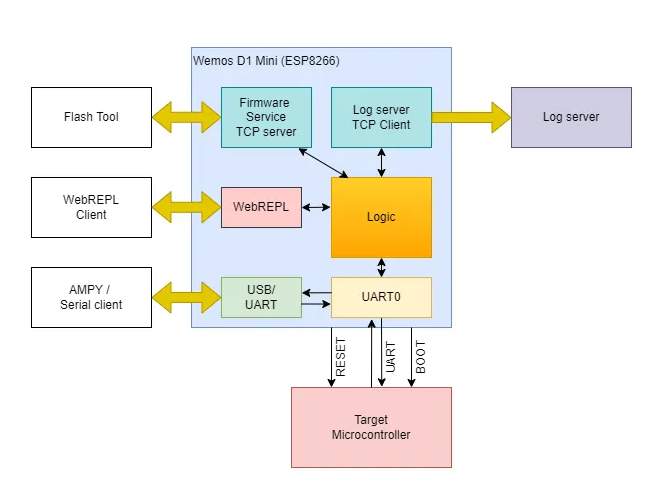
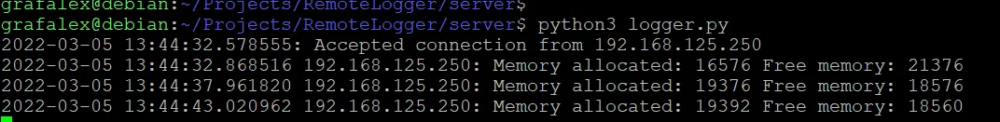

# Hello Zigbee World, Part 28 - Remote logging and flashing of Zigbee devices

Despite being somewhat outdated, the UART interface remains a popular choice for intra-chip communication and interacting with external devices. While there are more advanced alternatives like I2C or SPI for intra-chip communication and USB for external interfaces, the simplicity of UART is highly appealing, and it is featured in nearly every microcontroller. UART is commonly used for debug output and for uploading new firmware to microcontrollers, particularly the NXP JN5169 one.

But what happens if the UART is present in a circuit but is difficult to access? For instance, the device might not function when disassembled, or it could be installed in a hard-to-reach location. In this article, I will describe how to create a UART-WiFi bridge using an ESP8266 chip, specifically with the Wemos D1 Mini board. The first part of the article is dedicated to logging a device’s UART output to a log server through a UART-WiFi bridge. At first glance, this might seem straightforward, but surprisingly, I have not found a similar project online. 

Moreover, I needed not just to pass through the debug output, but also a remote programmer for the NXP JN5169 microcontroller. I decided to integrate these two useful functions into one device, which I will cover in the second part of the article.

Although the topic in this article is not directly related to Zigbee stuff I am exploring in this [Hello Zigbee series](part0_plan.md) - I need this device for long term monitoring of a Zigbee smart switch mounted on the wall. I’ll write the bridge firmware in Micropython. Despite its apparent simplicity, I encountered several non-trivial issues that I will discuss in this article. This should be especially useful for beginner developers, though seasoned hardware enthusiasts may find something of value too.

Let's get started!

# Part 1: Remote Logger

## General architecture

The device will combine two essentially independent functions:
- Passing debug output from UART through WiFi to a log server.
- Firmware flashing of the target microcontroller.

Let's start with the debug output. Receiving data from a microcontroller via UART and sending it elsewhere is not very difficult. One could set up a small socket server on the ESP8266, connect to it with a favorite terminal program, and that's that. However, I plan to collect logs for a long time - hours, maybe even days. During this process, it might be necessary to restart the computer or WiFi network, power could go out, or some other failure might occur. Therefore, the system needs to be made a bit more reliable. Let the logs be collected on a special server, and the ESP connects to it as possible.

What about the [firmware flashing of the target JN5169 microcontroller](part27_flash_tool.md)? It also goes through the same UART, but involves a few more GPIO lines to switch the microcontroller into programming mode. Most importantly, a binary protocol is used for flashing, which means data logging must be turned off while flashing.

I spent a long time deciding how to organize both logging and flashing and came up with the idea to set up a special server on the ESP for uploading firmware. When the flashing program connects to this server, the ESP switches to flashing mode, but it can still log the progress of the flashing to the server.

This is what it all looks like together.



Another architectural problem I had to solve - ESP8266 has only one UART (strictly speaking two, but the second one only works for output, which is useless for our task). Having only one UART is not the problem itself. The problem is that this UART on the Wemos D1 Mini board is physically connected to the USB-UART converter, and not to the target microcontroller. 

Experienced Arduino users might immediately suggest SoftwareSerial, but that's not our method. And that's because the ESP8266 can switch its UART to other pins - those are the ones we'll connect the target microcontroller to. If you need to communicate with the computer via USB-UART, we switch the UART one way; if you need to talk to the target microcontroller, we switch it the other way.

The only issue is that if the UART looks towards the target microcontroller, we will lose the ability to communicate with the ESP8266 itself. But there is also a solution for this - WebREPL. This is a special way to control the ESP via WiFi, including uploading files and retrieving logs.

With the general architecture sorted out, it's time to move on to the code.

## Log Server

I'll start with the log server. It's a separate and the simplest part of the setup. I have a home Linux server - let's have the log collector program run on it, but generally, it could be run on any other system.

The server code is very simple.

```python
import socketserver
from datetime import datetime

class MyTCPHandler(socketserver.BaseRequestHandler):
    def handle(self):
        print(f"{datetime.now()}: Accepted connection from {self.client_address[0]}")

        buf = ""
        while True:
            data = self.request.recv(1024)
            if not data: break

            buf += data.decode('utf-8')
            while '\n' in buf:
                line, buf = buf.split('\n', 1)
                print(f"{datetime.now()} {self.client_address[0]}: {line}")


    def finish(self):
        print(f"{datetime.now()}: Connection from {self.client_address[0]} dropped")


if __name__ == "__main__":
    with socketserver.ThreadingTCPServer(("0.0.0.0", 9999), MyTCPHandler, True) as server:
        server.serve_forever()
```

This code sets up a TCP server on port 9999. When a client connects, a separate thread starts and the handle() function is called. This function receives data from the socket and prints it on the screen (along with the Client IP, and date/time of the message).

Since messages do not necessarily arrive line by line, you might receive only part of a line or several lines at once. I had to manually merge partial lines and split the data by EOL symbol. There’s probably a way to simplify this.

I could also organize file logging, but since I'm running this server on a UNIX platform, I can use the tee utility.

```
python3 -u logserver.py | tee log.txt
```

## Preparing the ESP8266

Before we start coding, we need to prepare the ESP8266, and first of all, flash it with MicroPython. To do this, [download the firmware](https://micropython.org/download/ESP8266_GENERIC/) and flash it using your preferred ESP flashing tool, for example esptool. 

```
esptool --port COM4 erase_flash
esptool --port COM4 --baud 460800 write_flash --flash_size=detect 0 "Micropython ESP8266_GENERIC-20240222-v1.22.2.bin" 
```

Before starting the flasher, connect the GPIO0 line (on the Wemos D1 Mini board, this is pin D3) to the ground, then press the reset button. This procedure will put the ESP8266 in flash mode. Just remember to remove this jumper after flashing, and restart the ESP.

Now, we need to perform some basic initialization of the microcontroller. To do this, connect to the ESP8266 with a terminal program - we should land in the REPL, the Python console. I think connecting to WiFi should not be a problem, but just in case, here's the necessary sequence of commands:

```python
import network
sta_if = network.WLAN(network.STA_IF)
sta_if.active(True)
sta_if.connect('ssid', 'passwd')
```

In the last command, specify your network name and access password. You can check the connection with the command `sta_if.isconnected()` - if it returns `True`, it means you are connected.

Next, enable WebREPL. We are going to disable USB-UART, but we still need access to the console. WebREPL is a way to reach the same console, not through the COM port, but via WiFi (more specifically through a Web Socket). Everything is done with the following command:

```python
import webrepl_setup
```

You will be asked a few questions, such as whether we want to enable this permanently (doesn't matter, we will reconfigure it anyway), and the access password (enter and remember it).

Now you can communicate with the ESP8266 not only through the UART, but also through a Web Socket. For this, there is a separate project [MicroPython WebREPL](https://micropython.org/webrepl/). It doesn't work over HTTPS, as indicated by a big red banner. Instead, you need to [clone the repository](https://github.com/micropython/webrepl) and open [webrepl.html](https://github.com/micropython/webrepl/blob/master/webrepl.html) from your local drive in a browser. In the address field, you need to specify the IP of our ESP. This way, we get access to a copy of the ESP8266 console - the same console which is also available via the COM port terminal.

It is handy to have one more tool installed on the host computer - ampy. This tool will be used to upload files to the ESP8266.

```
pip install adafruit-ampy
```

## Hello World

As usual, for a warm-up, we'll blink an LED, which is very simple using asyncio.

```python
import uasyncio as asyncio
from machine import Pin

async def blink():
    led = Pin(2, Pin.OUT, value = 1)

    while True:
        led(not led())
        await asyncio.sleep_ms(1000)
```

As you can see, blinking an LED with `asyncio` isn't much different from blinking an LED in the Arduino style. The key difference is the use of `asyncio.sleep_ms()` instead of the regular `time.sleep()`. For those unfamiliar with asyncio, this function means something like "wake me up in a second, and in the meantime, you can do something else." Indeed, we will write much more code that will run "concurrently" with this blinking loop.

The blinker is started by calling `asyncio.create_task()`, which can be placed in the `main()` function. The `main()` function itself will hang out in an infinite loop using the same `asyncio.sleep()`.

```python
async def main():
    asyncio.create_task(blink())

    while True:
        await asyncio.sleep(5)


loop = asyncio.get_event_loop()
loop.run_until_complete(main())
```

## Configuration

While it's possible to hardcode the WiFi password and server address directly in the code, especially since it's a single-unit production, I believe it's not the right approach. This is especially true since I plan to share the code on GitHub. Instead, I'll store all important settings in a config.txt file, where each line contains a piece of data: the WiFi SSID, the WiFi password, the log server's address, and the port to connect to.

```
ssid
passwd
192.168.1.20
9999
```

Using the ampy tool this configuration file can be uploaded to the device.

```
ampy -p COM4 put config.txt
```

Let’s add the code to parse this file.

```python
def readConfig():
    print("Reading configuration...")

    config = {}
    with open("config.txt") as config_file:
        config['ssid'] = config_file.readline().rstrip()
        config['wifi_pw'] = config_file.readline().rstrip()
        config['server'] = config_file.readline().rstrip()
        config['port'] = config_file.readline().rstrip()

    return config
```

## Firmware structure

In the firmware, there will be a number of moving parts that might not work under certain external conditions, or might occur in an undesirable state. We need to monitor a number of connectivity lines, and if they fail perform meaningful actions to keep the microcontroller healthy:
- WiFi connection
- Connection to the log server
- WebREPL clients connection
- UART connectivity
- Connection to the target microcontroller in firmware mode

Initially, I tried creating separate modules for each of these tasks checking each other, but the code structure quickly turned into a tangle of conditions and flags. For instance:
- If the connection to the server is interrupted but WiFi is still available, try reconnecting to the server.
- If the WiFi connection is lost, temporarily turn off the connection to the log server (otherwise sending data to the server will fail)
- While there is no internet for whatever reason, ESP8266 still has to keep connection to the target JN5169 microcontroller
- If the connectivity fails while we are in programming mode, set safe levels on the required pins.

This leads to unnecessary complications. Upon closer examination, it became clear that the firmware can only function correctly when all conditions are met: there is a connection to both WiFi and the log server, and the UART is connected to the target microcontroller. If any of the conditions are not met, the firmware is inoperable.

Therefore, it is possible to rewrite the ESP8266 firmware to a pretty much linear algorithm:
- Connect to WiFi.
- Connect to the log server.
- Start UART-WiFi bridge to the target JN5169 microcontroller
- Periodically check the connection to the log server. If it drops for some reason, perform a simple reset of the entire ESP8266, and reconnect after 5 seconds.

Let's start with connecting to WiFi. I've already shown a few lines on how to connect to WiFi in console mode, but for full operation, this code needs a bit of enhancement:

```python
async def connectWiFi(ssid, passwd, timeout=10):
    sta = network.WLAN(network.STA_IF)
    sta.active(True)

    print("Connecting to WiFi: " + ssid)
    sta.connect(ssid, passwd)

    duration = 0
    while not sta.isconnected():
        if duration >= timeout:
            halt("WiFi connection failed. Status=" + str(sta.status()))

        print("Still connecting... Status=" + str(sta.status()))
        duration += 1
        await asyncio.sleep(1)

    print("Connected to WiFi. ifconfig="+str(sta.ifconfig()))


def halt(err):
    print("Fatal error: " + err)
    for i in range(5, 0, -1):
        print("The app will reboot in {} seconds".format(i))
        time.sleep(1)

    machine.reset()
```

If for some reason this code fails to connect to the access point, we simply go for a reboot. Although the specific reason might not be particularly important, you can optionally print the status code to the console. The halt() function simply prints the error, waits a few seconds, and then reboots the ESP8266.

## Errors handling

Our application will consist of several coroutines that will perform some useful actions and also pass control to each other during wait times. Unfortunately, during testing, it turned out that if an exception occurs in one coroutine, the others continue to work as if nothing happened.

For such cases, I decided to make a global exception handler that should monitor each of the launched coroutines. Since each coroutine is a separate function, the simplest and most elegant way to add additional functionality to a function is a decorator.


```python
def coroutine(fn):
    async def coroutineWrapper():
        try:
            await fn()
        except Exception as e:
            buf = io.StringIO()
            sys.print_exception(e, buf)
            halt(buf.getvalue())

    return coroutineWrapper
```

The task of this decorator is to wrap the function with a try/except block. In case an exception occurs, the decorator passes it to the `halt()` function for printing. In MicroPython, there is no standard `traceback` module. However, there is a `print_exception()` function, which can do essentially the same thing.

Now, all that’s left is to mark all the coroutines with the `@coroutine` decorator, including main():

```python
@coroutine
async def main():
...
```


## Connecting the the log server

The next step is to connect to the log server, and send a few meaningful messages. To hide all the inner workings, I grouped all the functions into a small class:

```python
class RemoteLogger():
    def __init__(self):
        self.writer = None


    async def connect(self, server, port):
        print("Opening connection to " + server + ":" + str(port))
        _, self.writer = await asyncio.open_connection(server, int(port))
        await self.writer.drain()


    async def log(self, msg):
        print(msg)

        self.writer.write(msg.encode())
        await self.writer.drain()
```

Surprisingly, the `open_connection()` function never returns an error, even if you tell it to connect to an incorrect address. However, the `write()` and `drain()` functions can indeed fail if the connection is suddenly lost. As I mentioned earlier, the easiest thing to do in such a case is just throw an exception, which will be caught by the `coroutine()` decorator, which in turn will reboot the ESP.

Setting everything up looks quite simple.

```python
import uasyncio as asyncio

logger = RemoteLogger()

@coroutine
async def main():
    ...
    await logger.connect(config['server'], config['port'])
    ...

    # Send a message periodically (for example memory usage stats)
    while True:
        gc.collect()  # For RAM stats.
        mem_free = gc.mem_free()
        mem_alloc = gc.mem_alloc()

        await logger.log("Memory allocated: " + str(mem_alloc) + " Free memory: " + str(mem_free))

        await asyncio.sleep(5)
```

This way, the message about memory statistics reaches the server as intended. 



Sending memory stats actually works as a heartbeat message - if a communication failure happens, an exception will be generated, and the device will reboot. On restart the device will perform reconnection, and if the error condition is no longer actual, the device will continue working normally. This approach keeps the device running with minimal downtime and ensures data integrity is maintained to the extent possible within the given setup constraints.


## dupterm и WebREPL

Here's where things get tricky.

From the architectural diagram above, it might seem that the aim of the application is simply transferring data from UART to TCP. This task has been solved long ago and shouldn't cause any problems. And indeed, it doesn't.

However, the problem is that the UART on the Wemos D1 Mini board is physically connected to the USB-UART bridge and is used for flashing and controlling the ESP8266. As I've mentioned before, you can switch the UART to alternative pins, but then you lose the ability to control the ESP itself. We wouldn't be able to upload a new firmware or even see errors if they occur.

MicroPython firmware is managed through a special console - REPL (Read Evaluate Print Loop). You can enter individual commands as well as upload/download/read files on the ESP, and launch loaded programs. This is what the ampy console utility does. Under the hood, ampy opens the same console, where it loads a small program of the sort "create a file and write the following content" - this is exactly how files are uploaded to the ESP.

But what to do if we need REPL and the UART switched to alternative pins? It turns out there is such a thing as WebREPL - a similar console, but which works through a Web socket. Of course, WebREPL can only work if the WiFi connection is up and running. You need to be very careful not to brick the device. For example, UART has already been disconnected, but WebREPL has not yet been connected, where would the error report go?

The `dupterm()` function is used to attach WebSocket to the REPL. The function accepts the interface object to be used for communication, as well as the slot number. In the ESP8266 port of MicroPython, it is possible to connect up to two slots for REPL. By default, UART is connected through slot index 1, and slot 0 is reserved for WebREPL.

Which REPL is better, UART or WebREPL? Personally, I prefer UART because ampy does not work through WebREPL. There is also a [console program](https://github.com/micropython/webrepl/blob/master/webrepl_cli.py) for uploading files through WebREPL, but it is less convenient and has fewer features. For this reason, I would enable UART for a few seconds during boot-up before switching to WebREPL. 

So, the algorithm is as follows:
- At startup, enable USB-UART (in case it was turned off).
- Enable REPL through this UART.
- Connecting to WiFi takes a few seconds. This should be enough, in case of an emergency, to connect to REPL and switch to firmware update mode.
- After connecting to WiFi enable the WebREPL
- Now we can safely disconnect REPL from USB-UART. The UART port can be switched to alternative pins for communication with the target microcontroller. If needed, logs and firmware updates are available through WebREPL.

In case of an error (for example, WiFi is lost, or the connection to the log server breaks):

- ESP8266 switches UART back to the original pins (connected to USB ones) and switches REPL there.
- Now it is possible to print the error and other important debug information.

Obviously, UART needs to be enabled as early as possible. In MicroPython, there implicitly exists such a file - `boot.py`, which is executed at the start of the firmware - let's add it there.

```python
# This file is executed on every boot (including wake-boot from deepsleep)
import uos, machine
uos.dupterm(machine.UART(0, 115200), 1)
print("Using UART as REPL until connected to WebREPL")
import gc
gc.collect()
```

The contents of this file are almost identical to the one initially loaded into the ESP. I just added a line with a dupterm() call. It means the following - initialize UART on standard pins, set up REPL through UART, and use slot #1 (remember, slot #0 will be implicitly used by WebREPL).

Ah yes, don't forget to upload this file to the ESP8266, for example, using ampy:

```
ampy -p COM4 put boot.py
```

Now WebREPL needs to be activated in the code (of course, after setting up WiFi and connecting to the log server):

```python
import webrepl
...
@coroutine
async def main():
...
    await connectWiFi(config['ssid'], config['wifi_pw'])
    await logger.connect(config['server'], config['port'])
    webrepl.start()
```

Now we can open [webrepl.html](https://github.com/micropython/webrepl/blob/master/webrepl.html) in a browser and connect to the ESP on port 8266. The password for connection we specified in the setup section. If everything is done correctly, the messages that are printed using `print()` or `RemoteLogger.log()` should appear in both USB-UART and the WebREPL consoles.

## Switch the UART

Technically, this is a simple procedure - just recreate the UART object on the necessary pins. Since we don't need REPL on these pins (as they are now connected to the target microcontroller), it should be disconnected using dupterm().

```python
def swapUART():
    print("Swapping UART to alternate pins. Disconnecting REPL on UART")
    uos.dupterm(None, 1)

    uart = machine.UART(0, 115200, tx=machine.Pin(15), rx=machine.Pin(13), rxbuf=2048)
    return uart
```

An important parameter, as it turned out, is `rxbuf` - it sets the size of the UART buffer, indicating how many bytes can be stored before they need to be retrieved. By default, this buffer is only 16 bytes. This means that at a baud rate of 115200, the UART must be polled at least every 1 ms.

Unfortunately, our application is quite complex, doing a lot - talking over the network, listening to the target microcontroller, blinking lights. Moreover it is written in Python - not the fastest programming language. Having the standard buffer size a lot of data simply wasn't processed in time. However, this isn't a problem because we can simply increase the buffer - immediate reaction isn't required anyway, the next log message can be processed a few milliseconds later.

I think a buffer of 2 KB should be sufficient. But if the target microcontroller is sending a continuous stream, the logger, of course, won't cope and will miss some data.

Let’s also relay the log from UART to the log server. We just listen to the UART, and if something appears, we transfer it line by line to the log server.

```python
@coroutine
async def uartListener(uart):
    reader = asyncio.StreamReader(uart)

    while True:
        data = yield from reader.readline()
        line = data.decode().rstrip()
        await logger.log("UART message: " + line)
```

The `uartListener()` coroutine is started from `main()`, right after setting up WebREPL.

```python
async def main():
...
    uart = swapUART()
    asyncio.create_task(uartListener(uart))
```

Now, most importantly: in case of an error, it's crucial to revert the configuration - switch the UART back to the original pins. This is very important. If we don't do this, we might end up with a "bricked" device that won’t respond to UART commands, requiring a complete reflash of the ESP8266.

```python
def halt(err):
    print("Swapping back to USB UART")
    uos.dupterm(machine.UART(0, 115200), 1)


    print("Fatal error: " + err)
...
```

Someone might ask why go through all this complexity? Wouldn't it be easier to use another microcontroller with more UARTs? For example, the ESP32 can use USB and UART simultaneously without needing to switch UART pins. Actually, this setup is due to historical reasons - when I started this project, I only had a Wemos D1 Mini board available, and there was no opportunity to quickly purchase an ESP32.

# Part 2: JN5169 microcontroller flasher

The first part was applicable to logging any microcontrollers with a UART interface, but the second part will be dedicated to programming the JN5169 chip from NXP (and potentially JN5179 and JN5189). [The previous article](part27_flash_tool.md) was dedicated to programming this chip from a local machine. Now we will extend our logger to flash the remote device.

You may need to program (or otherwise control) a different microcontroller - you could try something similar. In this article, I will not burden you with the intricacies of programming the JN5169 specifically, but will focus on the firmware issues of the ESP8266. And there are quite a few challenges.

## UART Modes

The JN5169 microcontroller is programmed via UART at 38400 baud. This differs from the logging settings, where the speed of 115200 is used. Moreover, a binary protocol is used in programming mode, and logging while programming the microcontroller is not really necessary.

Thus, three mutually exclusive operating modes of the ESP8266's UART emerge:
- Logging mode (speed 115200, textual protocol, messages from UART are transferred to the log server, using alternative UART pins)
- Programming mode (speed 38400, binary protocol, using alternative UART pins)
- ESP REPL/programming mode - the UART is facing the USB. It is enabled during the initial boot-up of the ESP8266. Also the halt() function will report critical errors there. (speed 115200, using original UART pins)

Actually, there is a fourth mode: programming the JN5169 begins at 38400 baud, but after the initial setup, the speed can be increased to 1 Mbps. Maybe one day I will add 1Mbps speed support, but for now I left only the 38400 mode.

I spent several days pondering how to ensure mutually exclusive operating modes, but also make it easy to switch between them during the operation of the firmware. Eventually, I came up with the following structure.

The core part of the modification will be the UART manager

```python
class UartMode:
    USB_UART = 0
    LOGGING_UART = 1
    PROGRAMMING_UART = 2


class UartManager:
    UART_CFG = {
        UartMode.USB_UART: {'baudrate': 115200},
        UartMode.LOGGING_UART: {'baudrate': 115200, 'tx': machine.Pin(15), 'rx': machine.Pin(13), 'rxbuf': 2048},
        UartMode.PROGRAMMING_UART: {'baudrate': 38400, 'tx': machine.Pin(15), 'rx': machine.Pin(13), 'rxbuf': 1024, 'timeout': 100}
    }


    def __init__(self):
        self.mutex = asyncio.Lock()
        self.mode = None
        self.uart = self.getUart(UartMode.USB_UART)


    def getUart(self, mode):
        if self.mode != mode:
            print("Switch to UART mode " + str(mode))
            cfg = UartManager.UART_CFG[mode]
            self.uart = machine.UART(0, **cfg)
            self.mode = mode

        return self.uart
```

First, this class manages the UART operation modes and essentially owns the UART object itself. The `getUart()` function switches the UART to a different configuration as needed. Various configuration options are set in the `UART_CFG` array.

Another function of the `UartManager` class is to provide exclusive access to the interface. While one coroutine is working with UART, others must wait. For this, the class has a mutex field and two functions to acquire and release this mutex.

```python
    async def acquire(self):
        await self.mutex.acquire()

    def release(self):
        self.mutex.release()
```

I was too lazy to create a singleton, so it will simply be a global variable:

```python
uart_manager = UartManager()
```

To make this easy to use, access to the UART can be wrapped in a context manager.

```python
class ScopedUart:
    def __init__(self, mode):
        self.mode = mode


    async def __aenter__(self):
        await uart_manager.acquire()
        return uart_manager.getUart(self.mode)


    async def __aexit__(self, *args):
        uart_manager.release()
```

Now the function to relay logs will look like this:

```python
@coroutine
async def uartListener():
    while True:
        async with ScopedUart(UartMode.LOGGING_UART) as uart:
            try:
                reader = asyncio.StreamReader(uart)
                data = await asyncio.wait_for(reader.readline(), timeout=1)
                line = data.decode().rstrip()
                await logger.log("UART message: " + line)
            except asyncio.TimeoutError:
                pass
```

The `async with` construct will internally call the `__aenter__()` and `__aexit__()` functions to acquire and release the UART interface. Meanwhile, other parts of the application will patiently wait until the interface is free.

It’s worth noting that acquiring the UART is intentionally done inside the `while True` loop, so that UART is only captured for the duration of transmitting one line. After the line is transmitted the `ScopedUart` releases the mutex. This is necessary so that the code responsible for programming the target microcontroller can jump in and switch the system to programming mode. After the microcontroller is programmed, the whole system automatically switches back to logging mode. No additional code is needed.

However, the `readline()` function complicates things, as it will wait for a line until it gets one. Therefore, I had to limit its wait with the `wait_for()` function with a one second timeout, and after the timeout, the cycle is restarted.

By the way, the `halt()` function is called in case of a critical error. In this case, the UART will be forcibly switched to USB-UART mode, regardless of who was using this interface before, and whether any data transmission is currently happening. I know this is a crude method, but despite the appearance of multitasking, in reality, everything runs in one thread, and there will not be real simultaneous access from multiple threads.

```python
def halt(err):
    print("Swapping back to USB UART")
    uart = uart_manager.getUart(UartMode.USB_UART)
    uos.dupterm(uart, 1)
...
```

## JN5169 microcontroller programming mode

To switch the JN5169 microcontroller into programming mode, it is necessary to hold the SPI MISO line low during the microcontroller's reset and initial boot-up. Conversely, to bring the target microcontroller back to normal operation, the MISO line must be high at boot time.

For this purpose, we'll need two additional lines from the ESP device to the target microcontroller. Let’s also write a few functions to switch the target microcontroller into the desired mode.

```python
targetMisoPin = machine.Pin(12, value=True, mode=machine.Pin.OUT)  # D6 pin on Wemos D1 Mini
targetResetPin = machine.Pin(14, value=True, mode=machine.Pin.OUT) # D5 pin on Wemos D1 Mini


async def resetTargetForFlashing():
    await logger.log("Resetting target device to flashing mode")

    targetMisoPin.off()
    targetResetPin.off()
    await asyncio.sleep_ms(20)  # 1 us is basically enough (as per datasheet)
    targetResetPin.on()
    await asyncio.sleep_ms(200) # 180 us is basically enough, but let the bootloader to start


async def resetTargetIntoFirmware():
    await logger.log("Resetting target device to normal mode")

    targetMisoPin.on()
    targetResetPin.off()
    await asyncio.sleep_ms(20)  # 1 us is basically enough (as per datasheet)
    targetResetPin.on()         # target device will be ready to start in 180 us. No waiting from our side is needed
```

The code is straightforward - just setting a right level on a pin, and performing delays between pulses. The timing values are chosen slightly larger than they could be - just in case. For example after the reset, the microcontroller is ready to operate in 180 µs, but I'm not sure how long the bootloader takes to load. So, before proceeding to programming, it seems sensible to wait a bit longer.

However, I was concerned about reliability. What if the microcontroller is switched into programming mode and then the firmware on the ESP fails? The microcontroller would remain in programming mode. Therefore, just in case, I decided to reset the target microcontroller at the start of the ESP firmware.

```python
@coroutine
async def main():
...
    await resetTargetIntoFirmware()
```

Admittedly, this might be somewhat crude and could unnecessarily reset a normally functioning microcontroller. I may revise this approach later, perhaps by storing the current state in EEPROM and only resetting the microcontroller in the event of an incorrect state.


## Programming Server

The JN5169 microcontroller is programmed through UART using a binary protocol. Typically a local USB-UART converter is used to connect the computer with the microcontroller. But since we are developing a remote flashing tool, we need a way for remote communication. To achieve this, I will set up a TCP server on the ESP. The flashing tool will connect to this server, send commands, and the ESP will relay these commands to the microcontroller. The responses from the microcontroller will be sent back the same way.

Starting the TCP server is straightforward:

```python
async def main():
...
    await asyncio.start_server(firmwareServer, "0.0.0.0", 5169)
```

For each connected client, a `firmwareServer()` handler will be launched:

```python
@coroutine
async def firmwareServer(tcpreader, tcpwriter):
    await logger.log("Firmware client connected: " + str(tcpreader.get_extra_info('peername')))

    try:
        await resetTargetForFlashing()
        await programingLoop(tcpreader, tcpwriter)
    except Exception as e:
        await logger.log("Exception: " + repr(e))

    await resetTargetIntoFirmware()

    tcpreader.close()
    await tcpreader.wait_closed()
    tcpwriter.close()
    await tcpwriter.wait_closed()

    await logger.log("Firmware client disconnected: " + str(tcpreader.get_extra_info('peername')))
```

If we strip away the extraneous aspects like logging connections/disconnections/errors, the function performs the following actions:
- Switches the microcontroller into programming mode.
- Starts the programming process within a try/except block.
- Once programming is complete (whether successfully or due to an error):
- Switches the target microcontroller back into normal mode.
- Closes the socket. It could have been left open, but I thought it would be more appropriate to close it.


## Programming loop

The programming protocol is described in the [JN-AN-1003 JN51xx Boot Loader Operation](https://www.nxp.com/docs/en/application-note/JN-AN-1003.pdf) document. According to the protocol, the flashing tool and the microcontroller exchange short messages (up to 256 bytes), where the first byte is the length of the message, followed by the payload.


Initially, I considered parsing these messages and logging them to the server, but this was quite resource consuming, and slowed down the programming process significantly. Fortunately logging can be done on the flashing tool side if necessary. The following code simply transfers messages from one interface to another - from the TCP socket to UART, and vice versa. The only field that will actually be used is the message length.

```python
async def receiveMsg(stream):
    len = (await stream.read(1))[0]
    data = await stream.read(len)
    return data


async def sendMsg(stream, data):
    stream.write(bytes([len(data)]))
    stream.write(data)
    await stream.drain()


async def xferMsg(src, dst):
    data = await receiveMsg(src)
    await sendMsg(dst, data)
```

The main loop of the programmer looks like this:

```python
async def programingLoop(tcpreader, tcpwriter):
    async with ScopedUart(UartMode.PROGRAMMING_UART) as uart:        
        uartstream = asyncio.StreamReader(uart)

        while True:
            await asyncio.wait_for(xferMsg(tcpreader, uartstream), timeout=15)
            await asyncio.wait_for(xferMsg(uartstream, tcpwriter), timeout=5)
```

There are several nuances here. First, UART is captured for the entire programming session. In this way the logging function will not be able to acquire the UART until the programming finishes (the `uartListener()` function will patiently wait on the mutex).

Second, it is assumed that the flashing tool and the microcontroller communicate only in a request-response mode. Therefore, we first transfer a message from the tool to the microcontroller, and then transfer the response. The protocol does not assume any asynchronous messages from the microcontroller.

And third, if the communication breaks down for some reason, everything needs to be returned to its original state. In this case, it was convenient to use the `wait_for()` function with a short timeout. Regardless of the reason for the failure - whether the internet was lost, the flashing tool sent an incorrect request, or the microcontroller went out for a smoke - we simply end the operation with an exception (which will be caught by the `firmwareServer() `function).


# Summary 

That's all. In this configuration, the device can operate without failures for a very long time. If WiFi, electricity, or a log server issue happens, the device will simply reboot and, after a brief timeout, try to restore. 

Although log collection seems like a simple task, making the device as robust as possible, with the ability to recover from problems, required additional effort for error handling. Also, the target microcontroller is connected to alternative UART pins on the Wemos D1 Mini, which added some complexity to the device code. Finally, the device implements not only log collection but also firmware updates for the JN5169 microcontroller, which further complicated the firmware.

This [series of articles](./part0_plan.md) is dedicated to writing alternative firmware for the Xiaomi Aqara QBKG12LM smart switch, and the device from this article is intended for collecting logs from the switch. But it's important to consider the power consumption of the ESP8266 - in WiFi communication mode, the chip consumes about 250 mA. I wanted to power the device from the switch's power source, but unfortunately, the switch's power supply turned out to be weak. It is only sufficient to power the switch itself, but not the additional ESP8266. So for the test setup, a separate power supply for the ESP8266 had to be used.


# Links

- [Project on github](https://github.com/grafalex82/RemoteLogger)
- [JN5169 Microcontroller Datasheet](https://www.nxp.com/docs/en/data-sheet/JN5169.pdf)
- [Application Note: JN-AN-1003: JN51xx Boot Loader Operation](https://www.nxp.com/docs/en/application-note/JN-AN-1003.pdf)


