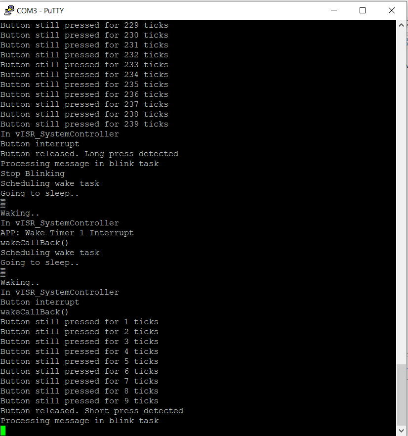

# Hello Zigbee World, Part 3 - Sleep Modes

This is a third article in [the series of learning NXP JN5169 microcontroller and Zigbee stack](part0_plan.md). In the previous articles it was described [bringing up a JN5169 microcontroller](part1_bring_up.md), setting up some of the essential peripherals, and [using software timers and queues](part2_timers_queues.md). But it is worth remembering that Zigbee devices are designed to have low power consumption and work from battery for a long time. In order to get really low power consumption the device must use sleeping modes. And this is what this article is about.

I'll be using the same cheap [EBYTE E75–2G4M10S module accompanied with a few buttons and LED](part1_bring_up.md). The code in this article is based on the toolchain and building blocks described in the first two parts of the series.

## Hello sleep/wake

Getting sleep/wake functionality working took me some time. Not because it's difficult, but because I had to revisit the structure of almost the entire firmware. Now I'm starting to understand why everything is so confusing in the examples - I'm starting to get the same :)

Anyhow, the functionality related to falling asleep / waking up is in the PWRM module (Power Management). The framework allows to register 2 callbacks that will be executed before entering sleep mode, as well as after exiting.

```cpp
static PWRM_DECLARE_CALLBACK_DESCRIPTOR(PreSleep);
static PWRM_DECLARE_CALLBACK_DESCRIPTOR(Wakeup);

PWRM_CALLBACK(PreSleep)
{
    DBG_vPrintf(TRUE, "Going to sleep..\n\n");
    DBG_vUartFlush();

    ZTIMER_vSleep();

    // Disable UART (if enabled)
    vAHI_UartDisable(E_AHI_UART_0);

    // clear interrupts
    u32AHI_DioWakeStatus();                         

    // Set the wake condition on falling edge of the button pin
    vAHI_DioWakeEdge(0, BOARD_BTN_PIN);
    vAHI_DioWakeEnable(BOARD_BTN_PIN, 0);
}

PWRM_CALLBACK(Wakeup)
{
    // Stabilize the oscillator
    while (bAHI_GetClkSource() == TRUE);

    // Now we are running on the XTAL, optimize the flash memory wait states
    vAHI_OptimiseWaitStates();

    // Re-initialize Debug UART
    DBG_vUartInit(DBG_E_UART_0, DBG_E_UART_BAUD_RATE_115200);

    DBG_vPrintf(TRUE, "\nWaking..\n");
    DBG_vUartFlush();

    // Re-initialize hardware and interrupts
    TARGET_INITIALISE();
    SET_IPL(0);
    portENABLE_INTERRUPTS();

    // Wake the timers
    ZTIMER_vWake();
}

void vAppRegisterPWRMCallbacks(void)
{
    PWRM_vRegisterPreSleepCallback(PreSleep);
    PWRM_vRegisterWakeupCallback(Wakeup); 
}
```

The `PreSleep()` function stops all active processes - suspends timers, turns off the UART and, if necessary, other shut down procedures. The last thing the function does is configuring GPIO to wake up when a button is pressed.

The `Wakeup()` function performs the reverse procedure - starts clocking, sets up a debug UART, re-initializes other peripherals, and wakes up timers. In fact, this function does almost all the same hardware configuration as `vAppMain()`, except that it does not initialize the timers.

The blink function has changed slightly (for simplicity of the structure, I had to return to the version from queues example).

```cpp
uint8 enabled = TRUE;

PUBLIC void blinkFunc(void *pvParam)
{
    static uint8 fastBlink = TRUE;

    ButtonPressType value;    
    if(ZQ_bQueueReceive(&queueHandle, (uint8*)&value))
    {
        DBG_vPrintf(TRUE, "Processing message in blink task\n");

        if(value == BUTTON_SHORT_PRESS)
            fastBlink = fastBlink ? FALSE : TRUE;

        if(value == BUTTON_LONG_PRESS)
        {
            DBG_vPrintf(TRUE, "Stop Blinking\n");
            vAHI_DioSetOutput(BOARD_LED_PIN, 0);
            enabled = FALSE;
        }
    }

    if(enabled)
    {
        uint32 currentState = u32AHI_DioReadInput();
        vAHI_DioSetOutput(currentState^BOARD_LED_PIN, currentState&BOARD_LED_PIN);
    }

    ZTIMER_eStart(blinkTimerHandle, fastBlink? ZTIMER_TIME_MSEC(200) : ZTIMER_TIME_MSEC(1000));
}
```

The `enabled` flag has now moved to the global scope, as it is this flag that will control sleep. Everything else remains almost the same.

The buttons polling function has not changed. And although it is possible to fall asleep right as soon as a long press is detected, it would be correct to send a message to the blink function. This will give the blink function the opportunity to finish its business and turn off the LED.

```cpp
PUBLIC void buttonScanFunc(void *pvParam)
{
    static int duration = 0;

    uint32 input = u32AHI_DioReadInput();
    bool btnState = (input & BOARD_BTN_PIN) == 0;

    if(btnState)
    {
        duration++;
        DBG_vPrintf(TRUE, "Button still pressed for %d ticks\n", duration);
    }
    else
    {
        // detect long press
        if(duration > 200)
        {
            DBG_vPrintf(TRUE, "Button released. Long press detected\n");
            ButtonPressType value = BUTTON_LONG_PRESS;
            ZQ_bQueueSend(&queueHandle, (uint8*)&value);
        }

        // detect short press
        else if(duration > 5)
        {
            DBG_vPrintf(TRUE, "Button released. Short press detected\n");
            ButtonPressType value = BUTTON_SHORT_PRESS;
            ZQ_bQueueSend(&queueHandle, &value);
        }

        duration = 0;
    }

    ZTIMER_eStart(buttonScanTimerHandle, ZTIMER_TIME_MSEC(10));
}
```

How can the device fall asleep? Let's take a look at `vAppMain()`. First I'd like to draw your attention that timers shall be started with the `ALLOW_SLEEP` flag. Previously, we started them with the `PREVENT_SLEEP` flag, which means that the microcontroller will not go to sleep while such timers are running. In this case timers must be explicitly stopped before falling asleep. I tried to do this, but it complicates the code structure too much. Let them just tick whenever the microcontroller is awake, and automatically fall asleep and wake up with the microcontroller.

```cpp
// Init and start timers
ZTIMER_eInit(timers, sizeof(timers) / sizeof(ZTIMER_tsTimer));
ZTIMER_eOpen(&blinkTimerHandle, blinkFunc, NULL, ZTIMER_FLAG_ALLOW_SLEEP);
ZTIMER_eStart(blinkTimerHandle, ZTIMER_TIME_MSEC(1000));
ZTIMER_eOpen(&buttonScanTimerHandle, buttonScanFunc, NULL, ZTIMER_FLAG_ALLOW_SLEEP);
ZTIMER_eStart(buttonScanTimerHandle, ZTIMER_TIME_MSEC(10));
```

Let's take a look at the main loop.

```cpp
PRIVATE uint8 keepAliveTime = 10;
PRIVATE pwrm_tsWakeTimerEvent wakeStruct;

PUBLIC void vAppMain(void)
{
...

    // Let the device go to sleep if there is nothing to do
    PWRM_vInit(E_AHI_SLEEP_OSCON_RAMON);

    while(1)
    {
        ZTIMER_vTask();

        vAHI_WatchdogRestart();

        if(enabled == FALSE)
        {
            DBG_vPrintf(TRUE, "Scheduling wake task\n");
            PWRM_eScheduleActivity(&wakeStruct, keepAliveTime * 32000, wakeCallBack);
        }

        PWRM_vManagePower();
    }
}
```

The first step is to initialize power (and sleep) management by calling `PWRM_vInit()`. Here we indicate the degree of sleep of the microcontroller - E_AHI_SLEEP_OSCON_RAMON, which means do not turn off the wake up timer, do not clear the memory. Keeping memory on is important - we need to maintain the `enabled` flag state. If the memory is shut down, then when waking up the microcontroller will not remember the state of this flag. In fact, we may not need a wake up timer - we will wake up on the button, but I wanted to try this functionality for other ZigBee-related tasks.

The actual sleep is performed by the `PWRM_vManagePower()` function. But this function is not as simple as it seems. It decides whether the microcontroller can now sleep or not according to two criteria. First, there should be no active tasks (for example, timers with the `PREVENT_SLEEP` flag). And secondly, the wake-up timer must be started, which is set by the `PWRM_eScheduleActivity()` function (which in turn depends on the `enabled` flag).

Finally, let's check out the system controller interrupt handler - it will receive a message that the processor has woken up.

```cpp
PUBLIC void vISR_SystemController(void)
{
    // clear pending DIO changed bits by reading register
    uint8 u8WakeInt = u8AHI_WakeTimerFiredStatus();
    uint32 u32IOStatus = u32AHI_DioInterruptStatus();

    DBG_vPrintf(TRUE, "In vISR_SystemController\n");

    if(u32IOStatus & BOARD_BTN_PIN)
    {
        DBG_vPrintf(TRUE, "Button interrupt\n");
        enabled = TRUE;
        PWRM_vWakeInterruptCallback();
    }

    if(u8WakeInt & E_AHI_WAKE_TIMER_MASK_1)
    {
        /* wake timer interrupt got us here */
        DBG_vPrintf(TRUE, "APP: Wake Timer 1 Interrupt\n");

        PWRM_vWakeInterruptCallback();
    }
}
```

We have 2 events that can wake up the system - button (pin change) interrupt, and a wake up timer. In the case of a button, let's set the enabled flag, which will activate the blinker. In case of waking up on a timer, we simply check in and go to sleep further. The framework will automatically call the `PreSleep()` and `Wakeup()` functions, as well as the function that was specified when calling `PWRM_eScheduleActivity()`.

```cpp
PUBLIC void wakeCallBack(void)
{
    DBG_vPrintf(TRUE, "wakeCallBack()\n");
}
```

This is how the device falls asleep by long pressing the button, periodically waking up by the alarm clock, and finally waking up by the button.



## Hello Deep Sleep

In the previous example, a light sleep mode was used - the wake up timer was running, and the memory was not turned off. This may not be suitable for some battery-powered devices, and a deeper sleep mode should be used. Let's check out the `E_AHI_SLEEP_DEEP` mode.

```cpp
PUBLIC void vAppMain(void)
{
...
    // Let the device go to sleep if there is nothing to do
    PWRM_vInit(E_AHI_SLEEP_DEEP);

    while(1)
    {
        ZTIMER_vTask();

        vAHI_WatchdogRestart();

        if(enabled == FALSE)
        {
            DBG_vPrintf(TRUE, "Scheduling sleep\n");
            PWRM_vManagePower();
        }
    }
}
```

Well, we can also remove the wake up timer processing from the `vISR_SystemController()` function, but this is not mandatory.

There is one non-obvious nuance with this approach. Every time the system falls asleep, all systems of the microcontroller (including memory) will shut down. This means that the microcontroller performs a complete initialization cycle (complete reboot) when waking up - the `vAppMain()` will be called instead of `Wakeup()`. In turn this means that the blinking mode will not be remembered, and will always start with a slow blinking. For the LED blinker this may not be very critical, but in a real device you will most likely need to save some data between reboots.

To implement state saving, we can use EEPROM, and the manufacturer provides 2 approaches for this:
- Low-level use of EEPROM - can read and write raw blocks of bytes to/from EEPROM
- Persistent Data Manager (PDM) - provides a key-value storage option in EEPROM

I will use the second approach, because this is consistent with the ZigBee framework, which also uses PDM for storing its parameters. Let's just write the functions for saving and loading the value.

```cpp
#define PDM_ID_BLINK_MODE          0x2
#define BLINK_MODE_SLOW            0
#define BLINK_MODE_FAST            1

uint8 blinkMode = BLINK_MODE_SLOW;

void storeBlinkMode(uint8 mode)
{
    blinkMode = mode;
    PDM_teStatus status = PDM_eSaveRecordData(PDM_ID_BLINK_MODE, &blinkMode, sizeof(blinkMode));
    DBG_vPrintf(TRUE, "Storing blink mode. Status %d, value %d\n", status, blinkMode);    
}

void restoreBlinkMode()
{
    uint16 readBytes;
    PDM_teStatus status = PDM_eReadDataFromRecord(PDM_ID_BLINK_MODE, &blinkMode, sizeof(blinkMode), &readBytes);

    DBG_vPrintf(TRUE, "Reading blink mode. Status %d, size %d, value %d\n", status, readBytes, blinkMode);    
}
```

The `blinkFunction()` is already responsible for handling blinking mode - let it also save the new value to PDM.

```cpp
PUBLIC void blinkFunc(void *pvParam)
{
...
    if(value == BUTTON_SHORT_PRESS)
    {
        blinkMode = (blinkMode == BLINK_MODE_FAST) ? BLINK_MODE_SLOW : BLINK_MODE_FAST;
        storeBlinkMode(blinkMode);
    }
...
}
```

Upon waking up from the deep sleep mode, the microcontroller is initialized in the `vAppMain()` function, and this is a good place to load the value from PDM. Do not forget to initialize PDM itself.

```cpp
PUBLIC void vAppMain(void)
{
...
    // Restore blink mode from EEPROM
    PDM_eInitialise(0);
    restoreBlinkMode();
```

## Conclusion

In this article I described how the microcontroller can fall into a sleep mode. Depending on power consumption requirements, the microcontroller may use light sleep mode, when RAM and some other peripherals keep running, or go the the deep sleep mode with really low power consumption. This may be essential for building long living battery powered devices. Mass produced JN5169-based Xiaomi devices can work for a really long time (up to several years) from a single battery, which is exciting.

This article also concludes the first chapter of getting familiar with the JN5169 microcontroller, its basic peripheral, and essential building blocks provided by SDK. The next step is Zigbee. Stay tuned.

## Links:

- [Project on github](https://github.com/grafalex82/hellojn5169world)
- https://www.nxp.com/docs/en/user-guide/JN-UG-3113.pdf
- https://www.nxp.com/docs/en/user-guide/JN-UG-3116.pdf
- https://www.nxp.com/docs/en/user-guide/JN-UG-3087.pdf
