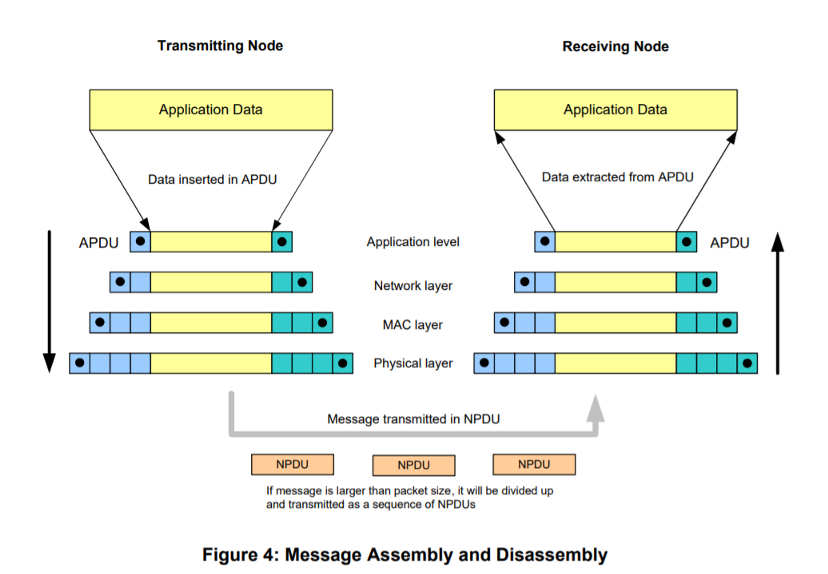

# Hello Zigbee World, Part 4 - Zigbee Basics

This is another article in the [series of learning NXP JN5169 microcontroller and Zigbee stack](part0_plan.md). In the previous articles I described [how to build a LED blinker from scratch](part1_bring_up.md), set up a toolchain, and experimented with some peripherals and SDK ([timers and queues](part2_timers_queues.md), [sleep modes](part3_sleep_modes.md)). I think I am ready to dive into Zigbee now.

Although I am eager to jump right into the code and start experimenting with Zigbee stack, I think it is worth reading some documentation first in order to understand what the Zigbee network is. This part will be purely theoretical with no code. I'll describe here what I learned reading the NXP docs as well as other resources, summarizing all important aspects in a single article. Unlike generic articles like “Zigbee is a wireless network for home automation” I'll try to go deeper and understand how it really works.

Are you ready to dive into Zigbee world? Let's go.

## High level info

When you start getting familiar with Zigbee you quickly get the next information.
- There are 3 types of devices in a ZigBee network - coordinator, routers, and end devices
- There can only be one **coordinator** in a ZigBee network
- **End devices** can only send or receive data to/from routers, not being transit nodes
- **Routers** and **coordinator** provide transit data transmission between different network nodes
- Usually devices powered from the line are routers, while battery powered devices are end devices
- A ZigBee network can be a mesh network where multiple devices can communicate directly without going through a coordinator.

The ZigBee network is quite standardized
- There are a number of open projects ([zigbee2mqtt](https://www.zigbee2mqtt.io/), SLS, sprut) that allow you to combine devices from different vendors into a single network
- In theory, manufacturers can make a closed ecosystem where devices from other vendor cannot join the network (simply by adding an secret encryption key)
- Devices with similar functionality (switches, lamps, thermostats) should theoretically work the same for all manufacturers
- Different manufacturers interpret the standard differently, which is why not all devices may work correctly in a generic network
- ZigBee does not have a mandatory certification like Z-Wave. Zigbee devices are cheaper, but no one guarantees their correct operation in non-native networks (in native networks too, however)

<figcaption align = "center"><i>A picture from the JN-UG-3113 ZigBee 3.0 Stack User Guide document shows an example of a ZigBee network with different types of devices.</i></figcaption>

Basically, this knowledge is quite enough for an ordinary consumer, including advanced users who build a smart home system on their own. A large knowledge base has been collected regarding the capabilities, tricky cases, features, and bugs of certain device models. But for some reason there is very little information on how to make your device. Because of this, the learning curve is quite steep - you need to read a whole bunch of documentation and example code before you start getting some understanding how this really works.

## Zigbee Device Architecture

I'll try to explain in simple terms how it all works from the technical side.

<figcaption align = "center"><i>A picture from the JN-UG-3113 ZigBee 3.0 Stack User Guide document describing high level architecture of the Zigbee protocol stack</i></figcaption>

Let's look at this picture from the bottom up.

- **ZigBee** is based on the **IEEE 802.15.4 standard**. The **PHY** part describes the physical layer of the network - how bits and bytes are transmitted over the radio. The microcontroller itself will monitor the radio environment, and transmit data when the radio channel is free. All this happens without our (application firmware) participation.
- IEEE 802.15.4 **MAC layer** is engaged in the transmission of data packets between individual network nodes, and also sends back a confirmation of the correct delivery of data. Basically, we will not have to dive to this level as well, unless some kind of error will be thrown from there. For us, this is just a transport - send these bytes (no more than 100 bytes at a time) to that device over there.
- **The ZigBee Network (NWK) Layer** actually serves the ZigBee network - assigns network addresses to devices, builds routes for how to transfer a data packet between non-directly connected nodes, allows you to send data in various ways (unicast or broadcast). We won't go too far here either, but we will be interested in some of the events that take place at this level.
- For us, the most interesting will be the **Application Layer (APL)**. This layer manages the interaction of the device with the Zigbee network, describes the behavior of the device as a whole, and also implements its individual functions. This is the part to deal with.

I will try to describe the Application Layer and its components in my own words.

Useful functions of the device are implemented in the **Application Framework (AF)** block, and more specifically, they are implemented in entities called **End Points**. An endpoint is a logical grouping of capabilities, commands, and attributes that describe a single device function. Not clear yet, right?

Let's take examples:
- You are making a multi-channel relay switch with ZigBee control. So each channel in this device will be a separate end point - each relay switch will be able to turn on and off independently, and probably measure some parameters, such as current or power. And all the endpoints together already define the device as a whole.
- Or here's a night light with a thermometer function. Nightlight and thermometer are completely separate features, each of which can be controlled independently, which means they are implemented by different endpoints.
- A two-button smart switch is also implemented with two endpoints, each controlled by its own button and controlling its relay switch independently.

Endpoints are intended to identify which part of the device was the source of the message, or which part of the target device the command is addressed to.

It is possible to **bind endpoints** of different devices directly. For example, one of the switch keys can control a separate relay switch in the multi-channel relay from the example above, and it does this without the participation of a coordinator.

**ZigBee Cluster** is a standardized set of capabilities grouped by functionality. A cluster groups several attributes and commands that are logically related to the functionality of the cluster. So for a lamp, attributes can be brightness, color temperature, or RGB color, and for a climate sensor, attributes can be temperature, humidity and pressure. The lamp will have on and off commands, or set the color mode command, while the climate sensor will not have any commands at all - it is a sensor, not an actuator.

An Endpoint can consist of several clusters, but similar clusters in a single endpoint should not be repeated. If you need a device with several identical clusters, they need to be distributed to different endpoints (which is why the two-button switch is implemented by at least two endpoints).

Although a device can basically implement any functionality, ZigBee developers have noticed that some types of functionality are repeated in different devices, and are implemented in a similar way. Many devices implement something like a switch, a thermometer, a power meter, a lamp, a motion sensor, a thermostat, or something else. Each of these types of functionality is called a **cluster**, standardized, and described in detail in the specification.

ZigBee stack developers went even further and implemented for us an API for working with each standard cluster, and called this a **ZigBee Cluster Library (ZCL)**. Thus, we do not have to deal with low-level packets to send the temperature or brightness of the lamp. Instead, we will use a fairly high-level API.

Each cluster can implement both **client** and **server** (or one of them). For example, a wireless button will only be a client in the On/Off Cluster - it has no relay switch part and can only send a signal when the button is pressed. A ZigBee relay switch will also implement the On / Off cluster, but will only be a server - it will execute commands to turn on and off, but will not be able to generate these commands in any way. Of course, there are devices that implement both the client and the server (for example, the Xiaomi switch, which has both buttons and relays).

**ZigBee Device Object (ZDO)** is a special endpoint #0, that is used for device identification. When the device joins the network, the coordinator does not know anything about the device. Using the interview process the coordinator can send requests to the device's ZDO endpoint asking to describe itself. In turn the device will report the coordinator various information such as device model and name, firmware version, power source, and many more attributes.

ZDO can also describe device functions, by sending device and endpoint **descriptors**. Descriptors are special data structures, that describe which clusters are implemented in the device, and how they are grouped by endpoints, which of the clusters are server or client.

Although the device can implement its own network joining logic, the SDK provides **Base Device Behavior (BDB)** functionality that implements typical device behavior as a network node, such as joining, re-joining in case of network loss, and leaving the network. It also provides capabilities for enabling pre-configured networks.

The **Application Support Sublayer (APS)** is a set of other handy functions related to the device. I could not clearly clarify for myself what exactly it offers. However, we don't need this for now.

## Asynchronous behavior

All right, that is enough to understand the basic architecture. But before we go any further, I should mention one more important thing that has a significant impact on the firmware architecture - it's all terribly asynchronous, and the main actors in this system are events and messages.

From school I know that the algorithm is a clear instruction describing a sequence of actions for a certain performer. And indeed, most programs are actually implemented by some kind of instruction flow: do A, then B, if C is true - repeat again.

This can't be fully applied to ZigBee. The nodes communicate with each other with short messages. If a node cannot reach the recipient directly, the message will be delivered through several intermediate nodes. At each stage, the packet is acknowledged by the receiving node at the IEEE 802.15.4 MAC level. The final recipient can send a response back, where at each stage the packet will also be acknowledged.

But the radio is not a very reliable transmission medium and some packets may simply not reach the recipient. In this case, after some timeout, the sender needs to organize a retransmission, and possibly even search for a new route. And while the sender is waiting for a response, a million other things can happen in the network - some nodes will communicate with each other, a node will want to join the network, the coordinator may come with a request, or the neighboring end device will wake up and start transmitting data through our device. From the point of view of a “linear” programmer, all this turns into terrible chaos.

<figcaption align = "center"><i>An example of communication in a ZigBee network. Black color indicates the path of some request and the corresponding response. Messages not related to this request are marked in gray</i></figcaption>

But it is not all that bad. NXP provides us with a whole bunch of code that will streamline all this and turn it into a kind of event stream for which we will need to write handlers. If an incoming message comes in it will be processed in a handler. If the network drops - device reconnects and reports back with an event. If you need to send some important data - send it over the network and start a timer waiting for a response. Thus turns the firmware into a set of handlers for a specific event. But in case of a complex communication those handlers must be grouped into a bigger structure, possibly a state machine.

## Data packets

The last point of the theoretical educational program is how data packets are constructed.

If we need to transmit bytes over the network, we cannot just send them to the radio channel directly - the receivers will not figure out what kind of packet it is, to whom it is addressed, whether it needs to be processed, or it is supposed to be passed along the network to some other node. Therefore, smart people came up with the OSI model and gave each layer its own purpose. Each layer has its own packet format and adds its service data to the packet. Let's take a look at the picture.

<figcaption align = "center"><i>Picture from JN51xx Core Utilities User Guide JN-UG-3116 document</i></figcaption>

Suppose an application wants to send a block of data. It passes this block to the next (network) layer, which adds a header to the packet. This header describes who is the sender of the packet, and what network device the packet is addressed to. The final recipient may be quite far from the sender, and the packet will actually be sent over an intermediate node. So the MAC layer adds its own header setting the intermediate node as a recipient for this particular packet, asking to retransmit this packet further. The PHY layer also adds some of its own data. Thus our payload bytes are wrapped in several wrappers, each with its own purpose.

Upon receiving the packet unpacking occurs in the opposite way - each next layer cuts off its headers and tails, and transfers only the payload to the next layer. Only payload data bytes, without any wrappers, reach the application layer at destination device.

The microcontroller does not have too much memory, and copying the payload back and forth just to add headers and tails is not reasonable. Since the sizes of all headers are known in advance, it is possible to reserve space for headers and tails before accepting the payload from the application. For these purposes NXP SDK provides a concept of **Protocol Data Unit (PDU)** - a data packet with a reserved space for metadata. **Protocol Data Unit Manager (PDUM)** component is responsible for allocation of the data packet and transferring these packets between layers.

## Summary

I think now we have enough information in order to start building the application. This part will be used as a reference describing the Zigbee device architecture. In the next articles I'll describe a step-by-step guide on how to build a simple Zigbee device. Stay tuned.

## Links:

- https://www.nxp.com/docs/en/user-guide/JN-UG-3113.pdf
- https://www.nxp.com/docs/en/user-guide/JN-UG-3116.pdf
- https://www.nxp.com/docs/en/user-guide/JN-UG-3087.pdf
- https://zigbeealliance.org/wp-content/uploads/2019/11/docs-05-3474-21-0csg-zigbee-specification.pdf
- https://zigbeealliance.org/wp-content/uploads/2019/12/07-5123-06-zigbee-cluster-library-specification.pdf