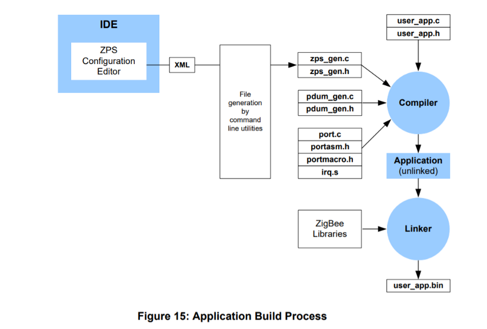
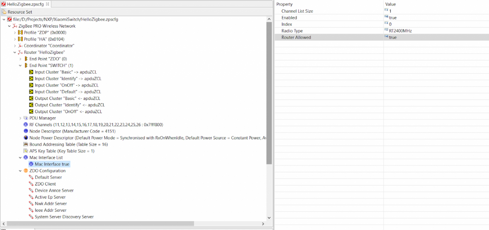
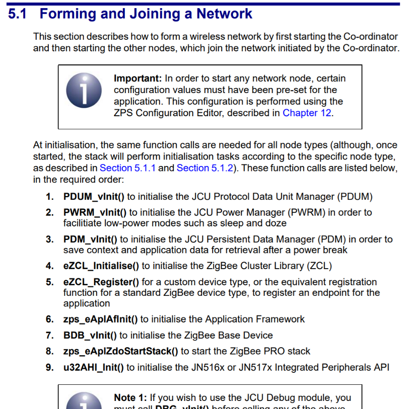

# Hello Zigbee World, Part 5 - Zigbee Device Firmware Skeleton

This is the next article in the [Hello Zigbee series](part0_plan.md), describing building a Zigbee device firmware from scratch. The [previous article](part4_zigbee_basics.md) described the basics of the Zigbee Network, and architecture of the Zigbee stack provided by SDK. Now it is time to start working on the firmware itself. The aim of this article is to get Zigbee stack libraries linked to the firmware and properly initialized. It appears to be a non-trivial task, especially if the app is built from scratch.

My code will be based on the LED blinker code developed in previous articles. As a development board I'll be using the same EBYTE E75–2G4M10S module based on NXP JN5169 microcontroller. The approach remains the same - add a minimum amount of code to get it working.

Let's go.

## Examples from NXP

To get an understanding of the Zigbee initialization process I started looking at the `JN-AN-1219-Zigbee-3–0-Controller-and-Switch` example first. Particularly, I was trying to figure out which parts of it are the most important. Unfortunately the code is so sophisticated, and spread across multiple files. The order of functions executed is not always clear. It appears that it could not be tackled this way right away.

I tried to read the documentation from cover to cover. When I got bored, I read the code. When I came across an incomprehensible function, I tried reading the documentation on the function. When something was unclear in the documentation, I came to the conclusion that this was probably explained earlier in the text, and therefore I need to read the entire documentation from beginning to end. I ended up reading the entire ZigBee 3.0 Stack User Guide JN-UG-3113 document and most of the example code, and only then it started fitting in my head how it all works.

I have a number of complains about the NXP example code:
- NXP tried to fit several different examples into a single codebase. As result there is a mix of unrelated functionality packed in a single place - working with sensors, OTA update, counting HW power ups (standard way to make a Zigbee lamp joining the network), network commissioning with NFC.
- Some examples share similar functionality. That is good if you are creating a library for common functionality. But in this case extracted code was not looking like a library with a well defined API - it was just a piece of function code moved elsewhere. As a result, the code was spread across multiple directories and became much more confusing than it could have been.
- Moreover, many parts of the code are enabled/disabled by different defines. It is very difficult to understand what I really need right now, and what may never be needed.
- The names of functions and variables are made in Hungarian notation, use module and resulting type prefixes, and half consist of abbreviations. The abbreviations are partially explained in the ZigBee 3.0 Stack User Guide JN-UG-3113 on page 60, but the Hungarian notation takes some getting used to.
- Part of the framework comes as pre-built libraries, another part is in source code. At the same time, the SDK sources depend on the files that the User must provide in their firmware.
- Example code is using SDK functions that are not described in documentation. Moreover they are not even mentioned in the header files!!!
- Part of the code is generated by external tools. There is a dedicated configurator with a very specific UI/UX, and it is supposed to configure entities that a beginner has no idea about. By the way, the generated code is completely obfuscated and incomprehensible.

Thus, the entry threshold is very high, but it can be sorted out eventually (especially if you read this article series). Perhaps this complexity aimed to reduce the firmware size and move device settings from runtime to compile time. Possibly for the same reason, there is no dynamic memory in the framework, and all resources are allocated statically based on parameters in configuration files.

In this article series we will go in completely opposite way - write a minimum amount of code to perform certain action, and will try not to mix different functionality in the same code.

## Project structure

So, let's try to mold something from the knowledge gained. I won't describe the agonizing process of how I was searching my way millimeter-by-millimeter for several weeks to get something compileable. Instead, I will describe in detail how I would do it now, as I already understand how everything works. BTW, I eventually found the building approach in the documentation, I just had to read up to page 471 :)


<p><figcaption align = "center"><i>A picture from ZigBee 3.0 Stack User Guide JN-UG-3113 document</i></figcaption></p>

The first step is to configure the device. This is done in the Zigbee3ConfigEditor application that comes with the SDK. This is a graphical configurator that allows you to set the parameters of ZigBee devices. Moreover, you can describe several devices on the network in the same configuration file, and even set up connections between these devices.

But without a deep understanding of ZigBee the application is almost useless - just a set of parameters and values. Moreover, you cannot create a new project and fill in only what you need - by default you'll get an empty project, and a dozen of parameters must be added manually. If you do not know what you are doing you will definitely set something wrong, or you will forget to add an important parameter. So I ended up with a creative copy-paste approach based on app.zpscfg file from the NXP example.



The output of the Zigbee3ConfigEditor program is a .zpscfg file, which in fact is just an XML representation of what is visible on the screen.

Now you need to generate files that will describe low level settings and variables of the ZigBee stack - various buffers, the initial values ​​of some internal data structures, device descriptors, and a whole bunch more. The tool will generate 1500 lines of very obfuscated C and a little assembler code.

```
C:\NXP\bstudio_nxp\sdk\JN-SW-4170\Tools\PDUMConfig\bin\PDUMConfig.exe -z HelloZigbee -f HelloZigbee.zpscfg  -o .

C:\NXP\bstudio_nxp\sdk\JN-SW-4170\Tools\ZPSConfig\bin\ZPSConfig.exe -n HelloZigbee -f HelloZigBee.zpscfg -o . -t JN516x -l D:\Projects\NXP\JN5169-for-xiaomi-wireless-switch\sdk\JN-SW-4170\Components\Library\libZPSNWK_JN516x.a -a D:\Projects\NXP\JN5169-for-xiaomi-wireless-switch\sdk\JN-SW-4170\Components\Library\libZPSAPL_JN516x.a -c C:\NXP\bstudio_nxp\sdk\Tools\ba-elf-ba2-r36379
```

As I said, several devices can be described in the same .zpscfg file. Therefore, when calling these tools, we must specify the device name, for which device we want to generate our files (HelloZigbee). Since generated files are referenced by the ZigBee framework sources, output file names are predefined - zps_gen.c/.h and pdum_gen.c/.h.

Also, the User must provide a configuration file - zcl_options.h. A bigger part of the ZigBee framework sources refer to this file. The file contains a set of defines that configure different services and clusters. These defines will enable compilation of the relevant SDK code. It also defines endpoints count, as well as a list of cluster attributes that the firmware will respond to. I've creatively reworked this file from the DimmerSwitch example, removing unnecessary (in my opinion) things.

I'll try to build a smart switch that will turn on and off a LED. Thus I need to enable 1 endpoint, an On/Off cluster, as well as the basic device attributes from the ZDO endpoint. Here is what I got.

```cpp
/****************************************************************************/
/***        Macro Definitions                                             ***/
/****************************************************************************/
/****************************************************************************/
/*                      ZCL Specific initialization                         */
/****************************************************************************/
/* This is the NXP manufacturer code.If creating new a manufacturer         */
/* specific command apply to the Zigbee alliance for an Id for your company */
/* Also update the manufacturer code in .zpscfg: Node Descriptor->misc      */
#define ZCL_MANUFACTURER_CODE                                0x1037

/* Sets the number of endpoints that will be created by the ZCL library */
#define ZCL_NUMBER_OF_ENDPOINTS                             1

#define ZCL_ATTRIBUTE_READ_SERVER_SUPPORTED
#define ZCL_ATTRIBUTE_READ_CLIENT_SUPPORTED
#define ZCL_ATTRIBUTE_WRITE_SERVER_SUPPORTED


#define ZCL_NUMBER_OF_REPORTS     1
#define ZLO_MIN_REPORT_INTERVAL   1
#define ZLO_MAX_REPORT_INTERVAL   15

/* Enable wild card profile */
#define ZCL_ALLOW_WILD_CARD_PROFILE
/****************************************************************************/
/*                             Enable Cluster                               */
/*                                                                          */
/* Add the following #define's to your zcl_options.h file to enable         */
/* cluster and their client or server instances                             */
/****************************************************************************/
#define CLD_BASIC
#define BASIC_SERVER
#define BASIC_CLIENT

#define CLD_SCENES
#define SCENES_CLIENT

#define CLD_IDENTIFY
#define IDENTIFY_CLIENT
#define IDENTIFY_SERVER

#define CLD_ONOFF
#define ONOFF_CLIENT
#define ONOFF_SERVER

/****************************************************************************/
/*             Basic Cluster - Optional Attributes                          */
/*                                                                          */
/* Add the following #define's to your zcl_options.h file to add optional   */
/* attributes to the basic cluster.                                         */
/****************************************************************************/
#define   CLD_BAS_ATTR_APPLICATION_VERSION
#define   CLD_BAS_ATTR_STACK_VERSION
#define   CLD_BAS_ATTR_HARDWARE_VERSION
#define   CLD_BAS_ATTR_MANUFACTURER_NAME
#define   CLD_BAS_ATTR_MODEL_IDENTIFIER
#define   CLD_BAS_ATTR_DATE_CODE
#define   CLD_BAS_ATTR_SW_BUILD_ID
#define   CLD_BAS_ATTR_GENERIC_DEVICE_CLASS
#define   CLD_BAS_ATTR_GENERIC_DEVICE_TYPE


#define CLD_BAS_APP_VERSION         (1)
#define CLD_BAS_STACK_VERSION       (2)
#define CLD_BAS_HARDWARE_VERSION    (1)
#define CLD_BAS_MANUF_NAME_STR      "NXP"
#define CLD_BAS_MANUF_NAME_SIZE     3
#define CLD_BAS_MODEL_ID_STR        "Hello Zigbee Switch"
#define CLD_BAS_MODEL_ID_SIZE       19
#define CLD_BAS_DATE_STR            "20210331"
#define CLD_BAS_DATE_SIZE           8
#define CLD_BAS_POWER_SOURCE        E_CLD_BAS_PS_SINGLE_PHASE_MAINS
#define CLD_BAS_SW_BUILD_STR        "v0.1"
#define CLD_BAS_SW_BUILD_SIZE       4
#define CLD_BAS_DEVICE_CLASS        (0)


/****************************************************************************/
/*             Basic Cluster - Optional Commands                            */
/*                                                                          */
/* Add the following #define's to your zcl_options.h file to add optional   */
/* commands to the basic cluster.                                           */
/****************************************************************************/
#define   CLD_BAS_CMD_RESET_TO_FACTORY_DEFAULTS
```

Most of the settings are related to the Basic cluster - these attributes describe the device in general. I decided to leave the NXP manufacturer code for now (0x1037), I don't really know who is assigning these manufacturer codes.

The build process also revealed the need for another option file - bdb_options.h. It turned out to describe some very subtle settings for the behavior of the device in the ZigBee network, which I do not really understand. So I just took this file from the example as is.

## Initialization
Now we can start working on the code, but first let's look at the instructions first. Section 5.1 “Forming and Joining a Network” recommends that we initialize the device as follows.



Of course, I did not find anything similar in the example code. Instead, the initialization was spread out over several files and a dozen functions. It took me superhuman effort to find all these parts. I even had to draw a call tree to understand the order of called functions. Moreover, some of these functions are actually implemented in the ZigBee framework, and some functions in the user code are executed as a callback. Some of the functions in the example are executed in a different order, compared to the documentation. But since the example works, then, apparently, this order is not so important. Though my implementation will be based primarily on the documentation.

Let's try to implement something similar. But do you really think that you can read the documentation and receive clear instructions on what to do? Ha! While investigating this stuff I found another document - ZigBee 3.0 Devices User Guide JN-UG-3114. It also describes some aspects of device initialization, but also has notes like “don't forget this thing”.

Ok, stop talking, let's finally write a code. First, we initialize the microcontroller, UART and debug output (DBG), power and sleep management system (PWRM), GPIO, EEPROM storage (Persistent Data Manager, PDM). There is nothing new here - I described this in very detail in previous articles.

```cpp
extern "C" PUBLIC void vAppMain(void)
{
   // Initialize the hardware
   TARGET_INITIALISE();
   SET_IPL(0);
   portENABLE_INTERRUPTS();

   // Initialize UART
   DBG_vUartInit(DBG_E_UART_0, DBG_E_UART_BAUD_RATE_115200);

   // Restore blink mode from EEPROM
   DBG_vPrintf(TRUE, "vAppMain(): init PDM...\n");
   PDM_eInitialise(0);
   restoreBlinkMode();

   // Initialize hardware
   DBG_vPrintf(TRUE, "vAppMain(): init GPIO...\n");
   vAHI_DioSetDirection(BOARD_BTN_PIN, BOARD_LED_PIN);
   vAHI_DioSetPullup(BOARD_BTN_PIN, 0);

   // Initialize power manager and sleep mode
   DBG_vPrintf(TRUE, "vAppMain(): init PWRM...\n");
   PWRM_vInit(E_AHI_SLEEP_DEEP);
```

The next subsystem that must be initialized is the Protocol Data Unit Manager, PDUM. This is a very important thing for the ZigBee stack - all operations with data buffers that need to be transmitted or received go exclusively through PDUM. There is nothing complicated with the initialization.

```cpp
   // PDU Manager initialization
   DBG_vPrintf(TRUE, "vAppMain(): init PDUM...\n");
   PDUM_vInit();
```

This function code is located in the pdum_gen.c file, which was generated from the .zpscfg file. Several dozens of PDU buffers are statically allocated there, and will later be used by the stack and applications. This file also declares 2 variables - `apduZDP` and `apduZCL` which represent 2 buffer pools. The difference between them is unclear, but we have to use these things in the future.

The next thing to do is to initialize the ZigBee Cluster Library (ZCL) by calling `eZCL_Initialise()`. The most important thing here is passing the `APP_ZCL_cbGeneralCallback()` callback function. The ZCL subsystem will call our function when there are messages for clusters that are implemented in our device.

```cpp
   DBG_vPrintf(TRUE, "vAppMain(): init Zigbee Class Library (ZCL)...  ");
   status = eZCL_Initialise(&APP_ZCL_cbGeneralCallback, apduZCL);
   DBG_vPrintf(TRUE, "eZCL_Initialise() status %d\n", status);
```

Next is device's endpoints initialization. The documentation suggests using the `eZCL_Register()` function for registering a custom endpoint, or use a number of predefined implementations provided by ZCL. Switch functionality has long been standardized by the ZigBee alliance, and NXP has implemented predefined endpoints in the `OnOffLightSwitch` component (this is not the name of a specific function, but is rather a set of functions and types).

```cpp
tsZLO_OnOffLightSwitchDevice sSwitch;

extern "C" PUBLIC void vAppMain(void)
{
...
   DBG_vPrintf(TRUE, "vAppMain(): register On/Off endpoint...  ");
   status = eZLO_RegisterOnOffLightSwitchEndPoint(HELLOZIGBEE_SWITCH_ENDPOINT, &APP_ZCL_cbEndpointCallback, &sSwitch);
   DBG_vPrintf(TRUE, "eApp_ZCL_RegisterEndpoint() status %d\n", status);
```

This code registers an endpoint, and associates it with the `sSwitch` object and the `APP_ZCL_cbEndpointCallback()` callback function. All events associated with this endpoint will come to this callback. If we were making a two-button switch, or other device with multiple endpoints, then this code would need to be repeated for each endpoint.

Now it is time to initialize the application layer (Application Framework) by calling `ZPS_eAplAfInit()`. There is nothing remarkable about this code.

```cpp
   DBG_vPrintf(TRUE, "vAppMain(): init Application Framework (AF)...\n");
   ZPS_teStatus status = ZPS_eAplAfInit();
   DBG_vPrintf(TRUE, "ZPS_eAplAfInit() status %d\n", status);
```

The next step of the algorithm is the call to BDB_vInit(). Here I stop a little bit because this function is not so simple. Here's what the ZigBee 3.0 Devices User Guide JN-UG-3114 says.


From this text we understand that the `BDB_vInit()` and `BDB_vStart()` calls are very important. They initialize the Base Device Behavior (BDB) component, which is responsible for the general behavior of the device as a network node. Moreover, if something important happens, we will be notified through the `APP_vBdbCallback()` callback.

And note 2 is important here, which says that part of the BDB functionality works through software timers. Moreover, the user is obliged to allocate space for them in the amount of `BDB_ZTIMER_STORAGE` pieces in the global list of timers (in addition to our button and the LED timers defined in the previous articles).

```cpp
ZTIMER_tsTimer timers[2 + BDB_ZTIMER_STORAGE];

extern "C" PUBLIC void vAppMain(void)
{
...
   // Init and start timers
   DBG_vPrintf(TRUE, "vAppMain(): init software timers...\n");
   ZTIMER_eInit(timers, sizeof(timers) / sizeof(ZTIMER_tsTimer));
```

But that's not all. The document ZigBee 3.0 Stack User Guide JN-UG-3113 mentions in section 5.9.1.2 (which is basically about message queues) that any ZigBee device must declare 3 more queues for ZigBee stack needs. There is no clear description of these queues. We are simply asked to copy-paste the necessary code to our application.


Well, okay, they ask, we do. Unfortunately I didn't really understand how exactly these queues are used in the stack. In the generated zsp_gen.c file pointers to these queues are casted to a void* and passed to the Zigbee stack. Moreover, zsp_gen.c file declares 4 queues, not 3. The example code also initializes 4 queues. Anyhow, let's just copy the initialization code for four queues from the example.

Also, the BDB_vInit() function expects one more queue for BDB needs. So we have 5 queues now.

```cpp
#define MLME_QUEUE_SIZE             10
#define MCPS_QUEUE_SIZE             24
#define TIMER_QUEUE_SIZE            8
#define MCPS_DCFM_QUEUE_SIZE        5
#define BDB_QUEUE_SIZE              3

extern PUBLIC tszQueue zps_msgMlmeDcfmInd;
extern PUBLIC tszQueue zps_msgMcpsDcfmInd;
extern PUBLIC tszQueue zps_TimeEvents;
extern PUBLIC tszQueue zps_msgMcpsDcfm;

PRIVATE MAC_tsMlmeVsDcfmInd asMacMlmeVsDcfmInd[MLME_QUEUE_SIZE];
PRIVATE MAC_tsMcpsVsDcfmInd asMacMcpsDcfmInd[MCPS_QUEUE_SIZE];
PRIVATE MAC_tsMcpsVsCfmData asMacMcpsDcfm[MCPS_DCFM_QUEUE_SIZE];
PRIVATE zps_tsTimeEvent asTimeEvent[TIMER_QUEUE_SIZE];
PRIVATE BDB_tsZpsAfEvent asBdbEvent[BDB_QUEUE_SIZE];

PRIVATE tszQueue APP_msgBdbEvents;

extern "C" PUBLIC void vAppMain(void)
{
...
   // Initialize ZigBee stack queues
   ZQ_vQueueCreate(&zps_msgMlmeDcfmInd, MLME_QUEUE_SIZE, sizeof(MAC_tsMlmeVsDcfmInd), (uint8*)asMacMlmeVsDcfmInd);
   ZQ_vQueueCreate(&zps_msgMcpsDcfmInd, MCPS_QUEUE_SIZE, sizeof(MAC_tsMcpsVsDcfmInd), (uint8*)asMacMcpsDcfmInd);
   ZQ_vQueueCreate(&zps_TimeEvents, TIMER_QUEUE_SIZE, sizeof(zps_tsTimeEvent), (uint8*)asTimeEvent);
   ZQ_vQueueCreate(&zps_msgMcpsDcfm, MCPS_DCFM_QUEUE_SIZE, sizeof(MAC_tsMcpsVsCfmData), (uint8*)asMacMcpsDcfm);
   ZQ_vQueueCreate(&APP_msgBdbEvents, BDB_QUEUE_SIZE, sizeof(BDB_tsZpsAfEvent), (uint8*)asBdbEvent);
```

I have absolutely no clue on what data is passed through these queues, and what will happen if the queues are too small.

Finally, the `BDB_vInit()` call

```cpp
   // Initialize Base Device Behavior
   DBG_vPrintf(TRUE, "vAppMain(): initialize base device behavior...\n");
   BDB_tsInitArgs sInitArgs;
   sInitArgs.hBdbEventsMsgQ = &APP_msgBdbEvents;
   BDB_vInit(&sInitArgs);
```

The last (if not counting any other peripheral initialization), we need to call the `zps_eAplZdoStartStack()` function. But there is a significant discrepancy between the documentation and the example code - there is no such a call is not in the example code. And in other examples too.

According to the documentation, this function should start the ZigBee stack. The device will immediately begin to join the network and connect somewhere. This is probably the correct behavior in a pre-configured network, but real devices behave differently. For example, a Xiaomi switch requires a special procedure (hold a button for 5–10 seconds) to join the network.

Based on the example code, the `BDB_vStart()` function is called instead of `zps_eAplZdoStartStack()`, and this is consistent with the ZigBee 3.0 Devices User Guide JN-UG-3114, section 1.4 Device Initialization. Well, let's use `BDB_vStart()`.

```cpp
   DBG_vPrintf(TRUE, "vAppMain(): Starting base device behavior...\n");
   BDB_vStart();
```

The final touch is interrupts. The microcontroller is able to work with the radio receiver. If the next data packet is received, the microcontroller generates an interrupt. We do not have to write the interrupt code - it is implemented inside the ZigBee stack, and comes as a prebuilt library. But it needs to be registered in the interrupt vector table in the irq_JN516x.S file.

```asm
.globl  PIC_SwVectTable
    .section .text,"ax"
    .extern zps_isrMAC
    .extern ISR_vTickTimer
    .extern vISR_SystemController
    .align 4
    .type   PIC_SwVectTable, @object
    .size   PIC_SwVectTable, 64
PIC_SwVectTable:
    .word vUnclaimedInterrupt               # 0
    .word vISR_SystemController             # 1
    .word vUnclaimedInterrupt               # 2
    .word vUnclaimedInterrupt               # 3
    .word vUnclaimedInterrupt               # 4
    .word vUnclaimedInterrupt               # 5
    .word vUnclaimedInterrupt               # 6
    .word zps_isrMAC                        # 7
    .word vUnclaimedInterrupt               # 8
    .word vUnclaimedInterrupt               # 9
    .word vUnclaimedInterrupt               # 10
    .word vUnclaimedInterrupt               # 11
    .word vUnclaimedInterrupt               # 12
    .word vUnclaimedInterrupt               # 13
    .word vUnclaimedInterrupt               # 14
    .word ISR_vTickTimer                    # 15
```

All set? Not yet, we need callbacks. So far, there is no logic in the application, so the callbacks are almost empty, and just print various messages. These functions will be filled further as we understand how it all works.

```cpp
PRIVATE void APP_ZCL_cbGeneralCallback(tsZCL_CallBackEvent *psEvent)
{
   DBG_vPrintf(TRUE, "APP_ZCL_cbGeneralCallback(): Processing event %d\n", psEvent->eEventType);
}

PRIVATE void APP_ZCL_cbEndpointCallback(tsZCL_CallBackEvent *psEvent)
{
   DBG_vPrintf(TRUE, "APP_ZCL_cbEndpointCallback(): Processing event %d\n", psEvent->eEventType);
}

void vfExtendedStatusCallBack (ZPS_teExtendedStatus eExtendedStatus)
{
   DBG_vPrintf(TRUE,"ERROR: Extended status %x\n", eExtendedStatus);
}

PUBLIC void APP_vBdbCallback(BDB_tsBdbEvent *psBdbEvent)
{
   switch(psBdbEvent->eEventType)
   {
       case BDB_EVENT_INIT_SUCCESS:
           DBG_vPrintf(TRUE, "BDB event callback: : BdbInitSuccessful\n");
           break;

       default:
           DBG_vPrintf(1, "BDB event callback: evt %d\n", psBdbEvent->eEventType);
           break;
   }
}
```

Now we need to run the main loop.

```cpp
   DBG_vPrintf(TRUE, "vAppMain(): Starting the main loop\n");
   while(1)
   {
       zps_taskZPS();
       bdb_taskBDB();
       ZTIMER_vTask();
       vAHI_WatchdogRestart();
   }
```

Funny thing, the `zps_taskZPS()` function is not described anywhere in the documentation, not mentioned in the header files, but it is called in the example code. Moreover, it is fundamentally important! Looking ahead, after I implemented the device, I tried to remove this call and nothing worked at all without it. Looks like this function is responsible for MAC level messages processing, and converting them to application level events.

I had to deal with the project files a little bit in order to add only those SDK files that are really used. Though, there is nothing interesting here.

Let's run the code.


Nothing exploded, and there are no error lines in the log. The device starts up normally and blinks its LED (this functionality is still there since previous articles). In the logs, we see that the initialization was successful, and the device is operational.

## Summary

Yeah, the device initialization takes quite a big amount of code. Fortunately this code is quite linear and simple so far (and even simpler if you remove debug prints). It does not do anything specific, just initializes Zigbee components according to the documentation. But this step is essential in terms of understanding moving parts involved in the application.

Today we built a skeleton Zigbee application, ready to be added with some useful functionality. Next step is to connect this device to the network.

## Links:
- [Project on github](https://github.com/grafalex82/hellozigbee/tree/hello_zigbee_part_1) (see hello_zigbee_part_1 branch, the mainline goes much further)
- https://www.nxp.com/docs/en/user-guide/JN-UG-3113.pdf
- https://www.nxp.com/docs/en/user-guide/JN-UG-3116.pdf
- https://www.nxp.com/docs/en/user-guide/JN-UG-3087.pdf
- JN-AN-1220-Zigbee-3–0-Sensors example (recommended)
- JN-AN-1219-Zigbee-3–0-Controller-and-Switch example (somewhat sophisticated for learning purposes)
- https://github.com/actg/JN5169-for-xiaomi-wireless-switch.git