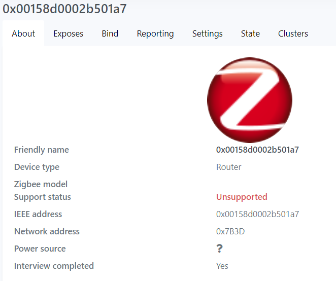
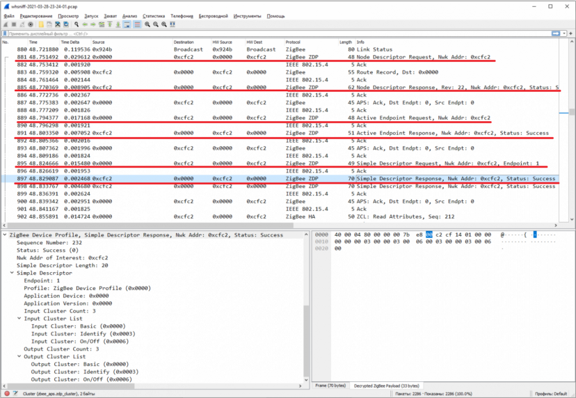
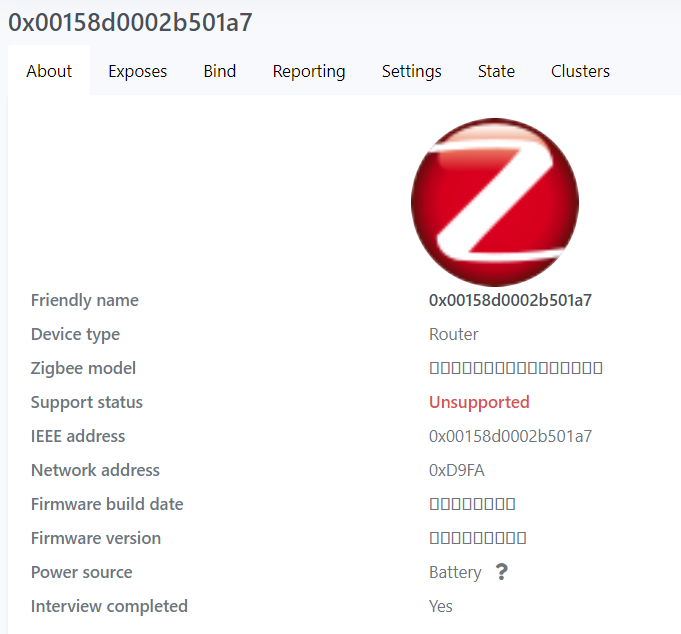
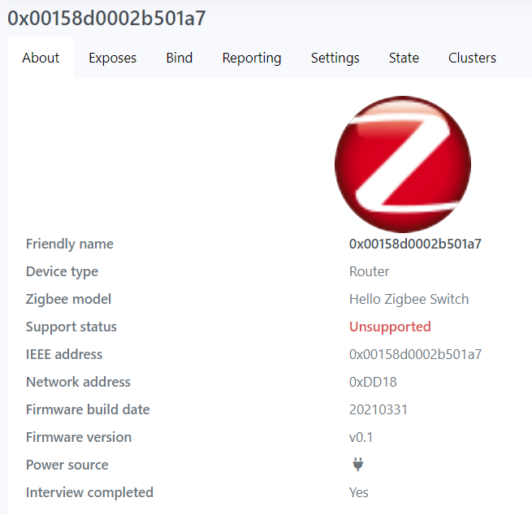

# Hello Zigbee World, Part 7 - Registering Device at Zigbee2mqtt

This is the next part in the [Hello Zigbee tutorial series](part0_plan.md), describing how to develop a Zigbee device firmware from scratch. By this point we developed a device that [can join a Zigbee network](part6_join_zigbee_network.md). But despite the coordinator acknowledging it as a valid Zigbee device, there is no communication happening so far. Moreover, zigbee2mqtt does not really understand what the device is. The aim of this article is to make zigbee2mqtt properly identify our device.

The hardware setup is described in the [very first article](part1_bring_up.md), and is based on the EBYTE E75–2G4M10S module (NXP 5169 microcontroller). The toolchain and basic MCU peripherals were also described in the article. 

## Device identification and device descriptors

Our device has joined the network, but zigbee2mqtt dashboard displays it like this



There is no device information on the About tab, and the Exposes tab is totally empty for our device. Other devices properly identify themselves, displaying device model name, support status, and number of controls on the Exposes tab. Perhaps something must be done on the device side so that zigbee2mqtt can read at least basic information about the device.

Let's figure out how exactly the device information gets into the ZigBee network, and in particular into zigbee2mqtt. When the device comes online, the coordinator (zigbee2mqtt) starts the interview process. Various requests are sent to the device, and the device responds with so-called descriptors - standardized structures that describe the device and its structure. We saw these requests in the previous article, and I promised to explain them.



First of all, Z2M requests a Node Descriptor. This descriptor describes the device as a ZigBee network node - operating frequencies, the sizes of incoming and outgoing buffers, the version of the ZigBee stack, power source. Here is a Node Descriptor dumped by Wireshark.

```
ZigBee Device Profile, Node Descriptor Response, Rev: 22, Nwk Addr: 0x183c, Status: Success
    Sequence Number: 52
    Status: Success (0)
    Nwk Addr of Interest: 0x183c
    Node Descriptor
        .... .... .... .001 = Type: 1 (Router)
        .... .... .... 0... = Complex Descriptor: False
        .... .... ...0 .... = User Descriptor: False
        .... 0... .... .... = 868MHz BPSK Band: False
        ..0. .... .... .... = 902MHz BPSK Band: False
        .1.. .... .... .... = 2.4GHz OQPSK Band: True
        0... .... .... .... = EU Sub-GHz FSK Band: False
        Capability Information: 0x8e
            .... ...0 = Alternate Coordinator: False
            .... ..1. = Full-Function Device: True
            .... .1.. = AC Power: True
            .... 1... = Rx On When Idle: True
            .0.. .... = Security Capability: False
            1... .... = Allocate Short Address: True
        Manufacturer Code: 0x1037
        Max Buffer Size: 127
        Max Incoming Transfer Size: 100
        Server Flags: 0x2c00
            .... .... .... ...0 = Primary Trust Center: False
            .... .... .... ..0. = Backup Trust Center: False
            .... .... .... .0.. = Primary Binding Table Cache: False
            .... .... .... 0... = Backup Binding Table Cache: False
            .... .... ...0 .... = Primary Discovery Cache: False
            .... .... ..0. .... = Backup Discovery Cache: False
            .... .... .0.. .... = Network Manager: False
            0010 110. .... .... = Stack Compliance Revision: 22
        Max Outgoing Transfer Size: 100
        Descriptor Capability Field: 0x00
            .... ...0 = Extended Active Endpoint List Available: False
            .... ..0. = Extended Simple Descriptor List Available: False
```

The next information requested is Active Endpoint descriptor. It enumerates endpoint numbers implemented in the device. Every device must implement an endpoint #0 (Zigbee Device Object) that is responsible for managing the device in general. All functional endpoints are listed in the Active Endpoint Descriptor. In our case the device implements just a single endpoint (besides ZDO).

```
ZigBee Device Profile, Active Endpoint Response, Nwk Addr: 0x183c, Status: Success
    Sequence Number: 53
    Status: Success (0)
    Nwk Addr of Interest: 0x183c
    Endpoint Count: 1
    Active Endpoint List
        Endpoint: 1
```

Finally, the coordinator requests a Simple Descriptor that describes a single endpoint. If there were multiple endpoints implemented on the device, the coordinator would make several requests, one for each endpoint.

```
ZigBee Device Profile, Simple Descriptor Response, Nwk Addr: 0x183c, Status: Success
    Sequence Number: 54
    Status: Success (0)
    Nwk Addr of Interest: 0x183c
    Simple Descriptor Length: 20
    Simple Descriptor
        Endpoint: 1
        Profile: Home Automation (0x0104)
        Application Device: 0x0000
        Application Version: 0x0000
        Input Cluster Count: 3
        Input Cluster List
            Input Cluster: Basic (0x0000)
            Input Cluster: Identify (0x0003)
            Input Cluster: On/Off (0x0006)
        Output Cluster Count: 3
        Output Cluster List
            Output Cluster: Basic (0x0000)
            Output Cluster: Identify (0x0003)
            Output Cluster: On/Off (0x0006)
```

This structure describes input and output clusters implemented in the endpoints (more on clusters in the next articles). This information can be used by other devices or the coordinator to set up communication with the device. 

Honestly, I had no idea why my device did not identify itself properly, while other devices do. So I just captured several device joining logs for various devices, and compared them to my device onboarding. Eventually I found that the ProfileID field was set incorrectly (it was zero in my case). As per Zigbee specification smart home consumer devices shall set this parameter to 0x0104 (Home Automation).

Descriptors are automatically generated from the .zpscfg file by the ZPSConfig tool. Endpoint parameters (including profileID) are also set in the HelloZigbee.zpscfg file, and can be changed either through a graphical application, or directly in XML. Corresponding files shall be re-generated with ZPSConfig.exe [as described in the article related to Zigbee stack initialization](part5_zigbee_init.md). 

Once profileID is corrected, the coordinator can now make additional requests. The following line appears in the device console

```
AF event callback: endpoint 1, event 1
```

Well, the process of adding new handlers is already [known and understood](part6_join_zigbee_network.md), and we just need to write some new handlers code. First of all we need to correct the `vAppHandleAfEvent()` function. Here we need to separate messages for ZDO (zero endpoint) from messages for other endpoints (#1 in our case). Our functional endpoint consists of standard Basic and OnOff clusters, that are implemented in Zigbee Clusters Library (ZCL). So let’s create a handler for ZCL messages in a similar way as we did for ZDO. Messages for different endpoints will be routed to either vAppHandleZdoEvents() or vAppHandleZclEvents(). 

```cpp
PRIVATE void vAppHandleAfEvent(BDB_tsZpsAfEvent *psZpsAfEvent)
{
   // Dump the event for debug purposes
   vDumpAfEvent(&psZpsAfEvent->sStackEvent);

   if(psZpsAfEvent->u8EndPoint == HELLOZIGBEE_ZDO_ENDPOINT)
   {
       // events for ep 0
       vAppHandleZdoEvents(&psZpsAfEvent->sStackEvent);
   }
   else if(psZpsAfEvent->u8EndPoint == HELLOZIGBEE_SWITCH_ENDPOINT &&
           psZpsAfEvent->sStackEvent.eType == ZPS_EVENT_APS_DATA_INDICATION)
   {
       vAppHandleZclEvents(&psZpsAfEvent->sStackEvent);
   }
   else if (psZpsAfEvent->sStackEvent.eType != ZPS_EVENT_APS_DATA_CONFIRM &&
            psZpsAfEvent->sStackEvent.eType != ZPS_EVENT_APS_DATA_ACK)
   {
       DBG_vPrintf(TRUE, "AF event callback: endpoint %d, event %d\n", psZpsAfEvent->u8EndPoint, psZpsAfEvent->sStackEvent.eType);
   }

   // Ensure Freeing of APDUs
   if(psZpsAfEvent->sStackEvent.eType == ZPS_EVENT_APS_DATA_INDICATION)
       PDUM_eAPduFreeAPduInstance(psZpsAfEvent->sStackEvent.uEvent.sApsDataIndEvent.hAPduInst);
}
```

This function appears a little bit more complex than usual. Let me explain this. It handles several types of messages:
- Messages to ZDO are routed to `vAppHandleZdoEvents()`
- Messages to `HELLOZIGBEE_SWITCH_ENDPOINT` (endpoint #1) are routed to `vAppHandleZclEvents()`. But we route only the `ZPS_EVENT_APS_DATA_INDICATION` type of messages, which mean real data messages (commands, read or write attributes). All other messages (status, information, general network messages) will be discarded.
- As we learned in the previous article, `ZPS_EVENT_APS_DATA_CONFIRM` and `ZPS_EVENT_APS_DATA_ACK` messages are notifications just for our information. We do not have to make any reaction to this.
- There will be a notification in the console in case of another yet unknown message received.

One more important thing. If the device is receiving a valuable data packet, the `ZPS_EVENT_APS_DATA_INDICATION` event is generated. A non-trivial thing here is that [PDUM](part4_zigbee_basics.md) is allocating a memory for the data buffer, and passes the buffer handler to the application. It is the application's responsibility to clean up the memory when the data packet is processed. That is why we call `PDUM_eAPduFreeAPduInstance()` function after the data processing is completed.

As I mentioned earlier, most of the standard cluster implementation is provided by the Zigbee Cluster Library (ZCL). Messages to functional endpoints are typically related to a certain standard cluster. Thus these messages must be forwarded to ZCL for processing. Basically the aim of the `vAppHandleZclEvents()` function is simply passing a message to the ZCL handler (rays of bloody diarrhea to that engineer who forced the event to be wrapped in a tsZCL_CallBackEvent structure, in order to be unfold back inside vZCL_EventHandler() and go further into processing in its original form) .

```cpp
PRIVATE void vAppHandleZclEvents(ZPS_tsAfEvent* psStackEvent)
{
   tsZCL_CallBackEvent sCallBackEvent;
   sCallBackEvent.pZPSevent = psStackEvent;
   sCallBackEvent.eEventType = E_ZCL_CBET_ZIGBEE_EVENT;
   vZCL_EventHandler(&sCallBackEvent);
}
```

Let me explain different levels of abstractions here. Zigbee network is responsible for passing messages between network nodes. We saw different message types earlier - beacon requests, joining requests, device descriptors, routing table updates, etc. But when talking about data messages, Zigbee network does not care about what the payload is. It is just bytes passed between nodes.

But these bytes became valuable data when passed to the ZCL layer. ZCL parses the data packet, and can distinguish read and write requests, various commands specific to a certain cluster, and various data structures passed as a part of the message. So we will need a handler that will make a proper reaction on ZCL specific events generated inside the ZCL framework - `APP_ZCL_cbEndpointCallback()`. Looks like we need to add some more code there as well. This particular message is a Read Attribute command, that is supposed to read some value and send this value back to the requestor.

```cpp
PRIVATE void APP_ZCL_cbEndpointCallback(tsZCL_CallBackEvent *psEvent)
{
   switch (psEvent->eEventType)
   {
       case E_ZCL_CBET_READ_REQUEST:
           vDumpZclReadRequest(psEvent);
           break;
...
```

Here is an interesting fact. ZCL will generate an `E_ZCL_CBET_READ_REQUEST` event **before** processing an attribute read request. The application has a chance to update the data fields, prior ZCL read these values and send them to the requestor. The event handler only prepares the data, while data is sent automatically by the framework.

In our particular case, we only dump the request, we do not need to do anything else at the moment. That's just a notification that someone requested a data field. The only difficulty is that the request has to be parsed manually.

```cpp
PRIVATE void vDumpZclReadRequest(tsZCL_CallBackEvent *psEvent)
{
   // Read command header   tsZCL_HeaderParams headerParams;
   uint16 inputOffset = u16ZCL_ReadCommandHeader(psEvent->pZPSevent->uEvent.sApsDataIndEvent.hAPduInst,
                                             &headerParams);

   // read input attribute Id
   uint16 attributeId;
   inputOffset += u16ZCL_APduInstanceReadNBO(psEvent->pZPSevent->uEvent.sApsDataIndEvent.hAPduInst,
                                             inputOffset,
                                             E_ZCL_ATTRIBUTE_ID,
                                             &attributeId);

   DBG_vPrintf(TRUE, "ZCL Read Attribute: EP=%d Cluster=%04x Command=%02x Attr=%04x\n",
               psEvent->u8EndPoint,
               psEvent->pZPSevent->uEvent.sApsDataIndEvent.u16ClusterId,
               headerParams.u8CommandIdentifier,
               attributeId);
}
```

Let’s run network joining again, and collect logs of the interview process

```
BDB event callback: Network Join Successful
ZPS_EVENT_NWK_JOINED_AS_ROUTER: Addr=d9fa, rejoin=0, secured rejoin=0
ZPS_EVENT_APS_DATA_CONFIRM: SrcEP=0 DstEP=0 DstAddr=0000 Status=0
ZPS_EVENT_APS_DATA_ACK: SrcEP=0 DrcEP=0 DstAddr=0000 Profile=0000 Cluster=8002
ZPS_EVENT_NWK_STATUS_INDICATION: Addr:0000 Status:11
ZPS_EVENT_APS_DATA_CONFIRM: SrcEP=0 DstEP=0 DstAddr=0000 Status=0
ZPS_EVENT_APS_DATA_ACK: SrcEP=0 DrcEP=0 DstAddr=0000 Profile=0000 Cluster=8005
ZPS_EVENT_APS_DATA_CONFIRM: SrcEP=0 DstEP=0 DstAddr=0000 Status=0
ZPS_EVENT_APS_DATA_ACK: SrcEP=0 DrcEP=0 DstAddr=0000 Profile=0000 Cluster=8004
ZPS_EVENT_NWK_STATUS_INDICATION: Addr:0000 Status:11
ZPS_EVENT_NWK_STATUS_INDICATION: Addr:0000 Status:11

ZPS_EVENT_APS_DATA_INDICATION: SrcEP=1 DstEP=1 SrcAddr=0000 Cluster=0000 Status=0
ZCL Read Attribute: EP=1 Cluster=0000 Command=00 Attr=0005
ZPS_EVENT_APS_DATA_CONFIRM: SrcEP=1 DstEP=1 DstAddr=0000 Status=0
ZPS_EVENT_APS_DATA_ACK: SrcEP=1 DrcEP=1 DstAddr=0000 Profile=0104 Cluster=0000

ZPS_EVENT_APS_DATA_INDICATION: SrcEP=1 DstEP=1 SrcAddr=0000 Cluster=0000 Status=0
ZCL Read Attribute: EP=1 Cluster=0000 Command=00 Attr=0004
ZPS_EVENT_APS_DATA_CONFIRM: SrcEP=1 DstEP=1 DstAddr=0000 Status=0
ZPS_EVENT_APS_DATA_ACK: SrcEP=1 DrcEP=1 DstAddr=0000 Profile=0104 Cluster=0000

ZPS_EVENT_APS_DATA_INDICATION: SrcEP=1 DstEP=1 SrcAddr=0000 Cluster=0000 Status=0
ZCL Read Attribute: EP=1 Cluster=0000 Command=00 Attr=0007
ZPS_EVENT_APS_DATA_CONFIRM: SrcEP=1 DstEP=1 DstAddr=0000 Status=0
ZPS_EVENT_APS_DATA_ACK: SrcEP=1 DrcEP=1 DstAddr=0000 Profile=0104 Cluster=0000

ZPS_EVENT_APS_DATA_INDICATION: SrcEP=1 DstEP=1 SrcAddr=0000 Cluster=0000 Status=0
ZCL Read Attribute: EP=1 Cluster=0000 Command=00 Attr=0000
ZPS_EVENT_APS_DATA_CONFIRM: SrcEP=1 DstEP=1 DstAddr=0000 Status=0
ZPS_EVENT_APS_DATA_ACK: SrcEP=1 DrcEP=1 DstAddr=0000 Profile=0104 Cluster=0000

ZPS_EVENT_APS_DATA_INDICATION: SrcEP=1 DstEP=1 SrcAddr=0000 Cluster=0000 Status=0
ZCL Read Attribute: EP=1 Cluster=0000 Command=00 Attr=0001
ZPS_EVENT_APS_DATA_CONFIRM: SrcEP=1 DstEP=1 DstAddr=0000 Status=0
ZPS_EVENT_APS_DATA_ACK: SrcEP=1 DrcEP=1 DstAddr=0000 Profile=0104 Cluster=0000
ZPS_EVENT_NWK_STATUS_INDICATION: Addr:0000 Status:11

ZPS_EVENT_APS_DATA_INDICATION: SrcEP=1 DstEP=1 SrcAddr=0000 Cluster=0000 Status=0
ZCL Read Attribute: EP=1 Cluster=0000 Command=00 Attr=0002
ZPS_EVENT_APS_DATA_CONFIRM: SrcEP=1 DstEP=1 DstAddr=0000 Status=0
ZPS_EVENT_APS_DATA_ACK: SrcEP=1 DrcEP=1 DstAddr=0000 Profile=0104 Cluster=0000

ZPS_EVENT_APS_DATA_INDICATION: SrcEP=1 DstEP=1 SrcAddr=0000 Cluster=0000 Status=0
ZCL Read Attribute: EP=1 Cluster=0000 Command=00 Attr=0003
ZPS_EVENT_APS_DATA_CONFIRM: SrcEP=1 DstEP=1 DstAddr=0000 Status=0
ZPS_EVENT_APS_DATA_ACK: SrcEP=1 DrcEP=1 DstAddr=0000 Profile=0104 Cluster=0000

ZPS_EVENT_APS_DATA_INDICATION: SrcEP=1 DstEP=1 SrcAddr=0000 Cluster=0000 Status=0
ZCL Read Attribute: EP=1 Cluster=0000 Command=00 Attr=0006
ZPS_EVENT_NWK_STATUS_INDICATION: Addr:0000 Status:11
ZPS_EVENT_APS_DATA_CONFIRM: SrcEP=1 DstEP=1 DstAddr=0000 Status=0
ZPS_EVENT_APS_DATA_ACK: SrcEP=1 DrcEP=1 DstAddr=0000 Profile=0104 Cluster=0000

ZPS_EVENT_APS_DATA_INDICATION: SrcEP=1 DstEP=1 SrcAddr=0000 Cluster=0000 Status=0
ZCL Read Attribute: EP=1 Cluster=0000 Command=00 Attr=4000
ZPS_EVENT_APS_DATA_CONFIRM: SrcEP=1 DstEP=1 DstAddr=0000 Status=0
ZPS_EVENT_APS_DATA_ACK: SrcEP=1 DrcEP=1 DstAddr=0000 Profile=0104 Cluster=0000
```

Here we can see incoming packets (`DATA_INDICATION`) that were digested by ZCL into a ZCL Read Attribute request. As I said, ZCL itself will handle reading the attribute and sending a response over the network (we just log this fact). We see the fact of sending as `DATA_CONFIRM` and `DATA_ACK` confirmations.

But back to the data transferred. We see requests to cluster 0000 (Basic Cluster) which is responsible for general device description. These are read attribute requests (Command=00) with attribute IDs from 0 to 7, and 0x4000. These attributes describe the device name, manufacturer name, hardware and software version, build number, and power settings. 

Despite the fact that some data was sent, it arrived at zigbee2mqtt corrupted.



Looking with the sniffer, indeed zero bytes were transmitted there. Let's figure it out. After a short investigation I came to the zcl_options.h file. It enables which attributes of the Basic cluster will be reported, and also defines sizes of string attributes.

```cpp
#define   CLD_BAS_ATTR_APPLICATION_VERSION
#define   CLD_BAS_ATTR_STACK_VERSION
#define   CLD_BAS_ATTR_HARDWARE_VERSION
#define   CLD_BAS_ATTR_MANUFACTURER_NAME
#define   CLD_BAS_ATTR_MODEL_IDENTIFIER
#define   CLD_BAS_ATTR_DATE_CODE
#define   CLD_BAS_ATTR_SW_BUILD_ID
#define   CLD_BAS_ATTR_GENERIC_DEVICE_CLASS
#define   CLD_BAS_ATTR_GENERIC_DEVICE_TYPE

#define CLD_BAS_APP_VERSION         (1)
#define CLD_BAS_STACK_VERSION       (2)
#define CLD_BAS_HARDWARE_VERSION    (1)
#define CLD_BAS_MANUF_NAME_STR      "NXP"
#define CLD_BAS_MANUF_NAME_SIZE     3
#define CLD_BAS_MODEL_ID_STR        "Hello Zigbee Switch"
#define CLD_BAS_MODEL_ID_SIZE       19
#define CLD_BAS_DATE_STR            "20210331"
#define CLD_BAS_DATE_SIZE           8
#define CLD_BAS_POWER_SOURCE        E_CLD_BAS_PS_SINGLE_PHASE_MAINS
#define CLD_BAS_SW_BUILD_STR        "v0.1"
#define CLD_BAS_SW_BUILD_SIZE       4
#define CLD_BAS_DEVICE_CLASS        (0)
```

How I “love” the C language, where you have to count the length of strings manually. strlen() function cannot be used here since this header is included in the framework files, and there is simply no necessary #include there.

Anyhow, the reason of empty lines in zigbee2mqtt is that no one really initialized Basic cluster fields. Let’s fix that in the vAppMain().

```cpp
   //Fill Basic cluster attributes
   memcpy(sSwitch.sBasicServerCluster.au8ManufacturerName, CLD_BAS_MANUF_NAME_STR, CLD_BAS_MANUF_NAME_SIZE);
   memcpy(sSwitch.sBasicServerCluster.au8ModelIdentifier, CLD_BAS_MODEL_ID_STR, CLD_BAS_MODEL_ID_SIZE);
   memcpy(sSwitch.sBasicServerCluster.au8DateCode, CLD_BAS_DATE_STR, CLD_BAS_DATE_SIZE);
   memcpy(sSwitch.sBasicServerCluster.au8SWBuildID, CLD_BAS_SW_BUILD_STR, CLD_BAS_SW_BUILD_SIZE);
   sSwitch.sBasicServerCluster.eGenericDeviceType = E_CLD_BAS_GENERIC_DEVICE_TYPE_WALL_SWITCH;
```

Voila, all the data is now transferred and displayed in zigbee2mqtt correctly. The ‘unsupported’ status means that zigbee2mqtt still does not really understand what the device is in terms of functionality (this is z2m side issue). But at least it understands standard description fields provided by the Basic cluster.




## Summary

All right. We are now one step further in creating our own Zigbee device. In this article we learned how the device presents itself to the zigbee2mqtt system. Typically this happens using
- Device descriptors - structures describing the device as a whole (Node Descriptor), list of endpoints (Active Endpoint Descriptor), and endpoints structure (Simple Descriptor)
- Attributes in the Basic Cluster - standard fields describing device and model name, software and hardware version, product description, etc.

If the device can properly respond to the coordinator on the descriptors and attributes requests, it will be correctly displayed in Z2M as a valid device.

This article does also a brief introduction to ZCL - a manufacturer provided implementation of standard clusters. ZCL uses an additional protocol on top of Zigbee, and therefore requires an additional set of handlers. In these handlers we can operate on the level of clusters and its attributes, handle device commands and do some real actions. And this is a topic of the next article - let’s finally implement a smart Zigbee switch.


## Links

- Documentation
  - [JN-UG-3113 ZigBee 3.0 Stack User Guide](https://www.nxp.com/docs/en/user-guide/JN-UG-3113.pdf)
  - [JN-UG-3114 ZigBee 3.0 Devices User Guide](https://www.nxp.com/docs/en/user-guide/JN-UG-3114.pdf)
  - [JN-UG-3115 ZigBee Cluster Library (for ZigBee 3.0) User Guide](https://www.nxp.com/docs/en/user-guide/JN-UG-3115.pdf)
  - [Zigbee Class Library Specification](https://zigbeealliance.org/wp-content/uploads/2019/12/07-5123-06-zigbee-cluster-library-specification.pdf)
  - [How to sniff Zigbee traffic](https://www.zigbee2mqtt.io/advanced/zigbee/04_sniff_zigbee_traffic.html)
- Code
  - [Project on github](https://github.com/grafalex82/hellozigbee/tree/hello_zigbee_part_1)
  - JN-AN-1220-Zigbee-3–0-Sensors example (recommended)
  - JN-AN-1219-Zigbee-3–0-Controller-and-Switch example (somewhat sophisticated for learning purposes)
  - https://github.com/actg/JN5169-for-xiaomi-wireless-switch.git