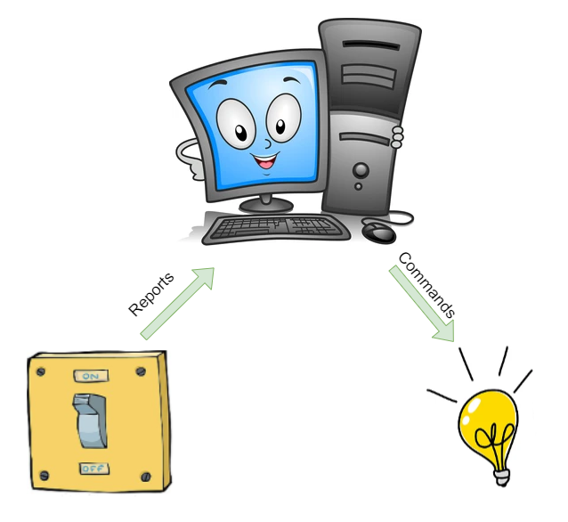
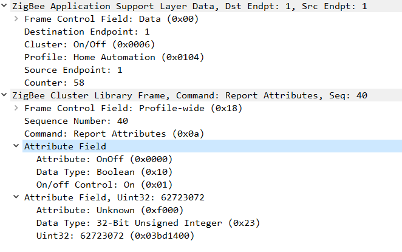
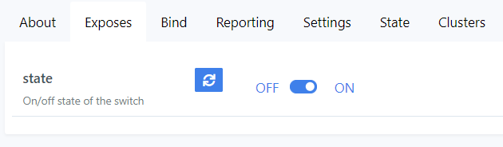
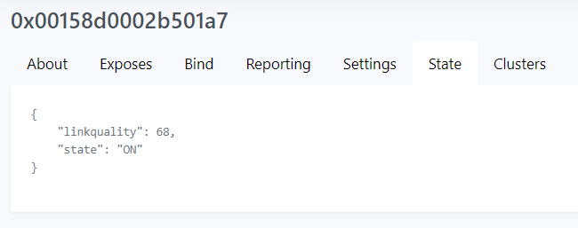
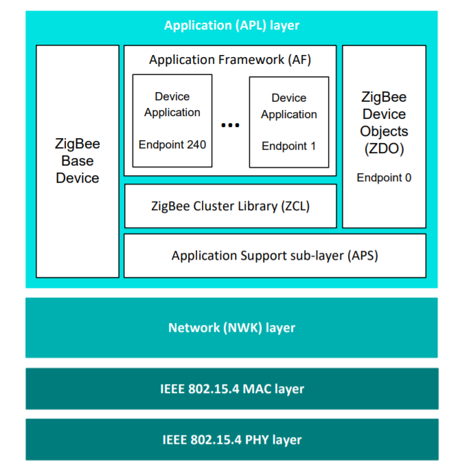

# Hello Zigbee World, Part 8 - Simple Zigbee Smart Switch

So, our device can [join the network](part6_join_zigbee_network.md), and can [correctly describe itself](part7_zigbee_descriptors.md). But it has not yet become a switch. This is the next part in the [Hello Zigbee tutorial series](part0_plan.md), describing how to develop a Zigbee device firmware from scratch. In this part we will create a simple Zigbee smart switch that will send its status to the smart home system, as well as accept switching commands from the coordinator.

The hardware setup is described in the [very first article](part1_bring_up.md), and is based on the EBYTE E75–2G4M10S module (NXP 5169 microcontroller). The toolchain and basic MCU peripherals were also described in the article. 

## How Smart Switch works

It is quite obvious that the device must send some signals when its button is pressed, and respond to external signals to switch the LED state. But it is not yet clear how to do this. 

As it turned out, the JN-AN-1219-Zigbee-3-0-Controller-and-Switch example shows us a completely different mode of operation than a typical smart switch on the market. In this example, several devices communicate **with each other**. They can directly send each other on and off commands, find each other in various ways and bind their endpoints, and request each other for some data.

But real Zigbee switches and lights (for example, Xiaomi, or Tuya) work completely differently. Such devices on the network **do NOT communicate with each other**. Instead they **communicate with the coordinator** as the brain of the network. Devices send the coordinator reports on key presses, and accept commands to turn on and off. In this case, slightly different internal mechanisms are used. For example, upon a button press a real switch does not send the “turn on” command - it simply does not know which light should be the receiver of this command. Instead, the switch sends a report to the coordinator with the message “my STATE attribute has changed its value”, and the coordinator is deciding what to do with this information - turn on lights, or do something else.



Wait, one may argue ‘you said Zigbee is a mesh network and nodes can communicate directly skipping the coordinator’. That is correct. On the network level packets may travel through the network in the shortest way, and it is not necessary for the coordinator to be the part of that route. But on the logical level (Application level) the coordinator becomes a decision center of the network, and all application specific messages are happening between coordinator and the device, and not between devices.

One more very important thing. In Zigbee world it is absolutely necessary to feel the difference between client and server. **Client** devices can only send commands, but **do not maintain internal state**. As per Zigbee specification, a switch or a wireless button is a client device. It can only generate button press events, but it does not have its state. **Server devices** are usually actuators, and they **have an internal state**. For example, a light obviously has a state - on or off. And there is some discrepancy between Zigbee Specification and the real world. Looking at mass produced devices that we usually call a ‘smart switch’, from Zigbee point of view these devices are lights (servers with an internal state) rather than switches. Maybe these smart switches do not literally emit a light, but they have a relay switch that is turned on or off.

NXP's ZigBee Cluster Library implementation provides blueprints for various devices - lights, thermometers, sensors, switches, and more. Particularly it provides the OnOffLight**Switch**Device, but this is not what we need due to reasons described above - this is the client device. The correct choice is OnOffLightDevice (not Switch) - this is a server device that has an On/Off attribute. The device can report the value of this attribute to the coordinator if it changes, and receive commands to turn it on / off. 

BTW, I can state that JN-AN-1220-Zigbee-3-0-Sensors example is much better for studying. This example contains code for sending statuses. Also the code of this example is much better structured, broken into small examples, easier to understand compared to JN-AN-1219 example.

## The switch

ZCL works with the device object - a special structure that contains all the data related to the specific endpoint. In the previous articles I was using OnOffLightSwitchDevice one, but as we just learned we need to use `OnOffLightDevice`.

```cpp
tsZLO_OnOffLightDevice sSwitch;

extern "C" PUBLIC void vAppMain(void)
{
...
    DBG_vPrintf(TRUE, "vAppMain(): register On/Off endpoint...  ");
    status = eZLO_RegisterOnOffLightEndPoint(HELLOZIGBEE_SWITCH_ENDPOINT, &APP_ZCL_cbEndpointCallback, &sSwitch);
    DBG_vPrintf(TRUE, "eApp_ZCL_RegisterEndpoint() status %d\n", status);
```

Although a typical switch either turns the light on or off, my LED will blink. This will allow me to see if the device has hung. In the “on” mode my LED will blink frequently, and in the “off” mode - slowly.

The most important: where do we store the state of the LED? The ZCL library suggests storing attribute values directly in the device/cluster object. This gives ZCL the opportunity to read and write this value without having to call application code. We will access the corresponding variables in the cluster object directly (in our case, `sSwitch.sOnOffServerCluster.bOnOff`)

```cpp
PUBLIC void blinkFunc(void *pvParam)
{
   // Toggle LED
   uint32 currentState = u32AHI_DioReadInput();
   vAHI_DioSetOutput(currentState^BOARD_LED_PIN, currentState&BOARD_LED_PIN);

   // restart blink timer
   ZTIMER_eStart(blinkTimerHandle, sSwitch.sOnOffServerCluster.bOnOff ? ZTIMER_TIME_MSEC(200) : ZTIMER_TIME_MSEC(1000));
}
```

Let me briefly remind you of the button handling for our LED blinker we created earlier. The button is polled every 10ms and 2 types of signals are sent - a short and a long press.

```cpp
PUBLIC void buttonScanFunc(void *pvParam)
{
   static int duration = 0;

   uint32 input = u32AHI_DioReadInput();
   bool btnState = (input & BOARD_BTN_PIN) == 0;

   if(btnState)
   {
       duration++;
       DBG_vPrintf(TRUE, "Button still pressed for %d ticks\n", duration);
   }
   else
   {
       // detect long press
       if(duration > 200)
       {
           DBG_vPrintf(TRUE, "Button released. Long press detected\n");
           ButtonPressType value = BUTTON_LONG_PRESS;
           ZQ_bQueueSend(&buttonQueueHandle, (uint8*)&value);
       }

       // detect short press
       else if(duration > 5)
       {
           DBG_vPrintf(TRUE, "Button released. Short press detected\n");
           ButtonPressType value = BUTTON_SHORT_PRESS;
           ZQ_bQueueSend(&buttonQueueHandle, &value);
       }

       duration = 0;
   }

   ZTIMER_eStart(buttonScanTimerHandle, ZTIMER_TIME_MSEC(10));
}
```

The button messages will be processed by the `APP_vTaskSwitch()` function called from the main loop. It will toggle the value of sSwitch.`sOnOffServerCluster.bOnOff`, as well as send the corresponding message to the coordinator.

```cpp
PRIVATE void APP_vTaskSwitch()
{
    ButtonPressType value;
    if(ZQ_bQueueReceive(&buttonQueueHandle, (uint8*)&value))
    {
        DBG_vPrintf(TRUE, "Processing button message %d\n", value);

        if(value == BUTTON_SHORT_PRESS)
        {
            // Toggle the value
            sSwitch.sOnOffServerCluster.bOnOff = sSwitch.sOnOffServerCluster.bOnOff ? FALSE : TRUE;

            // Destination address - 0x0000 (coordinator)
            tsZCL_Address addr;
            addr.uAddress.u16DestinationAddress = 0x0000;
            addr.eAddressMode = E_ZCL_AM_SHORT;

            // Report the attribute
            DBG_vPrintf(TRUE, "Reporting attribute... ", value);
            PDUM_thAPduInstance myPDUM_thAPduInstance = hZCL_AllocateAPduInstance();
            teZCL_Status status = eZCL_ReportAttribute(&addr,
                                                        GENERAL_CLUSTER_ID_ONOFF,
                                                        E_CLD_ONOFF_ATTR_ID_ONOFF,
                                                        HELLOZIGBEE_SWITCH_ENDPOINT,
                                                        1,
                                                        myPDUM_thAPduInstance);
            PDUM_eAPduFreeAPduInstance(myPDUM_thAPduInstance);
            DBG_vPrintf(TRUE, "status: %02x\n", status);
        }

        if(value == BUTTON_LONG_PRESS)
        {
            // TODO: add network join here
        }
    }
}
```

The message is sent to the coordinator (address 0x0000) to the endpoint #1. In the `eZCL_ReportAttribute()` function parameters we specify which cluster (`GENERAL_CLUSTER_ID_ONOFF`) and which attribute to report (`E_CLD_ONOFF_ATTR_ID_ONOFF`). The `eZCL_ReportAttribute()` function will send the selected cluster attribute to the coordinator. To be honest, it's not really clear to me why we use coordinator’s endpoint #1, but this is how other smart switches (e.g. Xiaomi) do.

Let’s upload the firmware and see that the report is successfully sent to the coordinator, and the coordinator even acknowledges this fact with a standard confirmation.

```
Button released. Short press detected
Processing button message 0
Reporing attribute... status: 00
ZPS_EVENT_APS_DATA_CONFIRM: SrcEP=1 DstEP=1 DstAddr=0000 Status=0
ZPS_EVENT_APS_DATA_ACK: SrcEP=1 DrcEP=1 DstAddr=0000 Profile=0104 Cluster=0006
ZPS_EVENT_APS_DATA_INDICATION: SrcEP=1 DstEP=1 SrcAddr=0000 Cluster=0006 Status=0
ZCL Endpoint Callback: DEFAULT_RESPONSE received. No action
```

In the Wireshark we can spot the report message with an updated value.



Zigbee2mqtt also sees this message, but so far it cannot do anything with it. But at least we were told what to do.

```
Zigbee2MQTT:debug 2021-04-04 10:55:00: Received Zigbee message from '0x00158d0002b501a7', type 'attributeReport', cluster 'genOnOff', data '{"onOff":1}' from endpoint 1 with groupID 0
Zigbee2MQTT:warn  2021-04-03 23:26:36: Received message from unsupported device with Zigbee model 'Hello Zigbee Switch' and manufacturer name 'NXP'
Zigbee2MQTT:warn  2021-04-03 23:26:36: Please see: https://www.zigbee2mqtt.io/how_tos/how_to_support_new_devices.html.
```

## Zigbee2mqtt external converter

It was good to know that we no longer need to edit zigbee2mqtt code to add a new device (which is quite complicated if you use a docker image). Since recently, zigbee2mqtt supports external converters - an external Java Script file with a function that converts messages from a device to zigbee2mqtt structures and vice versa.

Let's create a myswitch.js file next to the Z2M configuration.

```js
const fz = require('zigbee-herdsman-converters/converters/fromZigbee');
const tz = require('zigbee-herdsman-converters/converters/toZigbee');
const exposes = require('zigbee-herdsman-converters/lib/exposes');
const reporting = require('zigbee-herdsman-converters/lib/reporting');
const e = exposes.presets;

const device = {
    zigbeeModel: ['Hello Zigbee Switch'],
    model: 'Hello Zigbee Switch',
    vendor: 'NXP',
    description: 'Hello Zigbee Switch',
    fromZigbee: [fz.on_off],
    toZigbee: [tz.on_off],
    exposes: [e.switch()],
};

module.exports = device;
```

Now Z2M can recognize messages from our device and process them via the standard `fz.on_off` and `tz.on_off` converters (defined [here](https://github.com/Koenkk/zigbee-herdsman-converters/blob/master/converters/fromZigbee.js) and [here](https://github.com/Koenkk/zigbee-herdsman-converters/blob/master/converters/toZigbee.js), respectively).

With the converter, the device page in Z2M no longer complains that the device is unsupported. The Exposes tab displays the switch. Moreover, the state of this switch is dynamically changed when clicking the device button.



The State tab shows the actual state of the switch.



It also works in the other direction - if you change the state via Z2M, then the LED blinking mode also changes. The implementation of the ZigBee Cluster Library will automatically update the value of the sSwitch.`sOnOffServerCluster.bOnOff` variable, and the LED will start blinking in a new way.

## Handling the attribute state change

But what if we need to perform a specific action on the coordinator message arrival? We just need to handle `E_ZCL_CBET_CLUSTER_CUSTOM` or `E_ZCL_CBET_CLUSTER_UPDATE` events. These 2 messages are technically identical. Moreover, these 2 calls are located literally in adjacent lines in the ZCL sources. We can handle either of them. 

```cpp
PRIVATE void APP_ZCL_cbEndpointCallback(tsZCL_CallBackEvent *psEvent)
{
   switch (psEvent->eEventType)
   {
...
       case E_ZCL_CBET_CLUSTER_UPDATE:
           vHandleClusterUpdateMessage(psEvent);
           break;
...

PRIVATE void vHandleClusterUpdateMessage(tsZCL_CallBackEvent *psEvent)
{
   uint16 u16ClusterId = psEvent->uMessage.sClusterCustomMessage.u16ClusterId;
   tsCLD_OnOffCallBackMessage * msg = (tsCLD_OnOffCallBackMessage *)psEvent->uMessage.sClusterCustomMessage.pvCustomData;
   uint8 u8CommandId = msg->u8CommandId;

   DBG_vPrintf(TRUE, "ZCL Endpoint Callback: Cluster update message EP=%d ClusterID=%04x Cmd=%02x\n", psEvent->u8EndPoint, u16ClusterId, u8CommandId);
}
```

As usual, I only dump the message received, but nothing prevents you from inserting relay switching code here, for example. We have all the data for this - the endpoint number, the cluster number, and the command identifier.

I toggled the switch via the Z2M dashboard, and here is how the device log looks like.

```
ZPS_EVENT_APS_DATA_INDICATION: SrcEP=1 DstEP=1 SrcAddr=0000 Cluster=0006 Status=0
ZCL Endpoint Callback: Cluster update message EP=1 ClusterID=0006 Cmd=00
ZPS_EVENT_APS_DATA_CONFIRM: SrcEP=1 DstEP=1 DstAddr=0000 Status=0
ZPS_EVENT_APS_DATA_ACK: SrcEP=1 DrcEP=1 DstAddr=0000 Profile=0104 Cluster=0006
ZPS_EVENT_APS_DATA_INDICATION: SrcEP=1 DstEP=1 SrcAddr=0000 Cluster=0006 Status=0
ZCL Endpoint Callback: Cluster update message EP=1 ClusterID=0006 Cmd=01
```

The device can now be considered complete. It already can join the network, report state changes, and receive On/Off commands. But since the device is integrated with Z2M it can be also integrated into any smart home system. For example, we can create a Home Assistant automation to turn on and off the light in the room. 

```yaml
- id: '1617533042952'
  alias: Test
  description: Test
  trigger:
  - platform: state
    entity_id: switch.0x00158d0002b501a7
    attribute: state
  condition: []
  action:
  - type: toggle
    device_id: 3effcfbd5022447213791dc054d043ec
    entity_id: switch.living_room_light_right
    domain: switch
  mode: single
```

## Summary

So, with these fairly simple steps we managed to create our own Zigbee Smart Switch device. At first glance, it may seem difficult and we had to write a lot of code. But if we throw out the debug logging, then there are just about 300 lines in the bottom line.

Of course, these 300 lines need to be well understood. There are a number of messages and handlers calling each other. But this is not really difficult, you just need to understand the overall architecture. Let me once again give an overview of the ZigBee stack and describe how the firmware works.



When a data packet is transmitted over the network, the following happens:

- The `PHY` layer listens to the radio and receives a data packet into an internal buffer
- When the packet is received, the `zps_isrMAC` interrupt occurs and the packet is processed by the `MAC` layer
- If this packet is targeted for our device, it is passed to the ZigBee network layer (`NWK`) for further processing. Up to this point everything happens transparently for us, and we do not have to write any code.
- `APP_vBdbCallback()` is the event entry point to our application. This handler is called in case of important network events (e.g. device joins or drops off the network), or there is a data packet arrived.
- Data packets are processed by the `vAppHandleAfEvent()` function. In fact, data can arrive either for the Zigbee Device Object (`ZDO`) component, which is responsible for generic device requests, or for the application and its functional endpoints. Basically the `vAppHandleAfEvent()` function is an event router that dispatches the event to the correct event handler.
- The `vAppHandleZdoEvents()` function handles requests to ZDO (zero endpoint). This part is responsible for device behavior as a network node - joining/leaving the network, binding endpoints, searching for other devices, requesting for device descriptors.
- The `vAppHandleZclEvents()` function handles requests to all other device endpoints. Usually endpoints have a generic implementation in Zigbee Cluster Library (`ZCL`), so the processing is routed there.
- If ZCL requires an additional processing of the event, the `APP_ZCL_cbEndpointCallback()` function is called. Here we can address an event or request for a specific cluster, attribute or endpoint.

That's basically it. The stack is not so complex.

If we could fit the smart switch firmware into 300 lines of code, then why do the manufacturer's examples take several megabytes? That is because they tried to fit many examples in a single codebase, providing implementation for various features even though not every device needs all of this. Like “look, we can do this, this, and even this”.

Anyhow, the presented code is just a prototype.
- My device still lacks number of functions, such as re-joining the network in case of network loss, or joining with a button, direct binding, and many more features
- The code has absolutely no error handling. In fact, the device is noticeably buggy: in 50% of cases it cannot join the network, sometimes the stack runs out of memory, and some messages do not reach the receiver. 
- The code is quite cluttered. It needs some refactoring and breaking down into modules.

Why do I show you in such an unfinished form? This is an educational project. The goal is to understand the technology, what functions are responsible for what, which events may occur and how they need to be processed. In fact, it turned out to be a platform for experiments, where we can add and play with the necessary functionality. This is the value of such a project.

## Links

- Documentation
  - [JN-UG-3113 ZigBee 3.0 Stack User Guide](https://www.nxp.com/docs/en/user-guide/JN-UG-3113.pdf)
  - [JN-UG-3114 ZigBee 3.0 Devices User Guide](https://www.nxp.com/docs/en/user-guide/JN-UG-3114.pdf)
  - [JN-UG-3115 ZigBee Cluster Library (for ZigBee 3.0) User Guide](https://www.nxp.com/docs/en/user-guide/JN-UG-3115.pdf)
  - [JN-UG-3076 ZigBee Home Automation User Guide](https://www.nxp.com/docs/en/user-guide/JN-UG-3076.pdf)
  - [JN-UG-3101 ZigBee PRO Stack User Guide](https://www.nxp.com/docs/en/user-guide/JN-UG-3101.pdf)
  - [Zigbee Class Library Specification](https://zigbeealliance.org/wp-content/uploads/2019/12/07-5123-06-zigbee-cluster-library-specification.pdf)
  - [How to sniff Zigbee traffic](https://www.zigbee2mqtt.io/advanced/zigbee/04_sniff_zigbee_traffic.html)
- Code
  - [Project on github](https://github.com/grafalex82/hellozigbee/tree/hello_zigbee_part_1)
  - JN-AN-1220-Zigbee-3–0-Sensors example (recommended)
  - JN-AN-1219-Zigbee-3–0-Controller-and-Switch example (somewhat sophisticated for learning purposes)
  - https://github.com/actg/JN5169-for-xiaomi-wireless-switch.git
