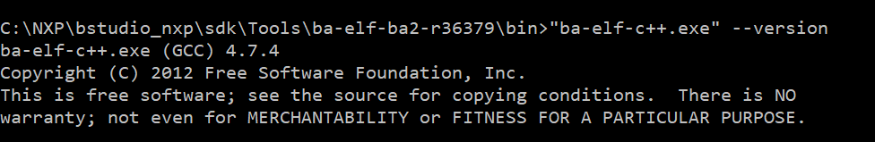
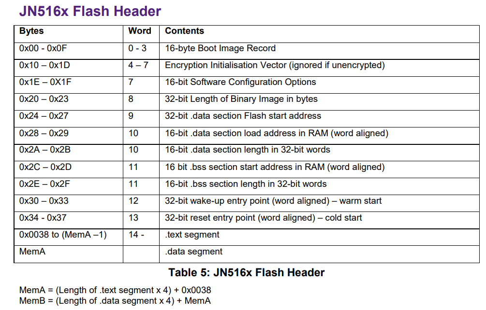

# Hello Zigbee World, Part 9 - C++ building blocks for JN5169 firmware

This article is a little bit a spin-off of my [Hello Zigbee series](part0_plan.md), describing creation of a Zigbee device firmware from scratch. This part does not have topics directly related to Zigbee, just a beautifying code made in the previous articles. Though work on this article revealed a number of low-level nuances of NXP JN5169 microcontroller, that are good to know for a deeper understanding of the microcontroller’s capabilities.

Personally, I don't really like to write in pure C when it's possible to write in C++. It seems to me that the client code in C++ is much more readable and concise, while all the guts can be hidden inside the class. It is a myth that C++ is slower, or memory consuming. If you know what you are doing, at least once opened a C++ book, and used a disassembler to inspect exactly what your code looks like on the machine level, you can state that the language itself adds no or negligible overhead. Additionally [there are techniques](https://arobenko.github.io/bare_metal_cpp) on how to ensure overhead code is not compiled into the resulting firmware.

Of course, in the microcontroller world we are not talking about fully-featured C ++ - you will have to avoid exceptions and RTTI, have limited support of STL, and probably refrain from using some other C++ features. Also microcontrollers may be limited in memory space or even do not have dynamic memory, which is widely used in big machines’ C++. But even without that, C++ provides much richer type checking features, OOD, templates, polymorphism, RAII, and much more.

The compiler that comes with the NXP SDK is a very ancient gcc. That is a bummer, as it does not support modern C++ standards (I doubt it fully supports even C++11).



Moreover, as we will see later, microcontroller architecture adds additional limitations due to poor CRT support of C++ features. So we will have to use workarounds.

## GPIO Pins

Let’s try to wrap a few basic primitives into C++ classes. For example, working with a GPIO would be a good start.

```cpp
class GPIOPin
{
protected:
   uint32 pinMask;

public:
   GPIOPin()
   {
       pinMask = 0;
   }

   void init(uint8 pin, bool output)
   {
       pinMask = 1UL << pin;

       if(output)
           vAHI_DioSetDirection(0, pinMask);
       else
           vAHI_DioSetDirection(pinMask, 0);
   }

   uint32 getPinMask() const
   {
       return pinMask;
   }
};

class GPIOOutput : public GPIOPin
{
public:
   void init(uint8 pin)
   {
       GPIOPin::init(pin, true);
   }

   void on()
   {
       vAHI_DioSetOutput(pinMask, 0);
   }

   void off()
   {
       vAHI_DioSetOutput(0, pinMask);
   }

   void toggle()
   {
       uint32 currentState = u32AHI_DioReadInput();
       vAHI_DioSetOutput(currentState ^ pinMask, currentState & pinMask);
   }
};

class GPIOInput : public GPIOPin
{
public:
   void init(uint8 pin, bool pullUp)
   {
       GPIOPin::init(pin, false);
       vAHI_DioSetPullup(pullUp ? pinMask : 0, pullUp ? 0 : pinMask);
   }

   void enableInterrupt()
   {
       vAHI_DioInterruptEnable(pinMask, 0);
       vAHI_DioInterruptEdge(0, pinMask); //Falling edge interrupt (e.g. button is pressed and the pin is tied to the ground)
   }

   void enableWake()
   {
       vAHI_DioWakeEnable(pinMask, 0);
   }

   bool value() const
   {
       return (u32AHI_DioReadInput() & pinMask) != 0;
   }
};
```

The implementation is pretty trivial - just holding the `pinMask` value, which is then passed to corresponding GPIO-related functions. The Pin class could be the only class that deals with the pin, including input and output, handle pull-ups and pin change interrupts. But usually pins are either input or output, and therefore deserve their separate classes.

The usage is trivial as well:

```cpp
GPIOOutput led;
led.init(17); 
led.on();
led.toggle();
```

One may argue that it is wasteful to allocate 4 bytes of RAM for every pin object. But if you take a wider look at how this would be used in real life, these 4 bytes may not be the new ones. Consider a multi-channel switch, where each button toggles its dedicated LED. In this case each channel will probably have a data structure, one of the fields will point to a corresponding LED. In this case it does not matter whether the structure will contain an integer (LED pin number) or whole GPIOPin object (which consists of the same 4-byte integer).

The JN5169 microcontroller has 32kb RAM, so 4 bytes for a pin object is negligible. But this could be reduced to 1 byte if we use pin number, instead of a pin mask. Though this will add a cost of calculating pin mask on every call. 

Moreover it is possible to get rid of this field at all if we use constant template parameters.

```cpp
template<uint8 pin>
class Pin
{
public:
   void init()
   {
       vAHI_DioSetDirection(0, 1UL << pin);
   }

   void on()
   {
       vAHI_DioSetOutput(1UL << pin, 0);
   }

   void off()
   {
       vAHI_DioSetOutput(0, 1UL << pin);
   }

   void toggle()
   {
       uint32 currentState = u32AHI_DioReadInput();
       vAHI_DioSetOutput(currentState ^ (1UL << pin), currentState & (1UL << pin));
   }
};
```

In this case pin mask can be calculated in compile time, will be burned in directly to the binary, and will become a constant parameter of the corresponding `vAHI_DioSetOutput()` function call.

In some cases this approach could simplify the code, and probably even reduce a footprint a little bit. Indeed, in a typical application pins are allocated by the HW designer, and hardwired to a particular circuit. So some code could just use this pin class like this.

```cpp
GPIOOutput<17> led;
```

Though I decided not to go this way - I’ll have a number of endpoints in my switch, probably allocated in an array. Using template Pin class would probably require template Endpoint class as well, which may blow up firmware size. I’ll probably have to deal with some obstacles packing templated objects into an array. In this case 4 bytes in the RAM would be a better alternative.

## Timer

Wrapping a timer into a class is even simpler.

```cpp
class Timer
{
   uint8 timerHandle;

public:
   void init(ZTIMER_tpfCallback cb, void * param, bool preventSleep = false)
   {
       ZTIMER_eOpen(&timerHandle, cb, param, preventSleep ? ZTIMER_FLAG_PREVENT_SLEEP : ZTIMER_FLAG_ALLOW_SLEEP);
   }

   void start(uint32 time)
   {
       ZTIMER_eStart(timerHandle, time);
   }

   void stop()
   {
       ZTIMER_eStop(timerHandle);
   }
};
```

There is nothing special here, but it allows you to reduce the amount of client code and improve readability.

```cpp
Timer myTimer(timerFunc, NULL);
myTimer.start(500);
```

instead of

```cpp
uint8 timerHandle;
ZTIMER_eOpen(&timerHandle, timerFunc, NULL, ZTIMER_FLAG_ALLOW_SLEEP);
ZTIMER_eStart(timerHandle, 500);
```


## Variable persisted in EEPROM

Next building block to port is storing value in PDM. Here I used handy type casting and implemented an assignment operator, so that the variable behaves like a regular variable.

```cpp
template<class T, uint8 id>
class PersistedValue
{
   T value;

public:
   void init(const T & initValue)
   {
       uint16 readBytes;
       PDM_teStatus status = PDM_eReadDataFromRecord(id, &value, sizeof(T), &readBytes);
       if(status != PDM_E_STATUS_OK)
           setValue(initValue);

       DBG_vPrintf(TRUE, "PersistedValue::init(). Status %d, value %d\n", status, value);
   }

   T getValue()
   {
       return value;
   }

   operator T()
   {
       return value;
   }

   PersistedValue<T, id> & operator =(const T & newValue)
   {
       setValue(newValue);
       return *this;
   }

   void setValue(const T & newValue)
   {
       value = newValue;
       PDM_teStatus status = PDM_eSaveRecordData(id, &value, sizeof(T));
       DBG_vPrintf(TRUE, "PersistedValue::setValue() Status %d, value %d\n", status, value);
   }
};
```

It is much nicer to see in the code something like this

```cpp
connectionState = JOINED;
```

rather than this

```cpp
uint8 value = JOINED;
PDM_eSaveRecordData(PDM_ID_NODE_STATE, &value, sizeof(value));
```

The `init()` function tries to read the previous value of the variable from the PDM, and if that fails, the default value is used.


## Queues

Concept of a queue perfectly matches with a class maintaining the data buffer, and the queue handler. The class will provide handy functions to push and pop a message to/from the queue. 

```cpp
template<tszQueue * handle>
struct QueueHandleExtStorage
{
   tszQueue * getHandle()
   {
       return handle;
   }
};

struct QueueHandleIntStorage
{
   tszQueue handle;

   tszQueue * getHandle()
   {
       return &handle;
   }
};


template<class T, uint32 size, class H>
class QueueBase : public H
{
   T queueStorage[size];

public:
   void init()
   {
       ZQ_vQueueCreate(H::getHandle(), size, sizeof(T), (uint8*)queueStorage);
   }

   bool receive(T * val)
   {
       return ZQ_bQueueReceive(H::getHandle(), (uint8*)val) != 0;
   }

   void send(const T & val)
   {
       ZQ_bQueueSend(H::getHandle(), (uint8*)&val);
   }
};


extern const tszQueue dummyQueue;

template<class T, uint32 size, const tszQueue * handle = &dummyQueue>
class Queue : public QueueBase<T, size, QueueHandleExtStorage<handle> >
{};

template<class T, uint32 size>
class Queue<T, size> : public QueueBase<T, size, QueueHandleIntStorage >
{};
```

The implementation must support 2 different use cases. When we declare a queue in our code, we can nicely wrap the queue handle to the class (as I did based on `QueueHandleIntStorage`). But some queues are declared outside the code we control (in the zps_gen.c file, which is generated by the ZPSConfig.exe utility) and linked to our code via extern. Therefore, we have to work differently with such external handles, which I implemented in `QueueHandleExtStorage` class. 

Here is how queues can be used.

```cpp
Queue<MyType, 3> myQueue;
myQueue.init();
myQueue.send(valueToSend);
myQueue.receive(&valueToReceive);
```

External Zigbee stack queues can be used by adding a pointer to the queue handle as a 3rd template parameter.

```cpp
extern PUBLIC tszQueue zps_msgMlmeDcfmInd;
Queue<MAC_tsMlmeVsDcfmInd, 10, &zps_msgMlmeDcfmInd> msgMlmeDcfmIndQueue;
```

## Periodic tasks

Let's go further and combine a few building blocks created earlier. 

A typical microcontroller firmware performs some actions on a regular basis, according to a timer. We already used such an approach for blinking the LED and polling the button. This time I made a small helper class that just utilizes a timer, and periodically calls a handler function. Since periodic tasks assumes never-ending process, I also added an auto-reload timer functionality here.

```cpp
class PeriodicTask
{
   Timer timer;
   uint32 period;

public:
   void init(uint32 newPeriod = 0)
   {
       timer.init(timerFunc, this);
       setPeriod(newPeriod);
   }

   void setPeriod(uint32 newPeriod)
   {
       period = newPeriod;
   }

   void startTimer(uint32 delay)
   {
       timer.start(delay);
   }

   void stopTimer()
   {
       timer.stop();
   }

protected:
   static void timerFunc(void * param)
   {
       // Execute the task main work
       PeriodicTask * task = (PeriodicTask*)param;
       task->timerCallback();

       // Auto-reload timer
       if(task->period != 0)
           task->startTimer(task->period);
   }

   virtual void timerCallback() = 0;
};
```

The LED blinker can now look like this.

```cpp
static const uint32 FAST_BLINK_PERIOD = ZTIMER_TIME_MSEC(200);
static const uint32 SLOW_BLINK_PERIOD = ZTIMER_TIME_MSEC(1000);

class BlinkTask : public PeriodicTask
{
   GPIOOutput ledPin;

public:
   BlinkTask() {}

   void init(uint8 pin)
   {
      ledPin.init(pin);

      PeriodicTask::init(SLOW_BLINK_PERIOD);
      startTimer(1000);
   }

   void setBlinkMode(bool fast)
   {
      setPeriod(fast ? FAST_BLINK_PERIOD : SLOW_BLINK_PERIOD);
   }

protected:
   virtual void timerCallback()
   {
      ledPin.toggle();
   }
};
```

## Deep dive into platform oddities

Here I run into an odd issue - the code compiles, but does not link with a strange error.

```
c:/nxp/bstudio_nxp/sdk/tools/ba-elf-ba2-r36379/bin/../lib/gcc/ba-elf/4.7.4/../../../../ba-elf/lib/mcpu_jn51xx_sizeopt\libg.a(lib_a-glue.o): In function `_sbrk':
/ba_toolchain/r36379/source/gcc-4.7.4-ba-r36379-build/ba-elf/mcpu_jn51xx_sizeopt/newlib/libc/sys/basim/../../../../../../../gcc-4.7.4-ba-r36379/newlib/libc/sys/basim/glue.c:75: undefined reference to `end'
/ba_toolchain/r36379/source/gcc-4.7.4-ba-r36379-build/ba-elf/mcpu_jn51xx_sizeopt/newlib/libc/sys/basim/../../../../../../../gcc-4.7.4-ba-r36379/newlib/libc/sys/basim/glue.c:75: undefined reference to `_stack'
/ba_toolchain/r36379/source/gcc-4.7.4-ba-r36379-build/ba-elf/mcpu_jn51xx_sizeopt/newlib/libc/sys/basim/../../../../../../../gcc-4.7.4-ba-r36379/newlib/libc/sys/basim/glue.c:75: undefined reference to `_stack'
/ba_toolchain/r36379/source/gcc-4.7.4-ba-r36379-build/ba-elf/mcpu_jn51xx_sizeopt/newlib/libc/sys/basim/../../../../../../../gcc-4.7.4-ba-r36379/newlib/libc/sys/basim/glue.c:75:(.text+0x197): relocation truncated to fit: R_BA_8 against undefined symbol `_stack'
```

The error is quite odd, and nothing points to the piece of code where the problem is. After some investigation I localized the problem - it comes from the fact the code has a pure virtual function. Normally pure virtual functions cannot be called, but the base class’ virtual table still has a reference to `__cxa_pure_virtual()` - a special implementation that terminates the application. And the default implementation of `__cxa_pure_virtual()` somehow references a `sbrk()` function, which causes troubles in this case. 

The `sbrk()` function is a part of the dynamic memory mechanism, which is switched off in our firmware. It is quite unfortunate that the pure virtual function call handler still uses `sbrk()`. Surprisingly the solution was found in the Arduino core - the `__cxa_pure_virtual()` function was just re-implemented with an infinite loop.

```cpp
extern "C" void __cxa_pure_virtual(void) __attribute__((__noreturn__));
void __cxa_pure_virtual(void)
{
 DBG_vPrintf(TRUE, "!!!!!!! Pure virtual function call.\n");
 while (1)
   ;
}
```

Once this code has been added, the application linked successfully.

## Even deeper dive into platform oddities

This chapter has really low-level details. Feel free to skip, if you are not so experienced. Main takeaway - we have to avoid global objects, and/or have to use `init()` functions instead of constructors. 

I really wanted to make the objects initialize themselves right in the constructors - just declare an object, and it is ready to work without additional initialization action. But here we come to an unpleasant surprise: the CRT that comes with the JN5169 SDK does not run constructors for globally allocated objects. Everything is ok for objects allocated on the stack - their constructors are executed normally. But whenever you declare something globally, the constructor is not called. This leads to a situation where some objects are not properly initialized. 

There is a [good video](https://www.youtube.com/watch?v=dOfucXtyEsU) explaining what is happening before the program gets its `main()` function. I highly recommend studying this video. The main idea, that every program has a special initialization code, that performs several important things before main():
- do initial initialization of CPU
- clear `.bss` section - place where all not-initialized variables are located. This section is zeroed before the program starts.
- initialize `.data` section - all statically initialized variables get their initial values (these values are copied from the ROM)
- constructors of all global objects are executed. Technically there is a `.init.array` section with a list of functions that must be executed at the program initialization stage. For each global object the compiler generates a special initialization function that runs the constructor. A pointer to this function is placed in the `.init.array` section.

First of all, the firmware linker script provided by SDK does not have an `.init.array` section. I tried to add it manually, but could not get the compiler to generate anything there. But even if I managed to configure the compiler, and global object constructors get to the `.init.array` list, it would not be run anyway - there is simply no code for this.

Typically the firmware implements a full set of the initialization actions listed above. But JN5169 firmware is structured differently - it does not have any initialization routines. Instead, [the bootloader takes responsibility for the initialization](https://www.nxp.com/docs/en/application-note/JN-AN-1003.pdf). The bootloader does the initial CPU initialization. Then the bootloader loads the firmware image. The image has special structure at the beginning of the image that describes the location of the `.bss` section, as well as location of the `.data` section. This means that the bootloader will initialize all global variables, and zero ones that do not have initial value. But this applies only for simple (POD) variables that can be initialized with a simple `memcpy()`. But there is no interface to initialize non-trivial objects, or go through the `.init.array` initialization list.



Why do I care about the global object constructors? There are 2 reasons for this.
- When the constructor is not called we have a situation where the object exists in a limbo state - we know its address, but the object's content is not initialized. And there is no way to understand whether the object is valid or not.
- Constructors are responsible for initializing the virtual functions table. It is not critical for simple classes, but if the class has at least one virtual function, then it becomes absolutely unusable if the constructor was not called and the vtable was not initialized. 

So, what are the options? I could imagine the following possibilities to overcome the problem.

**Option 1**: Perhaps we could develop our own bootloader. At first it sounds attractive. But! There is no documentation on the processor and its low level routines. The SDK comes pretty high level, and various CPU-level stuff comes precompiled. Also the bootloader is responsible for flashing the image, but there is no information on how to flash the bootloader itself. I am pretty sure that the bootloader is flashed during the chip production, and there is no way to upload the user bootloader. But even if we could create and flash our own bootloader, the image format must be extended with the .init.array section (and as I said previously, the compiler must also generate this section). 

I think this is the hardest option.

**Option 2:** Create an image-side initialization. Indeed, the image provides an entry function. Typically this is `AppColdStart()`/`AppWarmStart()`. I disassembled these functions, but it looks like they do not have low level initialization code. They rather start with calling high level stuff, such as wake timers or calling PWRM callbacks. 

The idea is to create an own entry point function that would go through the `.init.array` list and call the global constructors. This idea is quite interesting, and [does not look too hard to implement](https://github.com/eblot/newlib/blob/master/newlib/libc/misc/init.c). I might keep this option in mind, and get back to it when I understand how to teach the compiler to collect global objects constructors in the `.init.array` list.

The easiest **option is #3:** Just avoid using the global objects and their constructors. It is pretty much possible to create all the important objects somewhere on the `vAppMain()` stack. Then created objects could be passed to child functions by a pointer. It may happen that a callback function must have access to the object. In this case we can simply store the object pointer globally. Yes, this will be a global variable, but this will be an initialized pointer, rather than an object.

It's embarrassing, but not fatal, in terms of C++. As soon as I was not sure whether the object will be used locally or globally, I had to create an `init()` function in each class and call it explicitly from `vAppMain()`. That is why you can see these `init()` functions in the examples above. Perhaps, when I finish the project, I will understand what objects can be local only, and move initialization to the constructors. 


## Summary

I am pretty sure that creators of the SDK never tried to use their stuff in C++ code. If they would try to include SDK headers from the C++ code they would catch stupid syntax errors in the headers, caused by unmatched braces under `__cplusplus` sections. Fortunately that was easy to fix.

I wish C++ features could be added to the project in an easier way. Unfortunately the API design does not assume wrapping objects into C++ classes, the compiler is too old, and the image structure is not also C++ friendly. But even having these limitations I believe the code can still benefit of C++. Number of the language features still work well and can be used to make the code cleaner, safer, and modular.

In this article I described wrapping in C++ only basic primitives. Bigger pieces and components, such as endpoints and device handlers will be ported to C++ soon.

## Links

- Documentation
  - [JN-UG-3113 ZigBee 3.0 Stack User Guide](https://www.nxp.com/docs/en/user-guide/JN-UG-3113.pdf)
  - [JN-UG-3116 JN51xx Core Utilities User Guide](https://www.nxp.com/docs/en/user-guide/JN-UG-3116.pdf)
  - [JN-UG-3087 JN516x Integrated Peripherals API User Guide](https://www.nxp.com/docs/en/user-guide/JN-UG-3087.pdf)
  - [JN-AN-1003 JN51xx Boot Loader Operation](https://www.nxp.com/docs/en/application-note/JN-AN-1003.pdf)
- Code
  - [Project on github](https://github.com/grafalex82/hellozigbee/tree/hello_zigbee_part_2)


